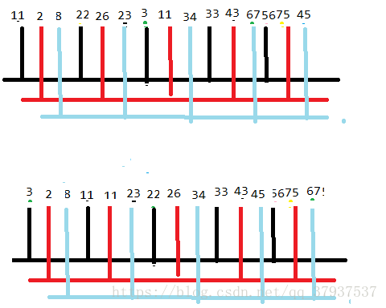

### 希尔排序 (shell sort)
 
参见 @blog [经典排序之希尔排序详解](https://www.cnblogs.com/tojian/p/10112303.html)
 
shell排序是一种插入排序算法，它出自D.L.Shell，因此而得名。Shell排序又称作缩小增量排序。Shell排序的执行时间依赖于增量序列。 
没有理论上分析希尔排序的效率的结论，估计它的时间级从O(N^(3/2))到O(N^(7/6))

> * 时间复杂度： *O(N1.5)*

> * 空间复杂度： *T(1)*

> * 稳定性 ： 不稳定

 好的增量序列的共同特征:

> ① 最后一个增量必须为1;

> ② 应该互素。

接下来用图来演示一下shell排序

给定一组数列: **23 3 11 34  45 43 67  56 22 33 11  2 8 75 26**
 
 ① 先分成5组排序
 
  
  
 ② 再分成3组排序
 
  

 ③ 最后进行直接插入排序
 
 
 ### 归并排序 (merge sort)  
 参见 @blog [经典排序之归并排序详解](https://www.cnblogs.com/tojian/p/10106152.html)
 
 1945年由约翰·冯·诺伊曼首次提出。
 该算法是采用分治法（Divide and Conquer）的一个非常典型的应用，且各层分治递归可以同时进行。
 归并排序的核心思想是将两个有序的数列合并成一个大的有序的序列。通过递归，层层合并，即为归并。

* 时间复杂度： *O(n log n )*  
* 空间复杂度： *T(n)*

  

