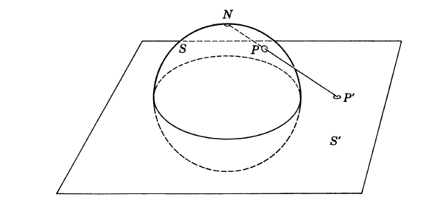

# 微积分和数学分析引论

<h2 class = 'section-title'>第 <label class = 'block-number'>1</label> 章：引 言</h2>

自古以来，关于连续地变化、生长和运动的直观概念，一直在向科学的见解挑战。但是，直到 17 世纪，当现代科学和微积分以及数学分析迅速发展起来时，才开辟了一条理解连续变化的道路。

> 微积分的基本概念是`导数`和`积分`  
> - 导数：对于变化速率的一种度量  
> - 积分：对于`连续变化`过程总效果的度量

理解导数和积分又有赖于对`极限`和`函数`的认识，而极限和函数又基于对数的`连续统`的了解。

<h3 class = 'auto-sort-sub'>实数连续统</h3>

> 自然数：1,2,3,...  
> 自然数是计算一个总体或集合中元素的一种合适工具

但是自然数没法对度量曲线长度、物体体积或重量等的度量。由于极其需要用称为`数`事物来表示`各种量的度量`，为此，不得不将数的概念加以扩充，以便能够描述`度量`的连续变化。这种扩充了的数系称为`数的连续统`或`实数系`。

<h4 class = 'auto-sort-sub1'>自然数系及其扩展：计数和度量</h4>

##### 自然数和有理数
对于我们来说自然数序列 1,2,3,...是已知的，不需要从哲学的观点去讨论它属于怎样的范。 对于同数学打交道的人来说，重要的只是知道一些规律或定理，根据这些规则和定理将一些自然数组合成另一些自然数。

**加法和乘法法则**  

交换率（commutative laws）：$ a + b = b+a $  

结合率（associative laws）：$ a + (b + c) = (a + b) + c $  

分配率（distributive law）：$ a(bc) = (ab)c $  

相消率（cancellation law）：如果 $a + c = b + c$，则 $a = b$

> 逆运算（除法和减法），在`自然数`集合中是不封闭的，如`1-2不属于自然数`

为了使逆运算不受限制的进行，人们不得不发明了`0`和`负`整数以及`分数`来扩充数的概念,这些数的全体被称为`有理数系`或`有理数集合`

`有理（rational）`派生自`ratio`,即关于两个量的比 

有理数域内，一切有理运算（用 0 做除数除外）得到的还是有理数。
**有理数的运算定律完全服从自然数的运算定律，因此，有理数是以完全直接的方式扩充了自然数系**

##### 稠密性
> 有理点在数轴上是稠密的  
> 在物理的现实中，各种量不能精确给出或求得，所以可以认为各种量可以用有理数来度量

##### 不可通约量
> 两个量，如果其比是有理数，则两个数为不可通约的

早在公元前五或六世纪，希腊数学家或哲学家就发现存在一些不可通约的量。

##### 无理数
因为有理数对于几何学来说是不够的，所以必须创造新的数作为不可通约量的度量，这些新的数被称为`无理数`

古希腊人不注重抽象的数的概念，而是把诸如线段这样的一些几何实体看作基本元素，他们用纯几何的方法发展出不但用来运算和处理可通约量，而且用来运算和处理不可通约量的逻辑体系。由毕达哥拉斯引入，欧多克斯推进，最后在欧几里得的《几何学源本》中详细叙述。

> 现代人在数的概念而不是几何概念的基础上，重建了数学

<h4 class = 'auto-sort-sub1'>实数和区间套</h4>

// TODO

<h3 class = 'auto-sort-sub'>函数的概念</h3>

只要一些量 a,b,c,... 的值由另一些量 x,y,z,... 的值来确定，我们就说 a,b,c,...依赖于 x,y,z,..., 或者说是 x,y,z,... 的函数。

> 函数：对于自变量的给定值确定因变量的唯一值的数学规律  
> $y$ 通过函数关系依赖于 $x$ ，常常简单地表述为：$y$ 是 $x$ 的函数

自 17 世纪以来，函数的概念一直是数学思想的核心。首先使用`函数(function)`一词的是莱布尼兹。

<h4 class = 'auto-sort-sub1'>映射--图形</h4>

##### 函数的定义域和值域
在几何上，我们常常把自变量解释为一维或多维空间中一个点的坐标。

对于定义域中的每个点 P, 函数规定了因变量的确定值点 Q (点 P 的像)，于是，我们说，`函数将点 P 映射为点 Q` ， 点 Q 构成函数的所有值域，此值域中每一个点 Q , 是函数定义域中一个或多个点的像

对于单自变量和单因变量，通常用平面图形来表示，即用（x, y）组成的曲线来表示。

<label class="imageTitle">图示1-3 : 函数的图形 </label>

如果我们不把 x 和 y 解释为 x, y 平面上同一点的坐标，而是解释为两个不同的独立的数轴上的点。于是，`函数就把 x 轴上的点 x 映射为 y 轴上的点 y`, 这种映射在几何学中常常出现，例如，把 x 轴上的点 x 投影到平行的 y 轴上的点 y (投影中心 O 在两轴所在的平面内)所产生的`仿射`映射。

<label class="imageTitle">图示1-4 : 映射 </label>

<label class="imageTitle">图示1-5 : 球极平面投影 </label>

画地图常用球极平面映射

> 由于许多这样的例子，使得我们把函数解释成`映射`

// TODO

<h2 class = 'section-title'>第 <label class = 'block-number'>2</label> 章：积分学和积分学的基本概念</h2>

微分和积分是微积分中两种基本的极限过程，这两种过程是`彼此互逆`地联系着的。
微积分的发展是 17 世纪由牛顿和莱布尼兹各自独立创造。虽然牛顿和莱布尼兹以及他们的直接继承者，使这种强有力的工具得到各种应用，但是谁也没有完全阐明微积分的基本概念。直到 19 世纪，在通过严格表述`极限概念`和分析了`实数的连续统`后，才阐明了微积分的基本概念。

<h3 class = 'auto-sort-sub'>积分</h3>
<h4 class = 'auto-sort-sub1'>引言</h4>

`微分`概念的产生是为了描述曲线的切线和运动质点的速度，更一般地说，`是为了描述变化率的概念`  

<label class="imageTitle">图示1-6 : 面积的近似法 </label>

曲线区域 $R$ 的面积介于区域 $R^{'}$ 和 $R^"$ 的面积

追溯到古代，以上就是在初等几何中为了描述圆的面积所使用过的穷举法,这种直观思想的精确的数学论述导致积分概念的产生

<h4 class = 'auto-sort-sub1'>作为面积的积分</h4>

##### 曲线下的面积
当我们将面积同`函数`联系起来时，便产生了积分的分析概念。
现在我们暂且从`直观`上接受以下的思想：下图所示区域的面积是一个确定的数,我们将这个数 $F_{a}^{b}$ 称为函数 $f(x)$ 在积分限 $a$ 和 $b$ 之间的积分。

<label class="imageTitle">图示1-7 </label>

我们用 $F_n$ 表示 $n$ 个小矩阵面积之和。如果将 n 无限增大，而各个块的最大长度趋于 0 , 则数值 $F_n$ 趋向于 $F_{a}^{b}$

<label class="imageTitle">图示1-8 </label>

<h4 class = 'auto-sort-sub1'>积分的分析定义</h4>

##### 积分的定义和存在
上一节，我们将曲线下的面积理解为直观上给定的量，随后又将它表示为极限值，现在我们把顺序颠倒过来，先用纯分析的方式讨论上面定义的 $F_n$ , 并且 $F_n$ 趋向于确定的极限值，然后将这个极限作为积分或面积精确的定义。

设函数 $f(x)$ 在闭区间 $a \leq x \leq b$ 上是连续的，我们用 n-1 个分点 $x_1, x_2, ..., x_{n-1}$ 将区间分成 n 个相等或不等的单元，其长度为 
$$ x_i - x_{i-1} = \Delta x_i  (i = 1, 2,..., n) $$ 
此外，令 $x_0 = a, x_n = b$ , 在每个闭区间 $[x_{i-1}, x_i]$ 或单元上，我们随意选取任意一点 $\xi_i$, 然后作和式 $$F_n = \sum_{i=1}^{n} f(\Xi_i)\Delta x_i$$

<label class="imageTitle">图示1-9 </label>

当子区间的个数无限增加且最大子区间的长度趋于 0 时，和 $F_n$ 必定趋于极限 $F_{a}^{b}$ 。我们将 $F_{a}^{b}$ 称为 $f(x)$ 在积分限 a 和 b 之间的积分。  
然而，几何上的直观，无论多么令人信服，也只能作为我们分析上求极限的过程的引导。因此分析证明是必要的，而且必须证明作为上述极限的`积分的存在性`，另外，完全不必要求函数 $f$ 在积分区间上为正。

**定积分存在定理**  
只要函数 $f(x)$ 在闭区间 [a, b] 上是连续的，则 $F_n$ 在下限 $a$ 和上限 $b$ 之间的定积分存在。

<button class="toggleAnswer answer-button">证明:</button>

分析：用相继的点把区间 [a, b] 划分为 n 个部分，其中 $x_0 = a, x_n = b$, 并且 $x_0 \lt x_1 \lt ...x_n$. 设 $S_n$ 表示如上的一种划分。首先证明对于分化序列 $S_n$, 如果其

跨距 (span)
0, 则近似和 $F_n$

$\Delta x_i = x_i - x_{i-1}$ 中最大者

 

