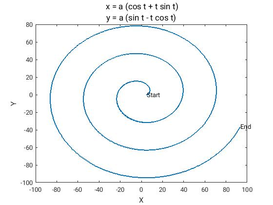
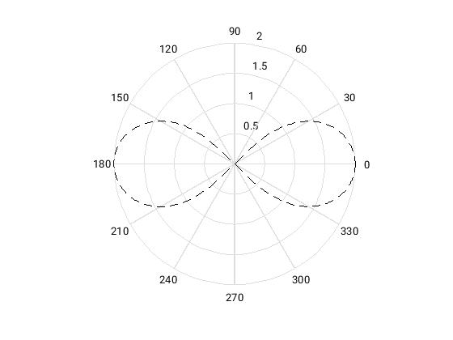
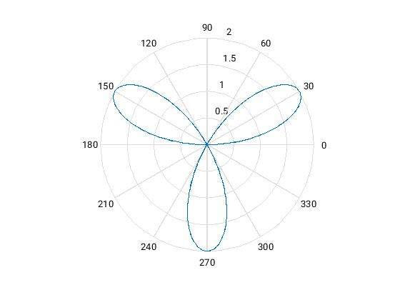
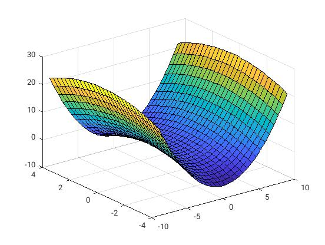
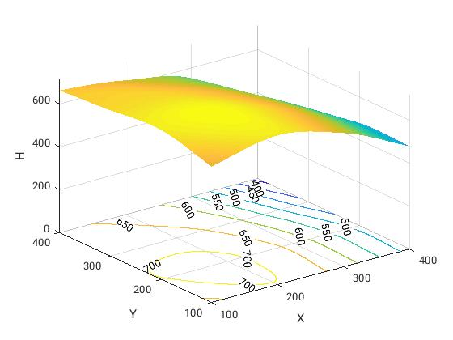
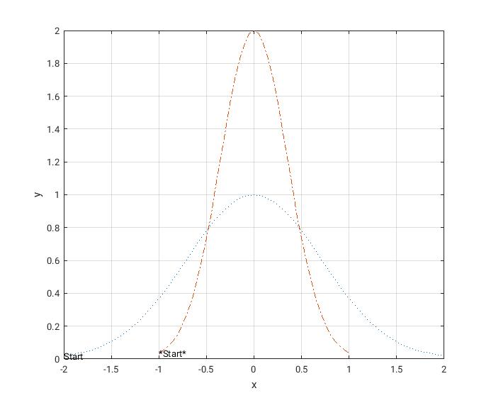
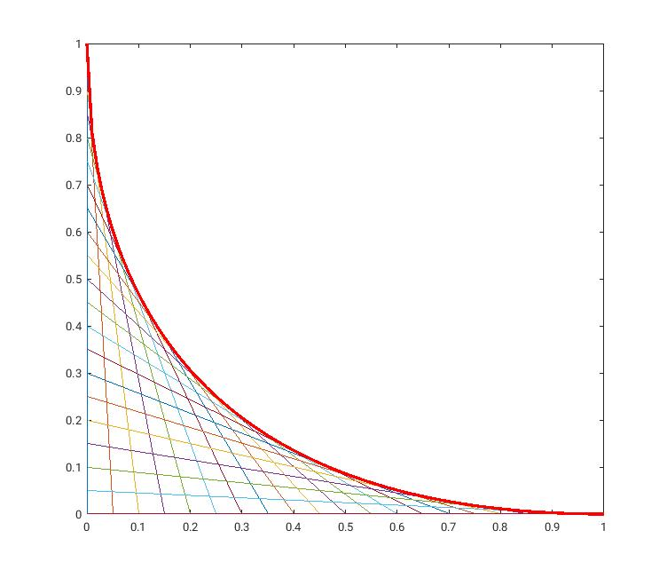

# 前言
本节的内容主要根据我在大四 matlab 课程设计整理而得。

<div class = 'data-section default-folding'>
<h2 class = 'section-title'>积分</h2>
<div class = 'folding-area'>

<h4 class = 'auto-sort'> 用定积分的方法计算椭圆 $ \frac{x^2}{9} + \frac{y^2}{4} = 1 $ 的周长。</h4>

  - **coding :**
     ```matlab
     syms t  dx  dy;
     a = 3;
     b = 2;
     dx = diff( a*cos(t), t, 1);
     dy = diff( b*sin(t), t, 1);
     vpa( int(sqrt( dx^2 + dy^2),t,0,2*pi))
     ```
   <br/>

<h4 class = 'auto-sort'> 计算数值积分 $ \iint_{x^2 + y^2  \le 2y} (1 + x +y)dt\, $ </h4>

  1. **coding :**  *调用系统自带函数 integral2*

     ```matlab
     clear;
     fun  = @(x,y) 1 + x + y;
     ymin = @(x)   1 - sqrt(1-x.^2);
     ymax = @(x)   1 + sqrt(1-x.^2);
     integral2(fun, -1, 1, ymin, ymax)
     ```
  1. **coding :**  *自己编写dblquad2函数*
     - 二重积分算法文件: *dblquad2.m*
        ```matlab
        function S=dblquad2(f\_name,a,b,c\_lo,d_hi,m,n)
           %{
           其中f_name为被积函数字符串,'c_lo'和'd_hi'是y的下限和上限函数,都是x的
           标量函数;a,b分别为x的下限和上限;m,n分别为x和y方向上的等分数(缺省值为
           100).
           %}

           if nargin<7, n=100; end
           if nargin<6, m=100; end
           if m<2|n<2
               error('Numner of intervals invalid');
           end
           hx=(b-a)/m;             %x区间被分割成的小区间长度
           x=a+(0:m)*hx;           %每个x小块的坐标
           for i=1:m+1
               ylo=feval(c_lo,x(i));
               yhi=feval(d_hi,x(i));
               hy=(yhi-ylo)/n;     %y区间被分割成的小区间长度
               for k=1:n+1
                   y(i,k)=ylo+(k-1)*hy; %每个y小块的坐标
                   f(i,k)=feval(f_name,x(i),y(i,k));
               end
               G(i)=trapz(y(i,:),f(i,:));
           end
           S=trapz(x,G);

           %被积函数eg3_fun.m
           function z=eg3_fun(x,y)
               z=1+x+y;

           %积分下限函数eg3_low.m
           function y=eg3_low(x)
               y=1-sqrt(1-x^2);

           %积分上限函数eg3_up.m
           function y=eg3_up(x)
               y=1+sqrt(1-x^2);

         ```
   <br/>

<h4 class='auto-sort'> （Simpson 积分法）编制一给定步长Simpson 法数值积分程序, 计算公式为: $ I \approx S_n = \frac{h}{3} (f_1 + 4f_2 + 2f_3 + 4f_4 + ... + 2f_{n-1} + 4f_n + f_{n+1}) $ ,其中 n 为偶数， $ n = \frac{b - a}{n}, f_i = f(a + (i-1)h), i = 1, 2, 3, ... , n+1. $  </h4> 

  - 编写一个 simpson.m 函数文件实现指定功能
    ```matlab
    %simpson.m
    function simpson = simpson(f, a, b, n)
    h = (b-a)/n;
    w=ones(1,2*n+1);
    w(2:2:2*n)=4;
    w(3:2:2*n-1)=2;
    x = linspace(a, b, 2*n+1);
    y = feval(f,x);
    simpson = h/6 * y*w'
    ```
    <br/>

<h4 class='auto-sort'> （假奇异积分）用trapz, integral, quald 计算积分 $\int_{-1}^{1} x^{0.3}cos(x) dx$ 会出现什么问题？</h4>

<!-- TODO 格式问题
  <table class="tg">
	<tr>
      <th><br></th>
      <th>trapz</th>
      <th>integral(推荐)</th>
      <th>quadl</th>
    </tr>
    <tr>
      <td><br class="error">错误解法<br></td>
      <td>clear:<br>x = -1: 0.01: 1<br>y = x^3 * cos(x)<br>trapz(x, y)<br></td>
      <td>clear:<br>fun = @(x)  x.^0.3.*cos(x)<br>integral(fun, -1, 1)<br></td>
      <td>clear:<br>fun = @(x) x.^0.3.* cos(x)<br>quadl(fun, -1, 1)<br></td>
    </tr>
    <tr>
      <td>错误结果<br></td>
      <td>0.9929 + 0.5059i<br></td>
      <td>0.9930 + 0.5060i<br></td>
      <td>0.9930 + 0.5060i<br></td>
    </tr>
    <tr>
      <td colspan="4" class = 
"notice">分析：数值方法对y(x)是通过exp(ln(y))计算，当时就会出现复数，这种情况称为假奇异积分。,<br><br>注：不要盲目的相信机器，在做计算前至少要大概有个可计算分析</td>
    </tr>
    <tr>
      <td><br>正确解法<br></td>
      <td></td>
      <td>clear;<br>fun1 = @(x)   -(-x).^0.3 .* cos(x);<br>fun2 = @(x)    x.^0.3 .* cos(x);<br>integral(fun1, -1, 0) + 
integral(fun2, 0, 1)</td>
      <td>clear;<br>fun1 = @(x)   -(-x).^0.3 .* cos(x);<br>fun2 = @(x)   x.^0.3 .* cos(x);<br>quadl(fun1, -1, 0) + 
quadl(fun2, 0, 1)</td>
    </tr>
    <tr>
      <td>结果<br></td>
      <td></td>
      <td>-1.102e-6</td>
      <td>1.1102e-16</td>
    </tr>
  <table>
	-->
</div>
</div>

<div class = 'data-section default-folding'>
<h2 class = 'section-title'>曲线绘图</h2>
<div class = 'folding-area'>

<h4 class='auto-sort'> 高斯曲线 $y = e^{-x^2}$ </h4>

  - **代码 :**
    ```matlab
    clear;
    close;
    x = linspace(-10, 10, 1000);
    y = exp(-x.^2);
    plot(x, y, 'linewidth', 2);

    %==============设置样式==============
    % title( ''); %标题命令
    text(x(1),y(1),'Start', 'color', 'y'); %在开始处加字符串'Start',并且设置字体颜色
    n=length(x);
    text(x(n),y(n),'End', 'color', 'y');
    xlabel('X'); ylabel('Y');  %说明坐标轴标记
    set(gca, 'color', 'k');  %设置背景颜色
    %===================================
    ```

  

  <br/>

<h4 class='auto-sort'> 笛卡尔曲线 $x = \frac{3at}{1 + t^3}, y = \frac{3at^2}{1 + t^3}  ( x^3 + y^3 - 3axy = 0) .$ </h4>

  - **代码 :**
    ```matlab
    clear;
    close;
    syms x  y;
    a = input('请输入数字 a = ');
    ezplot(x^3 + y^3 - 3*a*x*y);
    % set(gca, 'color', 'k');  %设置背景颜色
    ```
    **取 a = 2**
    
    <br/>

<h4 class='auto-sort'> 蔓叶线 $x = \frac{at^2}{1 + t^2}, y = \frac{at^3}{1 + t^2} ( y^2 = \frac{x^3}{a-x} ) .$ </h4>

  - **代码 :**
    ```matlab
    close;
    syms x  y;
    a = input('请输入数字 a = ');
    ezplot(x^3 - y^2*(a-x), [-10, 10]);
    % set(gca, 'color', 'k');  %设置背景颜色   % set(gca, 'color', 'k');  %设置背景颜色
    ```
    **取 a = 2**
    
    <br/>

<h4 class='auto-sort'> 摆线 $x = a(t - sin t), y = b(1 - cost) .$ </h4>

  - **代码 :**
    ```matlab
    clear;
    close;
    t=0:0.01:20;
    a = input('a = ');
    b = input('b = ');
    x = a * ( t - sin(t) );
    y = b * ( 1 - cos(t) );
    plot( x, y, 'linewidth', 2);

    %============================设置样式===========================
    % title( ''); %标题命令
    text(x(1),y(1),'Start', 'color', 'k'); %在开始处加字符串'Start',并且设置字体颜色
    n=length(x);
    text(x(n),y(n),'End', 'color', 'k');
    xlabel('X'); ylabel('Y');  %说明坐标轴标记
    % set(gca, 'color', 'k');  %设置背景颜色
    %===============================================================
    ```
    **取 a = 2**
    
    <br/>

<h4 class='auto-sort'> 圆的渐近线（渐开线） $x = a(cost + tsint), y = a(sint - tcost) .$ </h4>

  - **代码 :**
    ```matlab
    clear;
    close;
    t=0:0.01:20;
    a = input('a = ');
    x = a * ( cos(t) + t.*sin(t) );
    y = a * ( sin(t) - t.*cos(t) );
    plot(x,y, 'linewidth', 2);

    %==============设置样式==============
    title( { '\fontsize{13} x = a (cos t + t sin t)'; ' y = a (sin t - t cos t) '}); %标题命令
    text(x(1),y(1),'Start', 'color', 'k'); %在开始处加字符串'Start',并且设置字体颜色
    n=length(x);
    text(x(n),y(n),'End', 'color', 'k');
    xlabel('X'); ylabel('Y');  %说明坐标轴标记
    % legend('Cone line'); %  图例说明
    % set(gca, 'color', 'k');  %设置背景颜色
    %===================================
    ```
    **取 a = 5**
    
    <br/>

<h4 class='auto-sort'> 空间螺线 $x = acost, y = bsint, z = ct .$ </h4>

  - **代码 :**
    ```matlab
    clear;
    close;
    t=0:0.001:20;
    a = input('a = ');
    b = input('b = ');
    c = input('c = ');
    x = a * cos(t);
    y = b * sin(t);
    z = c * t;
    plot3(x,y,z, 'linewidth', 2);

    %=======================设置样式==================
    title( {'x = a cos t'; 'y = b sin t'; 'z = c t     '}); %标题命令
    text(x(1),y(1),z(1),'Start');      %在开始处加字符串'Start'
    %在开始处加字符串'Start',并且设置字体颜色
    text(x(1),y(1),z(1), 'Start', 'color', 'k');
    n=length(x);
    text(x(n),y(n),z(n), 'End', 'color', 'k');
    xlabel('X'); ylabel('Y');  %说明坐标轴标记
    % set(gca, 'color', 'k');    %设置背景颜色
    %grid off  %掩藏格栅
    %===================================================
    ```
    **取 a = 2, b = 2, c = 2**
    
    <br/>

<h4 class='auto-sort'> 阿基米德线 $r = a\varphi .$ </h4>

  - **代码 :**
    ```matlab
    clear;
    close;
    phi = 0 : 0.01 : 5*pi;
    for  i = 1:2
        a(i) = input('请输入数字 a = ');
        rho(i,:) = a(i) * phi;
        subplot(1, 2, i),
        set( polar( phi, rho(i, :), '--r'), 'linewidth', 2);
    end
    ```
    **取 a = -5 \ a = 5**
    
    <br/>

<h4 class='auto-sort'> 双纽线 $r^2 = a^2 cos2\varphi, ((x^2 + y^2) = a^2(x^2-y^2)) .$ </h4>

  - **代码 :**
    ```matlab
    clear;
    close;
    phi = 0 : 0.01 : 2*pi;
    a = input('a = ');
    r = sqrt( a^2 * cos( 2*phi ) );
    polar(phi, r, '--k');
    ```
    **取 a = 2**
    
    <br/>

<h4 class='auto-sort'> 三叶玫瑰线 $r = asin3\varphi, r \ge 0 .$ </h4>

  - **代码 :**
    ```matlab
    clear;
    close;
    phi = 0 : 0.01 : 2*pi;
    a = input('a = '),
    y = a * sin( 3*phi );
    polar(phi, y);
    ```
    **取 a = 2**
    
    <br/>

<h4 class='auto-sort'> 四叶玫瑰线 $r = asin2\varphi, r \ge 0 .$ </h4>

  - **代码 :**
    ```
    clear;
    close;
    phi = 0 : 0.01 : 2*pi;
    a = input('a = '),
    y = a * sin( 2*phi );
    polar(phi, y);
    ```
    **取 a = 2**
    
    <br/>

</div>
</div>

<div class = 'data-section default-folding'>
<h2 class = 'section-title'>二元函数图像</h2>
<div class = 'folding-area'>

<h4 class='auto-sort'> 画出空间曲面 $z = \frac{10sin{ \sqrt{x^2 + y^2} }}{ \sqrt{1 + x^2 + y^2}}$ 在范围内的图形，并画出相应的等高线。</h4>

  - **代码 ：**
    ```matlab
    clear;
    close;
    x_ = linspace(-20, 20, 100);
    y_ = linspace(-20, 20, 100);
    [x, y] = meshgrid(x_, y_);  %将向量x, y指定的区域转化为矩阵X, Y
    z = 10 * sin( sqrt(x.^2+y.^2))./sqrt(1+x.^2+y.^2);
    % mesh(X, Y, Z);
    surf(x, y, z, 'EdgeColor', 'none');
    hold on;
    contour3(x, y, z, 10, 'y');       %画10条等高线
    xlabel('X-轴'); ylabel('Y-轴');zlabel('Z-轴');
    title('');
    % grid off;       %网格线
    ```
    
    <br/>

<h4 class='auto-sort'> 椭球面 $x = 3cosu*sinv, y = 2cosu*cosv, z = sinu .$ </h4>

  - **代码 ：**
    ```matlab
    clear;
    close;
    [u v] = meshgrid( linspace(0, 2*pi, 1000), linspace(0,  pi, 1000) );
    x = 3*cos(u).*sin(v);
    y = 2*cos(u).*cos(v);
    z = sin(u);
    % mesh(x, y, z);
    surf(x, y, z, 'EdgeColor', 'none');
    ```
    
    <br/>

<h4 class='auto-sort'> 椭圆抛物面 $x = 3u*sinv, y = 2u*cosv, z = 4u^2 .$ </h4>

  - **代码 ：**
    ```matlab
    clear;
    close;
    [u v] = meshgrid( linspace(-10, 10, 1000), linspace(0,  pi, 1000) );
    x = 3*u.*sin(v);
    y = 2*u.*cos(v);
    z = 4*u.^2;
    % mesh(x, y, z);
    surf(x, y, z, 'EdgeColor', 'none');
    ```
    
    <br/>

<h4 class='auto-sort'> 单叶双曲面 $x = 3secu*sinv, y = 2secu*cosv, z = 4tanu .$ </h4>

  - **代码 ：**
    ```matlab
    clear;
    close;
    u_ = linspace(-1, 1, 100);    %取u_的区间为[-1, 1]
    v_ = linspace(-pi, pi, 100);  %取v_的区间为[-pi, pi]
    [u v] = meshgrid( u_, v_ );
    x = 3 * sec(u) .* sin(v);
    y = 2 * sec(u) .* cos(v);
    z = 4 * tan(u);
    surf(x, y, z, 'EdgeColor', 'none');
    ```
    
    <br/>

<h4 class='auto-sort'> 双曲抛物面 $x = u, y = v, z = \frac{u^2 - v^2}{3} .$ </h4>

  - **代码 ：**
    ```matlab
    clear;
    close;
    u_ = linspace(-9, 9, 30);
    v_ = linspace(-4, 4, 30);  ]
    [u v] = meshgrid( u_, v_ );
    x = u;
    y = v;
    z = ( u.^2 - v.^2 )/3;
    surf(x, y, z);
    ```
    
    <br/>

<h4 class='auto-sort'> 旋转面 $x = ln(u)*sinv, y = ln(u)*cosv, z = u .$ </h4>

  - **代码 ：**
    ```matlab
    clear;
    close;
    u_ = linspace(0, 9, 30);     %取u_的区间为[0, 9]
    v_ = linspace(-pi, pi, 30);  %取v_的区间为[-pi, pi]
    [u v] = meshgrid( u_, v_ );
    x = log(u) .* sin(v);
    y = log(u) .* cos(v);
    z = u;
    surf(x, y, z, 'EdgeColor', 'none');
    ```
    
    <br/>

<h4 class='auto-sort'> 环面 $x = (3 + 0.4cosu)cosv, y = (3 + 0.4cosu)sinv, z = 0.4sinv .$ </h4>

  - **代码 ：**
    ```matlab
    clear;
    close;
    u_ = linspace(0, 2*pi, 1000);
    v_ = linspace(0, 2*pi, 1000);
    [u v] = meshgrid( u_, v_ );
    x = ( 3 + 0.4*cos(u) ) .* cos(v);
    y = ( 3 + 0.4*cos(u) ) .* sin(v);
    z = 0.4 * sin(v);
    surf(x, y, z, 'EdgeColor', 'none');
    ```
    
    <br/>

<h4 class='auto-sort'> 在一丘陵地带测量高程,x和y方向每隔100米测一个点, 高程数据见下表,试拟合一曲面,确定合适的模型,并由此找出最高点和该点的高程. </h4>
  <table>
    <tr>
      <th>   x<br> y<br></th>
      <th>100<br></th>
      <th>200<br></th>
      <th>300<br></th>
      <th>400<br></th>
    </tr>
    <tr>
      <td>100</td>
      <td>636</td>
      <td>697</td>
      <td>624</td>
      <td>478</td>
    </tr>
    <tr>
      <td>200</td>
      <td>698</td>
      <td>712</td>
      <td>630</td>
      <td>478</td>
    </tr>
    <tr>
      <td>300</td>
      <td>680</td>
      <td>674</td>
      <td>598</td>
      <td>412</td>
    </tr>
    <tr>
      <td>400</td>
      <td>662</td>
      <td>626</td>
      <td>552</td>
      <td>334<br></td>
    </tr>
  </table>

  - **代码 ：**
    ```matlab
    clear;
    close;
    x_ = [100 100 100 100];
    y_ = [100 200 300 400];
    x = [ x_  2*x_  3*x_  4*x_ ];
    y = [ y_  y_   y_   y_ ];
    z = [ 636 698 680 662 697 712 674 626 624  630  598 552 478 478 412 334 ];
    x_=100:0.5:400;  y_=100:0.5:400;
    [X,Y] = meshgrid(x_,y_);              %产生网格向量X,Y
    H=griddata(x,y,z,X,Y,'cubic');      %’cubic’采用三角形三次插值
    surf(X,Y,H, 'EdgeColor', 'none');
    hold on
    xlabel('X');  ylabel('Y'); zlabel('H')
    % view(-60,30); %改变视点
    contour(X,Y,H,'ShowText', 'on')
    % =======================================================================
     [MAX_HIGH , index]=max(H(:));                     %MAX_HIGH为最高点的高度
     MAX_POSITION = [
                      x_( ceil( index/length(x_) ) )   %最高点对应的的x_值
                      y_( mod( index ,length(x_) ) )   %最高点对应的的y_值
                     ];
    % -------------------代替解法-------------------------------------------
    %  [var, index_1] = max(H);
    %  [Max_HIGH, index_2] = max(var);
    %  MAX_POSITION = [
    %                   x_(index_2)               %最高点对应的的x_值
    %                   y_( index_1( index_2 ))   %最高点对应的的y_值
    %                  ];
    % ======================================================================

    MAX_HIGH
    MAX_POSITION
    ```
    
    <br/>

</div>
</div>

<div class = 'data-section default-folding'>
<h2 class = 'section-title'>平面图形的几何变换积分</h2>
<div class = 'folding-area'>

<h4 class='auto-sort'> 将函数 $y = e^{-x^2}$ 的图形在水平方向收缩一倍，在垂直方向扩大一倍。</h4>

   - **代码 :**
     ```matlab
     clear;
     close;
     x=-2: 0.1: 2;
     y=exp(-x.^2);
     f = [x; y];           %原函数
     phi = 0;              %逆时针旋转的角度
     b = [0; 0];           %旋转中心
     B = [0.5  0; 0 2];    %形变矩阵

     A = [cos(phi), -sin(phi)  ;  sin(phi), cos(phi)];    %旋转矩阵
     f1 = B*f;
     f1 = A*[f1(1,:)-b(1); f1(2,:)-b(2)];
     f1 = [f1(1,:)-b(1); f1(2,:)-b(2)];
     plot(x,y,':',f1(1,:), f1(2, :),'-.');
     text(f(1,1),f(2,1),'Start', 'color', 'k'); %在开始处加字符串'Start',并且设置字体颜色
     text(f1(1,1),f1(2,1),'*Start*', 'color', 'k');
     xlabel('x'); ylabel('y');
     grid on;
     ```
     
   <br/>

<h4 class='auto-sort'> $y = sinx, x \in (0, 2\pi)$ 绕（1, 1）逆时针旋转$60^\circ$. </h4>

   - **代码 :**
     ```matlab
     clear;
     close;
     x = 0: 0.1: 2*pi;
     y = sin(x);
     f = [x; y];           %原函数
     phi = pi/3;           %逆时针旋转的角度
     b = [1; 1];           %旋转中心
     B = [1  0; 0  1];                                    %形变矩阵

     A = [cos(phi), -sin(phi)  ;  sin(phi), cos(phi)];    %旋转矩阵
     f1 = B*f;
     f1 = A*[f1(1,:)-b(1); f1(2,:)-b(2)];
     f1 = [f1(1,:)-b(1); f1(2,:)-b(2)];
     plot(x,y,':',f1(1,:), f1(2, :),'-.');
     text( f(1,1), f(2,1), 'Start', 'color', 'k' ); %在开始处加字符串'Start',并且设置字体颜色
     text( f1(1,1), f1(2,1), '*Start*', 'color', 'k');
     xlabel('x'); ylabel('y');
     grid on;
     ```
     
   <br/>

</div>
</div>

<div class = 'data-section default-folding'>
<h2 class = 'section-title'>迭代式与不动点</h2>
<div class = 'folding-area'>

<h4 class='auto-sort'> 为求解方程 $x^3 - x^2 -1 = 0$ 在 $x = 1.5$ 附近的一个根， 使用以下不动点方程构造迭代格式进行计算，并分析收敛性：</h4>

   (1) **$ x = 1 + \frac{1}{x^2} $**

   - **代码 :**
     ```matlab
     clear;
     x=1.5;
     n = 1:20;
     list = zeros(1,length(n));
     for j = n
         x=1+1/x^2;
         list(1,j) = x;
     end
     format short;
     list      %列出每次迭代的结果
     err = [0 ,list] - [list, 0];
     err = err(1, 2:length(err)-1)      %判断是否有收敛趋势
     %==========================================
     ```

     **结果 :**
     list =
          1.4444    1.4793    1.4570    1.4711    1.4621
          1.4678    1.4642    1.4665    1.4650    1.4659
          1.4653    1.4657    1.4655  **1.4656**  1.4655
          1.4656    1.4656    1.4656    1.4656    1.4656
    err =
         -0.0348    0.0223   -0.0141    0.0090   -0.0057
          0.0036   -0.0023    0.0015   -0.0009    0.0006
         -0.0004    0.0002   -0.0002    0.0001   -0.0001
          0.0000   -0.0000    0.0000   -0.0000

      <br/>

   (2) **$x = (1 + x^2)^\frac{1}{3}$**

   - **代码 :**
     ```matlab
     clear;
     x=1.5;
     n = 1:20;
     list = zeros(1,length(n));
     for j = n
         x=(1+x^2)^(1/3);
         list(1,j) = x;
     end
     format short;
     list      %列出每次迭代的结果
     %==========================================
     ```

     **结果 :**
     list =
          1.4812    1.4727    1.4688    1.4670    1.4662
          1.4659    1.4657  **1.4656**  1.4656    1.4656
          1.4656    1.4656    1.4656    1.4656    1.4656
          1.4656    1.4656    1.4656    1.4656    1.4656

     err =
          0.0085    0.0039    0.0018    0.0008    0.0004
          0.0002    0.0001    0.0000    0.0000    0.0000
          0.0000    0.0000    0.0000    0.0000    0.0000
          0.0000    0.0000    0.0000    0.0000

     <br/>

   (3) **$ x =  \frac{1}{\sqrt{x-1}} $**

   - **代码 :**
     ```matlab
     clear;
     x=1.5;
     n = 1:20;
     list = zeros(1,length(n));
     for j = n
         x = 1/sqrt(x-1);
         list(1,j) = x;
     end
     format short;
     list      %列出每次迭代的结果
     %==========================================
     ```

     收敛较慢

   <br/>

<h4 class='auto-sort'> 数列 $ x_n $ 满足 $ x_{n+1} = \frac{1}{2}(x_n + \frac{a}{x_n}),(a \gt 0, x_0 \gt 0) $ </h4>

    (1) **利用此迭代式近似计算 a 的平方根**

   - **代码 :**
     ```matlab
     clear;
     count = 0;
     eps=1.0e-6;
     x = 1;
     a = 3;
     while abs( x - 1/2*(x + a/x) )>eps
         x = 1/2*(x + a/x);
         count = count+1;
     end
     RESULT = [vpa(x), count]
     %=============================
     ```
     **结果 ：** 迭代4次
     RESULT = [ 1.732050810014727540500736377025, 4]

     <br/>

    (2) **使用迭代格式 $ x_{n+1} = \frac{x_{n}^3 + 3ax_n}{3x_{n}^2 + a}, (a \gt 0, x_0 \gt 0)$ 计算$\sqrt{a} $, 并比较迭代结果。**

   - **代码 :**

     ```matlab
     clear;
     count = 0;
     eps=1.0e-6;
     x = 1;
     a = 3;
     while abs( x - 1/2*(x + a/x) )>eps
         x = (x^3 + 3*a*x)/(3*x^2+a);
         count = count+1;
     end
     RESULT = [vpa(x), count]
     %=============================
     ```
     **结果：** 迭代3次
     RESULT = [ 1.7320508075688772935274463415059, 3]

    <br/>

<h4 class='auto-sort'> 设 $ f(x) = x^gg5 + x -1. $ </h4>

    (1) **证明方程 $ f(x) = 0 $ 在区间 [0,1] 内有且只有一个根**

  - **代码 :**
     ```matlab
     clear;
     syms x ;
     f(x) = x^5 + x - 1;
     [sign(f(0)*f(1)), diff(f)]
     %=============================
     ```
     **结果 ：** $RESULT(x) = [ -1, 5x^4 + 1]$

     因为 f(0)和f(1)异号，且在[0,1]区间，f(x)的导数都大于0
     所以 方程在区间内有且仅有一个根;

     <br/>

    (2) **用迭代格式 $ x = 1 - x^5 $ 构造迭代式，迭代过程收敛吗？**

  - **代码 :**
     ```matlab
     clear;
     x=0;
     list = zeros(1,10);
     for n=1:10
         x=1-x^5;
         list(1,n) = x;
     end
     list
     %=============================
     ```
    **迭代10次每次的结果：** list = [ 1, 0, 1, 0, 1, 0, 1, 0, 1, 0 ]

     结果不收敛

    <br/>

    (3) **对迭代格式 $ x = (1 - \lambda)x + \lambda(1-x^5) $ ,选择 $ \lambda $ 值进行迭代,观测收敛速度,记录实验结果.**

   - **代码：**
     ```matlab
     clear;
     eps=1.0e-6;                             %最大误差
     lambda = 0 : 0.05 : 1; lambda = lambda';
     x=zeros( length(lambda),1);             %迭代的起点
     count = zeros( length(lambda),1);       %用于统计迭代次数
     w = 1000;                               %迭代的最大步数

     for j = 1 : length(lambda)
         while abs( x(j) - ((1-lambda(j))*x(j) + lambda(j)*(1 - x(j)^5)) )>eps
             x(j) = (1-lambda(j))*x(j) + lambda(j)*(1 - x(j)^5);
             count(j)=count(j)+1;
             if count(j) > w
                 count(j) = -1;
                 break;
             end
         end
     end

     RESULT = [lambda, x, count]
     %===============================================================
     ```

     **结果：** 步长为0.05，误差为10-6 ，最大迭代次数10000

     <br/>

     | --$ \lambda $-- | ------- 迭代结果 -------|  迭代步数 |
     | --| -- | -- |

     ```ans
        0                      0            0
     0.05      0.754870872193172           92
      0.1      0.754873869439061           45
     0.15      0.754875537266301           29
      0.2       0.75487670347573           21
     0.25      0.754876589548533           15
      0.3      0.754876730184012           11
     0.35      0.754877236814649            8
      0.4      0.754878561657115            6
     0.45      0.754876826889256            8
      0.5      0.754878172687218           11
     0.55      0.754877268720405           15
      0.6      0.754878298820794           22
     0.65      0.754877166726579           35
      0.7      0.754877160076038           65
     0.75      0.754878172392699          280
     -------------------------------------------
      0.8      0.857772224739456           -1
     0.85      0.900126653633779           -1
      0.9      0.930663607217391           -1
     0.95      0.960556048991364           -1
        1                      1           -1
     ```
    说明：迭代次数为-1，表达式未收敛
    由结果初步断定表达式是否收敛的临界点在 $ \lambda \in [0.75, 0.8] $, 进一步细化迭代（代码略）

     |-- $ \lambda $ --| ------- 迭代结果 -------|  迭代步数 |
     | --| -- | -- |

     ```ans
      0.75        0.754878172392699         280
     0.751        0.754878165370155         298
     0.752        0.754878171531977         316
     0.753         0.75487816064712         334
     0.754        0.754878162397703         340
     0.755        0.754878164875426         285
     0.756        0.754878166387056         463
     0.757        0.754877165393876         596
     0.758        0.754878165904173         769
     0.759        0.754877168155563        1034
      0.76        0.754877165148552        1516
     0.761        0.754878166288113        2719
     ----------------------------------------------
     0.762        0.754879256217995          -1
     0.763        0.771181718528619          -1
     0.764        0.780054098460845          -1
     0.765        0.786310263691814          -1
     0.766        0.791371289280384          -1
     0.767        0.795706997262982          -1
     0.768        0.799542599267108          -1
     0.769        0.803006742660196          -1
      0.77        0.806181097084819          -1
      …
      …

      ```
     由结果初步断定表达式是否收敛的临界点在 $ \lambda \in [0.761, 0.762] $

</div>
</div>

<div class = 'data-section default-folding'>
<h2 class = 'section-title'>牛顿迭代法</h2>
<div class = 'folding-area'>

<h4 class='auto-sort'> 为求出方程 $ x^3 - x - 1 = 0 $ 的根,在区间 [1, 2] 内使用迭代函数进行迭代,记录迭代数据,问迭代是否收敛?对迭代进行加速,对比加速前的数据,比较加速效果. </h4>

   - **代码1：**
     ```matlab
     %普通的求根算法
     %================================
     clear;
     syms  x ;
     eps = 1.0e-18;           %最大误差
     f(x) = x^3 - x -1;       %待求根的函数
     g(x) = ( x+1 )^(1/3);
     x_ = 1;                  %迭代起点
     count = 0;               %迭代次数
     while  abs(x_ - g(x_)) > eps
          x_ = g(x_);
          count = count + 1;
     end

     RESULT = [vpa(x_) , count]
     %================================
     ezplot(f, [0, 2])
     grid on;
     ```
     **结果：**[1.3247179572447460256419340197423, 25]

     

     <br/>

   - **代码2：** 加速迭代1
     ```matlab
     % ================================
     % 牛顿迭代法
     % ================================
     clear;
     syms  x ;
     eps = 1.0e-18;           %最大误差
     f(x) = x^3 - x -1;       %待求根的函数
     g = x - f/diff(f);
     x_ = 1;                  %迭代起点
     count = 0;               %迭代次数
     while  abs(x_ - g(x_)) > eps
          x_ = g(x_);
          count = count + 1;
     end


     RESULT = [vpa(x_) , count]
     %================================
     ```
     **结果：** [1.3247179572447460259609088562644,  6]

      <br/>

   - **代码3：** 加速迭代2
     ```matlab
     clear;
     syms  x ;
     eps = 1.0e-18;           %最大误差
     f(x) = x^3 - x -1;       %待求根的函数
     g(x) = ( x+1 )^(1/3);
     h(x) = ( g - x * diff(g) ) / ( 1 - diff(g) );
     x_ = 1;                  %迭代起点
     count = 0;               %迭代次数
     while  abs(x_ - h(x_)) > eps
          x_ = h(x_);
          count = count + 1;
     end

     RESULT = [vpa(x_) , count]
     %================================
     ```
     **结果：** [1.3247179572447460259609088544836, 4]

</div>
</div>

<div class = 'data-section default-folding'>
<h2 class = 'section-title'>多元函数的极值</h2>
<div class = 'folding-area'>

<h4 class='auto-sort'> 求 $z = x^4 + y^4 -4xy + 1$ 的极值，并对图形进行观测 </h4>

   - **代码 :**
     ```matlab
     %==================================================================
     % 步骤1. 定义多元函数 ；
     % 步骤2. 求解正规方程 ,得到驻点；
     % 步骤3. 对于每一个驻点 ,求出二阶偏导数
     % 步骤4. 对于每一个驻点 ,计算判别式 AC-B^2,
     %        若 AC-B^2 > 0 ,则该驻点是极值点,当 A > 0 为极小值,A < 0  为极大值;
     %        若 AC-B^2 = 0 ,判别法失效,需进一步判断;
     %        若 AC-B^2 < 0 ,则该驻点不是极值点。
     %==================================================================
     clear;
     close;
     syms x y real;                    % real设置x, y为实数
     f(x, y) = x^4 + y^4 - 4*x*y + 1;                      %步骤1
     df_x = diff(f,x);
     df_y = diff(f,y);
     [x_, y_] = solve( df_x == 0, df_y == 0, 'x', 'y');    %步骤2得到驻点
     % stagnationPoint = [x_, y_]   %驻点
     A = diff(df_x, x);                             % 步骤3
     B = diff(df_x, y);
     C = diff(df_y, y);           %或者A= diff(z, y, 2);
     criterion = A*C - B^2;                          % 步骤4

     var = [
             x_,                     ...
             y_,                     ...
             criterion(x_, y_),      ...
             A(x_ , y_)              ...              %驻点对应A的值
            ];

     var(find( var(:,3)<0 ), :) = [];
     flag =sign( var(:,3).*var(:,4) );  %用于标记极值

     % ++++++++++++++++++++++++++结果++++++++++++++++++++++++++++++++
      RESULT = [
                 f( var(:,1),var(:,2) ),  ...        % 极值
                 flag,                    ...        % -1为极大值，1为极小值， 0为不可判定
                 var(: , 1:2)             ...        % 极值点（最后2列）
                ]

     % ========================函数图像模拟==========================
     x=-5:0.2:5;  y=-5:0.2:5;
     [x,y]=meshgrid(x,y);
     z = x.^4 + y.^4 - 4*x.*y + 1;
     subplot(1, 2, 1), surf(x,y,z);
     subplot(1, 2, 2), contour(x,y,z, 200);
     xlabel('x'),ylabel('y'),zlabel('z');
     % =============================================================
     ```

   
   <br/>

<h4 class='auto-sort'> 在球面 $x^2 + y^2 + z^2 = 1$ 求出与点（3, 1, -1）距离最近和最远点。</h4>

   - **代码 :**
     ```matlab
     %===============================================================
     % 1.构造Lagrange函数
     % 2.求Lagrange函数的自由极值
     clear;
     syms x y z lambda real;
     L(x, y, z, lambda) = (x-3)^2 + (y-1)^2 + (z+1)^2 - lambda * (x^2 + y^2 + z^2 - 1);
     dL_x =  diff(L,x);
     dL_y =  diff(L,y);
     dL_z =  diff(L,z);
     dL_lambda = diff(L,lambda);
     [x_, y_, z_, lambda_] = solve( dL_x == 0,           ...
                                    dL_y == 0,           ...
                                    dL_z == 0,           ...
                                    dL_lambda == 0,      ...
                                    'x', 'y', 'z', 'lambda' );
     RESULT = [
               sqrt( L(x_, y_, z_, lambda_) ),  ...    % 待求距离（极值或边界值）
               x_,                              ...    % 对应的x坐标
               y_,                              ...    % 对应的y坐标
               z_,                              ...    % 对应的z坐标
               lambda_,                         ...    % 对应的lambda取值
              ];
     RESULT = vpa( RESULT , 4 )
     %===============================================================
     ```

     **结果 :**
      最大值：4.317   坐标: -0.9045, -0.3015, 0.3015
      最小值：2.317   坐标：0.9045,  0.3015, -0.3015
   <br/>

<h4 class='auto-sort'> 求函数 $f(x, y) = x^2 + 2y^2$ 在圆周 $x^2 + y^2 = 1$ 的最大值和最小值。</h4>

   - **代码 :**
     ```matlab
     %===============================================================
     % 1.构造Lagrange函数
     % 2.求Lagrange函数的自由极值
     %===============================================================
     % 1.构造Lagrange函数
     % 2.求Lagrange函数的自由极值
     clear;
     syms x y lambda real;
     L(x, y, lambda) = x^2 + 2*y^2 - lambda * (x^2 + y^2 - 1);
     dL_x =  diff(L,x);
     dL_y =  diff(L,y);
     dL_lambda = diff(L,lambda);
     [x_, y_, lambda_] = solve( dL_x == 0,           ...
                             dL_y == 0,           ...
                             dL_lambda == 0,      ...
                             'x', 'y', 'lambda' );
     A = diff(dL_x, x);
     B = diff(dL_x, y);
     C = diff(dL_y, y);         %或者A= diff(L, y, 2);
     criterion = A*C - B^2;
     RESULT = [
               L(x_, y_, lambda_),          ...    % 极值或边界值
               x_,                          ...    % 对应的x坐标
               y_,                          ...    % 对应的y坐标
               lambda_,                     ...    % 对应的lambda取值
               criterion(x_, y_, lambda_),  ...    % 对应的极值判别式的值
               A(x_ , y_, lambda_)          ...    %  对应的A的值
              ]
     %===============================================================
     ```

     **结果 ：** 最大值为2， 最小值为1
   <br/>

<h4 class='auto-sort'> 求函数 $z = x^2 + y^2$ 在三条直线$x = 1, y = 1, x + y = 1$ 所围区域上的最大值和最小值。</h4>

   分析：最值点只能在函数的极值点和边界点产生

   - **代码 :**
     ```matlab
     clear;
     close;
     % ========================函数图像模拟==========================
     x=-0:0.01:1;  y=0:0.01:1;
     [x,y]=meshgrid(x,y);
     z = x.^2 + y.^2;
     % surf(x,y,z); hold on;
     contour(x,y,z);
     xlabel('x'),ylabel('y'),zlabel('z');
     % ==============================================================


     clear;
     close;
     syms x y real;                    % real设置x, y为实数
     f(x, y) = x^2 + y^2;

     %边界上的极值点
     m_1 = solve( diff( f(1,y) ) == 0 );
     m_2 = solve( diff( f(x,1) ) == 0 );
     m_3 = solve( diff( f(x,1-x) ) == 0 );
     solve = [
             f( 1, m_1 )
             f( m_2, 1 )
             f( m_3, 1-m_3 )
             f(1, 1)
             ];
     max(solve)
     min(solve)

     ```

     **结果 ：**
     最大值 2  坐标（1，1）
     最大值 0.5  坐标（0.5，0.5）

   
   <br/>

</div>
</div>

<div class = 'data-section default-folding'>
<h2 class = 'section-title'>简单应用</h2>
<div class = 'folding-area'>

<h4 class='auto-sort'> 给定 $ n $，例如取 $ n = 20 $，在轴上取点 $ P_i(\frac{i}{n}, 0), i = 0, 1, 2, ..., n, $ 在 $ y $ 轴上取点 $ Q_i(0, \frac{i}{n}) $ 。连接 $ P_iQ_{n-1}$ 形成直线段。试写出直线簇的方程及其包络曲线的方程，并用计算机绘图。 </h4>

   - **代码：**
     ```matlab
     % =====================================
     clear;
     syms  x y t;
     k = 1;
     F(x, y, t) = -y -(k-t)*x/t + k-t;
     [t_, y_]= solve( F == 0, diff(F, t)==0, t,y)
     % =====================================
     ```
     得到： $ y = x - 2x^\frac{1}{2} + 1 $ 或 $ y = x + 2x^\frac{1}{2} + 1 $
     取包络线:  $ y = x - 2x^\frac{1}{2} + 1 $

     ```matlab
     % =====================================
     clear;
     n = 20;
     a = 1/n*[0:n;zeros(1,n+1)];
     b = 1/n*[zeros(1,n+1); n:-1:0];
     plot(a,b);
     x = 0:0.01:1
     y = x - 2*x.^(1/2) + 1;
     hold on;
     plot(x, y, 'linewidth', 2.5, 'color', 'r');
     % =====================================
     ```

    

     <br/>

<h4 class='auto-sort'> 将两个点的直线段产生的 Koch 分形曲线算法，推广为三个点的三角形产生的 Koch 分形曲线实现的算法并绘制曲线。</h4>

   - **代码：**
     ```matlab
     % ==========================================
     clear;
     p=[0 0; 0 2; sqrt(3) 1; 0 0];%三角形扩张
     % p=[0 0;0,1;1,1;1,0;0,0]; %正方形扩张
     a=[cos(pi/3) -sin(pi/3);sin(pi/3) cos(pi/3)];
     for k=1:5
         n=max(size(p));
     d=diff(p)/3;
     q=p(1:n-1,:);
     p(5:4:4*n-3,:)=p(2:n,:);
     p(2:4:4*n-6,:)=q+d;
     p(3:4:4*n-5,:)=p(2:4:4*n-6,:)+d*a';
     p(4:4:4*n-4,:)=q+2*d;
     end
     plot(p(:,1),p(:,2))
     % ==========================================
     ```

    
</div>
</div>
