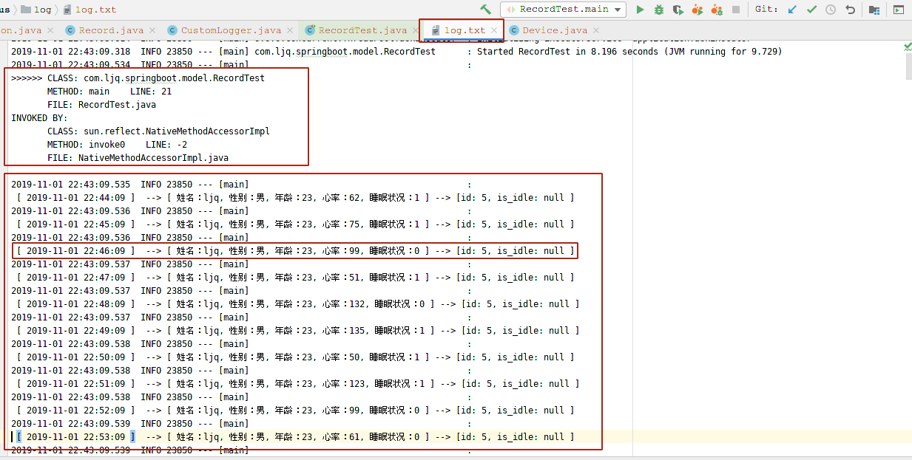

[源码](https://github.com/ljq199612/00/tree/master/code/java/HealthStatus)

**测试环境**   
操作系统：opensuse  
IDE:      idea  
JDK: 1.8  
其他：Springboot  

!> 因目前正在用 springboot 搭建关于java web 的架子，所以就用 springboot 了


**记录:**  
Record.java
```java
package com.ljq.springboot.model;

import com.ljq.springboot.tools.CustomLogger;
import lombok.Getter;
import lombok.Setter;

import java.text.SimpleDateFormat;
import java.util.*;

public class Record {
    int flag = 0;
    int hourToMin = 60;
    int dayToHour = 24;

    @Getter @Setter
    private Device device;
    @Getter @Setter
    private Person person;

    public Record(Device device, Person person){
        this.device = device;
        this.person = person;
    }


    @Getter    // [1] 一个小时内每分钟最大的心率列表，本例共24小时
    private List<Integer> maxHeartRateList = new ArrayList<>();
    @Getter
    private List<Integer> minHeartRateList = new ArrayList<>();

    private int maxHeartRate = Integer.MIN_VALUE;
    private int minHeartRate = Integer.MAX_VALUE;

    // [2] 设置当前用户的心率/分钟，
    public void status() throws InterruptedException {
        // 因缺数据省去每隔一秒执行
        //Thread.sleep(1000);

        flag++;
        person.obtainHeartRate();
        person.obtianSleepStatus();
        // [4] 模拟的每分钟 设备状况和人的状况记录
        String msg = "\n [ " + recordTime(flag*60) + " ] "+ " --> " + person.toString() + " --> " + device.toString();
        // [5] 将每分钟的记录打印到日志 log.txt
        CustomLogger.info(msg);
        //System.out.println(msg);

        {   // [3]以及记录中每小时最大最小的心率/分钟
            maxHeartRate = maxHeartRate > person.getHeartRate() ? maxHeartRate : person.getHeartRate();
            minHeartRate = minHeartRate < person.getHeartRate() ? minHeartRate : person.getHeartRate();

            if (0 == flag % hourToMin) {
                maxHeartRateList.add(maxHeartRate);
                minHeartRateList.add(minHeartRate);
                maxHeartRate = Integer.MIN_VALUE;
                minHeartRate = Integer.MAX_VALUE;

            }
        }

        if(flag == dayToHour* hourToMin){
            return;
        }else{
            status();
        }

    }


    static String recordTime(long second /*时间间隔, 秒为单位 */ ){
        long timeStamp = System.currentTimeMillis();
        Calendar calendar = Calendar.getInstance();
        SimpleDateFormat simpleDateFormat = new SimpleDateFormat("yyyy-MM-dd HH:mm:ss");
        return simpleDateFormat.format(calendar.getTimeInMillis() + second*1000);
    }


}


```


** 设备类:  **  
Device.java

```java
package com.ljq.springboot.model;


import lombok.*;


public class Device {
    @Getter @Setter
    private int id;
    private Boolean is_idle;   //是否正在被用

    public Device(int id){
        this.id = id;
    }

/*

    public Person ServicePerson(String name, int age, String sex){
        this.is_idle = true;
        return new Person(name, age, sex);
    }

*/
    @Override
    public String toString() {
        return "["+"id: " + id + ", is_idle: " + is_idle + " ]";
    }
}


```

**Person**    
Person.java

```java
package com.ljq.springboot.model;


import com.ljq.springboot.model.helper.PersonStatusHelper;
import lombok.*;

public class Person {

    @Getter @Setter
    private String name;
    @Getter @Setter
    private int age;
    @Getter @Setter
    private String sex;

    @Getter
    private int heartRate;
    @Getter
    private int sleepStatus;

    public Person(String name, int age, String sex){
        this.name = name;
        this.age = age;
        this.sex = sex;
    }

    // [1]  获取心率
    public void obtainHeartRate() {
        this.heartRate = PersonStatusHelper.measuringHeartRate();
    }
    // [1]  获取睡眠状况，{清醒:0 ，睡眠:1}
    public void obtianSleepStatus() {
        this.sleepStatus = PersonStatusHelper.sleepStatus();
    }

    @Override
    public String toString() {
        return "[ 姓名：" + name + ", 性别：" + sex + ", 年龄：" + age + ", 心率：" + heartRate + ", 睡眠状况：" + sleepStatus + " ]";
    }
}


/*---------------------------------------------------------
                          NOTE
  ---------------------------------------------------------

*/

```

**自定义Log:**  
CustomLogger.java
```java
package com.ljq.springboot.tools;

import org.slf4j.Logger;
import org.slf4j.LoggerFactory;


public class CustomLogger {
    static private Logger log = LoggerFactory.getLogger("");

    static public void info(String s){
        log.info(s);
    }

    static public void startMethodLog(){
        // Thread.currentThread().getStackTrace()[1]是你当前方法执行堆栈
        StackTraceElement[] stackTrace = Thread.currentThread().getStackTrace();
        StackTraceElement currentClass = stackTrace[2];
        StackTraceElement invokedClass = stackTrace[3];

        String className =currentClass.getClassName();
        String methodName = currentClass.getMethodName();
        int    methodLine = currentClass.getLineNumber()-1;
        String fileName = currentClass.getFileName();
        String invokedMethodName = invokedClass.getMethodName();
        String invokedClassName = invokedClass.getClassName();
        int    invokedmethodLine = invokedClass.getLineNumber();
        String invokedFileName = invokedClass.getFileName();
        log.info(
                 ">>>>>> CLASS: " + className + "\n"
                +"       METHOD: " + methodName + "    LINE: " + methodLine + "\n"
                +"       FILE: " + fileName +"\n"
                +"INVOKED BY: \n"
                +"       CLASS: " + invokedClassName + "\n"
                +"       METHOD: " + invokedMethodName + "    LINE: " + invokedmethodLine + "\n"
                +"       FILE: " + invokedFileName +"\n"
        );

    }

    static public void endMethodLog(){
        StackTraceElement currentTrace = Thread.currentThread().getStackTrace()[2];
        String className = currentTrace.getClassName();
        String methodName = currentTrace.getMethodName();
        log.info(
                 "\n<<<<<< CLASS: " + className + "\n"
                +"         METHOD: " + methodName + "\n"
        );
    }

    static public void methodLogInCatch(){
        StackTraceElement[] stackTrace = Thread.currentThread().getStackTrace();
        StackTraceElement currentClass = stackTrace[2];
        StackTraceElement invokedClass = stackTrace[3];

        String className =currentClass.getClassName();
        String methodName = currentClass.getMethodName();
        String fileName = currentClass.getFileName();
        log.info(
                "\n<<<<<< [CATCH] "
               +"       CLASS: " + className + "\n"
               +"       METHOD: " + methodName + "\n"
               +"       FILE: " + fileName +"\n"
        );
    }


}

```

**测试：**  
RecordTest.java

```java
package com.ljq.springboot.model;

//import org.junit.Test;
import com.ljq.springboot.tools.CustomLogger;
import org.junit.Test;
import org.junit.runner.RunWith;
import org.springframework.boot.test.context.SpringBootTest;
import org.springframework.test.context.junit4.SpringRunner;

@RunWith(SpringRunner.class)

@SpringBootTest

public class RecordTest {

    int deviceID = 5;

    Record record = new Record(new Device(deviceID), new Person("ljq", 23, "男"));

    @Test
    public void main() {
        CustomLogger.startMethodLog();

        record.status();
        record.getMaxHeartRateList();
        record.getMinHeartRateList();

        CustomLogger.endMethodLog();
    }

}

```

**log**  




### 思考： 如何判断用户是否佩戴了手环？
思路：  
1. 从佩戴者方面考虑： 佩戴的对象是谁， 如果是人，是否可以通过让`手环感知人的生理特征`来判断，
比如: 体温，脉搏等，人的脉搏是否在睡眠和清醒时有差距，如果有差距，是否可以通过让机器获取这个人
的脉搏信息，让机器来学习这个人的脉搏情况，用来测定这个人的睡眠质量。

2. 从机器方面考虑：添加设备移动的感应设备，感觉不太靠谱，毕竟狗也能跑，如果对
   人的运动做全面的建模，感觉难度比较大，而且总有模仿人的设备可以来干扰。
   考虑摄像头一样的视觉感应器，感觉怪怪的。

最后，个人看法是，硬件方面的支持是需要的，同时软件方面也是必要的，尤其涉及到对人
的生理特征的了解。


