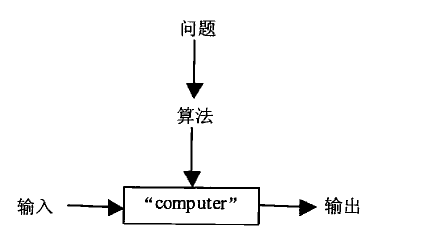
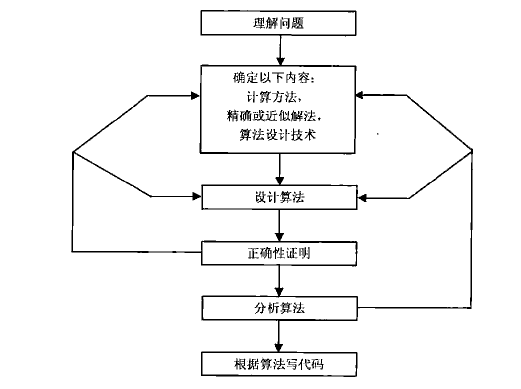
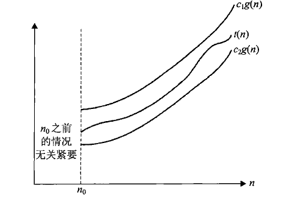
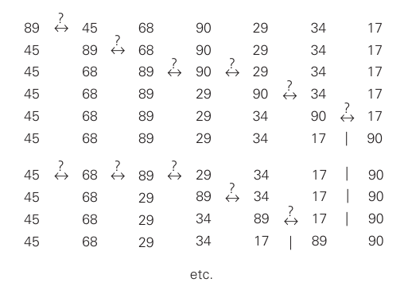
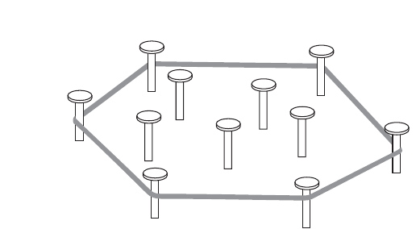

 

<div class = 'data-section default-folding'>
<h2 class = 'section-title'><label class = 'block-number'>1</label>绪论</h2>
<div class = 'folding-area'>

<h3 class = 'auto-sort-sub'>什么是算法</h3>

`算法（algorithm）`是一系列解决问题的明确`指令`，也就是说，对于符合一定规范的输入，能够在有限时间内获得要求的输出。


<div class="myImage">


<label class="imageTitle">图示: 算法的概念 </label>
</div>

<div class="myWarning">

`指令`一词表明有人或物能够理解和执行所给出的命令，我们将这种人或物称为`computer`。在计算机发明以前，computer 指那些从事数学计算的人。值得注意的是，虽然绝大多数算法最终要靠计算机来执行，但算法概念的本身并不依赖于这样的假设。
</div>
<br>
<div class="myTip">

`algorithm` 一词来源于人名`al-Khorezmi` 或称`al-Khwarizmi`，译为阿尔花剌子模，与代数`algebra`同源
</div>

**算法的要点：**
- 每一步必须没有歧义
- 必须认真确定算法所处理的输入的值域
- 同一算法可以用几种不同的形式来描述
- 同一问题，可以存在不同的算法


<h4 class = 'auto-sort-sub1'>最大公约数的求解</h4>


**连续整数检测算法**  

**第一步**：将 $min\{m，n\}$ 的最小值赋给 $t$， 如果 $t=0$ 返回 $max\{m, n\}$ 的值作为结果，否则，进入第二步  
**第二步**：$m$ 除以 $t$，如果余数为 0，进入第三步；否则进入第四步  
**第三步**：返回 $t$ 的值作为结果；  
**第四步**：把 $t$ 的值减 1，返回第二步

<!-- tabs:start -->

### **伪代码**

$$\begin{aligned}
&\bold{CheckInteger(m, n)} \\
&// 使用连续整数检测算法计算\ gcd(m, n)\\
&// 输入：\ 两个不全为\ 0，的非负整数\ m,\ n\\
&// 输出：\ m,\ n\ 的最大公约数\\
&\\
&t\gets min\{m, n\} \\
&\bold{if}\ t=0\\
&\quad\bold{return}\ max\{m, n\}\\
&\bold{while}\ \frac{m}{t} \not = 0,\ \bold{do}\\
&\quad t\gets t-1 \\
&\bold{return}\ t\\

&\qquad\qquad\qquad\qquad\qquad\qquad\qquad\qquad\qquad\qquad\qquad\qquad\qquad\qquad\qquad\qquad\qquad\qquad\\
\end{aligned}$$


<!-- tabs:end -->


**欧几里德算法（辗转相除法）**
$$gcd(m,\ n)=gcd(n,\ m\ mod\ n)$$


<div class="myProblem no-shadow">
<div class="myQuestion">

</div>
<button class="toggleAnswer answer-button">证明:</button>
<div class="myAnswer hidden">

设 $a\gt b\gt 0$, 则
$$a = q*b+r,\qquad q=\lfloor\frac{a}{b}\rfloor, 0\le r\le n$$
如果 $r=0$, 则 $gcd(a,b)=b$  
如果 $r\not = 0$, 则
$$
\begin{aligned}
&\begin{cases}
d\mid a\ \land\ d\mid b \implies\ d\mid b \land d\mid(a-q*b)\implies\ d\mid b\ \land\ d\mid r\\
d\mid b\ \land\ d\mid r \implies d\mid (q*b+r)\ \land\ d\mid b\implies d\mid a\ \land\ d\mid b\\
\end{cases}
\\
&\implies d\mid a\ \land\ d\mid b \iff d\mid b\ \land\ d\mid r \\
&\implies \{d\mid\ d\mid a\ \land\ d\mid b\}_{max} = \{d\mid\ d\mid b\ \land\ d\mid r\}_{max} \\
&\implies gcd(a,d) = gcd(b,r) \\

&\qquad\qquad\qquad\qquad\qquad\qquad\qquad\qquad\qquad\qquad\qquad\qquad\qquad\qquad\qquad\qquad\qquad\qquad\\
\end{aligned}$$

</div>
</div>

<div class="myTip">

- 如果 $0 \lt m \lt n$, 则 $gcd(m, n) = gcd(n, m)$
- 因为 $gcd(r,\ 0)=r$ , 所以 $r$ 最后的取值就是 $m$ 和 $n$ 初值的最大公约数。  
例如，$gcd(60,\ 24) = gcd(24,\ 12)=gcd(12,\ 0)=12$
</div>

**用于计算 $gcd(m, n)$ 的欧几里德算法**  
**第一步**: 如果 $n = 0$, 返回 $m$ 的值，计算结束; 否则，进入第二步。  
**第二步**: $m$ 除以 $n$, 将余数赋给 $r$  
**第三步**: 将 $n$ 的值赋给 $m$, 将 $r$ 的值赋给 $n$, 返回第一步。


<!-- tabs:start -->

### **伪代码**

$$\begin{aligned}
 
&\bold{Euclid(m, n)}\\
&// 使用欧几里德算法计算\ gcd(m, n)\\
&// 输入：\ 两个不全为\ 0，的非负整数\ m,\ n\\
&// 输出：\ m,\ n\ 的最大公约数\\
&\\
&\bold{while}\ n \not = 0,\ \bold{do}\\
&\quad r\gets m\ mod\ n\\
&\quad m\gets n\\
&\quad n\gets r\\
&\bold{return}\ m\\

&\qquad\qquad\qquad\qquad\qquad\qquad\qquad\qquad\qquad\qquad\qquad\qquad\qquad\qquad\qquad\qquad\qquad\qquad\\
&\end{aligned}$$

### **python**

```python
//TODO
```

<!-- tabs:end -->

**埃拉托色尼筛选法：筛选出质数序列**  

<!-- tabs:start -->

### **伪代码**

// 有问题 TODO

$$\begin{aligned}
&\bold{Sieve(n)}\\
&//实现 "挨拉托色尼筛选法"\\
&//输入：\ 一个正整数\ n\gt1\\
&//输出：\ 包括所有小于等于\ n\ 的质数的数组\ L\\
\\
&\bold{for}\ p \gets 2\ \bold{to}\ n\ \bold{do}\ A[p]\gets p\\
&\bold{for}\ p\gets 2\ \bold{to}\ \lfloor\sqrt{n}\rfloor\ \bold{do}\\
&\quad\bold{if}\ A[p]\not = 0 \qquad //p\ 没有被消除的元素\\
&\qquad j\gets p*p\\
&\qquad\bold{while}\ j\le\ n\ \bold{do}\\
&\qquad\quad A[j]\gets 0  \qquad //将该元素标记为去除 \\
&\qquad\quad j\gets j+p\\
&//将 A 中剩余的元素复制到质数数组\ L\ 中\\
&i\gets 0\\
&\bold{for}\ p\gets 2\ \bold{to}\ n\ \bold{do}\\
&\quad \bold{if}\ A[p] \not = 0\\
&\qquad L[i]\gets A[p]\\
&\qquad i\gets i+1\\
&\bold{return}\ L\\

&\qquad\qquad\qquad\qquad\qquad\qquad\qquad\qquad\qquad\qquad\qquad\qquad\qquad\qquad\qquad\qquad\qquad\qquad\\
\end{aligned}$$

<!-- tabs:end -->


<h3 class = 'auto-sort-sub'>算法问题求解基础</h3>

<div class="myImage">


<label class="imageTitle">图示: 算法的设计和分析过程</label>
</div>

<h4 class = 'auto-sort-sub1'>理解问题</h4>

从实践角度来看，在设计算法之前，我们首先要对给定的问题有完全的理解。应该仔细阅读问题描述，试着手工处理一些小规模的例子。记住，正确的算法不仅应该能处理大多数常见问题情况，而且应该能正确处理`所有合法`的输入。

<h4 class = 'auto-sort-sub1'>了解计算设备的性能</h4>

如今，类冯诺依曼机仍是计算机的主流，这个体系结构的根本在于`随机存取储机（random-access machine, RAM）`指令逐条运行，每次执行一步操作。在这种机器上运行的算法称为`顺序算法`。一些更新式的计算机打破了 RAM 模型的核心假设，可以在同一时间执行多条操作，即并行计算，能够利用这种计算能力的算法称为`并行算法`。虽然如此，RAM 模型下的算法设计和分析的经典技术依然是算法学的基础。

<h4 class = 'auto-sort-sub1'>在精确解法和近似解法之间做出选择</h4>

**为什么有时要选择近似算法？**  
- 有些重要的问题在很多情况下无法求出精确解，例如求平方根、解非线性方程和求定积分;
- 由于某些问题固有的复杂性，用已知的精确算法来解决该问题会非常慢;
- 一个近似算法可以作为更复杂精确算法的一部分。

<h4 class = 'auto-sort-sub1'>算法的设计技术</h4>

算法的设计技术（也称为"策略"或者"范例"）是用算法解题的一般性方法，用于解决不同计算领域的多种问题。
算法设计技术让我们可以按照内在设计理念对算法进行分类，所以设计技术使我们能够以一种自然的方式对算法进行分类和研究。

<h4 class = 'auto-sort-sub1'>确定适当的数据结构</h4>

<h4 class = 'auto-sort-sub1'>算法的描述</h4>

伪代码（pseudocode）是自然语言和类编程语言混合组成的结构。伪代码往往比自然语言更精确更简洁。

早期计算机应用中，描述算法的主要工具是流程图，实践证明，除了一些非常简单的算法以外，这种表示方式使用起来非常不便。

<h4 class = 'auto-sort-sub1'>算法的正确性证明</h4>

一旦完成对算法的描述，我们就必须证明它的正确性。也就是说，我们必须证明对于每一合法输入，该算法在有限时间内得到一个正确的输出。证明正确性的一般方法是数学归纳法，因为算法迭代过程原本就符合这种证明所需要的一系列步骤。对于近似算法的正确性定义则没有精确算法那么直接。一般我们证明该算法所产生的误差不超过预定义的范围。

<h4 class = 'auto-sort-sub1'>算法的分析</h4>

- 效率：`时间效率`和`空间效率`
- 简单性：简单性带来美感，而"美"很大程度上取决于审视者的眼光。例如，欧几里德算法是否比连续整数检验算法更简单则不是一目了然的。遗憾的是，对于同一问题，简单的算法往往效率要低，在这种情况下我们需要谨慎权衡
- 一般性：算法所`解决问题`的一般性和算法所`接受输入`的一般性

一般情况，不要指望一次尝试就能找出最好的算法，最起码，我们应该试着对已有的算法进行优化。

<div class="myTip">

不是在无以复加，而是在无以复减的时候，设计师才知道他达到了完美的境界。
</div>


<h4 class = 'auto-sort-sub1'>为算法写代码</h4>

一些计算机科学家坚信，除非计算机程序的正确性能够用数学证明，否则就不认为程序是正确的。
就实用性来说，对程序的验证还是依赖测试。测试计算机与其说是一门科学，还不如说是一门艺术。
</div>
</div>


<div class = 'data-section default-folding'>
<h2 class = 'section-title'><label class = 'block-number'>2</label>算法效率分析基础</h2>
<div class = 'folding-area'>

> 不是所有能计算的都有价值，不是所有有价值的都能被计算

`算法分析`通常指对资源的运行时间和存储空间做研究。为什么要如此强调效率，首先，和简单性、一般性这样的特性不同，我们对效率可以做精确的定量研究。从实际应用的角度来看，就计算机现在的速度和容量而言，效率依然是第一重要的。

<h3 class = 'auto-sort-sub'>分析框架</h3>

<h4 class = 'auto-sort-sub1'>输入规模的度量</h4>

<h4 class = 'auto-sort-sub1'>运行时间的度量单位</h4>

//TODO

<h3 class = 'auto-sort-sub'>渐近符号和基本效率类型</h3>

<div class="myFormula">

**$O$ 标记**  
对于所有足够大的 $n$, $t(n)$ 的`上界`由 $g(n)$ 的常数倍所确定，也就是说，存在大于 0 的常数 $c$ 和非负的整数 $n_0$, 使得，对于所有的 $b\ge n_0$, 有 $t(n)\le cg(n)$, 则我们说 函数 $t(n)$ 包含在 $O(g(n))$ 中， 记作 $t(n)\in O(g(n))$
</div>

<div class="myFormula">

**$\Omega$ 标记**  
对于所有足够大的 $n$, $t(n)$ 的`下界`由 $g(n)$ 的常数倍所确定，也就是说，存在大于 0 的常数 $c$ 和非负的整数 $n_0$, 使得，对于所有的 $b\ge n_0$, 有 $t(n)\ge cg(n)$, 则我们说 函数 $t(n)$ 包含在 $O(g(n))$ 中， 记作 $t(n)\in \Omega(g(n))$
</div>

<div class="myFormula">

**$\Theta$ 标记**  
对于所有足够大的 $n$, $t(n)$ 的`上界和下界`都由 $g(n)$ 的常数倍所确定，也就是说，存在大于 0 的常数 $c_1,\ c_2$ 和非负的整数 $n_0$, 使得，对于所有的 $b\ge n_0$, 有 $c_2g(n)\le t(n)\le c_1g(n)$, 则我们说 函数 $t(n)$ 包含在 $O(g(n))$ 中， 记作 $t(n)\in \theta(g(n))$
</div>

<div class="myImage">


<label class="imageTitle">符号 $\Theta\ : \ t(n)\in \Theta(g(n))$ </label>
</div>

<h3 class = 'auto-sort-sub'>非递归算法的数学分析</h3>

<div class="myProblem no-shadow">
<div class="myQuestion">
考虑一下从 $n$ 个元素的列表中查找元素最大值的问题。为简单起见，我们假设列表是用数组实现的。下面给出一个解决该问题的标准算法伪代码。
</div>
<button class="toggleAnswer answer-button">解:</button>
<div class="myAnswer hidden">

<!-- tabs:start -->

### **伪代码**

$$
\begin{aligned}
&\bold{MaxElement(A[0\dots n-1])}\\
&//求给定数组中最大元素的值\\
&//输入：实数数组 A[0\dots n-1] \\
&//输出：A\ 中最大元素的值 \\
&\\
&maxval\gets A[0]\\
&\bold{for}\ i\gets 1\ \bold{to}\ n-1,\ \bold{do}\\
&\quad\bold{if}\ A[i]\gt maxval\\
&\qquad maxval\gets A[i]\\
&\bold{return}\ maxval\\

&\qquad\qquad\qquad\qquad\qquad\qquad\qquad\qquad\qquad\qquad\qquad\qquad\qquad\qquad\qquad\qquad\qquad\qquad\\
\end{aligned}
$$

<!-- tabs:end -->

</div>
</div>

对于所有大小为 $n$ 的数组，比较次数都是相同的。所以，使用比较次数度量的时候，我们没有必要去区分最差情况、平均情况和最优情况。我们把 $C(n)$ 记作比较运算的执行次数，这里 $C(n)=\displaystyle\sum_{i=1}^{n-1}1\in\Theta(n)$

**分析非递归算法效率的通用方案**  
1. 决定用哪个参数表示输入规模  
1. 找出算法的基本操作（作为一个规律，它总是位于算法的最内层循环中）  
1. 检查基本操作的执行次数是否只依赖输入规模。如果它还依赖于一些其他的特性，则最差效率、平均效率以及最优效率需要分别研究
1. 建立一个算法基本操作执行次数的求和表达式
1. 利用求和运算的标准公式和法则来建立一个操作次数的闭合公式，或者至少确定它的增长次数  

<div class="myProblem no-shadow">
<div class="myQuestion">
 考虑一下元素唯一性问题：验证给定数组中的 $n$ 个元素是否全部唯一
</div>
<button class="toggleAnswer answer-button">解:</button>
<div class="myAnswer hidden">

<!-- tabs:start -->

### **伪代码**

$$
\begin{aligned}
&\bold{UniqueElements(A[0\dots n-1])}\\
&//验证给定数组中的元素是否全部唯一\\
&//输入：数组\ A[0\dots n-1]\\
&//输出：如果\ A\ 中的元素全部唯一，返回 true, 否则，返回 false\\
&\\
&\bold{for}\ i\gets 0\ \bold{to}\ n-2,\ \bold{do}\\
&\quad\bold{for}\ j\gets i+1\ \bold{to}\ n-1, \ \bold{do}\\
&\qquad\bold{if}\ A[i]\ =\ A[j]\\
&\qquad\quad\bold{return}\ false\\
&\bold{return}\ true\\

&\qquad\qquad\qquad\qquad\qquad\qquad\qquad\qquad\qquad\qquad\qquad\qquad\qquad\qquad\qquad\qquad\qquad\qquad\\
\end{aligned}
$$

<!-- tabs:end -->

</div>
</div>


<h3 class = 'auto-sort-sub'>递归算法的数学分析</h3>

对于任意非负整数 $n$, 计算阶乘函数 $F(n)=n!$ 的值。

<div class="myWarning">

$0!=1$
</div>

<!-- tabs:start -->

### **伪代码**

$$
\begin{aligned}
&\bold{F(n)}\\
&//递归计算\ n!\\
&//输入: 非负整数\ n\\
&//输出: n!\ 的值\\
&\bold{if}\ n=0\\
&\quad\bold{return}\ 1\\
&\bold{else}\\
&\quad\bold{return}\ F(n-1)*n\\

&\qquad\qquad\qquad\qquad\qquad\qquad\qquad\qquad\qquad\qquad\qquad\qquad\qquad\qquad\qquad\qquad\qquad\qquad\\
\end{aligned}
$$

<!-- tabs:end -->

**分析递归算法时间效率的通用方案**  
1. 决定用哪个（哪些）参数作为输入规模的度量标准  
1. 找出算法的基本操作  
1. 检查一下，对不同规模的不同哦输入，基本操作的执行次数是否可能不同，如果有这种可能，则必须对最差效率、平均效率以及最优效率做单独研究
1. 对于算法基本操作的次数，建立一个递归关系以及相应的初始条件
1. 解这个递推式，或者至少确定它的解增长次数

**汉诺塔问题**

<div class="myImage">


<label class="imageTitle">图示: 汉诺塔的递归解法</label>
</div>

选择盘子的数量 n 作为输入规模的一个指标，盘子的移动也可以作为该算法的基本操作。盘子的移动i次数 $M(n)$ 只依赖于 $n$, 因此，对于 $M(n)$ 有下列递推等式：
$$当\ n\gt 1\ 时，\ M(n)=2M(n-1)+1$$
另一个明显事实是，初始条件 $M(1)=1$， 我们使用`反向替换法`借这个递推式:
$$\begin{aligned}
M(n)&=2M(n-1)+1\\
&=2^{n-1}M(1)+2^{n-1}+1\\
&=2^n-1\\
\end{aligned}$$

<div class="myWarning">

我们因该谨慎使用递归算法，因为它们的简洁可能会掩盖其低效率的事实。
</div>

如果一个递归算法会不止一次地调用它v本身，处于分析目的，构造一颗它的递归调用数是很有价值的。在这颗树中，节点相当于递归调用。

<div class="myImage">


<label class="imageTitle">图示: 汉诺塔递归算法的递归调用树</label>
</div>

现在研究这样一个递归算法
$$\begin{aligned}
&\bold{BinRec(n)}\\
&//输入：一个正的\ 10\ 进制数\\
&//输出：n\ 的\ 2\ 进制表示的位数\\
&\bold{if}\\
&\quad\bold{return}\ 1\\
&\bold{else}\\
&\bold{return\ BinRec(\lfloor n/2 \rfloor)+1}\\

&\qquad\qquad\qquad\qquad\qquad\qquad\qquad\qquad\qquad\qquad\qquad\qquad\qquad\qquad\qquad\qquad\qquad\\
\end{aligned}$$

该算法加法所需要的次数 $A(n)$:
$$当\ n\gt 1\ 时，\ A(n)=A(\lfloor n/2 \rfloor)+1$$
初始条件， $A(1)=0$  

因为该函数包含 $\lfloor n/2 \rfloor$，所以，如果 $n$ 不是 2 的乘方，就很难应用方向替换法。因此，标准的做法是仅在 $n=2^k$ 的情况下对该递推式求解，然后再使用所谓的`平滑规则`定理。
这样，$$A(2^k)=A(2^{k-1})+1=A(1)+k=k$$
即 $$A(n)=\log_2n\in\Theta(\log_2n)$$


<h4 class = 'auto-sort-sub1'>斐波那契数</h4>

// TODO


</div>
</div>


<div class = 'data-section default-folding'>
<h2 class = 'section-title'><label class = 'block-number'>3</label>蛮力法</h2>
<div class = 'folding-area'>

这里的`力`是指计算机的计算能力，而不是人的智力。

**蛮力法的的地位**  
1. 和其他某些策略不同，蛮力法可能是唯一一种几乎什么问题都能解决的一般性方法
1. 对于一些重要问题（排序、查找、矩阵乘法和字符串匹配）来说，蛮力法可以产生一些合理的算法，它们多少具备一些实用价值，而且不必限制实例规模
1. 如果要解决的实例不多，那么设计一个更高效算法所花费的代价可能是不值得的
1. 可以用蛮力法作为衡量其他算法的准绳

<h3 class = 'auto-sort-sub'>选择排序和冒泡排序</h3>


<h4 class = 'auto-sort-sub1'>选择排序</h4>

<!-- tabs:start -->

### **伪代码**

$$\begin{aligned}
&\bold{SelectSort(A[0\dots n-1])}\\
&//该算法用选择排序对给定的数组排序\\
&//输入：一个可排序数组\ A[0\dots n-1]\\
&//输出：升序排列的数组\ A[0\dots n-1]\\
&\bold{for}\ i\gets 0\ \bold{to}\ n-2,\ \bold{do}\\
&\quad min\gets i\\
&\quad\bold{for}\ j\gets i+1\ \bold{to} \ n-1,\ \bold{do}\\
&\qquad\bold{if}\ A[j]\lt A[min]\ min\gets j\\
&\quad swap\ A[i]\ and\ A[min]\\

&\qquad\qquad\qquad\qquad\qquad\qquad\qquad\qquad\qquad\qquad\qquad\qquad\qquad\qquad\qquad\qquad\qquad\qquad\qquad\qquad\\
\end{aligned}$$

<!-- tabs:end -->
基本操作是键值比较 $A[j]\lt A[min]$, 
$$C(n)=\displaystyle{\sum_{i=0}^{n-2}\sum_{j=i+1}^{n-1}}1=\frac{(n-1)n}{2}$$


<div class="myImage">


<label class="imageTitle">图示: 选择排序的示例。每一行代表该算法的一次迭代，也就是说从尾部到竖线的一遍扫描，找到的最小元素用黑体字表示</label>
</div>
 
<div class="myTip">

虽然选择排序是 $\Theta(n^2)$ 的算法。但键的交换次数仅为 $\Theta(n)$, 这个特性使得选择排序优于许多其他排序算法
</div>


<h4 class = 'auto-sort-sub1'>冒泡排序</h4>

<!-- tabs:start -->

### **伪代码**

$$\begin{aligned}
&\bold{BubbleSort(A[0\dots n-1])}\\
&//该算法用冒泡排序对给定的数组排序\\
&//输入：一个可排序数组\ A[0\dots n-1]\\
&//输出：升序排列的数组\ A[0\dots n-1]\\
&\bold{for}\ i\gets 0\ \bold{to}\ n-2,\ \bold{do}\\
&\quad\bold{for}\ j\gets 0\ \bold{to} \ n-2-i,\ \bold{do}\\
&\qquad\bold{if}\ A[j+1]\lt A[j]\\
&\qquad\quad swap\ A[j]\ and\ A[j+1]\\

&\qquad\qquad\qquad\qquad\qquad\qquad\qquad\qquad\qquad\qquad\qquad\qquad\qquad\qquad\qquad\qquad\qquad\qquad\qquad\qquad\\
\end{aligned}$$

<!-- tabs:end -->

基本操作是键值比较次数 $A[j]\lt A[j+1]$,都是相同的 
$$C(n)=\displaystyle{\sum_{i=0}^{n-2}\sum_{j=0}^{n-2-i}}1=\frac{(n-1)n}{2}$$
但键交换次数取决于特定输入:
$$S_{worst}=C(n)=\frac{(n-1)n}{2}$$

<div class="myImage">


<label class="imageTitle">图示: 冒泡排序示例</label>
</div>

<div class="myTip">

可以基于一下事实对冒泡排序的原始版本进行改良：如果对列表比较一遍之后没有交换元素的位置，那么这个表已经有序，我们可以停止这个算法了。虽然对于某些输入，这个版本运行速度比较快，但最坏情况和平均情况下，它依然属于 $\Theta(n^2)$
</div>
<br>
<div class="myWarning">

事实上，即使在初等排序算法中，冒泡排序也不是一个好的选择，如果它不是有一个好记的名字，我们可能不会对它有任何了解
</div>

<h3 class = 'auto-sort-sub'>顺序查找和蛮力字符串匹配</h3>

<h4 class = 'auto-sort-sub1'>顺序查找</h4>

实现顺序查找时，常常会使用则样一个小技巧：如果我们把查找键添加到列表的末尾，那么查找就一定会成功，所以不必在算法的每次循环时都检查是否到达表的末尾。

<!-- tabs:start -->

### **伪代码**

$$\begin{aligned}
&\bold{SequentialSearch(A[0\dots n])}\\
&//顺序查找的算法实现，它用了查找键来作限定器\\
&//输入：一个\ n\ 个元素的数组\ A\ 和一个查找键\ K \\
&//输出：第一个值等于\ K\ 的元素的位置，如果找不到这样的元素，返回\ -1\\
&A[n]\gets K\\
&i\gets 0\\
&\bold{while}\ A[i]\not = K,\ \bold{do}\\
&\quad i\gets i+1\\
&\bold{if}\ i\lt n\\
&\quad\bold{return}\ i\\
&\bold{else}\\
&\quad\bold{return}\ -1\\

&\qquad\qquad\qquad\qquad\qquad\qquad\qquad\qquad\qquad\qquad\qquad\qquad\qquad\qquad\qquad\qquad\qquad\qquad\qquad\qquad\\
\end{aligned}$$

<!-- tabs:end -->

<div class="myTip">

如果已知给定数组是有序的，我们可以对该算法做另外一个简单的改进：在这种列表中，只要遇到一个不小于查找键的元素，查找就可以停止。
</div>

<h4 class = 'auto-sort-sub1'>蛮力字符串匹配</h4>

<!-- tabs:start -->

### **伪代码**

$$\begin{aligned}
&\bold{BruteForceStringMatch(T[0\dots n-1].\ P[0\dots m-1]}\\
&//该算法实现了蛮力字符串匹配\\
&//输入: T[0\dots n-1]\ 代表一段文本,\ P[0\dots m-1]\ 代表一个模式\\
&//输出: 如果查找成功，返回文本的第一个匹配子串中第一个字符的位置，否则返回\ -1\\
&/bold{for}\ i\gets 0 \ \bold{to}\ n-m,\ \bold{do}\\
&\quad i\gets 0\\
&\quad\bold{while}\ j\lt m\ \bold{and}\ P[j]=T[i+j]\ \bold{do}\\
&\qquad i\gets j+1\\
&\qquad\bold{if}\ j=m\\
&\qquad\quad\bold{return}\ i\\
&\bold{return}\ -1\\

&\qquad\qquad\qquad\qquad\qquad\qquad\qquad\qquad\qquad\qquad\qquad\qquad\qquad\qquad\qquad\qquad\qquad\qquad\qquad\qquad\\
\end{aligned}$$

<!-- tabs:end -->

在这个例子中，几乎每做一次字符比较就要移动一次模式的位置。然而，最坏的情况比这还要糟糕得多：在移动模式之前，算法可能会做足 m 次比较，而 n-m+1 次尝试的每一次都可能会遇到这种情况。因此，在最坏情况下，该算法属于 $O(nm)$，然而，在现实问题中，我们可以认为大多数移动都发生在很少几次比较之后。所以，该算法的平均效率应该比最差效率好很多。

<h3 class = 'auto-sort-sub'>最近对和凸包问题的蛮力算法</h3>

<h4 class = 'auto-sort-sub1'>最近对问题</h4>

最近点对问题要求在一个包含 n 个点的集合中，找出距离最近的两个点。这种处理平面或者高维空间的邻近点的问题，在各种计算几何问题当中是最简单的。问题中的点可以代表飞机、邮局这类实体对象，也可以代表数据库记录、统计样本或者 DNA 序列等非实体对象。最近点对问题的一个最重要的应用是统计学中的聚类分析。对于n 个数据点的集合，层次聚类分析希望基于某种相似度量标准将数据点构成的簇按层次关系组织起来。对于数值型数据。相似度度量标准通常采用欧几里德距离：对于文本和其他非数值数据，通常采用诸如汉明距离这样的相似度度量标准。自上而下的算法初始时一般把每个元素作为一个分离的簇，然后合并最近的簇，使之成为更大的后继簇。


<!-- tabs:start -->

### **伪代码**

$$\begin{aligned}
&\bold{BruteForceClosestPoints(p)}\\
&//使用蛮力算法求平面中距离最近的两点\\
&//输入: 一个\ n(n\ge 2)\ 个点的列表\ p, p_i=(x_i,y_i),\dots ,p_n=(x_n,y_n)\\
&//输出: 两个最近点的距离\\
&d\gets\infty\\
&\bold{for}\ i\gets 1 \ \bold{to}\ n-1,\ \bold{do}\\
&\quad\bold{for}\ j\gets i+1\ \bold{to}\ n,\ \bold{do}\\
&\qquad d\gets \min(d, \sqrt{(x_i-x_i)^2+(y_i-y_j)^2})\\
&\bold{return}\ d\\

&\qquad\qquad\qquad\qquad\qquad\qquad\qquad\qquad\qquad\qquad\qquad\qquad\qquad\qquad\qquad\qquad\qquad\qquad\qquad\qquad\\
\end{aligned}$$

<!-- tabs:end -->

<div class="myWarning">

该算法的基本操作是计算平方根，有人可能认为计算平方根的操作就像加法或乘法那样简单。但实际并非如此。首先即使整数的平方根也大多是无理数，因此只能对它们求近似值。 `实际上，我们不用开根号，用距离的平方本身就可以比较`。因此算法的基本操作就是求平方。平方操作的执行次数可以如下计算：
$$C(n)=\displaystyle{\sum_{i=1}^{n-1}\sum_{j=i+1}^{n}}2=(n-1)n\in\Theta(n^2)$$
</div>

<h4 class = 'auto-sort-sub1'>凸包问题</h4>

在平面或高维度的一个给定点集合中寻找凸包，被视为计算几何中最重要的问题之一，甚至有人认为这是最重要的问题。

<div class="myFormula">

**凸集合**  
对于平面上的一个点集合(有限或无限)，如果以集合中任意两点 $p$ 和 $q$ 为端点的线段都属于该集合，我们说这个集合是凸的。

**凸包**  
一个点集合 S 的凸包（convex hull）是包含 S 的最小凸集合。
</div>


<div class="myImage">


<label class="imageTitle">图示: 用橡皮筋来解释凸包</label>
</div>

因为线段构成了凸包的边界，基于这个事实可以设计一个简单但效率低下($\Theta$)的算法：对于一个 $n$ 个点集合中两个点 $p_i$ 和 $p_j$, 当且仅当该集合中的其他点位于穿过这两点的直线的同一边时，它们的连线是该集合凸包边界的一部分。

为实现这个算法，需要用到一些解析几何的基本知识。首先，在坐标平面上穿过两个点 $(x_i,y_1),\ (x_2,y_2)$ 的直线由下列方程定义：
$$ax+by=c$$
其中，$a=y_2-y_1,\ b=x_1-x_2,\ c=x_1y_2-y_1x_2$

这样的一条直线把平面分成了两部分，利用不等式子 $ax+by\gt c$ 来检查是否在同一边。

<!-- tabs:start -->

### **伪代码**

$$\begin{aligned}
//TODO\\

&\qquad\qquad\qquad\qquad\qquad\qquad\qquad\qquad\qquad\qquad\qquad\qquad\qquad\qquad\qquad\qquad\qquad\qquad\\
\end{aligned}$$

<!-- tabs:end -->

<h3 class = 'auto-sort-sub'>穷举查找</h3>

//TODO

</div>
</div>


