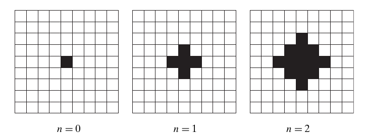
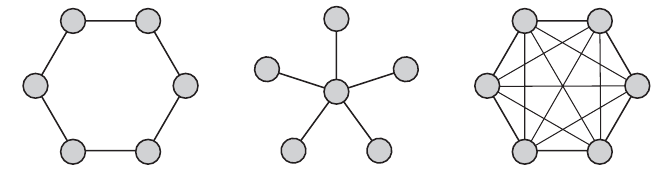
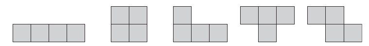

# 题集

<h2 class = 'section-title'><label class = 'block-number'>1</label>绪论</h2>

<b class = 'auto-sort'>
扩展欧几里德算法 不仅能够求出两个正整数 m 和 n 的最大共约数 d, 还能求出两个整数 x 和 y（不一定为正），使得 $mx+ny=d$   
$\quad$ 1) 用代码实现该算法; 
$\quad$ 2) 改写上述程序以对丢番图方程 $ax+by=c$ 求解，系数 $a,\ b,\ c$ 为任意整数。

</b>

<button class="toggleAnswer answer-button">解:TODO</button>

//TODO

<b class='auto-sort'>
带锁的门 在走廊上有 n 个带锁的门，从 1 到 n 依次编号。最初所有的门都是关着的。我们从门前经过 n 次，每一次都从 1 号开始。在第 i 次经过时，我们改变 i 的整数倍号锁的状态。在最后一次经过后，哪些门是开着的，哪些门是关着的？
</b>

<button class="toggleAnswer answer-button">解: TODO</button>

//TODO

<b class='auto-sort'>
一个农夫带着一只狼、一只羊和一颗白菜来到河边。他需要用船把它们带到河对岸。然而，这艘船只能容下农夫本人和另外一样东西。如果农夫不在场的话，狼就会吃掉羊，羊也会吃掉白菜。请为农夫解决这个问题，或者证明它无解。
</b>

<button class="toggleAnswer answer-button">解:</button>

$\xRightarrow{农民、羊}\colorbox{grey}{农民、羊}$  

$\xLeftarrow{农民}\colorbox{grey}{羊}$  

$\xRightarrow{农民、狼}\colorbox{grey}{农民、羊、狼}$  

$\xLeftarrow{农民、羊}\colorbox{grey}{狼}$  

$\xRightarrow{农民、白菜}\colorbox{grey}{农民、狼、白菜}$  

$\xLeftarrow{农民}\colorbox{grey}{狼、白菜}$  

$\xRightarrow{农民、羊}\colorbox{grey}{农民、狼、羊、白菜}$  

<b class='auto-sort'>
有 4 个人打算过桥，他们都在桥的某一端。他们有有 17 分钟全部到达桥的另一端。时间是晚上，他们只有一个手电筒。一次最多只能有两个人同时过桥，而且必须携带手电筒。必须步行将手电筒带来带去，即仍来仍去是不行的。每个人走路的速度不同：甲过桥要用 1 分钟，乙要用 2 分钟，丙要用 5 分钟，丁要用 10 分钟。两人一起走的速度等于其中走的慢的那个人的速度。
</b>

<button class="toggleAnswer answer-button">解</button>

$\xRightarrow[(2)]{手电筒、甲、乙}\colorbox{grey}{手电筒、甲、乙}$  

$\xLeftarrow[(3)]{手电筒、甲}\colorbox{grey}{乙}$  

$\xRightarrow[(13)]{手电筒、丙、丁}\colorbox{grey}{手电筒、乙、丙、丁}$  

$\xLeftarrow[(15)]{手电筒、乙}\colorbox{grey}{丙、丁}$  

$\xRightarrow[(17)]{手电筒、甲、乙}\colorbox{grey}{手电筒、甲、乙、丙、丁}$  

<b class='auto-sort'>
用伪代码写一个算法来求方程 $ax^2+bx+c=0$ 的实根，$a,\ b,\ c$ 是任意系数。
</b>

<button class="toggleAnswer answer-button">解:</button>

<!-- tabs:start -->

### **伪代码**

$$\begin{aligned}
&\bold{Quadratic(a,b,c)}\\
&//求\ ax^2+bx+c=0 \ 实根的算法\\
&//输入：实系数\ a,\ b,\ c \\
&//输出：方程实根 \\
&\\
&\bold{if}\ a\not = 0 \\
&\quad D\gets b*b-4*a*c\\
&\quad\bold{if}\ a\gt 0 \\
&\qquad temp\gets 2*a\\
&\qquad x_1\gets \frac{-b+\sqrt{D}}{temp}\\
&\qquad x_2\gets \frac{-b-\sqrt{D}}{temp}\\
&\qquad\bold{return}\ x_1,\ x_2 \\
&\quad\bold{else\ if}\ D = 0\\
&\qquad\bold{return}\ -\frac{b}{2*a}\\
&\quad\bold{else}\\
&\qquad\bold{return}\ 'no real roots'\\
&\bold{else}\\
&\quad\bold{if}\ b\not = 0\\
&\qquad\bold{return}\ -\frac{c}{b}\\
&\qquad\bold{else}  \qquad//a=b=0 \\
&\qquad\quad\bold{if}\ c=0\\
&\qquad\qquad\bold{return}\ 'all real numbers' \\
&\qquad\quad\bold{else}\\
&\qquad\qquad\bold{return}\ 'no real numbers' \\

\end{aligned}$$

<!-- tabs:end -->

<b class='auto-sort'>
写出将 10 进制正数转换为 2 进制整数的标准算法。  
</b>

<button class="toggleAnswer answer-button">解:</button>

<!-- tabs:start -->

### **伪代码**

$$\begin{aligned}
&\bold{Binary(n)}\\
&//10 进制转 2 进制\\
&//输入：正 10 进制整数 \\
&//输出：2 进制列表 b_k b_{k-1} \dots b_1\\
&\\
&k\gets 0\\
&\bold{while}\ n\not = 0 \\
&\quad b_k\gets n\ mod\ 2\\
&\quad n\gets \lfloor\frac{n}{2}\rfloor\\
&\quad k\gets k+1\\

\end{aligned}$$

<!-- tabs:end -->

<b class='auto-sort'>
写出 ATM 在提款时所用的算法
</b>

<button class="toggleAnswer answer-button">解:TODO</button>

//TODO

<h2 class = 'section-title'><label class = 'block-number'>2</label>算法效率分析基础</h2>

<b class='auto-sort'>
$x_1,\dots ,x_n$ 的采样方差 $n$ 可以这样计算：
</b>
$$
\frac{\displaystyle\sum_{i=1}^n(x_i-\overline{x})^2}{n-1},\ 其中\ \ \overline{x}=\frac{\displaystyle\sum_{i=1}^n x_i}{n}\tag{1}
$$
或者，
$$\frac{\displaystyle\sum_{i=1}^{n}x_i^2-(\displaystyle\sum_{i=1}^{n}x_i)^2 / n}{n-1}\tag{2}$$
比较 2 种计算中的有理运算的次数

<button class="toggleAnswer answer-button">解:</button>

对于公式（1）:  
除法：$D(n) = 2$  
乘法：$M(n) = n$  
加减法：$A(n)+S(n)=3n+1$  

对于公式（2）:  
除法：$D(n) = 2$  
乘法：$M(n) = n+1$  
加减法：$A(n)+S(n)=2n$  

<b clsss='auto-sort'>
考虑下列算法：从一个 1X1 的方格开始，每次都会在上次图形的周围再加上一圈方格，在第 n 次的时候要生成多少个方格？
</b>

<label class="imageTitle"></label>

<button class="toggleAnswer answer-button">解:</button>

$$\sum_{i=0}^n 4*i + 1$$

<h2 class = 'section-title'><label class = 'block-number'>3</label>蛮力法</h2>

<b class='auto-sort'>
网络拓扑图可以展示计算机、打印机和其他的设备如何通过网络进行互连。
以下是三种常见的网络拓扑结构: 环形拓扑、星形拓扑和完全互连拓扑。
</b>

<label class="imageTitle"></label>

现在给出一个布尔矩阵 $A[0\dots n-1,\ 0\dots n-1]$, 其中 $n\gt 3$, 它用连接矩阵来表示以上某种拓扑结构所对应的图。能否确定连接矩阵表示的是哪一种拓扑结构？设计一种蛮力算法来解决这个问题并指出它的时间效率。

<button class="toggleAnswer answer-button">解:TODO</button>

//TODO

<b class='auto-sort'>
用下列 5 种类型的四格拼板，在不重叠的情况下完全覆盖一个 8x8 的棋盘。
</b>

<label class="imageTitle"></label>

<button class="toggleAnswer answer-button">解:TODO</button>

//TODO

<b class='auto-sort'>
有 n 摞硬币，每摞包含 n 个硬币，其中一摞全是假币，其他摞全是真币。每个真币重 10 克，每个假币重 11 克。你有一个称重盘，可以对任意数量硬币精确称重。设计一个蛮力算法识别那摞假币。
</b>

<button class="toggleAnswer answer-button">解:TODO</button>

//TODO

