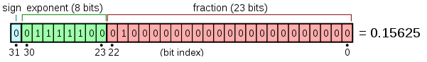
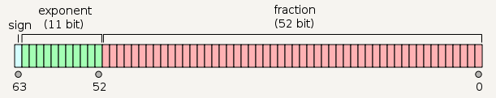

 

```c
extern int a;     // 声明一个全局变量 a
int a;            // 定义一个全局变量 a
extern int a =0;  // 一旦给予赋值，一定是定义
int a =0;         //定义一个全局变量 a，并给初值
```

- 变量在使用前就要被定义或者声明
- 在一个程序中，变量只能定义一次，却可以声明多次
- 定义分配存储空间，而声明不会


<div class="myTip">

在 C 语言中，所有变量都必须先声明后使用，声明通常放在函数开始处可执行语句之前。

<div></div >
printf 函数并不是 C 语言本身的一部分，它是标准库函数中的一个有用函数。
<span class="myAnnotate">
ANSI
</span> 标准中定义了 printf 函数的行为。
<div class="js-annotate annotate hidden">
American National Standards Institute
</div>

</div>


<div class = 'data-section default-folding'>
<h2 class = 'section-title'>第 <label class = 'block-number'>2</label> 章：类型、运算符与表达式</h2>
<div class = 'folding-area'>

- 运算符用于指定要对变量与常量进行的操作
- 表达式用于把变量与常量组合起来产生新的值
- 类型决定该对象可取值的集合以及可以对该对象施行的运算

<h3 class = 'auto-sort-sub'>变量名</h3>

- 区分大小写
- 局部变量使用短名字
- 全局变量使用长名字

<h3 class = 'auto-sort-sub'>数据类型与大小</h3>

在 C 语言中有如下几种基本数据类型：

<!-- tabs:start -->

### **C**

|类型|描述|
|:-|:-|
|char|单字节1B, 整数类型 (-128 - 127 或 0 - 255)|
|int| 特定机器的自然大小，一般 2B/4B|
|float|单精度浮点数<br>      |
|double|双精度浮点数<br>     |

### **Java**

|类型|描述|
|:-|:-|
|char| 2B, Unicode 字符|
|byte| 1B, 整数（-128-127）|
|short| 2B, 整数|
|int| 4B, 整数|
|long| 8B, 整数|
|float|4B, 单精度浮点|
|double|8B, 双精度浮点|
|boolean|true, false|

<!-- tabs:end -->

<h4 class = 'auto-sort-sub1'>限定符</h4>

- `short` int a;    
- `long` int a;  $\qquad$ //这里的 `int` 都可以省略  
- `long` double a;    
- signed 与 unsigned 用于限定 `char` 或 `整数类型`，经 unsigned 限定符限定的数总是正的或0

<h3 class = 'auto-sort-sub'>常量</h3>

**int**: 1234  
**long**: 123456789`L`, 123456789`l`  
**unsigned long**: 12345678`UL`, 12345678`ul`  
**float**: 123.4`F`, 1e-2`f`  
**double**: 123.4  
**long double**: 123.4`L`, 1e-2`l`  

> 8 进制，`0`37  
> 16 进制，`0x`1F `0X`FUL 

**字符常量**  
字符常量是一个整数。如，在 ASCII  字符集中， 字符 '0' 的值是 48, 与数值 0 没有关系。虽然字符常量一帮用于与其他字符进行比较，但字符常量也可以像整数一样参与数值运算。

**转义字符**  
`\000`  1～3 个 8 进制数字  
`\xhh`  16 进制数  
`\0`    其值为 0 的字符，即空字符， 为了`强调字符`的性质，我们通常用 `\0` 代替 数值 0  
`\v`  纵向制表符  
`\r`  横向制表符  

```c
#define VTAB  '\013'  /* ASCII 纵向制表符*/  
#define BELL  '\007'  /* ASCII 响铃符*/
// 或者
#define VTAB  '\xb'  /* ASCII 纵向制表符*/  
#define BELL  '\x7'  /* ASCII 响铃符*/
```
**常量表达式**  
可以在编译时计算而不必推迟到运行时， 例如

```c
#define MAXLINE 1000
char line[MAXLINE +1];
```

**字符串常量**  
字符串常量也叫字符串字面量，是用`""` 括住的字符序列，例如
```c
"I am a string"
```

<div class="myNote">

- 从技术角度看，字符串常量就是`字符数组`，但内部表示字符串时要用一个空字符`\0`来结尾，故用来存储字符串的物理存储单元数会多一个。这样的表示方式说明`C 对 字符串的长度没有限制`，但程序必须扫描完整个字符串才能决定这个字符串的长度。 标准库函数 `strlen(s)` 用于返回其字符串变量 s 的长度，不包括末尾的 `\0`

- `'x'`表示产生字母 x 的数值，`"x"`表示包含字母 x 的数组

```c
/* 自定义函数 */
/* strlen : 返回 s 的长度 */
int strlen(char s[])
{
    int i = 0;
    while(s[i] != '\0') ++i;
    return i;
}
```
</div>

**枚举常量**  

```c
enum boolean {No, YES}   // 0, 1
enum months {JAN = 1, FEB, MAR} // FEB=2, MAR=3
```

<div class="myNote">

- 同一枚举中各个名字的值可以相同
- 枚举是使常量值与名字相关联的又一种方便的方法，其相对于 #define 语句的优势在于常量值可以自己控制
</div>

**const限定符** 

```c

// 值不能改变
const double e = 2.71828182845905; 

// 数组所有元素的值不能改变
const char msg[] = "warning";
int strlen(const char[]);

```

> `&&`运算符比`||`的优先级高

<h3 class = 'auto-sort-sub'>类型转换</h3>


</div>
</div>
