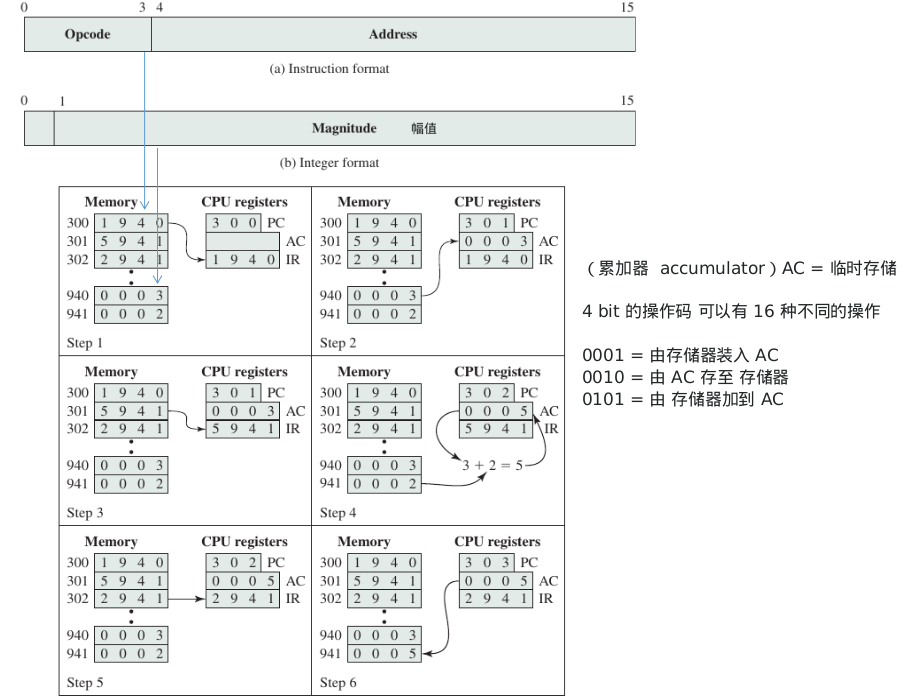

<h1 class='header-part'>引入</h1>

<h2 class = 'section-title'>第 <label class = 'block-number'>1</label> 章：基本概念和计算机演化</h2>

<h3 class = 'auto-sort-sub'>计算机的功能</h3>
<h4 class = 'auto-sort-sub1'>基础功能</h4>

1. **Data processing**
1. **Data storage**
1. **Data movement**
1. **Control**

<h3 class = 'auto-sort-sub'>计算机结构</h3>
<h4 class = 'auto-sort-sub1'>单处理器顶层结构</h4>

 

<label class="imageTitle">图示 1-1 : 单处理器顶层结构</lable>

**术语:**
1. **CPU** : Centarl processing unit  中央处理单元 (通常简单指代 presessor)。
1. **control unit** : 控制CPU的操作，从而控制计算机的操作。
1. **I / O** : 在电脑和外部环境之间的移动。
1. **ALU** : Arithmetic and logic unit  (算术逻辑单元) ----- 执行数据的处理。
1. **Register** : 提供 CPU 内部的存储。

<h4 class = 'auto-sort-sub1'>多核处理器结构</h4>

<label class="imageTitle">图示 1-2 : 多处理器典型结构</label>

**术语:**
1. **PCB** : printed circuit board (印刷电路板), 计算机中的主要印刷电路板称为系统板或主板，而较小的则插入主板。
1. **core** : 处理器芯片上的单个处理单元。 内核在功能上可能与单CPU系统上的CPU等效。 其他专门的处理单元，例如针对矢量和矩阵运算进行了优化的单元，也称为核心。
1. **proccessor** : 包含一个或多个核心的物理硅片。 处理器是解释和执行指令的计算机组件。 如果一个处理器包含多个内核，则称为多核处理器。
1. **instruction logic** : 包括提取指令和解码每个指令，以确定指令操作和任何操作数的存储位置。
1. **load /store logic** : 通过缓存管理与内存之间的数据传输。

<h4 class = 'auto-sort-sub1'>主板</h4>

<label class="imageTitle">图示 1-3 : 某电脑主板 示例1 </label>

<label class="imageTitle">图示 1-4 : 某电脑主板 示例2 </label>

<h4 class = 'auto-sort-sub1'>处理器单元结构</h4>

<label class="imageTitle">图示 1-5 : EC12 处理器</label>

<h4 class = 'auto-sort-sub1'>内核单元结构</h4>

<label class="imageTitle">图示 1-6 : EC12 内核</label>

**术语**
1. **ISU** : Instruction Sequence Unit (指令序列单元), 确定在所谓的超标量体系结构中执行指令的顺序。
1. **IFU** : Instruction Fetch Unit (指令提取单元)
1. **IDU** : Instruction Decode Unit (指令解码单元), IDU由IFU缓冲区提供，并负责所有 z/Architecture 操作代码的解析和解码。
1. **LSU** : Load-Stroe Unit (负载存储单元), LSU包含96 kB L1 数据高速缓存，并管理 L2 数据高速缓存与功能执行单元之间的数据流量。 它负责处理 z/Architecture 中定义的所有长度，模式和格式的所有类型的操作数访问。
1. **XU** : Translation Unit (转换单元), 该单元转换为主存储器中的物理地址。 因此，XU包含一个转换后备缓冲区(TLB), 用于加速内存访问。
1. **FXU** : Fixex-Point Unit FXU (定点单元), FXU 执行定点算术运算。
1. **BFU** : Binary Floating-Point Unit (二进制浮点单元), BFU处理所有二进制和十六进制浮点运算以及定点乘法运算。
1. **DFU** : Decimal Floating-Point Unit DFU (十进制浮点单位), DFU处理存储为十进制数字的数字的定点和浮点运算。
1. **RU** : Recovery Unit RU (恢复单元), RU保留包含所有寄存器的系统完整状态的副本，收集硬件故障信号，并管理硬件恢复操作。
1. **COP** : Dedicated CO-Processor COP (专用协处理器), COP负责每个核心的数据压缩和加密功能。
1. **I-cache** : 64 kB L1指令缓存，允许 IFU 在需要它们之前预取指令。
1. **L2 control** : 流量逻辑，用于管理通过两个L2缓存的流量。
1. **Data-L2** : 1 MB L2数据高速缓存，用于存储除指令外的所有内存流量。
1. **Instr-L2** : 1 MB L2 指令高速缓存。

<h4 class = 'auto-sort-sub1'>ARM 体系结构</h4>

**ARM体系结构参考RISC设计原理，并用于嵌入式系统中。**

<label class="imageTitle">图示 1-7 : 基于 Coretex-M3 的微控芯片 </label>

**术语**
1. **NVIC** : 为处理器提供可配置的中断处理功能, 促进了低延迟异常和中断处理，并控制电源管理。
1. **ETM** : 可选的调试组件，可用于重建程序执行。 ETM被设计为仅支持指令跟踪的高速，低功耗调试工具。
1. **DAP** : Debug Access Port (调试访问端口), 这为外部调试访问处理器提供了一个接口。
1. **Debug logic** : 基本调试功能包括处理器停止，单步执行，处理器核心寄存器访问，无限制的软件断点和完整的系统内存访问。
1. **ICode interface** : 从代码存储空间中获取指令。
1. **SRAM & peripheral interface** : 数据存储器和外围设备的读/写接口。
1. **Bus matrix** : 将内核和调试接口连接到微控制器上的外部总线。
1. **Memory protection unit** : 保护操作系统使用的重要数据与用户应用程序隔离，通过禁止访问彼此的数据，禁用对内存区域的访问，允许内存区域为只读以及检测意外的内存访问来分离处理任务 可能会破坏系统。
1. **Core and memory** : 该区域包括Cortex-M3处理器，静态RAM（SRAM）数据存储器和用于存储程序指令和不变应用程序数据的闪存15。闪存是非易失性的（关闭电源后不会丢失数据），因此是理想的选择。 SRAM存储变量数据。该区域还包括调试接口，可以很容易地在现场对系统进行重新编程和更新。
1. **Parallel I/O** : 可为各种并行 I / O 应用程序配置。
1. **Serial interfaces** : 串行接口, 支持各种串行I / O方案。
1. **Analog interfaces** : 模拟接口, 支持传感器和执行器的模数和数模逻辑。
1. **Timers and triggers** : 定时器和触发器, 跟踪时间并计数事件，生成输出波形并触发其他外设中的定时操作。
1. **Clock management** : 时钟管理, 控制芯片上的时钟和振荡器。使用多个时钟和振荡器可最大程度地降低功耗并缩短启动时间。
1. **Energy management** : 管理处理器和外围设备的各种低能耗操作模式，以实时管理能源需求。
1. **Security** : 该芯片包括高级加密标准（AES）的硬件实现。
1. **32-bit bus** : 连接芯片上的所有组件。
1. **Peripheral bus** : 外围总线, 一种网络，允许不同的外围模块直接相互通信，而无需处理器。 这样支持对时间要求严格的操作并减少了软件开销。

<h2 class = 'section-title'>第 <label class = 'block-number'>2</label> 章：性能问题</h2>

<h3 class = 'auto-sort-sub'>性能平衡</h3>

##### 处理器和内存之间的性能平衡
1. 增加一次检索的 bits --> 加宽 DRAMs，使用更宽的数据总线
1. 更改 DRAM 接口，使其更高效 --> 在 DRAM 芯片上添加高速缓存或者其他缓冲机制
1. 在处理器和内存间加入复杂高效的高速缓存机制，降低内存访问频率 --> 在处理器芯
   片上以及在靠近处理器芯片的外缓存中加入一个或多个缓存。
1. 缓冲和构造数据流，增加处理器和内存之间的互连宽带 --> 使用高速总线和总线层次结构

##### I/O 设备之间的性能平衡

<label class="imageTitle">图示 2-1 : 典型I/O设备数据速率</label>

<h4 class = 'auto-sort-sub1'>芯片组织结构的改进</h4>

**提高处理器的方式**：
1. 提高处理器硬件速度  -->  缩小处理器芯片上的逻辑门，将更多的逻辑门封装在一起
   ，并提高时钟速率。
1. 增加在处理器和主内存之间的高速缓存的容量和速度 --> 通过将处理器芯片本身一部分专门用于高速缓存。
1. 对处理器组织和体系结构进行更改 --> 使用某种形式的并行。

##### 性能提高的主要因素是时钟速度和逻辑密度，对这两方面的优化会引来新的问题 
1. **功率** : 随着逻辑密度和芯片上时钟速度的增加， 功率密度也随之增加。芯片散热成为严重设
   计问题。
1. **RC 延迟** : 当芯片元件尺寸减小，导线互连线变得更薄，增加了电阻。电线更靠近，增加了电容。
1. **存储器等待时间和吞吐量** : 存储器访问速度(等待时间)和传输速度(吞吐量)滞后处理器速度。

<h4 class = 'auto-sort-sub1'>多核处理器</h4>

考虑到前面提到的困难，设计人员转向一种全新的提高性能的方式：在同一芯片上放置多
个处理器，并配置一个大的共享缓存。这样提供了在不增加时钟速率的情况下提供性能的潜力。

研究表明， 在处理器内部，性能的提高与复杂度的平方根大致成正比。但是如果软件能够支持多个处理器的有效使用，那么处理器数量的翻倍据说是性能的两倍。

<h4 class = 'auto-sort-sub1'>阿姆达尔定律</h4>

以计算机架构师吉恩·阿姆达尔的名字命名的定律，用于寻找仅对系统的一部分进行改进时整个系统预期得到的最大改进。换言之，该定律要讨论的是为什么增加某些东西并不总能带来能力的翻番。该定律可应用在计算机行业，比如研究CPU的核数与性能的关系；在高性能计算领域，该定律可以解释为什么增加节点并不能带来性能的线性改善。
 

$$
 S(n) =  \frac{T(1-f)+Tf}{T(1-f) + \frac{Tf}{n}} = \frac{1}{(1-f)+\frac{f}{n}}
$$

**符号说明**
- **S(n)** : 固定负载下，理论上的加速比
- **f** : 并行所占比例
- **n** : 处理器的个数
- **T** : 单处理器执行程序的时间

<label class="imageTitle">图示 2-2 : 阿姆达尔定律 </label>

<label class="imageTitle">图示 2-3 : 阿姆达尔定律加速 </label>

阿姆达尔定律也用于指导CPU的可扩展设计。CPU的发展有两个方向，更快的CPU或者更多的核。目前看来发展的重心偏向了CPU的核数。但有时我们会发现虽然拥有更多的核，当我们同时运行几个程序时，只有少数几个线程处于工作中，其它的并未做什么工作，实践当中，并行运行多个线程往往并不能显著提升性能，程序往往并不能有效的利用多核。在多核处理器中加速比是衡量并行程序性能的一个重要参数，能否有效降低串行计算部分的比例和降低交互开销决定了能否充分发挥多核的性能，其中的关键在于：**合理划分任务、减少核间通信**。

<h4 class = 'auto-sort-sub1'>利特尔法则</h4>

$$ Throughout = \frac{WIP}{LeadTime}$$

实例一 : 医院体检

>  医院体检大家都经历过，之前体检有的检查项排队人数很多，有的则很少，整体感觉比较耗时，**单位时间内完成体检的人数（吞吐量）并不多。**   后来，医院搞了一个体检系统，从拿到体检单开始，系统会根据每个项目待体检的人数，自动分配下一个体检项目。 当完成了一项体检之后，医生会告诉你下一个体检项是什么，节省了排队等待的时间。 医院通过这种方式，**减少了每个体检项的排队人数（WIP：在制品数量），减少了等待时间，从而提升了医院体检的吞吐量。**

实例二 ： 挤地铁

> 我们知道每趟地铁在某一站停留的时间基本是固定的，假设是30秒。对一个地铁门口来说，这30秒能上多少人，代表了它的吞吐量。这门口排队的人的数量代表了它的在制品数量，通过增加在制品数量（排队的人数）可以提升吞吐量，但是当排队人数增加到一定程度后，吞吐量反而下降。这么多人都想挤进去，争先恐后，还有人插队（紧急需求来了），30秒时间到了，还有人挤在门口，有时候地铁门会开关数次。这种情况下，没有增加吞吐量，反而延长了地铁等待的时间（增加了交付周期）。 这个故事告诉我们：**当在制品数量增加到一定程度，吞吐量会下降。**

**Througout (吞吐量)** : 单位时间完成的工作（医院每天可以处理体检的人数）  
**WIP (在制品数量)** : 未完成体检的人数  
**LeadTime (前置时间)** : 体检平均消耗时间 = 等待时间 + 周期时间  
**CycleTime (周期时间)** : 生产能力最直接的体现，一项工作从开始到结束的时间,除
去等待时间 (医生开始体检到完成所花费的时间)

结论：
> 1. 减少在制品数量可以缩短前置时间，但前置时间的缩短是有极限的，就像我们不可能让10个妈妈在1个月之内完成怀孕的全过程一样。
> 2. 增加在制品数量可以提升平均产能，但平均产能的提升是有极限的，1个人每天8小时的产能再想提升只有加班加点。
> 3. 最短的前置时间和最大的平均产能不可并存，在“平均每人手头有一件事”的时候，在制品数量稍微小一点，可以达到最短的前置时间，在制品数量稍微大一点，可以达到最大的产能。至于各个组织如何选择，看自己的需求了。
 
<h3 class = 'auto-sort-sub'>计算机性能的基本测量</h3>

**决定应用程序的性能的因素**
1. 处理器的原始速度
2. 指令集、实现语言的选择
3. 编译器的效率
4. 编程技巧

 

<h1 class='header-part'>计算机系统</h1>

<h2 class = 'section-title'>第 <label class = 'block-number'>3</label> 章：计算机功能和交互的顶层视图</h2>

<label class="imageTitle">图示3-0 : 组件图</label>

<h3 class = 'auto-sort-sub'>计算机的组件</h3>
<h4 class = 'auto-sort-sub1'>冯诺依曼体系结构</h4>

1. 数据和指令存储在一个单一的读写存储器中
1. 存储器的内容是可寻址的，不考虑数据的类型
1. 指令按顺序执行

<h4 class = 'auto-sort-sub1'>编程方式</h4>

<label class="imageTitle">图示 3-1 : 基于硬件和软件编程 </label>

<label class="imageTitle">图示 3-2 : 计算机组件顶层视图 </label>

<h3 class = 'auto-sort-sub'>计算机的功能</h3>
<h4 class = 'auto-sort-sub1'>指令处理</h4>

<label class="imageTitle">图示 3-3 : 基础指令周期 </label>

> **处理器解释指令并执行所需的操作分为四类**  
>
> 1. 处理器内存：数据可以从处理器传输到内存，也可以从内存传输到处理器。  
> 1. 处理器 I / O ：可以通过在处理器和 I / O 模块之间传输，将数据传输到外围设备或从外围设备传输数据。   
> 1. 数据处理：处理器可以对数据执行某种算术或逻辑运算。  
> 1. 控制：一条指令可以更改执行顺序。 例如，处理器可以从位置 149 提取一条指令，该指令指定下一条指令来自位置 182。处理器将程序计数器设置为 182，从而记住这一事实。因此，在下一个提取周期，该指令将为 从位置 182 而非 150 获取。  

在每个指令周期的开始，处理器从内存中提取一条指令。 **PC**(程序计数器) 寄存器保存着接下来要提取的指令的地址。 除非另有说明，否则处理器总是在提取每条指令后递增PC，以便它将依次提取下一条指令（即，位于下一个较高存储地址的指令）。

例如，考虑一台计算机，其中每条指令占用16位字 。假定程序计数器设置为存储器位置 300 。处理器接下来将在位置 300 取指令。在随后的指令周期中，它将从位置 301、302、303 等取指令。所获取的指令被加载到处理器中被称为 **IR** (指令寄存器) 的寄存器中。

<label class="imageTitle">图示 3-4 : 假设的机器程序执行（16进制）</label>

示例：

PDP-11 处理器包含一条指令， 其符号表示为 " ADD B,A " , 它将存储器单元 A 和 B 相加，然后将和存入单元 A 中。这一指令周期由下列几步组成：
- 取 ADD 指令
- 将存储单元 A 的内容读入处理器
- 将存储单元 B 的内容读入处理器。为使 A 的内容不丢失，处理器至少有 2 个寄存器，而不是单一的累加器来存放存储器的值
- 将两个值相加
- 将结果从处理器写入到内存单元 A 中
-

<label class="imageTitle">图示 3-5 : 指令周期状态图</label>

> **术语**  
> 1. **iac  (instruction address calculation 指令地址计算)**：确定要执行的下一条指令的地址。 通常，这涉及在前一条指令的地址上添加一个固定的数字。 例如，如果每个指令的长度为 16 位，并且存储器被组织为 16 位字，则将 1 加到先前的地址中。 相反，如果将内存组织为可单独寻址的 8 位字节，则将 2 添加到前一个地址。  
> 1. **if (instruction fatch 指令提取)**：将指令从其内存位置读取到处理器中。  
> 1. **iod (instruction opration decoding 指令操作解码)**：分析指令以确定要执行的操作类型和要使用的操作数。  
> 1. **oac (operand address calculation 操作数地址计算)**：是否操作涉及对内存中操作数的引用或可通过 I / O 进行访问，则确定操作数的地址。  
> 1. **of (operand fetch 操作数获取)**：从内存中获取操作数或从 I / O 读取操作数。  
> 1. **os (operand 操作数存储)**：将结果写入内存或输出到 I / O。

<h4 class = 'auto-sort-sub1'>中断</h4>

##### 中断的类型
1. 程序：由某种指令执行结果引起的条件产生，例如算术溢出，零除，试图执行非法的机器指令或在用户允许的存储空间之外进行引用。
1. 计时器： 由处理器内的计时器生成。它允许操作系统以规整的时间间隔执行特定的功能。
1. I/O  ：由 I/O 控制器生成的信号，表示操作已正常完成，向处理器请求服务，或信号通知各种错误情况。 
1. 硬件故障 ：由诸如电源故障或内存奇偶校验错误之类的故障生成。

> 提供中断的主要是为了提高处理效率

<label class="imageTitle">图示 3-6 : 有中断和无中断的程序控制流 </label>

> $ \text{\textcircled 1 \textcircled 2 \textcircled 3} = $ 不包括 I/O 的指令序列  
> $ \text{\textcircled 4} = $ 为实际 I/O 操作准备的指令序列  
> I/O 命令 = 进行 I/O 操作的指令，I/O 操作需花较长时间完成，I/O 程序挂起，等待操作完成  
> $ \text{\textcircled 5} = $ 该操作完成的指令序列，可能包含设置标志位来表示操作是否成功

当外部设备准备接收服务，即当它准备从处理器中接受更多的数据时，外部设备的 I/O
模块发送`中断请求信号`给处理器。处理器挂起当前程序（`中断处理程序`）的操作，跳转到 I/O 设备程序的响应，完成后恢复原来的执行。

<label class="imageTitle">图示 3-7 : 发生中断时的控制转换 </label>

<label class="imageTitle">图示 3-8 : 有中断的指令周期 </label>

> 中断处理程序一般是操作系统的一部分

<label class="imageTitle">图示 3-9 : 短 I/O 等待 </label>

<label class="imageTitle">图示 3-10 : 长 I/O 等待 </label>

<label class="imageTitle">图示 3-11 : 有中断的指令周期状态图 </label>

<h4 class = 'auto-sort-sub1'>多重中断</h4>

// TODO

<h3 class = 'auto-sort-sub'>互连结构</h3>

// TODO

<h2 class = 'section-title'>第 <label class = 'block-number'>4</label> 章：高速缓存</h2>

<h3 class = 'auto-sort-sub'>计算机存储器系统概述</h3>

<h4 class = 'auto-sort-sub1'> 存储器系统的特性 </h4>

> 内存：主存(main memory)，寄存器(register)，高速缓存(cache)  
> 外存：磁盘

**数据单元的存取方式**：  
1. **顺序存取**（sequential access）: 内存被组织成数据单元，称为`记录(records)`
1. **直接存取**（direct access）：和顺序存取一样，设计共享读写机。但是，单个块或记录具有基于物理位置的唯一地址。
1. **随机存取**（random access）：访问时间恒定，与先前访问的位置无关。`主存`和一些`高速缓存`是随机存储。
1. **关联存取**（associative access）：这是一种随机存取内存，高速存储可以使用关联访问。

> 存储器的重要特点 : `容量`和`性能`  

**性能：**
1. **存取时间**：对于随机访问存储器，是执行读或写操作所需的时间，即从地址显示在存储器到数据存储或可供使用的时间。对于非随机访问存储器，访问时间是将读写机制定位在所需位置是所需的时间。
1. **存储器循环时间**：主要应用于随机访问的存储器，访问时间到第二次访问前开始的时间，存储器循环时间与系统总线有关，与处理器无关。
1. **传送速率**：数据输入(输出)存储器单元。对于随机存储器，数据传输率为`1/(cycle time)`。对于非随机存储器，数据传输率为 $ T_n = T_A + \frac{n}{R} $

> $ T_n $ = 读/写 n bits 的平均时间  
> $ T_A $ = 平均读取时间  
> R = 传输率，bits / 秒（bps）  

###### 存储器的物理材料  
> 半导体存储器：易失性或非易失性  
> 磁性表面存储器：非易失性  
> 光学：  
> 磁光学：  

1. read-only memory (ROM) 非易失性半导体存储器的一种 
1. 不可擦除性存储器一定是非易失性的

<h4 class = 'auto-sort-sub1'>存储器层次结构</h4>

> 存储器设计要素： `容量` `存取时间` `成本`

<label class="imageTitle">图示 4-1 : 存储器分层结构</label>

<label class="imageTitle">图示 4-1-1 : 存储器分层结构</label>

<label class="imageTitle">图示 4-1-2 : 存储器分层结构</label>

> 例子：假设一个处理器有 2 个级别的存储器 L1 和 L2 , L1 有 1000 个 words, 存取时间为 0.01 $\mu s$。 L2 有 100000 个字，存取时间为 0.1 $\mu s$。如果要访问的 word 在 L1, 处理器可以直接访问它。如果要访问的 word 在 L2, 需要把该 word 转移到 L1, 再由处理器访问。为了简便其见，我们忽略处理器判断一个 word 在哪一级存储器所用的时间。假设 95% 的访问在 L1 存储器, 则平均访问一个 word 的时间为：$$ (0.95)(0.01 \mu s) + (0.05)(0.01 \mu s + 0.1 \mu s) =  0.015 \mu s $$

<h3 class = 'auto-sort-sub'>高速缓存寄存器的原理</h3>

<label class="imageTitle">图示 4-2 : 高速缓存和主存</label>

> 如图4-3所示，主存由 $2^n$ 个可寻址 words 组成，每个 word 有唯一的 $n$-bits 的地址。为了关联映射，主存分割成由许多固定长度的 block 组成，其中每个 block 由 K 个 words 组成，则主存中有 $M=2^n/K$  个块。cache 由多个 blocks 组成（假设为 m 个，$m << M$ ）, 在 cache 中的 block 称为 line 。
> 
> line 的组成：`K words` + `tag` + `control bits`, 其中 控制位是隐藏的，例如利用单 bit 去表示该 line 加载到 cache 后是否修改过。  
> line 容量：`K words`, 例如 line 的容量可能只有 32 bits, 每个 word 是 单个 byte 长度，则 line 的容量是 4 bytes 。
>

<label class="imageTitle">图示 4-3 : 高速缓存和主存结构</label>

**为什么在 cache 中，使用术语`line`而不是`block`?**
1. 为了这块数据的位置，是 cache 中的数据还是主存中的数据
1. cache 的 line, 包括比 block 更多的东西，如 tag 和 控制 bits

<label class="imageTitle">图示 4-4 : cache 读操作</label>

<label class="imageTitle">图示 4-5 : 典型的 cache 组织结构</label>

<h3 class = 'auto-sort-sub'>cache 设计的要素</h3>

1. **CPU 缓存**： 为了弥补CPU和主存速度上的差异，处理器内部会引入多级Cache，称为CPU 缓存  
1. **缓存行**：CPU Cache 中的最小单元，是用于 Cache 存储和传输的单位。x86处理器典型的缓存行大小为64字节。编译器在优化的时候需要考虑这个参数。
1. **缓存一致性**：主存中的数据可能被多个CPU缓存下来。当一个CPU修改了内存，所有CPU Cache需要知道他的Cache已经失效，应该被丢弃，这样后续读到最新的数据，这个过程叫缓存一致性。在Java中`volatile`就是用来解决该问题的。

<label class="imageTitle">图示 4-6 : cache 设计要素</label>

<h4 class = 'auto-sort-sub1'>cache 地址</h4>

<label class="imageTitle">图示 4-7 : 逻辑 cache （虚拟 cache）</label>

逻辑 cache 也叫 虚拟 cache, 数据的存储使用虚拟地址，不需要经过 MMU  

**逻辑 cache 的优缺点**  
- 优点：速度比物理 cache 快，因为不需要经过 MMU  
- 缺点：对于每个应用虚拟地址的起始地址都是0, 相同的虚拟地址对应不同的物理地址。为解决这个问题，可以在`cache line`中添加位，用来辨别。 

<label class="imageTitle">图示 4-8 : 物理 cache</label>

<h4 class = 'auto-sort-sub1'>cache 容量</h4>

<label class="imageTitle">图示 4-9 : 一些处理器的 cache 容量</label>

<h4 class = 'auto-sort-sub1'>映射功能</h4>

> 因为 cache lines 远远少于主存 blocks，所以需要设计算法把需要的 blocks 映射到 lines 中  
> 映射功能所用到的 3 中方式：`direct` `associative` `set-associative`

###### 直接映射

直接映射是最简单的映射，映射表达式如下：
$$ i = j \: \% \: m $$
其中，  
&nbsp;&nbsp;i = cache 中指定的 line 标号  
&nbsp;&nbsp;j = 主存中指定的 block 标号  
&nbsp;&nbsp;m = cache 中 lines 的个数  

<label class="imageTitle">图示 4-10 : 直接映射</label>

为了获取 cache ， 主存地址可以看作由 3 部分组成
1. block 中 word/byte 的位置， 假设一个 block 中有 $2^w$ 个 word/byte , 则需
   要`w bits`用以寻址（当代计算机，绝大多数都是基于 byte 寻址）
1. cache 中 line 的位置， 假设有 $2^r$ 个 line , 则需要`r bits`用以寻址
1. cache 的容量远远小于主存， 假设 cache 有 $m=2^r$ lines， 主存有 $2^s$ blocks , 则用来作为 tag 的 数量有 $2^(s-r)$ 个，即需要`s-r bits`用以寻址

<label class="imageTitle">图示 4-11 : 直接映射的组成</label>

 

示例：假设 cache 的 line 个数为 $m = 16K = 2^{14}$, line number 为 $i = j \: \% \: m$, 

| Cache line | starting memory address of Block |
|:-:|:-:|
| 0 | 000000, 010000, ... , FF0000 |
| 1 | 000000, 010000, ... , FF0000 |
| ... | ... |
| $2^{14}$ | 00FFFC, 01FFFC, ... , FFFFFFC |

<label class="imageTitle">图示 4-12 : 直接映射的例子</label>

直接映射的缺点：不同的 block, 映射到 cache 的同一行时，则 block 会持续交换到 cache 中，cache 命中率降低。

###### 关联映射

<label class="imageTitle">图示 4-13 : 关联映射</label>

为了获取 cache ， 主存地址可以看作由 2 部分组成
1. block 中 word/byte 的位置， 假设一个 block 中有 $2^w$ 个 word/byte , 则需
   要`w bits`用以寻址（当代计算机，绝大多数都是基于 byte 寻址）
1. 主存中 block 的位置， 假设有 $2^s$ 个 block , 即用来作为 tag 的 数量有 $2^s$ 个, 则需要`s bits`用以寻址

<label class="imageTitle">图示 4-14 : 关联映射的组成</label>

示例：

<label class="imageTitle">图示 4-15 : 关联映射的例子</label>

关联映射克服了直接映射的缺点，且关联映射非常灵活，能够达到最高的命中率。
关联映射的缺点：tag 太多，所有 cache line 的检查会变得复杂且耗时。

<h4 class = 'auto-sort-sub1'>集关联映射</h4>

> 集关联映射是直接映射和关联映射的之间的折中策略。

集关联映射的关系，如下：
$$ m = v * k, $$ 
$$ i = j \: \% \: v $$
其中，  
&nbsp;&nbsp;i = cache set 对应的编号  
&nbsp;&nbsp;j = 主存中 block 对应的编号  
&nbsp;&nbsp;m = cache 中 line 的数量  
&nbsp;&nbsp;v = set 的数量($v = 2^d$)  
&nbsp;&nbsp;k = 每个 set 中 line 的数量  

<label class="imageTitle">图示 4-16 : k-way 集关联映射</label>

<label class="imageTitle">图示 4-17 : k-way 集关联映射的组成</label>

示例：

<label class="imageTitle">图示 4-18 : k-way 集关联映射的例子</label>

<label class="imageTitle">图示 4-19 : k-way 集关联命映射中率</label>

<h4 class = 'auto-sort-sub1'>缓存置换算法</h4>

对于直接映射，每个 block 对应唯一的 line, 所以不需要置换算法。只有关联映射和集关联映射才需要替换算法。为了高速，该算法必须在硬件上实现。

###### 一些常用的缓存置换算法
评价置换算法好坏的主要标准：
- 命中率要高
- 算法要容易实现

1. 先进先出 FIFO （first-in-first-out）  
FIFO 的命中率并不随组的增大而提高。

1. 最近最少用 LRU （ least-recently used）  
LRU 的命中率随组的增大而提高。
LRU 具体实现时，并不是通过移动块来实现的，而是通过给每个 cache 行设定一个计数器，根据计数值来记录这些主存块的使用情况。这个计数值称为 LRU 位。
计数器变化规则：
- 每组4行时，计数器有 2 位。计数值越小则说明越被常用。命中时，被访问行的计数器置0，比其低的计数器加1，其余不变。
- 未命中且该组未满时，新行计数器置为0，其余全加1。
- 未命中且该组已满时，计数值为3的那一行中的主存块被淘汰，新行计数器置为0，其余加1。

计数值为0的行中的主存块最常被访问，计数值为3的行中的主存块最不经常被访问，先被淘汰。
颠簸/乒乓（Thrashing / PingPong）现象：当分块局部化范围（即：某段时间集中访问的存储区）超过了Cache存储容量时，命中率变得很低。极端情况下，假设地址流是1、2、3、4、1、2、3、4、1……而Cache每组只有3行，那么，不管是 FIFO ，还是 LRU 算法，其命中率都为0。
- 最不经常用LFU （ least-frequently used）
- 随机替换算法（Random）

<h4 class = 'auto-sort-sub1'>写策略</h4>

<label class="imageTitle">图示 4-20: Inter Core i7 处理器的 Cache 架构</label>

对于数据，我们不仅仅要去读，还要去写入修改。这就产生了两个问题：
- 写入 cache 的性能比写入主存的要快，那我们写入的数据到底是写在 cache 中还是主存中呢？
- 如果我们直接写在主存里， cache 里的数据是否会失效？

Cache 一致性问题：
1. 因为 Cache 中的内容是主存块副本，当对 Cache 中的内容进行更新时，就存在 Cache 和主存如何保持一致的问题。
1. 当多个设备都允许访问主存时。I/O 设备可直接读写内存时，如果 Cache 中的内容被修改，则 I/O 设备读出的对应主存单元的内容无效；若 I/O 设备修改了主存单元的内容，则 Cache 中对应的内容无效。
1. 当多个 CPU 都带有各自的 Cache 而共享主存时。某个 CPU 修改了自身 Cache 中的内容，则对应的主存单元和其他 CPU 中对应的内容都变为无效。

**为解决以上问题，引入 2 种写入策略**

###### write-through (写直达)

<label class="imageTitle">图示 4-21: 写直达策略 </label>

最简单的写入策略是 Write-Through。在这个策略中，每一次数据都要写入到主存中。写入前，判断 cache 中是否有数据副本。如果 cache 中有，先把数据写入更新到 cache 里，再写入到主存里; 如果数据不再 cache 里， 只需要更新主存。

缺点：效率低，因为都需要把数据写人主存中。该方式类似于 java 中 `volatile` 关键字。

###### Write-Back (写回)

<label class="imageTitle">图示 4-21: 写回策略 </label>

既然读数据默认从 Cache 中加载，能否不用把所有的写入都同步到主存里呢？只写入 CPU Cache 里是不是可以？当然可以，这一策略就是 Write-Back。  

如果发现要写入的数据在 CPU Cache 里，那么只要更新 CPU Cache 里的数据。同时，我们会标记 CPU Cache 里的这个 line 为`Dirty`。  
如果要写入数据的 Cache line 里，已经有其他数据。首先，看这个 line 里的数据是否被标记成 Dirty。如果是 Dirty, 就先把这个 line 里的数据写入到主存里，再把要写入的数据写入到 Cache 里，再把 line 标记为 Dirty。如果 line 里数据没有标记为 Dirty, 那么直接把数据写入到 Cache 中，再把 line 标记为 Dirty。

Dirty: CPU Cache 里 line 数据与主存不一致。

对于多个 CPU 核的缓存一致性问题，写回和写直达都不能有效的解决。为此，我们引入一个新的方法，叫作 `MESI` 协议。

<h3 class = 'auto-sort-sub'>line 容量</h3>

//TODO

<h2 class = 'section-title'>第 <label class = 'block-number'>5</label> 章：内
部存储器</h2>

<h3 class = 'auto-sort-sub'>存储器概论</h3>

<h4 class = 'auto-sort-sub1'>存储器的分类</h4>

<label class="imageTitle">图示 5-1 : 存储系统 </label>

> 速度：寄存器 > 高速缓存 > 内存 > 硬盘

<label class="imageTitle">图示 5-2 : 存储器分类 </label>

<h3 class = 'auto-sort-sub'>半导体存储器</h3>
<h4 class = 'auto-sort-sub1'>组织结构</h4>

> 稳定的 0-1 信号，能读能写。

<label class="imageTitle">图示 5-3 : 存储器核心操作 </label>

<h4 class = 'auto-sort-sub1'>DARM 和 SRAM</h4>

**RAM**: random-access memory  
**DRAM**: dynamic RAM  
**SRAM**: static RAM  

###### 动态随机存储器
以一个晶体管（MOS）加一个电容（Capacitor）来存储 1 bit, 而且使用时，需要周期性补充电源来保持记忆内容，故称为`Dynamic`。  

<label class="imageTitle">图示 5-4 : DARM 结构 </label>

**同步动态随机存储器 (SDRAM : Synchronous DRAM)**  
CPU 与主存储器存取资料时的`工作时脉 Clock` 相同， 故称为`同步`。SDRAM 的存取速度较 DRAM 快，主存用 SDRAM 来存储。  
一般用处： 主机板上主存`DDR-SARAM` 

<label class="imageTitle">图示 5-5 : 内存条 </label>

###### 静态随机存储器
以 6 个晶体管（MOS）来存储 1 个 bit 信息，不需要周期性补充电源来保持存储内容，故称`static`。

<label class="imageTitle">图示 5-6 : SRAM 单元 </label>

<label class="imageTitle">图示 5-7 : SRAM </label>

> 优点：存取速度快，不需要刷新操作  
> 缺点：价格高，体积大，还不能作为用量较大的主存  
> 一般用处：CPU 内建的 Level2 Cache  
> 种类：如Async SRAM (Asynchronous SRAM，异步SRAM）、Sync SRAM (Synchronous SRAM，同步SRAM）、PBSRAM (Pipelined Burst SRAM，流水式突发SRAM）、CSRAM 等。

**铁电随机存储器（FRAM : Ferroelectric RAM）**  
传统 DRAM 的电容都是使用"氧化矽"作为绝缘体，其介电常数 K 不够大。使用"态锆酸铅(PZT)" 或 "钽铋酸锶(SBT)" 这种介电常数大的 "铁电材料" （Ferroelectric material）来取代氧化矽，则可以储存电子和电洞不会流失，使原本"易失性"的动态存储器变成"非易失性"的存储器。

<h4 class = 'auto-sort-sub1'>ROM</h4>

只读存储器（Read-Only Memory）是一种只能读取资料的存储器。在制造过程中，将资料以一特制光罩（mask）烧录于线路中，其资料内容在写入后就不能更改，所以有时又称为“光罩式只读内存”（mask ROM）。此内存的制造成本较低，常用于电脑中的开机启动如启动光盘，在系统装好的电脑上时，计算机将C盘目录下的操作系统文件读取至内存，然后通过cpu调用各种配件进行工作这时系统存放存储器为RAM。这种属于COMPACT DISC激光唱片，光盘就是这种。

**PROM**  
可编程程序只读存储器（Programmable ROM，PROM）之内部有行列式的熔丝，是需要利用电流将其烧断，写入所需的资料，但仅能写录一次。 PROM 在出厂时，存储的内容全为1，用户可以根据需要将其中的某些单元写入数据 0 (部分的 PROM 在出厂时数据全为0，则用 户可以将其中的部分单元写入 1 )， 以实现对其“编程”的目的。PROM的典型产品是“双极性熔丝结构”，如果我们想改写某些单元，则可以给这些单元通以足够大的电流，并维持一定的时间，原先的熔丝即可熔断，这样就达到了改写某些位的效果。另外一类经典的 PROM 为使用“肖特基二极管”的 PROM，出厂时，其中的二极管处于反向截止状态，还 是用大电流的方法将反相电压加在“肖特基二极管”，造成其永久性击穿即可。

**EPROM**  
可抹除可编程只读存储器（Erasable Programmable Read Only Memory，EPROM）可利用高电压将资料编程写入，抹除时将线路曝光于紫外线下，则资料可被清空，并且可重复使用。通常在封装外壳上会预留一个石英透明窗以方便曝光。

**OTPROM**  
一次编程只读存储器（One Time Programmable Read Only Memory，OTPROM）之写入原理同 EPROM，但是为了节省成本，编程写入之后就不再抹除，因此不设置透明窗。

**EEPROM**  
电子式可抹除可编程只读存储器（Electrically Erasable Programmable Read Only Memory，EEPROM）之运作原理类似EPROM，但是抹除的方式是使用高电场来完成，因此不需要透明窗。

**Flash**  
快闪存储器（Flash memory）的每一个记忆胞都具有一个“控制闸”与“浮动闸”，利用高电场改变浮动闸的临限电压即可进行编程动作。

**ROM 与 RAM 的不同使用范围**
1. `RAM (Random Access Memory)`易挥发性随机存取存储器，高速存取，读写时间相等，且与地址无关，如计算机内存等。

2. `ROM (Read Only Memory)`只读存储器。断电后信息不丢失，如计算机启动用的 BIOS 芯片。存取速度很低，（较RAM而言）且不能改写。由于不能改写信息，不能升级，现已很少使用。

3. `EPROM、EEPROM、Flash ROM(NOR Flash 和 NAND Flash)`，性能同ROM，但可改写。一般读出比写入快，写入需要比读出更高的电压（读 5V 写 12V）。而 Flash 可以在相同电压下读写，且容量大、成本低，如今在 U 盘、MP3 中使用广泛。在计算机系统里，RAM 一般用作内存，ROM 用来存放一些硬件的驱动程序，也就是固件。

<h4 class = 'auto-sort-sub1'>芯片逻辑</h4>

<label class="imageTitle">图示 5-8 : 典型的 16-Mbits DRAM ( 4M * 4 ) </label>

> DRAM 容量增加为 4 的倍数

<h4 class = 'auto-sort-sub1'>芯片封装</h4>

<label class="imageTitle">图示 5-9 : 典型的内存芯片引教和信号 </label>

<h3 class = 'auto-sort-sub'>纠错码</h3>

<label class="imageTitle">图示 5-10 : 纠错码功能图 </label>

<h4 class = 'auto-sort-sub1'>奇偶校验码</h4>

奇校验：以二进制数据中`1`的个数是奇数为依据  
偶校验：以二进制数据中`1`的个数是偶数为依据  

> 例如：发送一组 8 位二进制数，假定最高位为奇偶校验位，后七位为数据位,采用奇校验，则：
>  
> 当发送数据是`b'0000111`时，实际发出去的数据就是`b'000000111`  
> 当发送数据是`b'0000110`时，实际发出去的数据就是`b'100000110`  
> 接收端收到这组二进制数据后，则校验“1”的个数是否为奇数，从而确定传输代码的正确性。

1. 采用何种校验必须事先规定好  
1. 奇偶校验只能检测出错误而无法确定错误数据位具体是哪一位  
1. 奇偶校验却无法检测出偶数个数据位错误。(虽然同时有 2 bit 及以上同时时发生错误的概率相当低)

> 奇偶校验实现简单，具有相对理想的检错能力，因此得到广泛使用。

<h4 class = 'auto-sort-sub1'>汉明码</h4>

**汉明码（hanming code）**是一种由理查德·卫斯里·汉明于1950年发明的`纠错码`，可以用来检测并且纠正数据从发送端发往接收端中发生的错误。

校验位 $K$ 满足 ：$$ 2^K - 1 \ge M + K $$

示例：

<label class="imageTitle"></label>

<label class="imageTitle"></label>

<label class="imageTitle">图示 3-11 : 汉明码纠错示例</label>

<h3 class = 'auto-sort-sub'>DDR DRAM</h3>

当代计算机的一大瓶颈是处理器和主存(DRAM)之间的速度差异，为此引入高速缓存（SRAM）。主存也不再是传统的 DRAM, 是是基于 DRAM 的新结构，如：`SDRAM` `DDR-DRAM`

<h4 class = 'auto-sort-sub1'>Synchronous DRAM</h4>

// TODO
 
<h4 class = 'auto-sort-sub1'>DDR SDRAM</h4>

// TODO

<h3 class = 'auto-sort-sub'>Flash Memory</h3>

// TODO

<h2 class = 'section-title'>第 <label class = 'block-number'>6</label> 章：外部存储器</h2>

 ✿ [电脑外置存储器进化历史回顾：从 bit 到 GB](https://www.jb51.net/diannaojichu/348634.html)

<h3 class = 'auto-sort-sub'>磁盘</h3>

> 磁盘：`软磁盘(早期)` `硬磁盘(现在)`

<label class="imageTitle">图示 6-1 : 软磁盘 和 硬磁盘 </label>

<h4 class = 'auto-sort-sub1'>机械硬盘的组成</h4>

<label class="imageTitle">图示 6-2 : 机械硬盘结构 </label>

> 硬盘是高精度设备，需密封好。

##### 盘面
- 硬盘的盘片一般用铝合金材料做基片，高速硬盘也可能用玻璃做基片
- 硬盘的每一个盘片都有两个盘面（Side），即上、下盘面，一般每个盘面都会利用（极个别的硬盘盘面利用为单面）
- 每一个有效盘面都有一个盘面号，按顺序从上至下从“0”开始依次编号。在硬盘系统中，盘面号又叫磁头号，因为每一个有效盘面都有一个对应的读写磁头。硬盘的盘片组在2～14片不等，通常有2～3个盘片，故盘面号（磁头号）为0～3或 0～5
- 盘片以每分钟千转到万转的速度旋转

**硬盘盘片可分为 4 部分**

1. `启停区（Lzone：landing Zone）` 硬盘不加电时磁头停留的区域，因为这块区域没有任何数据，适合磁头的起落。 现有的硬盘在设计时，磁头的启停区并不在主轴电机周围，而是在盘片外部。

1. `定位 0 磁道` 是硬盘初始化时磁头用来定位的磁道，它把盘片分为正磁道和负磁道两部分。定位 0 磁道上记录的地址信息，它是磁头寻道的起点和终点，每次磁头寻道都从定位 0 磁道出发，寻道结束后回到定位 0 磁道。老式硬盘用 0 磁道传感器方式初始化寻道范围。

1. `固件区（SA：service area）`相当于硬盘的操作系统，位于盘片的最外层，也叫负磁道，所以说它一般位于盘片的负磁道内。固件区内保存着硬盘最底层的基本控制程序和基本参数。主要包括缺陷列表、检验算法公式和内部操作指令等。

1. `数据区（Data）`位于盘片的正磁道内，涂抹磁介质用来记录数据。

##### 磁头
盘片旋转产生的气流相当强，足以使磁头托起，并与盘面保持一个微小的距离。这个距离越小，磁头读写数据的灵敏度就越高，当然对硬盘各部件的要求也越高。现在的水平已经达到 0.005μm～0.01μm，这只是人类头发直径的千分之一。 气流既能使磁头脱离开盘面，又能使它保持在离盘面足够近的地方，非常紧密地跟随着磁盘表面呈起伏运动，使磁头飞行处于严格受控状态。磁头必须飞行在盘面上方，而不是接触盘面，这种位置可避免擦伤磁性涂层，而更重要的是不让磁性涂层损伤磁头。

<h4 class = 'auto-sort-sub1'>磁盘的读写机制</h4>

当代硬盘系统要求使用单独的读磁头，通常紧靠写磁头安装。写磁头又一部分被屏蔽的磁阻(magnetoresistive, MR)传感器组成。MR 材料的电阻大小取决与它下方运动介质的磁化方向。当电流通过 MR 传感器，电阻的变化作为电压信号被检测出来。MR 设计允许更高频率的操作，这等同于更高的存储密度和更快的操作速度。

<label class="imageTitle">图示 6-3 : 感应 读/写(磁阻) 头 </label>

<h4 class = 'auto-sort-sub1'>数据的组织与格式</h4>

##### 磁盘数据分布

<label class="imageTitle">图示 6-4 : 磁盘数据分布 </label>

##### 盘面布局方式

盘面匀速旋转，内圈的线速度比外圈慢。为了以相同的速度读取 bit, 可以通过增大外圈 信息 bit 之间的间隔来实现

<label class="imageTitle">图示 6-5 : 盘面布局方式</label>

##### 磁盘格式

<label class="imageTitle">图示 6-6 : 温彻斯特磁盘磁道格式（Seagate ST506）</label>

##### 磁盘性能参数

<label class="imageTitle">图示 6-7 : 典型的硬盘驱动器参数</label>

<label class="imageTitle">图示 6-8 : 磁盘 I/O 传送时序</label>

> **等待设备** ：当进程发出一个 I/O 请求后，首先要等待设备变为可用，直到此设备被分配给该进程  
> **等待通道** ：如果此设备与其他磁盘驱动器共享一个或一组 I/O 通道，则需要等待此设备被分配给该通道  
> **寻道时间** : 磁头定位到指定磁头所需时间  
> **旋转延迟** : 磁道确定后，等待指定扇区的起始处旋转到达磁头的时间数据  
> **传送时间** ：磁头定位后，完成读写操作的时间  
> **存取时间** : 定位到读或写位置的时间，及**寻道时间 + 旋转时间**

数据传送时间表示为：  
$$ T = \frac{b}{rN} $$
其中，  
&nbsp;&nbsp;&nbsp;&nbsp;&nbsp;&nbsp;$T$ = 传送时间  
&nbsp;&nbsp;&nbsp;&nbsp;&nbsp;&nbsp;$b$ = 传送的字节数  
&nbsp;&nbsp;&nbsp;&nbsp;&nbsp;&nbsp;$N$ = 每磁道的字节数  
&nbsp;&nbsp;&nbsp;&nbsp;&nbsp;&nbsp;$r$ = 旋转速率  

总平均访问时间可表示为：
$$  T_a = T_s + \frac{1}{2r} + \frac{b}{rN} $$
其中，  
&nbsp;&nbsp;&nbsp;&nbsp;&nbsp;&nbsp;$ T_s $ = 平均寻道时间

示例： 说明过分依赖平均值的危害

考虑某公司称一款磁盘的平均寻址时间为 4ms, 转速为 15000rpm, 每磁道有 500 扇区，每扇区 512B, 假设我们希望读取一个由 2500 个扇区组成的总长为 1.28MB 的文件，让我们来估计总的传输时间。
假设 I/O 操作能够跟得上磁盘数据流速度。

1. 若数据顺序组织在一起，及该文件占据了相连的 5 个磁道的全部扇区。
其余磁道的寻道时间基本可忽略，读取整个文件所需时间：$ (4+2+4) + 4 \times 6 = 34 ms = 0.034 s $

1. 若数据随机组织在一起，读取文件的时间为： $ 2500 \times (4 + 2 + 0.008) = 15020 ms = 15.02 s $ 

很明显，扇区的读取次序对 I/O 性能有巨大影响， 因此考虑一种改善磁盘 I/O 性能的方法，使之能超出纯随机磁盘存取的性能，是很有价值的。 这催生了`磁盘调度算法`（操作系统范畴）

<h3 class = 'auto-sort-sub'>RAID</h3>

**参见 ：**  
 ✿ [@blog : 图文并茂 RAID 技术全解](https://www.hack520.com/169.html)

<h3 class = 'auto-sort-sub'>光存储器</h3>

// TODO

<h3 class = 'auto-sort-sub'>磁带</h3>

// TODO

<h2 class = 'section-title'>第 <label class = 'block-number'>7</label> 章：输入/输出</h2>

一个 I/O 模块不是简单地将设备连接到系统总线的一组物理连接器，而是包含了执行设备与系统总线之间通信功能的逻辑。

> **不把外设直接连接到系统总线的原因：**  
> 1. 各种外设的操作方式不同，将控制各类外设的必要逻辑合并到某个处理器内是不现实的  
> 2. 外设的数据传输速度一般比存储器或处理器慢很多  
> 3. 某些外设的传输速率比存储器或处理器要快  
> 4. 外设使用的数据格式和字长度通常与处理器不同

<h3 class = 'auto-sort-sub'>外部设备</h3>

I/O 操作是通过各种外部设备来完成的，这些外部设备提供了外界环境和计算机之间交换数据的方式。

> 连接到 I/O 模块的外部设备通常被称为外围设备`peripheral device` 或 外设`peripheral`  

<label class="imageTitle">图示7-1 : I/O 模块通用模型</label>

广义上可以将外设分为 3 类:  
1. **人可读设备**: 如，视频显示终端（VDT）和打印机
1. **机器可读设备**: 如，传感器和动臂结构，以及磁盘和磁带系统
1. **通信设备**: 适用于远程设备通信

1. 从功能上看磁盘和磁带是存储器分层结构的一部分; 从结构上看，它们由 I/O 模块控
   制
1. 远程设备可以是人可读设备，如终端，也可以是机器可读设备，甚至是另一台计算机

I/O 模块的接口以控制、状态和数据信号的形式出现。  
1. 控制信号（control signal）决定设备将要执行的功能。例如，发送数据到I/O模块的数据（INPUT 或 READ 信号），接收来自 I/O 模块的数据（OUTPUT 或 WRITE 信号），报告状态或对特定设备进行控制（如，定位磁头）。
1. 数据（data）信息是以一组位的形式发送到 I/O 模块或从 I/O 模块接收。
1. 状态信号（status signal）表示设备的状态，如 READY/NOT-READY 表示进行数据传
   送的设备是否就绪。
1. 控制逻辑（control logic）控制设备的操作，以相应来自 I/O 模块的命令
1. 装换器（transducer）输出时，把数据从电信号转换成其他的能量形式;输入时，把其他信号形势转换成电信号。
1. 缓存器（buffer）一般与转换器有关，它缓存 I/O 模块和外部环境之间传送的数据，
   缓冲器的大小一般为 8 位或 16 位。

<label class="imageTitle">图示7-2 : 外部设备框图</label>

> 常见外设：键盘、显示器、 磁盘驱动器

<h3 class = 'auto-sort-sub'>I/O 模块</h3>

<h4 class = 'auto-sort-sub1'>模块功能</h4>

> I/O 模块的主要功能：控制和定时、处理器通信、设备通信、数据缓冲、检错

##### 控制和定时
1. 处理器查询 I/O 模块，以检验所连接设备的状态
1. I/O 模块返回设备状态
1. 如果设备正常，并准备就绪，则处理器通过向 I/O 模块发出一条命令，请求数据传送
1. I/O 模块获得来自外设的一个数据单元（8/16 bits）
1. 数据从 I/O 模块传送到处理器

##### 处理器通信
**命令译码**：I/O 模块接受来自处理器的命令，这些命令一般作为信号发送到控制总线。  
例如，一个用于磁盘驱动器的 I/O 模块，可能接受 READ SECTOR（读扇区）、WRITE
SECTOR（写扇区）、SEEK（寻道）、和 SCAN（扫描）记录标识等命令。后两条命令中都包含一个发送到数据总线上的参数。

**数据**：由处理器和 I/O 模块经由数据总线交换  

**状态报告**：例如，如果要求一个 I/O 模块发送数据到处理器（读操作），而该 I/O
模块仍在处理先前的 I/O 命令而对此请求未能就绪，则可以用状态信号来报告。常用的
状态信号有 BUSY 和 READY,以及各种报告出错的信号  

**地址识别**：每个 I/O 设备也有地址

##### 设备通信
通信的内容包括命令、状态信息和数据

##### 数据缓冲
来自主存的数据通常以高速发送到 I/O 模块，数据保存在 I/O 模块的缓冲器中，然后
以外设的数据传送速度发送到该外设。反向传送时，由于数据被缓冲，内存不会被束缚
在低速的传送操作中。 因此， I/O 模块必须既能以设备速度又能以内存速度传输。
类似的情况是外设速度高于内存速度。

##### 检错
把错误报告给处理器。一类差错是设备故障（如 磁道坏），二类差错为数据位在传送中发生错误（利用校验码检测）

<h4 class = 'auto-sort-sub1'>I/O 模块结构</h4>

<label class="imageTitle">图示7-3 : I/O 模块框图 </label>

高级 I/O 模块称为 I/O 通道（I/O channel）或 I/O 处理器，通常用于微型计算机  
基础 I/O 模块称为 I/O 控制器或设备控制器，通常用于大型计算机

I/O 操作可采用三种技术。  

**编程式 I/O (prorammed I/O)**  
数据在处理器和 I/O 模块之间交换，处理器通过执行程序来直接控制 I/O 操作，包括检测设备状态、发送读或写命令以及传送数据。当处理器发送一条命令到 I/O 模块时，它必须等待，直到 I/O 操作完成。`浪费处理器时间`

**中断驱动式 I/O (interrupt-driven I/O)**  
处理器发送一条 I/O 命令后，继续执行其他指令，并且当 I/O 模块完成其他工作时，才去中断处理器工作。

**直接存储器存取 (direct memory access, DMA)**  
I/O 模块直接与主存交换数据，不需要处理器干涉

<h3 class = 'auto-sort-sub'>编程式 I/O</h3>

