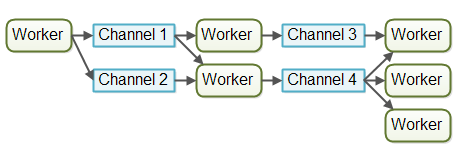

# Java 并发性和多线程

原文地址 [http://tutorials.jenkov.com/java-concurrency/index.html](http://tutorials.jenkov.com/java-concurrency/index.html)


<div class = 'data-section default-folding'>
<h2 class = 'section-title'><label class = 'block-number'>3</label> 多线程的代价</h2>
<div class = 'folding-area'>

从一个单线程的应用到一个多线程的应用并不仅仅带来好处，它也会有一些代价。不要仅仅为了使用多线程而使用多线程。而应该明确在使用多线程时能带来的好处比所付出的代价大的时候，才使用多线程。如果存在疑问，应该尝试测量一下应用程序的性能和响应能力，而不只是猜测。
<h3 class = 'auto-sort-sub'> 设计更复杂 </h3>

虽然有一些多线程应用程序比单线程的应用程序要简单，但其他的一般都更复杂。在多线程访问共享数据的时候，这部分代码需要特别的注意。线程之间的交互往往非常复杂。不正确的线程同步产生的错误非常难以被发现，并且重现以修复。
<h3 class = 'auto-sort-sub'> 上下文切换的开销 </h3>

当CPU从执行一个线程切换到执行另外一个线程的时候，它需要先存储当前线程的本地的数据，程序指针等，然后载入另一个线程的本地数据，程序指针等，最后才开始执行。这种切换称为“上下文切换”(“context switch”)。CPU会在一个上下文中执行一个线程，然后切换到另外一个上下文中执行另外一个线程。
`上下文切换并不廉价。如果没有必要，应该减少上下文切换的发生。`

你可以通过维基百科阅读更多的关于上下文切换相关的内容：

[http://en.wikipedia.org/wiki/Context_switch](http://en.wikipedia.org/wiki/Context_switch)


<h3 class = 'auto-sort-sub'> 增加资源消耗 </h3>

线程在运行的时候需要从计算机里面得到一些资源。除了CPU，线程还需要一些内存来维持它本地的堆栈。它也需要占用操作系统中一些资源来管理线程。我们可以尝试编写一个程序，让它创建100个线程，这些线程什么事情都不做，只是在等待，然后看看这个程序在运行的时候占用了多少内存。


</div>
</div>


<div class = 'data-section default-folding'>
<h2 class = 'section-title'><label class = 'block-number'>4</label> 并发编程模型</h2>
<div class = 'folding-area'>

并发系统可以采用多种并发编程模型来实现。并发模型指定了系统中的线程如何通过协作来完成分配给它们的作业。不同的并发模型采用不同的方式拆分作业，同时线程间的协作和交互方式也不相同。下面介绍几种（2015年，本文撰写时间）比较流行的几种并发模型。


<h3 class = 'auto-sort-sub'> 并发模型与分布式系统之间的相似性 </h3>

本文所描述的并发模型类似于分布式系统中使用的很多体系结构。在并发系统中线程之间可以相互通信。在分布式系统中进程之间也可以相互通信（进程有可能在不同的机器中）。线程和进程之间具有很多相似的特性。这也就是为什么很多并发模型通常类似于各种分布式系统架构。

当然，分布式系统在处理网络失效、远程主机或进程宕掉等方面也面临着额外的挑战。但是运行在巨型服务器上的并发系统也可能遇到类似的问题，比如一块CPU失效、一块网卡失效或一个磁盘损坏等情况。虽然出现失效的概率可能很低，但是在理论上仍然有可能发生。

由于并发模型类似于分布式系统架构，因此它们通常可以互相借鉴思想。例如，为工作者们（线程）分配作业的模型一般与分布式系统中的[负载均衡系统](http://tutorials.jenkov.com/software-architecture/load-balancing.html)比较相似。同样，它们在日志记录、失效转移、幂等性等错误处理技术上也具有相似性。


<h3 class = 'auto-sort-sub'>共享状态和独立状态</h3>

- 组件和线程被设计为在线程中共享某些状态， 这些状态是指某些数据，通常是一个或多个对象或类似的数据。当线程共享状态时，可能会发生类似[竟态](#)和[死锁](#)等的问题。这取决于线程的使用和访问共享对象的方式。

<div class="myImage">


<label class="imageTitle">共享状态</label>
</div>

- 具有从未在线程之间共享的单独状态, 独立状态意味着系统中的不同线程不会在其中共享任何状态。如果不同的线程需要进行通信，它们可以通过在其中交换不可变的对象，或通过在其中发送对象（或数据）的副本来执行。

<div class="myImage">


<label class="imageTitle">独立状态</label>
</div>

使用独立的状态并发设计通常可以使代码的某些部分更容易实现和推理，因为您知道只有一个线程会写入给定的对象。您不必担心对该对象的并发访问。但是，要使用独立的状态并发性，您可能必须更仔细地考虑应用程序的总体设计。但我觉得这是值得的。就个人而言，我更喜欢独立状态的并发设计。


<h3 class = 'auto-sort-sub'> 并行工作者模型 </h3>

第一种并发模型就是我所说的并行工作者模型。传入的作业会被分配到不同的工作者上。下图展示了并行工作者模型：

<div class="myImage">


<label class="imageTitle">并行工作者模型</label>
</div>

在并行工作者模型中，委派者（Delegator）将传入的作业分配给不同的工作者。每个工作者完成整个任务。工作者们并行运作在不同的线程上，甚至可能在不同的CPU上。
如果在某个汽车厂里实现了并行工作者模型，每台车都会由一个工人来生产。工人们将拿到汽车的生产规格，并且从头到尾负责所有工作。
在Java应用系统中，并行工作者模型是最常见的并发模型（即使正在转变）。[java.util.concurrent](http://tutorials.jenkov.com/java-util-concurrent/index.html) 包中的许多并发实用工具都是设计用于这个模型的。你也可以在Java企业级（J2EE）应用服务器的设计中看到这个模型的踪迹。


<h4 class = 'auto-sort-sub1'> 并行工作者模型的优点 </h4>

并行工作者模式的优点是，它很容易理解。你只需添加更多的工作者来提高系统的并行度。  
例如，如果你正在做一个网络爬虫，可以试试使用不同数量的工作者抓取到一定数量的页面，然后看看多少数量的工作者消耗的时间最短（意味着性能最高）。由于网络爬虫是一个IO密集型工作，最终结果很有可能是你电脑中的每个CPU或核心分配了几个线程。每个CPU若只分配一个线程可能有点少，因为在等待数据下载的过程中CPU将会空闲大量时间。


<h4 class = 'auto-sort-sub1'> 并行工作者模型的缺点 </h4>

- 共享状态可能会很复杂
在实际应用中，并行工作者模型可能比前面所描述的情况要复杂得多。共享的工作者经常需要访问一些共享数据，无论是内存中的或者共享的数据库中的。

<div class="myImage">


<label class="imageTitle">并行工作者模型中共享数据</label>
</div>

有些共享状态是在像作业队列这样的通信机制下。但也有一些共享状态是`业务数据`，`数据缓存`，`数据库连接池`等。
一旦共享状态潜入到并行工作者模型中，将会使情况变得复杂起来。线程需要以某种方式存取共享数据，以确保某个线程的修改能够对其他线程可见（数据修改需要同步到主存中，不仅仅将数据保存在执行这个线程的 CPU 的缓存中）。线程需要避免`竟态`，`死锁`以及很多其他共享状态的并发性问题。    
此外，`在等待访问共享数据结构时，线程之间的互相等待将会丢失部分并行性。`许多并发数据结构是阻塞的，意味着在任何一个时间只有一个或者很少的线程能够访问。这样会导致在这些共享数据结构上出现竞争状态。在执行需要访问共享数据结构部分的代码时，高竞争基本上会导致执行时出现一定程度的串行化。


<div class="myTip">

**如何解决上面出现的问题？**

- `非阻塞并发算法`也许可以降低竞争并提升性能，但是非阻塞算法的实现比较困难。


- <span class="myAnnotate">
可持久化的数据结构
</span>
<div class="js-annotate annotate hidden">
这里的可持久化数据结构不是指持久化存储，而是一种数据结构，比如 Java 中的 String 类，以及 CopyOnWriteArrayList 类
</div>
是另一种选择。在修改的时候，可持久化的数据结构总是保护它的前一个版本不受影响。因此，如果多个线程指向同一个可持久化的数据结构，并且其中一个线程进行了修改，进行修改的线程会获得一个指向新结构的引用。所有其他线程保持对旧结构的引用，旧结构没有被修改并且因此保证一致性(Scala编程包含几个持久化数据结构)。    

*虽然可持久化的数据结构在解决共享数据结构的并发修改时显得很优雅，但是可持久化的数据结构的表现往往不尽人意。比如说，一个可持久化的链表需要在头部插入一个新的节点，并且返回指向这个新加入的节点的一个引用（这个节点指向了链表的剩余部分）。所有其他现场仍然保留了这个链表之前的第一个节点，对于这些线程来说链表仍然是为改变的。它们无法看到新加入的元素。
这种可持久化的列表采用链表来实现。不幸的是链表在现代硬件上表现的不太好。链表中得每个元素都是一个独立的对象，这些对象可以遍布在整个计算机内存中。现代CPU能够更快的进行顺序访问，所以你可以在现代的硬件上用数组实现的列表，以获得更高的性能。数组可以顺序的保存数据。CPU缓存能够一次加载数组的一大块进行缓存，一旦加载完成CPU就可以直接访问缓存中的数据。这对于元素散落在RAM中的链表来说，不太可能做得到。*

</div>


<h4 class = 'auto-sort-sub1'> 工作者是无状态的 </h4>

共享状态能够被系统中的其他线程修改。所以工作者在每次需要的时候必须重读状态，以确保每次都能访问到最新的副本，不管共享状态是保存在内存中的还是在外部数据库中。工作者无法在内部保存这个状态（但是每次需要的时候可以重读）称为无状态的。
每次都重读需要的数据，将会导致速度变慢，特别是状态保存在外部数据库中的时候。

<h4 class = 'auto-sort-sub1'> 任务顺序是不确定的 </h4>

并行工作者模式的另一个缺点是，作业执行顺序是不确定的。无法保证哪个作业最先或者最后被执行。作业A可能在作业B之前就被分配工作者了，但是作业B反而有可能在作业A之前执行。
并行工作者模式的这种非确定性的特性，使得很难在任何特定的时间点推断系统的状态。这也使得它也更难保证一个作业在其他作业之前被执行。


<h3 class = 'auto-sort-sub'> 流水线并发模式 </h3>

第二种并发模型我们称之为流水线并发模型。我之所以选用这个名字，只是为了配合“并行工作者”的隐喻。其他开发者可能会根据平台或社区选择其他称呼（比如说`反应器系统`，或`事件驱动系统`）。下图表示一个流水线并发模型：

<div class="myImage">


<label class="imageTitle">流水线并发模式</label>
</div>

类似于工厂中生产线上的工人们那样组织工作者。每个工作者只负责作业中的部分工作。当完成了自己的这部分工作时工作者会将作业转发给下一个工作者。每个工作者在自己的线程中运行，并且不会和其他工作者共享状态。有时也被成为`无共享并行模型`。  
通常使用非阻塞的 IO 来设计使用流水线并发模型的系统。非阻塞 IO 意味着，一旦某个工作者开始一个IO操作的时候（比如读取文件或从网络连接中读取数据），这个工作者不会一直等待IO操作的结束。IO操作速度很慢，所以等待 IO 操作结束很浪费 CPU 时间。此时 CPU 可以做一些其他事情。当 IO 操作完成的时候，IO 操作的结果（比如读出的数据或者数据写完的状态）被传递给下一个工作者。  
有了非阻塞 IO，就可以使用 IO 操作确定工作者之间的边界。工作者会尽可能多运行直到遇到并启动一个 IO 操作。然后交出作业的控制权。当 IO 操作完成的时候，在流水线上的下一个工作者继续进行操作，直到它也遇到并启动一个 IO 操作。

<div class="myImage">


<label class="imageTitle"></label>
</div>


在实际应用中，作业有可能不会沿着单一流水线进行。由于大多数系统可以执行多个作业，作业从一个工作者流向另一个工作者取决于作业需要做的工作。在实际中可能会有多个不同的虚拟流水线同时运行。这是现实当中作业在流水线系统中可能的移动情况：

<div class="myImage">


<label class="imageTitle"></label>
</div>

作业甚至也有可能被转发到超过一个工作者上并发处理。比如说，作业有可能被同时转发到作业执行器和作业日志器。下图说明了三条流水线是如何通过将作业转发给同一个工作者（中间流水线的最后一个工作者）来完成作业:
<div class="myImage">


<label class="imageTitle"></label>
</div>

流水线有时候比这个情况更加复杂。

<h4 class = 'auto-sort-sub1'> 反应器，事件驱动系统 </h4>

采用流水线并发模型的系统有时候也称为反应器系统或事件驱动系统。系统内的工作者对系统内出现的事件做出反应，这些事件也有可能来自于外部世界或者发自其他工作者。`事件可以是传入的 HTTP 请求，也可以是某个文件成功加载到内存中等。`  
目前比较流行的反应器/事件驱动平台：
- [Vert.x](https://vertx.io/) 
- [AKKa](https://akka.io/)
- [Node.JS](http://nodejs.cn/)


<h4 class = 'auto-sort-sub1'> Actors 和 Channels </h4>

Actors 和 channels 是两种比较类似的流水线（反应器/事件驱动）模型。

在Actor 模型中每个工作者被称为 actor。`Actor 之间可以直接异步地发送和处理消息`。Actor 可以被用来实现一个或多个像前文描述的那样的作业处理流水线。

<div class="myImage">


<label class="imageTitle">Actor 模型</label>
</div>

而`在 Channel 模型中，工作者之间不直接进行通信。`相反，它们在不同的通道中发布自己的消息（事件）。其他工作者们可以在这些通道上监听消息，发送者无需知道谁在监听。
<div class="myImage">


<label class="imageTitle">Channel 模型</label>
</div>

目前而言，channel 模型似乎更加灵活。一个工作者无需知道谁在后面的流水线上处理作业。只需知道作业（或消息等）需要转发给哪个通道。通道上的监听者可以随意订阅或者取消订阅，并不会影响向这个通道发送消息的工作者。这使得工作者之间具有松散的耦合。


<h4 class = 'auto-sort-sub1'> 流水线模型的优点 </h4>

- **无需共享的状态**  
工作者之间无需共享状态，意味着实现的时候无需考虑所有因并发访问共享对象而产生的并发性问题。这使得在实现工作者的时候变得非常容易。在实现工作者的时候就好像是单个线程在处理工作-基本上是一个单线程的实现。

- **有状态的工作者**  
当工作者知道了没有其他线程可以修改它们的数据，工作者可以变成有状态的。对于有状态，我是指，它们可以在内存中保存它们需要操作的数据，只需在最后将更改写回到外部存储系统。因此，有状态的工作者通常比无状态的工作者具有更高的性能。

- <span class="myAnnotate">
<strong>硬件整合</strong>
</span>
<div class="js-annotate annotate hidden">
以某种方式编写的代码，使得能够自然地受益于底层硬件的工作原理。有些开发者称之为 mechanical sympathy。
</div><strong>（Hardware Conformity）的较好</strong>    

<div style="padding-left: 2rem">
<strong>单线程代码在整合底层硬件的时候往往具有更好的优势</strong><br>  
&nbsp; 1) 当能确定代码只在单线程模式下执行的时候，通常能够创建更优化的数据结构和算法。<br>
&nbsp; 2) 单线程有状态的工作者能够在内存中缓存数据。在内存中缓存数据的同时，也意味着数据很有可能也缓存在执行这个线程的 CPU 的缓存中。这使得访问缓存的数据变得更快。<br>
</div>

- **合理的作业顺序**  
基于流水线并发模型实现的并发系统，在某种程度上是有可能保证作业的顺序的。作业的有序性使得它更容易地推出系统在某个特定时间点的状态。更进一步，你可以将所有到达的作业写入到日志中去。一旦这个系统的某一部分挂掉了，该日志就可以用来重头开始重建系统当时的状态。按照特定的顺序将作业写入日志，并按这个顺序作为有保障的作业顺序。下图展示了一种可能的设计：

<div class="myImage">


<label class="imageTitle"></label>
</div>

<div style="padding-left: 2rem">

*实现一个有保障的作业顺序是不容易的，但往往是可行的。如果可以，它将大大简化一些任务，例如备份、数据恢复、数据复制等，这些都可以通过日志文件来完成。*
</div>


<h4 class = 'auto-sort-sub1'> 流水线模型的缺点 </h4>

- 作业的执行往往分布到多个工作者上，并因此分布到项目中的多个类上。这样导致在追踪某个作业到底被什么代码执行时变得困难。

- 加大了代码编写的难度。有时会将工作者的代码写成回调处理的形式。若在代码中嵌入过多的回调处理，往往会出现所谓的回调地狱（callback hell）现象。 

<div class="myTip">

所谓回调地狱，就是意味着在追踪代码在回调过程中到底做了什么，以及确保每个回调只访问它需要的数据的时候，变得非常困难  
使用并行工作者模型可以简化这个问题。你可以打开工作者的代码，从头到尾优美的阅读被执行的代码。当然并行工作者模式的代码也可能同样分布在不同的类中，但往往也能够很容易的从代码中分析执行的顺序。
</div>


<h3 class = 'auto-sort-sub'> 函数式并行（Functional Parallelism）模型 </h3>

第三种并发模型是函数式并行模型，这是也最近（2015）讨论的比较多的一种模型。函数式并行的基本思想是采用函数调用实现程序。函数可以看作是”代理人（agents）“或者”actor“，函数之间可以像流水线模型（AKA 反应器或者事件驱动系统）那样互相发送消息。某个函数调用另一个函数，这个过程类似于消息发送。  
函数都是通过拷贝来传递参数的，所以除了接收函数外没有实体可以操作数据。这对于避免共享数据的竞态来说是很有必要的。同样也使得函数的执行类似于原子操作。每个函数调用的执行独立于任何其他函数的调用。  
一旦每个函数调用都可以独立的执行，它们就可以分散在不同的 CPU 上执行了。这也就意味着能够在多处理器上并行的执行使用函数式实现的算法。


<div class="myNote">

<br>
Java7 中的 java.util.concurrent 包中的 
<span class="myAnnotate">
ForkAndJoinPool
</span> 能够帮助我们实现类似于函数式并行的一些东西。而 Java8 中并行 streams 能够用来帮助我们并行的迭代大型集合。
<div class="js-annotate annotate hidden">
有些开发者批评 ForkAndJoinPool
</div>

- `函数式并行里面最难的是确定需要并行的那个函数调用。` 跨 CPU 协调函数调用需要一定的开销。某个函数完成的工作单元需要达到某个大小以弥补这个开销。如果函数调用作用非常小，将它并行化可能比单线程、单 CPU 执行还慢。
- 可以使用反应器或者事件驱动模型实现一个算法，像函数式并行那样的方法实现工作的分解。使用事件驱动模型可以更精确的控制如何实现并行化。
- 此外，将任务拆分给多个 CPU 时协调造成的开销，仅仅在该任务是程序当前执行的唯一任务时才有意义。但是，如果当前系统正在执行多个其他的任务时（比如 web 服务器，数据库服务器或者很多其他类似的系统），将单个任务进行并行化是没有意义的。不管怎样计算机中的其他 CPU 们都在忙于处理其他任务，没有理由用一个慢的、函数式并行的任务去扰乱它们。使用流水线（反应器）并发模型可能会更好一点，因为它开销更小（在单线程模式下顺序执行）同时能更好的与底层硬件整合。
</div>


<h3 class = 'auto-sort-sub'> 使用那种并发模型最好？ </h3>

通常情况下，这个答案取决于你的系统打算做什么。如果你的作业本身就是并行的、独立的并且没有必要共享状态，你可能会使用并行工作者模型去实现你的系统。虽然许多作业都不是自然并行和独立的。对于这种类型的系统，我相信使用流水线并发模型能够更好的发挥它的优势，而且比并行工作者模型更有优势。  
你甚至不用亲自编写所有流水线模型的基础结构。像 Vert.x 这种现代化的平台已经为你实现了很多。
</div>
</div>


<div class = 'data-section default-folding'>
<h2 class = 'section-title'><label class = 'block-number'>6</label> 竞态条件与临界区</h2>
<div class = 'folding-area'>

> 1) 在同一程序中运行多个线程本身不会导致问题，问题在于多个线程访问了相同的资源。如，同一内存区（变量，数组，或对象）、系统（数据库，web services等）或文件  
- 2) 这些问题只有在一或多个线程向这些资源做了`写操作`时才有可能发生  
> 3) 只要资源没有发生变化, 多个线程读取相同的资源就是安全的  

当两个线程竞争同一资源时，如果对资源的访问顺序敏感，就称存在竞态条件。导致竞态条件发生的代码区称作临界区。下例中 add() 方法就是一个临界区, 它会产生竞态条件。在临界区中使用适当的同步就可以避免竞态条件。 

多线程同时执行下面的代码可能会出错： 
```java
public class Counter {
    protected long count = 0;
    public void add(long value){
        this.count = this.count + value;
    }
}
```
 假设线程 A 和 B 同时执行同一个 Counter 对象的 add() 方法，我们无法知道操作系统何时会在两个线程之间切换。JVM 并不是将这段代码视为单条指令来执行的，而是按照下面的顺序：
```
从内存获取 this.count 的值放到寄存器
将寄存器中的值增加value
将寄存器中的值写回内存
```
观察线程A和B交错执行会发生什么：
```
this.count = 0;
A:  读取 this.count 到一个寄存器 (0)
B:  读取 this.count 到一个寄存器 (0)
B:  将寄存器的值加2
B:  回写寄存器值(2)到内存. this.count 现在等于 2
A:  将寄存器的值加3
A:  回写寄存器值(3)到内存. this.count 现在等于 3
```
最终的值并不是期望的 5，而是最后写回内存的那个线程的值，上面例子中最后写回内存的是线程 A，但实际中也可能是线程 B。如果没有采用合适的同步机制，线程间的交叉执行情况就无法预料。

</div>
</div>


<div class = 'data-section default-folding'>
<h2 class = 'section-title'><label class = 'block-number'>7</label> 线程安全与共享资源</h2>
<div class = 'folding-area'>

> 1)  允许被多个线程同时执行的代码称作线程安全的代码  
> 2)  线程安全的代码不包含竞态条件  
> 3)  当多个线程同时更新共享资源时会引发竞态条件。因此，了解Java线程执行时共享了什么资源很重要

 
<h3 class = 'auto-sort-sub'> 局部变量 </h3>

局部变量存储在线程自己的栈中。也就是说，局部变量永远也不会被多个线程共享。所以，基础类型的局部变量是线程安全的。

<h3 class = 'auto-sort-sub'> 局部对象引用 </h3>

对象的局部引用和基础类型的局部变量不太一样。尽管引用本身没有被共享，但引用所指的对象并没有存储在线程的栈内。`所有的对象都存在共享堆中。`如果在某个方法中创建的对象不会逃逸出该方法，那么它就是线程安全的。实际上，哪怕将这个对象作为参数传给其它方法，只要别的线程获取不到这个对象，那它仍是线程安全的。下面是一个线程安全的局部引用样例：

```java
public void someMethod(){

  LocalObject localObject = new LocalObject();

  localObject.callMethod();
  method2(localObject);
}

public void method2(LocalObject localObject){
  localObject.setValue("value");
}
```
样例中 LocalObject 对象没有被方法返回，也没有被传递给 someMethod() 方法外的对象。每个执行 someMethod() 的线程都会创建自己的 LocalObject 对象，并赋值给 localObject 引用。因此，这里的 LocalObject 是线程安全的。事实上，整个 someMethod() 都是线程安全的。即使将 LocalObject 作为参数传给同一个类的其它方法或其它类的方法时，它仍然是线程安全的。当然，如果 LocalObject 通过某些方法被传给了别的线程，那它就不再是线程安全的了。 


<h3 class = 'auto-sort-sub'> 成员对象引用 </h3>

成员对象引用存储在堆上。如果两个线程同时更新同一个对象的同一个成员，那这个代码就不是线程安全的。下面是一个样例：

<div class="myImage">


<label class="imageTitle">成员对象引用的竞态条件</label>
</div>


<h3 class = 'auto-sort-sub'> 线程逃逸的控制规则 </h3>


> 如果一个资源的创建，使用，销毁都在同一个线程内完成，且永远不会脱离该线程的控制，则该资源的使用就是线程安全的。

1. 资源可以是对象，数组，文件，数据库连接，套接字等等
1. Java 中你无需主动销毁对象，所以"销毁"指不再有引用指向对象。
1. 即使对象本身线程安全，但如果该对象中包含其他资源（文件，数据库连接），整个应用也许就不再是线程安全的了

<div class="myTip">

比如 2 个线程都创建了各自的数据库连接，每个连接自身是线程安全的，但它们所连接到的同一个数据库也许不是线程安全的。比如，2 个线程执行如下代码：
```
检查记录X是否存在，如果不存在，插入X
```
如果两个线程同时执行，而且碰巧检查的是同一个记录，那么两个线程最终可能都插入了记录：
```
线程1检查记录X是否存在。检查结果：不存在
线程2检查记录X是否存在。检查结果：不存在
线程1插入记录X
线程2插入记录X
```
同样的问题也会发生在文件或其他共享资源上。因此，`区分某个线程控制的对象是资源本身，还是仅仅到某个资源的引用很重要。`
</div>

</div>
</div>

<div class = 'data-section default-folding'>
<h2 class = 'section-title'><label class = 'block-number'>8</label> 线程安全及不可变性</h2>
<div class = 'folding-area'>

> 可以通过创建不可变的共享对象来保证对象在线程间共享时不会被修改，从而实现线程安全  
> 即使一个对象是线程安全的不可变对象，指向这个对象的引用也可能不是线程安全的


<h3 class = 'auto-sort-sub'>不可变类</h3>

<div class="myImage">


<label class="imageTitle">不可变类</label>
</div>


<div class="myWarning">

"不变"（Immutable）和 "只读"（Read Only）是不同的。当一个变量是 "只读" 时，变量的值不能直接改变，但是可以在其它变量发生改变的时候发生改变。比如，一个人的出生年月日是 "不变" 属性，而一个人的年龄便是 "只读" 属性，但是不是 "不变" 属性。随着时间的变化，一个人的年龄会随之发生变化，而一个人的出生年月日则不会变化。这就是 "不变" 和 "只读" 的区别。
</div>

如果你需要对 ImmutableValue 类的实例进行操作，可以通过得到 value 变量后创建一个新的实例来实现，下面是一个对 value 变量进行加法操作的示例：

<div class="myImage">


<label class="imageTitle">对不可变量的操作</label>
</div>


<h3 class = 'auto-sort-sub'>引用不是线程安全的</h3>

<div class="myImage">


<label class="imageTitle"></label>
</div>

</div>
</div>


<div class = 'data-section default-folding'>
<h2 class = 'section-title'><label class = 'block-number'>9</label> Java 内存模型</h2>
<div class = 'folding-area'>

// TODO
</div>
</div>


<div class = 'data-section default-folding'>
<h2 class = 'section-title'><label class = 'block-number'>10</label> Java 同步块</h2>
<div class = 'folding-area'>

> Java 同步块（synchronized block）通过标记方法或者代码块同步来避免竞态


<h3 class = 'auto-sort-sub'> Java 同步关键字（synchronized）</h3>

Java 中的同步块用 synchronized 标记。同步块在 Java 中是同步在某个对象上。所有同步在一个对象上的同步块在同时只能被一个线程进入并执行操作。所有其他等待进入该同步块的线程将被阻塞，直到执行该同步块中的线程退出。

有四种不同的同步块： `实例方法`  `静态方法`  `实例方法中的同步块`  `静态方法中的同步块`

<h4 class = 'auto-sort-sub1'>实例方法同步</h4>

```java
public synchronized void add(int value){
    this.count += value;
}
```
Java 实例方法同步是同步在拥有该方法的对象上。这样，每个实例其方法同步都同步在不同的对象上，即该方法所属的实例。只有一个线程能够在实例方法同步块中运行。如果有多个实例存在，那么一个线程一次可以在一个实例同步块中执行操作。


<h4 class = 'auto-sort-sub1'>静态方法同步</h4>

```java
public static synchronized void add(int value){
    count += value;
}
```
静态方法的同步是指同步在该方法所在的类对象上。因为在 Java 虚拟机中一个类只能对应一个类对象，所以同时只允许一个线程执行同一个类中的静态同步方法。


<h4 class = 'auto-sort-sub1'>实例方法中打同步块</h4>

有时你不需要同步整个方法，而是同步方法中的一部分。Java可以对方法的一部分进行同步，如下所示：

```java
public void add(int value){
    
    /* 
        some code
    */

    synchronized(this){
       this.count += value;
    }
}

```
Java 同步块构造器用括号将对象括起来。在上例中，使用了 "this" ，即为调用 add 方法的实例本身。在同步构造器中用括号括起来的对象叫做`监视器对象`。一次只有一个线程能够在同步于同一个监视器对象的 Java 方法内执行。


```java
public class MyClass {
    public static void log2(String msg1, String msg2){
       synchronized(MyClass.class){
          log.writeln(msg1);
          log.writeln(msg2);
       }
    }
}
```


<h3 class = 'auto-sort-sub'>线程八锁</h3>

情况一:
```java

class Number{
  public synchronized void a() {
    log.debug("1");
  }
  public synchronized void b() {
    log.debug("2");
  }
}

public static void main(String[] args) {
  Number n1 = new Number();
  new Thread(()->{ n1.a(); }).start();
  new Thread(()->{ n1.b(); }).start();
}


/// Ans:  12 或 21
```

情况二:
```java
class Number{
  public synchronized void a() {
    sleep(1);    
    log.debug("1");
  }
  public synchronized void b() {
    log.debug("2");
  }
}

public static void main(String[] args) {
  Number n1 = new Number();
  new Thread(()->{ n1.a(); }).start();
  new Thread(()->{ n1.b(); }).start();
}


/// Ans: 1ms 后 12， 或 2 1ms 后 1
```

情况三：
```java
class Number{
  public synchronized void a() {
    sleep(1);    
    log.debug("1");
  }
  public synchronized void b() {
    log.debug("2");
  }
  public void c() {
    log.debug("3");
  }
}

public static void main(String[] args) {
  Number n1 = new Number();
  new Thread(()->{ n1.a(); }).start();
  new Thread(()->{ n1.b(); }).start();
  new Thread(()->{ n1.c(); }).start();
}


/// Ans: 3 1ms 后 12， 或 32 1ms 后 1, 或23 1ms 后 1
```

情况四：
```java
class Number{
  public synchronized void a() {
    sleep(1);
    log.debug("1");
  }
  public synchronized void b() {
    log.debug("2");
  }
}

public static void main(String[] args) {
  Number n1 = new Number();
  Number n2 = new Number();
  new Thread(()->{ n1.a(); }).start();
  new Thread(()->{ n2.b(); }).start();
}


/// Ans: 2 1ms 后 1
```

情况五：
```java
class Number{
  public static synchronized void a() {
    sleep(1);    
    log.debug("1");
  }
  public synchronized void b() {
    log.debug("2");
  }
}

public static void main(String[] args) {
  Number n1 = new Number();
  new Thread(()->{ n1.a(); }).start();
  new Thread(()->{ n1.b(); }).start();
}


/// Ans: 2 1ms 后 1
```

情况六：
```java
class Number{
  public static synchronized void a() {
    sleep(1);    
    log.debug("1");
  }
  public static synchronized void b() {
    log.debug("2");
  }
}

public static void main(String[] args) {
  Number n1 = new Number();
  new Thread(()->{ n1.a(); }).start();
  new Thread(()->{ n1.b(); }).start();
}


/// Ans: 1ms 后 12, 或 2 1ms 后 1
```

情况七：
```java
@Slf4j(topic = "c.Number")
class Number{
  public static synchronized void a() {
    sleep(1);
    log.debug("1");
  }
  public synchronized void b() {
    log.debug("2");
  }
}

public static void main(String[] args) {
  Number n1 = new Number();
  Number n2 = new Number();
  new Thread(()->{ n1.a(); }).start();
  new Thread(()->{ n2.b(); }).start();
}


/// Ans: 2 1ms 后 1
```

情况八：
```java
class Number{
  public static synchronized void a() {
    sleep(1);    
    log.debug("1");
  }
  public static synchronized void b() {
    log.debug("2");
  }
}

public static void main(String[] args) {
  Number n1 = new Number();
  Number n2 = new Number();
  new Thread(()->{ n1.a(); }).start();
  new Thread(()->{ n2.b(); }).start();
}


/// Ans: 1ms 后 12, 或 2 1ms 后 1
```

<h3 class = 'auto-sort-sub'>实例：经典买票问题</h3>

```java
public class ThreadTest {
    
    class Ticket implements Runnable
    {
        public int num = 100;
        @Override
        public void run() {
            // TODO Auto-generated method stub
            while(num > 0){
                try {
                    Thread.currentThread().sleep(10);
                } catch (InterruptedException e) {
                    // TODO Auto-generated catch block
                    e.printStackTrace();
                }
                /****  注意：这里的内容需要同步 ******/
                synchronized (this) {
                    num--;
                    if(num < 0) break;
                    System.out.println("当前线程为："+Thread.currentThread().getName()+",目前所剩票数为:"+num);
                }
                /******************************/

            }

            
        }
        
    }
    
    public static void main(String[] args) {
        Ticket tt = new ThreadTest().new Ticket();
        new Thread(tt,"AA").start();
        new Thread(tt,"BB").start();
        
    }
    
}
```


</div>
</div>


<div class = 'data-section default-folding'>
<h2 class = 'section-title'><label class = 'block-number'>11</label> 线程通信</h2>
<div class = 'folding-area'>

线程通信的目标是使线程间能够互相发送信号。例如，线程 B 可以等待线程A的一个信号，这个信号会通知线程 B 数据已经准备好了。
<h3 class = 'auto-sort-sub'>通过共享对象进行通信</h3>

`线程间发送信号的一个简单方式是在共享对象的变量里设置信号值。`线程 A 在一个同步块里设置 boolean 型成员变量 hasDataToProcess 为 true，线程 B 也在同步块里读取 hasDataToProcess 这个成员变量。这个简单的例子使用了一个持有信号的对象，并提供了 set 和 check 方法:

```java
public class MySignal{

  protected boolean hasDataToProcess = false;

  public synchronized boolean hasDataToProcess(){
    return this.hasDataToProcess;
  }

  public synchronized void setHasDataToProcess(boolean hasData){
    this.hasDataToProcess = hasData;
  }

}
```

<div class="myWarning">

1. 线程 A 和 B 必须获得指向一个 MySignal 共享实例的引用，以便进行通信。
1. 如果它们持有的引用指向不同的 MySingal 实例，那么彼此将不能检测到对方的信号。
1. 需要处理的数据可以存放在一个共享缓存区里，它和 MySignal 实例是分开存放的。
</div>


<h3 class = 'auto-sort-sub'>忙等待</h3>


</div>
</div>


