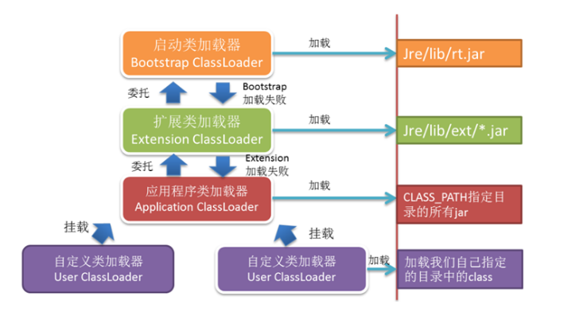

# java 虚拟机

<div class = 'data-section default-folding'>
<h2 class = 'section-title'><label class = 'block-number'>1</label> 类的加载机制</h2>
<div class = 'folding-area'>

<h3 class = 'auto-sort-sub'>加载</h3>

<h4 class = 'auto-sort-sub1'>class 文件的加载方式</h4>

- 本地系统中直接加载
- 通过网络加载
- 从 zip, jar 等归档文件中加载
- 从专有数据库中提取
- 将 java 源文件动态编译成 .class 文件


<h4 class = 'auto-sort-sub1'>类加载器</h4>

> JVM 自带的类加载器 : `启动类加载器` `扩展类加载器` `应用类加载器`


<div class="myNote">

**启动类加载器**
- `其他类加载器是由启动类加载器去加载的`，启动类加载器是`C++`写的，内嵌在 JVM 中。启动类加载器并不是 java 类，其他的加载器都是 java 类。 启动类加载器是特定于平台的机器指令，它负责开启整个加载过程。
- 内嵌于 JVM 中的启动类加载器会加载 java.lang.ClassLoader 以及其他的 Java 平台类。当 JVM 启动时，一块特殊的机器码会运行，它会加载扩展类加载器以及系统类加载器，这块特殊的机器码叫做启动类加载器。

**扩展类加载器** 加载的是 jar 包


</div>

**Example 1**
```java
public class Demo {
    public static void main(String[] args) throws ClassNotFoundException {

        ClassLoader classLoader = ClassLoader.getSystemClassLoader();
        System.out.println(classLoader);
        while ( null != classLoader) {
            classLoader = classLoader.getParent();  //[]
            System.out.println(classLoader);
        }
    }
}


输出：
sun.misc.Launcher$AppClassLoader@4e0e2f2a    //应用类加载器
sun.misc.Launcher$ExtClassLoader@2a139a55    //扩展类加载器  
null    //启动类加载器
```

**Example 2**
```java
public class Demo {
    public static void main(String[] args) {
        System.out.println(String.class.getClassLoader());
        System.out.println(C.class.getClassLoader());    
    }
}

class C {}


输出：
null   //由于String是由根加载器加载，在rt.jar包下
sun.misc.Launcher$AppClassLoader@73d16e93

```

**数组的加载**  
数组不是由类加载器加载，而是由 jvm 在`运行时`动态创建,
类加载器通过 Class.getClassLoader() 返回的是数组`元素`的类型,如果数组元素是`基本数据`类型，数组就没有类加载器

```java
public class Demo {
    public static void main(String[] args) {
        String[] strs = new String[2];
        System.out.println(strs.getClass().getClassLoader());
        System.out.println("----[1]----");
        Demo[] demos = new Demo[2];
        System.out.println(demos.getClass().getClassLoader());
        System.out.println("----[2]----");
        int[] ints = new int[2];
        System.out.println(ints.getClass().getClassLoader());
        System.out.println("----[3]----");
    }
}

输出：
null   // 根类加载器
----[1]----
sun.misc.Launcher$AppClassLoader@4e0e2f2a
----[2]----
null     //没有类加载器
----[3]----
```


**如何自定义类加载器？**  
答：继承java.lang.ClassLoader 


<div class="myProblem no-shadow">
<div class="myQuestion">
</div>
<button class="toggleAnswer answer-button">EXAMPLE</button>
<div class="myAnswer hidden">

```java
// 自定义类加载器
public class Demo extends ClassLoader {

    private String classLoaderName;
    private static final String filePost = ".class";

    public Demo(ClassLoader parent, String classLoaderName) {
        super(parent);   //显示指定该类的父类加载器
        this.classLoaderName = classLoaderName;
    }

    public Demo(String classLoaderName) {
        super();       //将系统类加载器当作该类的父类加载器
        this.classLoaderName = classLoaderName;
    }

    @Override
    public Class findClass(String name) {
        System.out.println("自定义类加载器加载了指定的类");
        System.out.println("class loader name: " + this.classLoaderName);
        byte[] b = loadClassData(name);
        return defineClass(name, b, 0, b.length);
    }

    private byte[] loadClassData(String name) {
        InputStream is = null;
        byte[] data = null;
        ByteArrayOutputStream byteArrayOutputStream = null;

        try {
            name = name.replace(".", File.separator);     //File.separator根据操作系统而变化
            is = new FileInputStream(new File(name + filePost));
            byteArrayOutputStream = new ByteArrayOutputStream();
            int len = 0;
            while (-1 != (len = is.read())) {
                byteArrayOutputStream.write(len);
            }
            data = byteArrayOutputStream.toByteArray();

        } catch (Exception e) {
            e.printStackTrace();
        } finally {
            try {
                is.close();
                byteArrayOutputStream.close();
            } catch (IOException e) {
                e.printStackTrace();
            }
            return data;
        }
    }

    public static void test(ClassLoader classLoader) throws Exception {
        Class<?> clazz = classLoader.loadClass("com.xxx.Load");
        System.out.println("classHashCode: " + clazz.hashCode());
        Object instance = clazz.newInstance();
        System.out.println("classInstance: " + instance);
        System.out.println("classLoader: " + instance.getClass().getClassLoader());
        System.out.println("++++++++++");
    }

    public static void main(String[] args) throws Exception {
        Demo demo1 = new Demo("demo1");
        test(demo1);

        Demo demo2 = new Demo("demo1");
        test(demo2);
    }
}

class Load {
    static {System.out.println("----[Load]----");}
}


输出：
classHashCode: 705927765 
----[Load]----
classInstance: com.xxx.Load@15db9742
classLoader:sun.misc.Launcher$AppClassLoader@4e0e2f2a
 ++++++++++
classHashCode: 705927765  // 相同，why?
classInstance: com.xxx.Load@6d06d69c
classLoader: sun.misc.Launcher$AppClassLoader@4e0e2f2a
```
// TODO


</div>
</div>

<h4 class = 'auto-sort-sub1'>加载方式</h4>

##### 双亲委托机制

<div class="myImage">


<label class="imageTitle">图示: 双亲委托机制</label>
</div>

- 双亲委托模型的好处：
  （1）可以`确保 Java 核心库的安全`：所有的 Java 应用都会引用 java.lang 中的类，也就是说在运行期 java.lang 中的类会被加载到虚拟机中，如果这个加载过程是由自己的类加载器所加载，那么很可能就会在 JVM 中存在多个版本的 java.lang 中的类，而且这些类是相互不可见的（命名空间的作用）。借助于双亲委托机制，Java 核心类库中的类的加载工作都是由启动类加载器去加载，从而确保了 Java 应用所使用的的都是同一个版本的 Java 核心类库，他们之间是相互兼容的；
  （2）不同的类加载器可以为相同名称的类（binary name）创建额外的命名空间。相同名称的类可以并存在 Java 虚拟机中，只需要用不同的类加载器去加载即可。相当于在 Java 虚拟机内部建立了一个又一个相互隔离的 Java 类空间。


1. 类加载器不需要等到某个类被`首次主动`使用时再加载它, jvm 规范允许类加载器在`预料`某个类将要被使用时预先加载它，如果在预先加载的过程中遇到了 .class 文件缺失或存在错误，类加载器必须在程序首次主动使用该类时才报告错误（`LinkageError`错误），如果这个类一直没有被主动使用，那么`类加载器就不会报告错误`
1. 类加载器用来把类加载到 JVM 中。从 JDK1.2 版本开始，类的加载过程采用`双亲委托机制`，这种机制能更好地`保证 java 平台的安全`。`在双亲委托机制中，除了 java 虚拟机自带的根类加载器(启动类加载器)以外，其余的类加载器都有且只有一个父加载器`。

当 java 程序请求加载器 loader1 加载 Sample 类时，loader1 首先委托自己的父加载器去加载  Sample 类，若父加载器能加载，则有父加载器完成加载任务，否则才由加载器 loader1  本身加载 Sample 类。

</div>

<div class="myNote">

**命名空间**  
- 每个类加载器都有自己的命名空间，`命名空间由该加载器及所有父加载器所加载的类构成`
- 在同一个命名空间中，不会出现类的完整名字（包括类的包名）相同的两个类
- 在不同的命名空间中，有可能会出现类的完整名字（包括类的包名）相同的两个类
- 同一命名空间内的类是互相可见的
- 非同一命名空间下，`子加载器可以访问父加载器加载的类，父加载器不能访问子加载器加载的类`
</div>

##### 线程上下文类加载器

<div class="myTip">

**为什么要有线程上下文类加载器？**   
答：在双亲委托模型下，类加载是由下至上的，即下层的类加载器会委托父加载器进行加载。但是对于 `SPI`（Service Provide Interface） 来说，有些接口是Java核心库所提供的的（如 JDBC），Java 核心库（如 Connection 接口）是由启动类加载器去加载的，而这些接口的实现却来自不同的 jar 包（`默认会被添加到 classes 下，这样就会导致父加载器无法访问子类加载器所加载的类`）（厂商提供），Java 的启动类加载器是不会加载其他来源的 jar 包，这样传统的双亲委托模型就无法满足 SPI 的要求。
父`ClassLoader`可以使用当前线程`Thread.currentThread().getContextClassLoader()`所制定的`ClassLoader`加载的类，这就改变了父加载器加载的类无法使用子加载器或是其他没有父子关系的`ClassLoader`加载的类的情况，即改变了双亲委托模型。

</div>

**当前类加载器 (Current ClassLoader):** 每个类都会尝试使用自己的类加载器去加载依赖的类。

线程上下文加载器 jdk1.2 提供 如果没有通过`setContextClassLoader(ClassLoader c)`方法设置，线程将继承父线程的上下文类加载器，java 应用运行时的初始线程的上下文类加载器是`系统`类加载器。该线程中运行的代码可以通过该类加载器加载类和资源。


<h4 class = 'auto-sort-sub1'>获取 ClassLoader 的方式</h4>

**获得当前类的 ClassLoader**
```java
clazz.getClassLoader()
```
**获得当前线程上下文的 ClassLoader**
```java
Thread.currentThread().getContextClassLoader()
```
**获得系统类 ClassLoader**
```java
ClassLoader.getSystemClassLoader()
```
**获得调用者的 ClassLoader**
```java
DriverManager.getCallerClassLoader()
```


<h3 class = 'auto-sort-sub'>连接</h3>

> 类的连接分为 3 个阶段：`验证` `准备` `解析`

<h4 class = 'auto-sort-sub1'>验证</h4>

- 将已经读入到内存的类的二进制数据合并到 JVM 的运行时环境中去

**类的验证的主要内容**  
1. 类文件的结构检查
1. 语义检查
1. 字节码验证
1. 二进制兼容性的验证

<h4 class = 'auto-sort-sub1'>准备</h4>

- 为`类变量`（静态变量）分配内存，并设置`默认值`。

```java
public class Demo {
    public static int a = 1;
    public static long b;

    static {
        b = 2;
    }
```
在准备阶段，将为 a 分配 4 个字节的内存空间，并赋默认值 0, 为 b 分配 8 个字节的内存空间，并赋默认值 0

<h4 class = 'auto-sort-sub1'>解析</h4>

- 在类的常量池中寻找类、接口、字段和方法的符号引用，把这些符号引用替换成直接引用的过程


<h3 class = 'auto-sort-sub'>初始化</h3>

- 为`类变量`（静态变量）赋初始值

```java
public class Demo {
    private static int a = 1; // 声明处进行初始化
    public static long b;     
    public static long c;    // 未初始化, 将保持默认值 0
    
    static {
        b = 2;    //在静态代码块中进行初始化  
    }  
}
```
`静态变量`的声明语句以及`静态代码块`都被看作类的初始化语句，JVM 会按照初始化语句在类文件的`先后顺序`依次执行它们。 

```java
public class Demo {
    static int a = 1; 
    static { a = 2; }
    static { a = 4; } 
   
    publlc static void main(String args[]){
        System.out.println("a="+a);
}

输出：
a = 4
```

<div class="myNote">

**类的初始化步骤**  
- 假如这个类还没有加载和连接，那就先进行加载和连接
- 假如类存在直接父类，并且这个父类没有被初始化，那就先初始化直接父类
- 假如类中存在初始化语句，那就依次执行这些初始化语句


**什么时候初始化类？**  
答：类或接口被 java 程序`首次主动使用`时才初始化它们

**什么是类的主动使用？**  
1. 创建类的实例 （new）
1. 访问某个类或接口的静态变量`getstatic`，或者对静态变量赋值`putstatic`
1. 调用静态变量`invokestatic`
1. 反射：ClassforName("com.test.Test")
1. 初始化一个类的子类
1. java 虚拟机启动时被标明为启动类(main 方法)的类
1. jdk1.7开始提供的动态语言支持：java.lang.invoke.MethodHandle 实例的解析结果 REF\_getStaitc, REF\_putStatic, REF\_invokeStaitc 未初始化，则初始化

除了以上的 7 种情况，其他使用 java 类的方式都被看作是对类的被动使用，都不会导致类的`初始化`
- 调用 ClassLoader 类的 loadClass 方法加载一个类，并不是对类的主动使用，不会导致类的初始化
</div>
<br>
<div class="myWarning">

当 JVM 初始化一个类时，要求它的所有父类都已经被初始化，但是这条规则不适用于接口。
1. 在初始化一个类时，并不会先初始化它所实现的接口
1. 在初始化一个接口时，并不会先初始化它的父接口
因此，一个父接口并不会因为它的子接口或者实现类的初始化而初始化。只有当程序首次使用特定接口的静态变量时，才会导致该接口的初始化
</div>

<h3 class = 'auto-sort-sub'>实例化</h3>

1. 为新的对象分配内存为`实例变量`(成员变量)赋默认值
1. 为`实例变量赋初始值`
1. java 编译器为它编译的每个类都至少生成一个实例初始化方法，在 java 的 .class 文件中，这个实例初始化方法被称为`<init>`。针对源代码中的每一个类的构造方法，java 编译器都产生一个 <init> 方法

<h3 class = 'auto-sort-sub'>卸载</h3>

- 当一个类被加载、连接和初始化之后，它的生命周期就开始了。当此类的 Class 对象不再被引用，即不可触及时，Class 对象就会结束生命周期，类在方法区内的数据也会被卸载。
- 一个类何时结束生命周期，取决于代表它的 Class 对象何时结束生命周期。
- 由 Java 虚拟机自带的类加载器所加载的类，在虚拟机的生命周期中，始终不会被卸载。Java 虚拟机本身会始终引用这些加载器，而这些类加载器则会始终引用他们所加载的类的 Class 对象，因此这些 Class 对象是可触及的。
- 由用户自定义的类加载器所加载的类是可以被卸载的。（**jvisualvm 查看当前java进程，VM 设置： -XX:+TraceClassUnloading**）

<div class="myTip">

在大量使用反射、动态代理、CGLib 等字节码框架、动态生成 JSP 以及 OSGI 这类频繁自定义 ClassLoader 的场景都需要 JVM 具备类卸载的支持，以保证方法区不会溢出
</div>


</div>
</div>

<div class = 'data-section default-folding'>
<h2 class = 'section-title'><label class = 'block-number'>2</label> 字节码</h2>
<div class = 'folding-area'>

//TODO
</div>
</div>


<div class = 'data-section default-folding'>
<h2 class = 'section-title'><label class = 'block-number'>3</label>内存模型</h2>
<div class = 'folding-area'>

//TODO
</div>
</div>
