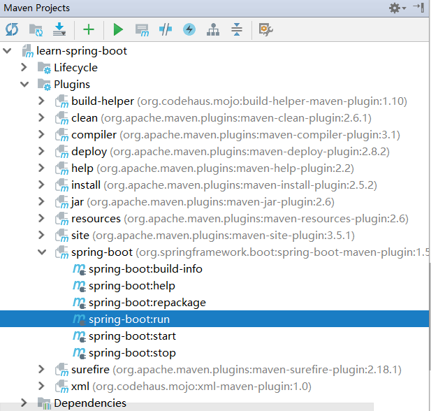
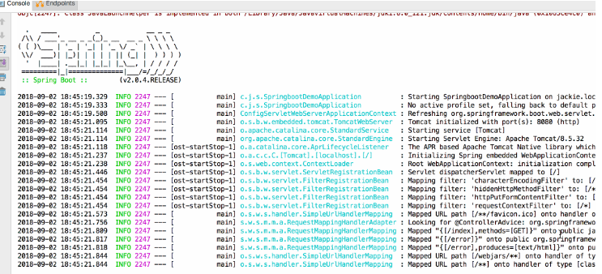
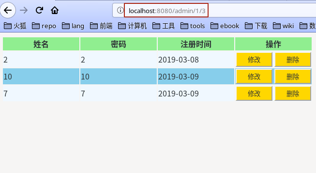
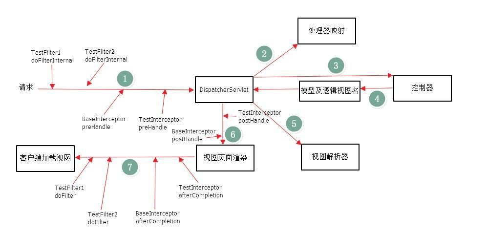
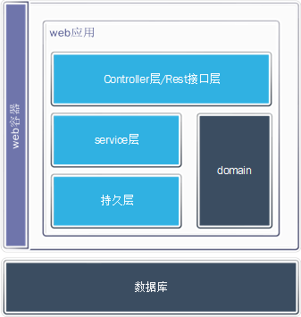

# Spring Boot 入门指南

<div class = 'data-section default-folding'>
<h2 class = 'section-title'>走进 SpringBoot</h2>
<div class = 'folding-area'>

**参见:**
 ✿ [@blog : 学习Spring Boot : (一) 入门](https://www.cnblogs.com/qnight/p/8997507.html)

Spring Boot `简化`了spring 全家桶的配置，它使用`习惯优于配置`（Convention Over Configuration 项目中存在大量的配置，此外还内置了一个习惯性的配置，让你无需手动进行配置）的理念让你的项目快速运行起来。使用Spring Boot很容易创建一个独立运行（运行jar,内嵌Servlet容器）、准生产级别的基于Spring框架的项目，使用Spring Boot你可以不用或者只需要很少的Spring配置。

### 核心
- `自动配置` 针对很多 Spring 应用程序常见的应用功能，Spring Boot 能自动提供相关配置。
- `起步依赖` 告诉 Spring Boot 需要什么功能，它就能引入需要的库。
- `命令行界面` 这是 Spring Boot 的可选特性，借此你只需写代码就能完成完整的应用程序，无需传统项目构建。
- `Actuator` 让你能够深入运行中的 Spring Boot 应用程序，一探究竟。

### pom.xml
1. Spring Boot 父级依赖 `spring-boot-starter-parent` 是一个特殊的 starter, 它用来提供相关的 Maven 默认依赖，使用它之后，常用的包依赖可以省去 version 标签。
```xml
<parent>
    <groupId>org.springframework.boot</groupId>
    <artifactId>spring-boot-starter-parent</artifactId>
    <version>1.5.9.RELEASE</version>
    <relativePath/> <!-- lookup parent from repository -->
</parent>
```

1. 起步依赖 `spring-boot-starter-xx`   
Spring Boot 提供了很多`开箱即用`的依赖模块，都是以 spring-boot-starter-xx 作为命名的。 起步依赖本质上是一个 Maven 项目对象模型（Project Object Model，POM），定义了对其他库的传递依赖，这些东西加在一起即支持某项功能。

1. `Spring Boot Maven` 插件
```xml
<build>
    <plugins>
        <plugin>
            <groupId>org.springframework.boot</groupId>
            <artifactId>spring-boot-maven-plugin</artifactId>
        </plugin>
    </plugins>
</build>
```
**作用**
  - 把项目打包成一个可执行的超级 JAR（uber-JAR）,包括把应用程序的所有依赖打入 JAR 文件内，并为 JAR 添加一个描述文件，其中的内容能让你用 java -jar 来运行应用程序。
  - 搜索 public static void main() 方法来标记为可运行类。


### 启动

```java
// SpringbootApplication.java

import org.mybatis.spring.annotation.MapperScan;
import org.springframework.boot.SpringApplication;
import org.springframework.boot.autoconfigure.SpringBootApplication;
import org.springframework.boot.web.servlet.ServletComponentScan;

@SpringBootApplication
@ServletComponentScan(basePackages = {
        "com.ljq.springboot.servlet",
        "com.ljq.springboot.filter"
})
@MapperScan(basePackages = {"com.ljq.springboot.mapper"})
public class SpringbootApplication {

    public static void main(String[] args) {
        SpringApplication.run(SpringbootApplication.class, args);
    }

}

/*---------------------------------------------------------------------------------
                                  Note
-----------------------------------------------------------------------------------
 @SpringBootApplication
    =  @ComponentScan + @SpringBootConfiguration + @EnableAutoConfiguration。

1) @SpringBootConfiguration 继承自 @Configuration，二者功能也一致，标注当前类是配置类，
   并会将当前类内声明的一个或多个以 @Bean 注解标记的方法的实例纳入到 srping 容器中，并且实例名就是方法名。

2) @EnableAutoConfiguration
   @EnableAutoConfiguration 注解的意思就是 Springboot 根据你添加的jar包来配置你项目的默认配置，
   比如根据 spring-boot-starter-web，来判断你的项目是否需要添加了 webmvc和tomcat，
   就会自动的帮你配置 web 项目中所需要的默认配置。

3) @ComponentScan，扫描当前包及其子包下被 @Component，@Controller，@Service，@Repository 注解标记的类
   并纳入到spring容器中进行管理。是以前的<context:component-scan>

-----------------------------------------------------------------------------------
 */
```

**启动方式**
- 命令行启动：`mvn spring-boot:run`
- IDEA 视图启动  



**2. 属性配置文件**  

**参见:**
 ✿ [@Blog : springboot中配置文件application.properties的理解](https://www.cnblogs.com/shamo89/p/8178109.html)

属性配置文件分为 2 种，分别是`.properties`和`.yaml`文件

**.properties 配置**   
当我们的项目中有多套配置文件, 比如开发的配置文件 测试的配置文件等，可以指定激活哪一套使用。

<!-- tabs:start -->

###### **application.properties**

```properties
# 多环境配置文件，指定激活哪套环境
spring.profiles.active=dev

spring.http.encoding.charset=UTF-8
spring.http.encoding.enabled=true
spring.http.encoding.force=true

```

###### **application.dev.properties**
```properties
spring.datasource.username=ljq
spring.datasource.password=199612

#6.0以上的驱动连接字符串为 com.mysql.cj.jdbc.Driver  比之前多了一个cj
spring.datasource.driver-class-name=com.mysql.cj.jdbc.Driver

#调整为北京时间 &serverTimezone=GMT%2B8
spring.datasource.url=jdbc:mysql://localhost:3306/springboot?useUnicode=true&characterEncoding=utf8&serverTimezone=GMT%2B8

mybatis.type-aliases-package=com.ljq.springboot.model
#mybatis.package.path=com.ljq.springboot.model
#mybatis.config-location=classpath:mybatis/mybatis-config.xml
mybatis.mapper-locaitons=classpath:mybatis/mappings/*.xml

```

<!-- tabs:end -->

</div>
</div>


<div class = 'data-section default-folding'>
<h2 class = 'section-title'>视图渲染配置</h2>
<div class = 'folding-area'>

### thymeleaf 视图渲染
 ✿ [thymeleaf 官方使用手册](https://www.thymeleaf.org/doc/tutorials/3.0/usingthymeleaf.html#what-kind-of-templates-can-thymeleaf-process)

**1. `pom.xml`添加对`thymeleaf`的依赖**
```xml
<dependency>
    <groupId>org.springframework.boot</groupId>
    <artifactId>spring-boot-starter-thymeleaf</artifactId>
</dependency>

```

**2. `application.properties` 配置**
```properties
spring.thymeleaf.prefix=/pages/
spring.thymeleaf.suffix=.html
spring.thymeleaf.mode=HTML5
spring.thymeleaf.encoding=UTF-8
spring.thymeleaf.content-type=text/html
spring.thymeleaf.cache=false
```

### jsp 视图渲染
**1.`pom.xml`添加对`jsp`的依赖**
```properties

spring.mvc.view.prefix=/jspPages/
spring.mvc.view.suffix=.jsp

```

**2. `application.properties` 配置**
```xml
<!-- [Start] jsp -->
        <!--引入Spring Boot内嵌的Tomcat对JSP的解析包-->
        <dependency>
            <groupId>org.apache.tomcat.embed</groupId>
            <artifactId>tomcat-embed-jasper</artifactId>
        </dependency>


        <!-- servlet依赖的jar包start -->
        <dependency>
            <groupId>javax.servlet</groupId>
            <artifactId>javax.servlet-api</artifactId>
        </dependency>

        <!-- servlet依赖的jar包start -->
        <!-- jsp依赖jar包start -->
        <dependency>
            <groupId>javax.servlet.jsp</groupId>
            <artifactId>javax.servlet.jsp-api</artifactId>
            <version>2.3.1</version>
        </dependency>

        <!-- jsp依赖jar包end -->
        <!--jstl标签依赖的jar包start -->
        <dependency>
            <groupId>javax.servlet</groupId>
            <artifactId>jstl</artifactId>
        </dependency>
<!-- [END] jsp -->
```

<div class="myWarning">

`thymeleaf` 是 SpringBoot 推荐使用的视图渲染引擎, 不建议使用`jsp`了。
</div>

</div>
</div>


<div class = 'data-section default-folding'>
<h2 class = 'section-title'>Lombok 的使用</h2>
<div class = 'folding-area'>

**参见:**
 ✿ [Lombok 官方手册](https://projectlombok.org/features/all)
 ✿ [@blog : Lombok 介绍](https://www.cnblogs.com/heyonggang/p/8638374.html)

Lombok 是一种 Java™ 实用工具，可用来帮助开发人员消除 Java 的冗长，尤其是对于简单的 Java 对象（POJO）。   
Lombok能通过注解的方式，在编译时自动为属性生成构造器、getter/setter、equals、hashcode、toString方法。出现的神奇就是在源码中没有getter和setter方法，但是在编译生成的字节码文件中有getter和setter方法。

### 在`pom.xml` 文件添加依赖
```xml
<dependency>
    <groupId>org.projectlombok</groupId>
    <artifactId>lombok</artifactId>
    <version>1.16.20</version>
    <scope>provided</scope>
</dependency>

```

<div class="myWarning">

IDE 需要下载对应插件来支持语法解析，以 idea 为例，需安装 lombok plugin 插件
</div>

### 注解说明

- `@Date` = `@ToString` + `@Getter` + `@Setter` + `@EqualsAndHashCode` + `@NoArgConstructor`

<div class="myWarning">

同时使用 @Date 和 @AllArgsConstructor后，@NoArgconstructor 失效， 需重新注解上 @NoArgconstructor
</div>

- `@RequiredArgsConstructor` 会生成一个包含常量 `final`，和标识了`@NotNull`的变量 的构造方法。

- `@NonNull`

<!-- tabs:start -->

###### **使用前**
```java
public NonNullExample(Person person) {
    if (person == null) {
      throw new NullPointerException("person");
    }
    this.name = person.getName();
 }
```

###### **使用后**
```java
public NonNullExample(@NonNull Person person) {
    this.name = person.getName();
 }
```
<!-- tabs:end -->

- `@Cleanup`  自动化关闭流，相当于 jdk1.7 种的 try with resource

<!-- tabs:start -->

###### **使用前**
```java
import java.io.*;

public class CleanupExample {
  public static void main(String[] args) throws IOException {
    InputStream in = new FileInputStream(args[0]);
    try {
      OutputStream out = new FileOutputStream(args[1]);
      try {
        byte[] b = new byte[10000];
        while (true) {
          int r = in.read(b);
          if (r == -1) break;
          out.write(b, 0, r);
        }
      } finally {
        if (out != null) {
          out.close();
        }
      }
    } finally {
      if (in != null) {
        in.close();
      }
    }
  }
}
```

###### **使用后**
```java
import lombok.Cleanup;
import java.io.*;

public class CleanupExample {
  public static void main(String[] args) throws IOException {
    @Cleanup InputStream in = new FileInputStream(args[0]);
    @Cleanup OutputStream out = new FileOutputStream(args[1]);
    byte[] b = new byte[10000];
    while (true) {
      int r = in.read(b);
      if (r == -1) break;
      out.write(b, 0, r);
    }
  }
}
```
<!-- tabs:end -->

- `@EqualsAndHashCode` 默认情况下，会使用所有非静态（non-static）和非瞬态（non-transient）属性来生成equals和hasCode，也能通过exclude注解来排除一些属性。

```java
import lombok.EqualsAndHashCode;

@EqualsAndHashCode(exclude={"id", "shape"})
public class EqualsAndHashCodeExample {
  private transient int transientVar = 10;
  private String name;
  private double score;
  private Shape shape = new Square(5, 10);
  private String[] tags;
  private int id;

  public String getName() {
    return this.name;
  }

  @EqualsAndHashCode(callSuper=true)
  public static class Square extends Shape {
    private final int width, height;

    public Square(int width, int height) {
      this.width = width;
      this.height = height;
    }
  }
}
```

- `@ToString`

<!-- tabs:start -->

###### **使用前**
```java
import java.util.Arrays;

public class ToStringExample {
  private static final int STATIC_VAR = 10;
  private String name;
  private Shape shape = new Square(5, 10);
  private String[] tags;
  private int id;

  public String getName() {
    return this.getName();
  }

  public static class Square extends Shape {
    private final int width, height;

    public Square(int width, int height) {
      this.width = width;
      this.height = height;
    }

    @Override public String toString() {
      return "Square(super=" + super.toString() + ", width=" + this.width + ", height=" + this.height + ")";
    }
  }

  @Override public String toString() {
    return "ToStringExample(" + this.getName() + ", " + this.shape + ", " + Arrays.deepToString(this.tags) + ")";
  }
}
```

###### **使用后**
```java
import lombok.ToString;

@ToString(exclude="id")
public class ToStringExample {
  private static final int STATIC_VAR = 10;
  private String name;
  private Shape shape = new Square(5, 10);
  private String[] tags;
  private int id;
  
  public String getName() {
    return this.getName();
  }
  
  @ToString(callSuper=true, includeFieldNames=true)
  public static class Square extends Shape {
    private final int width, height;
    
    public Square(int width, int height) {
      this.width = width;
      this.height = height;
    }
  }
}
```

<!-- tabs:end -->


- `@SneakyThrows(Exception.class)` 抛出异常时，不用显示的在方法名后面写 throw

- `@Slf4j`
```java
//类上面注解了，直接调用 log 即可：
log.info(xxxx);
```
- `@Log` 使用的是 java.util.logging.Logger ，直接使用变量 log。

- `@Builder` buider 模式构造对象


### 总结

  Lombok 虽然有很多优点，但 Lombok 更类似于一种 IDE 插件，项目也需要依赖相应的 jar 包。Lombok 依赖 jar 包是因为编译时要用它的注解，为什么说它又类似插件？因为在使用时，`eclipse 或 IntelliJ IDEA 都需要安装相应的插件`，在编译器编译时通过操作AST（抽象语法树）改变字节码生成，变向的就是说它在改变 java 语法。它不像 spring 的依赖注入或者 mybatis 的 ORM 一样是运行时的特性，而是`编译时`的特性。这里我个人最感觉不爽的地方就是对插件的依赖！因为 Lombok 只是省去了一些人工生成代码的麻烦，但 IDE 都有快捷键来协助生成 getter/setter 等方法，也非常方便。
  虽然非常不建议在属性的 getter/setter 写一些业务代码，但在多年项目的实战中，有时通过给 getter/setter 加一点点业务代码，能极大的简化某些业务场景的代码。所谓取舍，也许就是这时的舍弃一定的规范，取得极大的方便。
  Lombok 有它的得天独厚的优点，也有它避之不及的缺点，熟知其优缺点，在实战中灵活运用才是王道。

</div>
</div>


<div class = 'data-section default-folding'>
<h2 class = 'section-title'>日志管理</h2>
<div class = 'folding-area'>

**参见:**
 ✿ [Log | Spring Boot 官方文档](https://docs.spring.io/spring-boot/docs/current/reference/htmlsingle/#boot-features-logging)
 ✿ [SLF4J 官网](http://www.slf4j.org/)
 ✿ [@blog : springboot日志输出到文件](https://blog.csdn.net/lchq1995/article/details/80080642)


日志分为日志`抽象层`与日志`实现层`。类似于 JDBC 与数据库的形式，不管连接的是什么数据库，只需将 JDBC 中对应的数据库信息修改即可。这里的日志抽象层是类似 JDBC 的效果，只需修改相应的日志实现层的信息即可。

- 常用日志抽象层分类：`JCL` `SLF4j` `jboss-logging`
- 常用日志实现层分类：`Log4j` `JUL` `Log4j2` `Logback`

### 日志框架的配置
SpringBoot 底层采用的是 Spring 框架，Spring 默认采用`JCL`。但 SpringBoot 选用`SLF4j`与`logBcak`来实现日志的输出。

如果要使用 LogBack，原则上是需要添加 dependency 依赖的
```xml
<groupId>org.springframework.boot</groupId>
<artifactId>spring-boot-starter-logging</artifactId>
```
但是因为新建的 Spring Boot 项目一般都会引用`spring-boot-starter`或者`spring-boot-starter-web`，而这两个起步依赖中都已经包含了对于`spring-boot-starter-logging`的依赖，所以无需额外添加依赖。

默认日志打印如下：


<div class="myTip">

使用过 Spring Boot 就会发现每次项目启动时，控制台都会有一个大大的 Spring 的字符画。
Spring Boot也提供了自定义的方法, 在 `resource/banner.txt` 写入想显示的字符画, 就可以自动加载并显示出来。  
**生成 bar 的工具：** ✿ [Springboot bar 生成器](https://devops.datenkollektiv.de/banner.txt/index.html)
 ✿ [ASCLL Generator](http://www.network-science.de/ascii/)
</div>

- **日志的级别:** `trace < debug < info < warn < error`  
springboot 默认是日志级别为`info`, 即输出`info  warn  error`

- **日志级别的设置**  
在`application.properties` 文件中使用 `logging.level.com=trace`设定日志级别为 trace

<div class="myWarning">

Logback 没有 `FATAL` 级别，对应着 `ERROR`
</div>

- **彩色日志**  
在`application.properties`文件下添加

```properties
spring.output.ansi.enabled=detect

```

<div class="myWarning">

**[FIXME] 注意点(道听途说)：**   
`NEVER：`禁用 ANSI-colored 输出（默认项）  
`DETECT：`会检查终端是否支持 ANSI ，是的话就采用彩色输出（推荐项）  
`ALWAYS：`总是使用 ANSI-colored 格式输出，若终端不支持的时候，会有很多干扰信息，不推荐使用  
</div>

<div class="myTip">

IDEA提供了个曲线救国的插件 [Grep Console](https://plugins.jetbrains.com/plugin/7125-grep-console), 安装即可, 在 IDEA 的控制台渲染彩色日志, 在Tomcat不显示彩色日志。
</div>

- **输入到文件**  

```properties
# 日志文件  file.name 和 file.path 只有一个起作用
logging.file.name=./log/log.txt
# 日志容量
logging.file.max-size=5MB
```

### 日志的使用


<!-- tabs:start -->

###### **自定义 log**
```java
// CustomLog.java

import org.slf4j.Logger;
import org.slf4j.LoggerFactory;

public class CustomLogger {
    static private Logger log = LoggerFactory.getLogger("");

    static public void startMethodLog(){
        // Thread.currentThread().getStackTrace()[1]是你当前方法执行堆栈
        StackTraceElement[] stackTrace = Thread.currentThread().getStackTrace();
        StackTraceElement currentClass = stackTrace[2];
        StackTraceElement invokedClass = stackTrace[3];

        String className =currentClass.getClassName();
        String methodName = currentClass.getMethodName();
        int    methodLine = currentClass.getLineNumber()-1;
        String fileName = currentClass.getFileName();
        String invokedMethodName = invokedClass.getMethodName();
        String invokedClassName = invokedClass.getClassName();
        int    invokedmethodLine = invokedClass.getLineNumber();
        String invokedFileName = invokedClass.getFileName();
        log.info(
                 ">>>>>> CLASS: " + className + "\n"
                +"       METHOD: " + methodName + "    LINE: " + methodLine + "\n"
                +"       FILE: " + fileName +"\n"
                +"INVOKED BY: \n"
                +"       CLASS: " + invokedClassName + "\n"
                +"       METHOD: " + invokedMethodName + "    LINE: " + invokedmethodLine + "\n"
                +"       FILE: " + invokedFileName +"\n"
        );

    }

    static public void endMethodLog(){
        StackTraceElement currentTrace = Thread.currentThread().getStackTrace()[2];
        String className = currentTrace.getClassName();
        String methodName = currentTrace.getMethodName();
        log.info(
                 "\n<<<<<< CLASS: " + className + "\n"
                +"         METHOD: " + methodName + "\n"
        );
    }

    static public void methodLogInCatch(){
        StackTraceElement[] stackTrace = Thread.currentThread().getStackTrace();
        StackTraceElement currentClass = stackTrace[2];
        StackTraceElement invokedClass = stackTrace[3];

        String className =currentClass.getClassName();
        String methodName = currentClass.getMethodName();
        String fileName = currentClass.getFileName();
        log.info(
                "\n<<<<<< [CATCH] "
               +"       CLASS: " + className + "\n"
               +"       METHOD: " + methodName + "\n"
               +"       FILE: " + fileName +"\n"
        );
    }


}

```

###### **log 测试**
```java
// AdminServiceTest.java


    @Resource(name="adminService")
    public AdminService adminService;

    @Test
    @Rollback(false)
    public void selectAll(){
        // ------------------------------------------------
        CustomLogger.startMethodLog();   // 自定义的 log 类
        // ------------------------------------------------
        try {
            List<Admin> admins = adminService.selectAll();
        }catch (Exception e){
            CustomLogger.methodLogInCatch();
        }
        CustomLogger.endMethodLog();
    }

```
<!-- tabs:end -->


</div>
</div>

<div class = 'data-section default-folding'>
<h2 class = 'section-title'> 集成 MyBatis (全注解版)</h2>
<div class = 'folding-area'>

**参见：**
✿ [Mybatis 中文手册](http://www.dba.cn/book/mybatis/)

Mybatis 初期使用比较麻烦，需要各种配置文件、实体类、dao层映射关联、还有一大推其它配置。当然 Mybatis 也发现了这种弊端，初期开发了`generator`可以根据表结构自动生成实体类、配置文件和 dao 层代码，可以减轻一部分开发量；后期也进行了大量的优化可以使用注解了，自动管理 dao 层和配置文件等，发展到最顶端就是今天要讲的这种模式，`mybatis-spring-boot-starter`就是 springboot+mybatis 完全注解不用任何配置文件，就可以简单配置轻松上手。

mybatis-spring-boot-starter主要有两种解决方案，一种是使用注解解决一切问题，一种是简化后的老传统。

**1. `pom.xml` 文件配置**
```xml
   <!-- mybatis-spring-boot-starter就是springboot+mybatis完全注解不用任何配置文件 -->
   <dependency>
       <groupId>org.mybatis.spring.boot</groupId>
       <artifactId>mybatis-spring-boot-starter</artifactId>
       <version>1.3.1</version>
   </dependency>

   <!-- dao 层 测试 -->
   <dependency>
       <groupId>org.mybatis.spring.boot</groupId>
       <artifactId>mybatis-spring-boot-starter-test</artifactId>
       <version>1.3.1</version>
   </dependency>

```
**2. 入口文件中添加`@MapperScan`注解**
```java
//-------------------------------------------------------
@MapperScan(basePackages = {"com.ljq.springboot.mapper"})
//-------------------------------------------------------
@SpringBootApplication  // [1]
public class SpringbootApplication {

    public static void main(String[] args) {
        SpringApplication.run(SpringbootApplication.class, args);
    }

}

```

**3. dao 层只需要接口，不需要实现类**
```java

import java.util.List;
import java.util.Map;

public interface AdminMapper {

    @Insert("insert into admin(id,userName,password,registDate) values(#{id}, #{userName}, #{password}, #{registDate})")
    Boolean insert(Admin admin);   // 若返回 int 型， 执行成功为 1

    @Delete("delete from admin where id = #{id}")
    Boolean delete(String id);   // 若返回 int 型， 执行成功为 1

    @Select("select * from admin")
    List<Admin> selectAll();

    @Update("update admin set userName=#{userName},password=#{password}, registDate=#{registDate} where id =#{id}")
    Boolean update(Admin admin);


    //------------------------- 动态SQL --------------------------------------------
    @SelectProvider(type=AdminSql.class, method="selectAdminLikeSql")
    List<Admin> selectAdminLike(@Param("admin") Admin admin);

    // NOTICE : 注意是内部类，或者单独写一个 java 文件，修饰符为 public
    class AdminSql {

        public String selectAdminLikeSql(Map<String, Admin> adminMap) {
            Admin admin = adminMap.get("admin");
            return new SQL() {{
                SELECT("A.*");
                FROM("admin A");

                if ( StringUtils.isNotBlank(admin.getId()) ) {  // null、 空格、 制表符等
                    WHERE("A.id like "+ admin.getId());
                }
                if ( StringUtils.isNotBlank(admin.getUserName()) ) {
                    WHERE("A.userName like "+ admin.getUserName());
                }
                if ( StringUtils.isNotBlank(admin.getPassword()) ) {
                    WHERE("A.password like "+ admin.getPassword());
                }

                if ( admin.getRegistDate() != null) {
                    // FIXME
                    //  WHERE("A.registDate = " + admin.getRegistDate().toString());
                }
                //ORDER_BY("A.userName");
            }}.toString();
    }

    }

}

```

**4. 测试用例**
```java
@RunWith(SpringRunner.class)   //[1]
@MybatisTest  //@DataJpaTest   // [2]
@AutoConfigureTestDatabase(replace = AutoConfigureTestDatabase.Replace.NONE)
@Rollback(false)   // 不回滚

public class AdminMapperTest {

    @Resource
    public AdminMapper adminMapper;

    @Test
    //@Rollback(false)
    public void insert(){
        Boolean ret = false;
        for(int i=1; i<20; i++) {
            ret = adminMapper.insert(new Admin(Uuid.getUUID(), i+"", i+"", Date.valueOf("2019-03-09")));
        }
    }


/*------------------------------------------------------------------------------
                                  Note
--------------------------------------------------------------------------------
[2] @SpringBootTest 是把整个 spring 容器启动起来，然后把测试环境给你准备好，这样显得有点有点
笨重，单元测试不一定需要启动整个应用，层与层之间也可以并且应该隔离测试。如果上层测试需要用到下层的
依赖，就使用 mock 的方式构造一个依赖。比如
    [FIXME] 测试 DAO 层可以使用 @DataJpaTest 注解；
    [FIXME] 测试controller层可以使用 @WebMvcTest ；
    [FIXME] 测试 Service 层可以使用 @TestConfiguration
注意: Mybatis 提供专门的注解 @MybatisTest 来测试 Dao 层。


```


</div>
</div>


<div class = 'data-section default-folding'>
<h2 class = 'section-title'>事务管理</h2>
<div class = 'folding-area'>

**1.在入口类文件中使用注解`@EnableTransactionManagement`开启事物**
```java
@SpringBootApplication  // [1]
//-----------------------------------
@EnableTransactionManagement   // [2]
// ----------------------------------
public class SpringbootApplication {
    SpringApplication.run(SpringbootApplication.class, args);

}
```

**2.在访问数据库的 service 方法上添加注解`@Transactional`**

<!-- tabs:start -->

###### **事务回滚**
```java
// AdminServiceImpl.java


    @Override
    @Transactional  // 如果该方法抛出异常事务就会回滚
    public Boolean insert(Admin admin) {
        Boolean ret = adminMapper.insert(admin);
        int a = 1/0; // 模拟异常
        return ret;
    }


```

###### **事务测试**
```java
// AdminServiceTest.java
    
    @Test
    @Rollback(false)
    public void insert(){
        adminService.insert(
            new Admin( Uuid.getUUID(), "10", "10", Date.valueOf("2019-03-09") )
        );
    }


// 查看数据库数据插入情况

```
<!-- tabs:end -->

</div>
</div>


<div class = 'data-section default-folding'>
<h2 class = 'section-title'>Mabatis PageHelper 分页器</h2>
<div class = 'folding-area'>

**参见:**
 ✿ [PageHelp 官方文档](https://github.com/pagehelper/Mybatis-PageHelper/blob/master/README_zh.md)

**1. `pom.xml` 文件添加 pagehelper 依赖**

```xml

        <!--pagehelper-->
        <dependency>
            <groupId>com.github.pagehelper</groupId>
            <artifactId>pagehelper-spring-boot-starter</artifactId>
            <version>${pagehelper.starter.version}</version>
            <exclusions>
                <exclusion>
                    <groupId>org.mybatis.spring.boot</groupId>
                    <artifactId>mybatis-spring-boot-starter</artifactId>
                </exclusion>
            </exclusions>
        </dependency>

```

**2. `application.properties` 添加**
```properties
#pagehelper分页插件配置
pagehelper.helperDialect=mysql
```

**3. control 层添加分页代码**
```java
// adminControl.java

    @RequestMapping(
            value= {"/{currentPage:[1-9][0-9]*}/{pageSize:[1-9][0-9]*}",
                    "/index.html/{currentPage}/{pageSize}"},
            method = RequestMethod.GET)
    public String show(Model model, @PathVariable("currentPage") int pageNum, @PathVariable("pageSize") int pageSize){
        //-----------------------------------------------
        // 分页插件
        PageHelper.startPage(pageNum, pageSize);
        //----------------------------------------------
        List<Admin> admin = adminServiceImpl.selectAll();

        model.addAttribute("info", "springboot使用jsp");
        model.addAttribute("admin", admin);
        return baseLocation + "index";
    }

```

**4. 访问方式**
> localhost:8080/admin?pageNum=1&pageSize=6

**效果**



</div>
</div>


<div class = 'data-section default-folding'>
<h2 class = 'section-title'>404 500等处理</h2>
<div class = 'folding-area'>

**参见:**
 ✿ [Errorcontroller 与 @ControllerAdvice 区别和用法](https://blog.csdn.net/jwf111/article/details/88571067)
 ✿ [自定义异常处理界面](https://www.imooc.com/article/16985)

**实现 ErrorController 接口即可**
```java

@Controller
@RequestMapping(value="/error")
class MainErrorController implements ErrorController {

    private static final String ERROR_PATH = "/error";
    
    /**
     * 页面错误异常处理
     */
    @RequestMapping(produces="text/html")
    public String errorPageHandler(HttpServletResponse response){
        int status = response.getStatus();
        switch (status){
            case 403:
                return ERROR_PATH + "/403";
            case 400:
                return ERROR_PATH + "/400";
            case 404:
                return ERROR_PATH + "/404";
            case 500:
                return ERROR_PATH + "/500";
            default:
                return ERROR_PATH + "/404";
        }
    }


    @Override
    public String getErrorPath() {
        return ERROR_PATH;
    }
}

```

<div class="myWarning">

SpringBoot 的默认异常处理映射为`/error`。`BasicErrorController`已经默认实现了`text/html`的处理。换句话说没有以上自定义类, 也能访问到`error`文件夹下的 404 等页面。以下是 SpringBoot 中实现`BasicErrorController`类。
</div>


```java
//BasicErrorController.java

@Controller
@RequestMapping({"${server.error.path:${error.path:/error}}"})
public class BasicErrorController extends AbstractErrorController {
    private final ErrorProperties errorProperties;

    public BasicErrorController(ErrorAttributes errorAttributes, ErrorProperties errorProperties) {
        this(errorAttributes, errorProperties, Collections.emptyList());
    }

    public BasicErrorController(ErrorAttributes errorAttributes, ErrorProperties errorProperties, List<ErrorViewResolver> errorViewResolvers) {
        super(errorAttributes, errorViewResolvers);
        Assert.notNull(errorProperties, "ErrorProperties must not be null");
        this.errorProperties = errorProperties;
    }

    public String getErrorPath() {
        return this.errorProperties.getPath();
    }

    @RequestMapping(
        produces = {"text/html"}
    )
    public ModelAndView errorHtml(HttpServletRequest request, HttpServletResponse response) {
        HttpStatus status = this.getStatus(request);
        Map<String, Object> model = Collections.unmodifiableMap(this.getErrorAttributes(request, this.isIncludeStackTrace(request, MediaType.TEXT_HTML)));
        response.setStatus(status.value());
        ModelAndView modelAndView = this.resolveErrorView(request, response, status, model);
        return modelAndView == null ? new ModelAndView("error", model) : modelAndView;
    }

    @RequestMapping
    @ResponseBody
    public ResponseEntity<Map<String, Object>> error(HttpServletRequest request) {
        Map<String, Object> body = this.getErrorAttributes(request, this.isIncludeStackTrace(request, MediaType.ALL));
        HttpStatus status = this.getStatus(request);
        return new ResponseEntity(body, status);
    }

    protected boolean isIncludeStackTrace(HttpServletRequest request, MediaType produces) {
        IncludeStacktrace include = this.getErrorProperties().getIncludeStacktrace();
        if (include == IncludeStacktrace.ALWAYS) {
            return true;
        } else {
            return include == IncludeStacktrace.ON_TRACE_PARAM ? this.getTraceParameter(request) : false;
        }
    }

    protected ErrorProperties getErrorProperties() {
        return this.errorProperties;
    }
}
```


</div>
</div>

<div class = 'data-section default-folding'>
<h2 class = 'section-title'>过滤器和拦截器</h2>
<div class = 'folding-area'>

<br>
<div class='myNote'>

**过滤器（Filter）与拦截器（Interceptor）主要区别包括以下几个方面：**
  - Filter 是依赖于 Servlet 容器，属于 Servlet 规范的一部分，而拦截器则是独立存在的，可以在任何情况下使用。
  - Filter 的执行由 Servlet 容器回调完成，而 Interceptor 通常通过动态代理的方式来执行。
  - Filter 的生命周期由 Servlet 容器管理，而 Interceptor 则可以通过 IoC 容器来管理，因此可以通过注入等方式来获取其他 Bean 的实例，使用更方便。


</div>

### 过滤器
#### 方式一
**1. `@webFilter`注解类**
```java

@WebFilter(filterName = "filterDemo", urlPatterns = "/*")
public class FilterDemo implements Filter {

    @Override
    public void init(FilterConfig filterConfig) throws ServletException {

    }

    @Override
    public void doFilter(ServletRequest request, ServletResponse response, FilterChain chain) throws IOException, ServletException {
        System.out.println("--进入了过滤器");
        chain.doFilter(request, response);
    }

    @Override
    public void destroy() {

    }
}

```

**2.入口文件添加`@ServletComponentScan`注解**

```java
@ServletComponentScan(basePackages = {
        "com.ljq.springboot.servlet",
        //-----------------------------
        "com.ljq.springboot.filter"
        //-----------------------------
})

@ComponentScan(basePackages = {
        "com.ljq.springboot.mapper",
        "com.ljq.springboot.service",
        "com.ljq.springboot.control",
        "com.ljq.springboot.config"
})

@MapperScan(basePackages = {"com.ljq.springboot.mapper"})
@SpringBootApplication  // [1]

@EnableTransactionManagement   // [2]
public class SpringbootApplication {

    public static void main(String[] args) {
        SpringApplication.run(SpringbootApplication.class, args);
    }

}
```

<div class="myTip">

另一种配置，参考下一章`Servlet的使用 方式二`
</div>

### 拦截器
**1. 编写拦截方法，实现`HandleInterceptor`接口**
```java

public class LoginInterceptor implements HandlerInterceptor {
    //进入controller层之前拦截请求   // [1]
    @Override
    public boolean preHandle(HttpServletRequest request, HttpServletResponse response, Object handler) throws Exception {
        CustomLogger.startMethodLog();
        CustomLogger.log.info("\n>>>在请求处理之前进行调用（Controller方法调用之前）");
        String path = request.getServletPath();

        Object user = request.getSession().getAttribute("user");
        if(user == null || user == ""){
            request.setAttribute("error","当前处于未登录状态!");
            response.sendRedirect("/login.html");
            return false;
        }
           return true;
    }

    //访问controller之后 访问视图之前被调用   // [2]
    @Override
    public void postHandle(
            HttpServletRequest request, HttpServletResponse response,
            Object handler, ModelAndView modelAndView) throws Exception {
        CustomLogger.startMethodLog();
        CustomLogger.log.info("\n>>>请求处理之后进行调用，但是在视图被渲染之前（Controller方法调用之后）");

    }

    //访问视图之后被调用
    @Override
    public void afterCompletion(HttpServletRequest request, HttpServletResponse response, Object handler, Exception ex) throws Exception {
        CustomLogger.startMethodLog();
        CustomLogger.log.info("\n>>> 视图渲染后的操作 ---------");

    }

}

```

**2. 编写一个配置类，实现`WebMMvcConfigurer`接口**
```java

@Configuration   // 等价于一个spring的xml文件 比如applicationContext.xml
public class WebConfig implements WebMvcConfigurer {
    /**
     * 添加拦截器
     * @param registry
     */


    @Override
    public void addInterceptors(InterceptorRegistry registry) {

        // 拦截器要拦截的访问路径，
        String [] pathPatterns = {
                "/**"
        };
        // 拦截器不拦截的路径, NOTICE:是页面访问路径 URL, 不是文件所在路径
        String [] excluedPathPatterns = {
                "/*",
                "/static/**"
        };

        registry.addInterceptor(new LoginInterceptor())
                .addPathPatterns(pathPatterns)
                .excludePathPatterns(excluedPathPatterns);
        //如果项目中有多个拦截器,把上面代码在复制一行,修改参数即可

    }

}

```

<div class="myNote">

拦截器拦截的路径是访问地址路径，不是文件路径

测试：`localhost:8080`
</div>
<p>
<div class="myTip">

用例实现的是登录拦截，其他代码参看源码。
</div>

</div>
</div>


<div class = 'data-section default-folding'>
<h2 class = 'section-title'>Servlet的使用</h2>
<div class = 'folding-area'>

#### 方式一
**1.使用 Sevrlet3 的注解`@WebServlet` 注解类**
```java

@WebServlet(name = "servletDemo", urlPatterns = "/servletDemo")
public class ServletDemo extends HttpServlet {
    protected void doPost(HttpServletRequest request, HttpServletResponse respose) throws ServletException, IOException {
        respose.getWriter().println("Hello servlet !");
        respose.getWriter().flush();
        respose.getWriter().close();
    }

    protected void doGet(HttpServletRequest request, HttpServletResponse respose) throws ServletException, IOException {
        doPost(request,respose);
    }

}

```
**2. 在入口文件添加`@ServletComponentScan`注解**
```java

@ServletComponentScan(basePackages = {
        //------------------------------
        "com.ljq.springboot.servlet",
        //------------------------------
        "com.ljq.springboot.filter"
})

@ComponentScan(basePackages = {
        "com.ljq.springboot.mapper",
        "com.ljq.springboot.service",
        "com.ljq.springboot.control",
        "com.ljq.springboot.config"
})

@MapperScan(basePackages = {"com.ljq.springboot.mapper"})
@SpringBootApplication  // [1]

@EnableTransactionManagement   // [2]
public class SpringbootApplication {

    public static void main(String[] args) {
        SpringApplication.run(SpringbootApplication.class, args);
    }

}
```
#### 方式二
**1. 编写普通 Servlet**
```java
public class ServletDem2 extends HttpServlet {
    protected void doPost(HttpServletRequest request, HttpServletResponse respose) throws ServletException, IOException {
        respose.getWriter().println("Hello servlet2 !");
        respose.getWriter().flush();
        respose.getWriter().close();
    }

    protected void doGet(HttpServletRequest request, HttpServletResponse respose) throws ServletException, IOException {
        doPost(request,respose);
    }

}

```

**2. 编写配置类**
```java

@Configuration   
public class servletConfig {

    @Bean
    public ServletRegistrationBean heServletRegistrationBean(){
        ServletRegistrationBean registrationBean = new ServletRegistrationBean(new ServletDem2(),"/servletDemo2");
        return registrationBean;
    }
}

```


<div class="myTip">

`localhost:8080/servletDemo`  
`localhost:8080/1/servletDemo2`
</div>
<p>
<div class="myWarning">

1. 入口文件要能扫描到配置类  
` @ComponentScan(basePackages = { "com.ljq.springboot.config" }) `

2. 测试下，servlet 不能被拦截器拦截
</div>


</div>
</div>


<div class = 'data-section default-folding'>
<h2 class = 'section-title'>常见问题</h2>
<div class = 'folding-area'>
<h4 class = 'auto-sort'> debug 功能</h4>

```xml
<build>
        <plugins>
            <plugin>
                <groupId>org.springframework.boot</groupId>
                <artifactId>spring-boot-maven-plugin</artifactId>
                <configuration>
                    <fork>false</fork><!-- Important: debug 需要-->
                </configuration>
            </plugin>

        </plugins>
    </build>
```


<h4 class = 'auto-sort'> 数据库中日期少一天</h4>

**原因** : 默认的时间时区是GMT 即格林尼治所在的世界标准时间UTC 与中国所在的东八区差了八个小时的时差

**解决方案1** : (测试成功)  
排除Jackson的@JsonFormat注解，最终发现是SpringBoot升级的原因（SpringBoot从1.5升级到2.1），这是从2.0版本开始就存在这个问题，所以在2.0版本以上就要在数据库后面参数上带上时区，参数如下：`&serverTimezone=GMT%2B8`  

`aplication.properties` 文件 
```
spring.datasource.url=jdbc:mysql://localhost:3306/springboot?useUnicode=true&characterEncoding=utf8&serverTimezone=GMT%2B8
```
**解决方案2** :  

`aplication.properties` 文件中添加
```
spring.jackson.time-zone=GMT+8
```
**解决方案3** :  

实体类中对date类型进行注解
```java
@JsonFormat(pattern = "yyyy-MM-dd", timezone = "GMT+08")
private Date registDate;

```

<h4 class = 'auto-sort'> Mybatis Mapper sql 代理类</h4>
必须 public 或者写成内部类

```java
public interface AdminMapper {
    @SelectProvider(type=AdminSql.class, method="selectAdminLikeSql")
    List<Admin> selectAdminLike(@Param("admin") Admin admin);

    // NOTICE : 注意是内部类，或者单独写一个 java 文件，修饰符为 public
    class AdminSql {

        public String selectAdminLikeSql(Map<String, Admin> adminMap) {
            Admin admin = adminMap.get("admin");
            return new SQL() {{
                SELECT("A.*");
                FROM("admin A");
            // ...
            }}.toString();
        }
    }
}
```


</div>
</div>


<div class = 'data-section default-folding'>
<h2 class = 'section-title'>测试</h2>
<div class = 'folding-area'>

**参见:**
✿ [@Blog: 基于spring-boot的应用程序的单元测试方案](https://www.cnblogs.com/ywjy/p/9526185.html)

<div class="myImage">



<label class="imageTitle">图示：基于spring-boot 的 web应用程序框架图</label>
</div>

<div class="myTip">

数据封装类，称为`domain`  
Controller层/Rest接口层: 负责对外提供Rest服务，接收Rest请求，返回处理结果。  
service层: 业务逻辑层，根据Controller层的需要，实现具体的逻辑。  
持久层: 访问数据库，进行数据的读写。向上支撑service层的数据库访问需求。  
在Spring环境中，我们通常会把这三层注册到Spring容器，上图中使用`浅蓝色`背景就是为了表示这一点。
</div>

<p>
<div class="myNote">

集成测试和单元测试的区别:  
集成测试通常只需要测试最上面一层，因为上层会自动调用下层，所以会测试完整的流程链，流程链中每一个环节都是真实、具体的。  
单元测试是单独测试流程链中的某一环，这一个环所直接依赖的下游环节使用模拟的方式来提供支撑，这一技术称为`Mock`。
</div>
<p>

<h3 class='auto-sort-sub'>对 Controller 进行测试</h3>

#### MockMvc

<div class="myNote">

`MockMvcBuilder`是用来构造`MockMvc`的构造器，其主要有两个实现：`StandaloneMockMvcBuilder`和`DefaultMockMvcBuilder`，分别对应两种测试方式，即`独立安装`和`集成Web环境`测试（此种方式并不会集成真正的web环境，而是通过相应的`Mock API`进行模拟测试，无须启动服务器）。对于我们来说直接使用静态工厂`MockMvcBuilders`创建即可。
</div>

```java
//AdminControlTest.java

@RunWith(SpringRunner.class)
@SpringBootTest
@AutoConfigureMockMvc
public class AdminControlTest {
    @Resource
    private MockMvc mockMvc;

    @Resource
    private MockHttpSession session;

    // 模拟登录,只有先登录才能测试，否则测试的内容会被 LoginInterceptor 拦截器拦截
    @Before
    public void login() throws Exception{
        session = (MockHttpSession) mockMvc
                    .perform(
                        post("/_check")
                            .param("user", "ljq"))
                    .andReturn().getRequest().getSession();
    }

    @Test
    public void courseListTest() throws Exception{
        mockMvc.perform(                //执行请求
                 get("/admin/1/3", 1).session(session))
           .andExpect(model().attributeExists("admin")) //验证存储模型数据
           .andExpect(view().name("admin/index")) //验证viewName
           .andExpect(status().isOk())//验证状态码
           .andDo(print()); //输出MvcResult到控制台
    }

}

```

<div class="myNote">

整个过程：  
1.`mockMvc.perform`执行一个请求；  
2.`MockMvcRequestBuilders.get("/user/1")`构造一个请求  
3.`ResultActions.andExpect`添加执行完成后的断言  
4.`ResultActions.andDo`添加一个结果处理器，表示要对结果做点什么事情，比如此处使用`MockMvcResultHandlers.print()`输出整个响应结果信息。  
5.`ResultActions.andReturn`表示执行完成后返回相应的结果。  
</div>

#### RequestBuider / MockMvcRequestBuilders
从名字可以看出，`RequestBuilder`用来构建请求的，其提供了一个方法`buildRequest(ServletContext servletContext)`用于构建`MockHttpServletRequest`；其主要有两个子类`MockHttpServletRequestBuilder`和`MockMultipartHttpServletRequestBuilder`（如文件上传使用），即用来`Mock`客户端请求需要的所有数据。

<div class="myTip">

**MockMvcRequestBuilders主要API**

 `get`(String urlTemplate, Object... urlVariables)：根据uri模板和uri变量值得到一个GET请求方式的MockHttpServletRequestBuilder；如get(/user/{id}, 1L)；  

 `post`(String urlTemplate, Object... urlVariables)：同get类似，但是是POST方法；  

`put`(String urlTemplate, Object... urlVariables)：同get类似，但是是PUT方法；  

`delete`(String urlTemplate, Object... urlVariables) ：同get类似，但是是DELETE方法；  

`options`(String urlTemplate, Object... urlVariables)：同get类似，但是是OPTIONS方法；  

`request`(HttpMethod httpMethod, String urlTemplate, Object... urlVariables)： 提供自己的Http请求方法及uri模板和uri变量，如上API都是委托给这个API；  

`fileUpload`(String urlTemplate, Object... urlVariables)：提供文件上传方式的请求，得到MockMultipartHttpServletRequestBuilder；  

`asyncDispatch`(final MvcResult mvcResult)：创建一个从启动异步处理的请求的MvcResult进行异步分派的RequestBuilder；
</div>
<p>
<div class="myTip">

**MockHttpServletRequestBuilder API**  

`header`(String name, Object... values)/MockHttpServletRequestBuilder headers(HttpHeaders httpHeaders)：添加头信息；  

`contentType`(MediaType mediaType)：指定请求的contentType头信息；  

`accept`(MediaType... mediaTypes)/MockHttpServletRequestBuilder accept(String... mediaTypes)：指定请求的Accept头信息；  

`content`(byte[] content)/MockHttpServletRequestBuilder content(String content)：指定请求Body体内容；  

`cookie`(Cookie... cookies)：指定请求的Cookie；  

`locale`(Locale locale)：指定请求的Locale；  

`characterEncoding`(String encoding)：指定请求字符编码；  

`requestAttr`(String name, Object value) ：设置请求属性数据；  

`sessionAttr`(String name, Object value)/MockHttpServletRequestBuilder sessionAttrs(Map<string, object=""> sessionAttributes)：设置请求session属性数据；  

`flashAttr`(String name, Object value)/MockHttpServletRequestBuilder flashAttrs(Map<string, object=""> flashAttributes)：指定请求的flash信息，比如重定向后的属性信息；  

`session`(MockHttpSession session) ：指定请求的Session；  

`principal`(Principal principal) ：指定请求的Principal；  

`contextPath`(String contextPath) ：指定请求的上下文路径，必须以“/”开头，且不能以“/”结尾；  

`pathInfo`(String pathInfo) ：请求的路径信息，必须以“/”开头；  

`secure`(boolean secure)：请求是否使用安全通道；  

`with`(RequestPostProcessor postProcessor)：请求的后处理器，用于自定义一些请求处理的扩展点；  
</div>
<p>

<div class="myTip">

**MockMultipartHttpServletRequestBuilder**  
继承自`MockHttpServletRequestBuilder`，又提供了如下API  

`file`(String name, byte[] content)/MockMultipartHttpServletRequestBuilder file(MockMultipartFile file)：指定要上传的文件；
</div>

#### ResultActions

<div class="myNote">

调用`MockMvc.perform(RequestBuilder requestBuilder)`后将得到`ResultActions`，通过`ResultActions`完成如下三件事：

`ResultActions andExpect(ResultMatcher matcher)` ：添加验证断言来判断执行请求后的结果是否是预期的；

`ResultActions andDo(ResultHandler handler)` ：添加结果处理器，用于对验证成功后执行的动作，如输出下请求/结果信息用于调试；

`MvcResult andReturn()` ：返回验证成功后的MvcResult；用于自定义验证/下一步的异步处理；
</div>

#### ResultMatcher/MockMvcResultMatchers
`ResultMatcher`用来匹配执行完请求后的结果验证，其就一个`match(MvcResult result)`断言方法，如果匹配失败将抛出相应的异常；`spring mvc`测试框架提供了很多`***ResultMatchers`来满足测试需求。注意这些`***ResultMatchers`并不是`ResultMatcher`的子类，而是返回`ResultMatcher`实例的。`Spring mvc`测试框架为了测试方便提供了`MockMvcResultMatchers`静态工厂方法方便操作；


<div class="myTip">

**常用 API 如下：**

`HandlerResultMatchers handler()`：请求的Handler验证器，比如验证处理器类型/方法名；此处的Handler其实就是处理请求的控制器；

`RequestResultMatchers request()`：得到RequestResultMatchers验证器；

`ModelResultMatchers model()`：得到模型验证器；

`ViewResultMatchers view()`：得到视图验证器；

`FlashAttributeResultMatchers flash()`：得到Flash属性验证；

`StatusResultMatchers status()`：得到响应状态验证器；

`HeaderResultMatchers header()`：得到响应Header验证器；

`CookieResultMatchers cookie()`：得到响应Cookie验证器；

`ContentResultMatchers content()`：得到响应内容验证器；

`JsonPathResultMatchers jsonPath(String expression, Object ... args)/ResultMatcher jsonPath  (String expression, Matcher matcher)`：得到Json表达式验证器；

`XpathResultMatchers xpath(String expression, Object... args)/XpathResultMatchers xpath(String expression, Map<string, string=""> namespaces, Object... args)`：得到Xpath表达式验证器；

`ResultMatcher forwardedUrl(final String expectedUrl)`：验证处理完请求后转发的url（绝对匹配）；

`ResultMatcher forwardedUrlPattern(final String urlPattern)`：验证处理完请求后转发的url（Ant风格模式匹配，@since spring4）；
sul
`ResultMatcher redirectedUrl(final String expectedUrl)`：验证处理完请求后重定向的url（绝对匹配）；

`ResultMatcher redirectedUrlPattern(final String expectedUrl)`：验证处理完请求后重定向的url（Ant风格模式匹配，@since spring4）

</div>

#### 一些常用测试
**1.测试普通控制器**
```java
//执行请求  
mockMvc.perform(get("/user/{id}", 1)) 
        //验证存储模型数据  
        .andExpect(model().attributeExists("user"))
        //验证viewName  
        .andExpect(view().name("user/view")) 
        //验证视图渲染时forward到的jsp  
        .andExpect(forwardedUrl("/WEB-INF//index.html"))
        //验证状态码  
        .andExpect(status().isOk())
        //输出MvcResult到控制台
        .andDo(print());
```
**2.得到 MvcResult 自定义验证**
```java
//执行请求  
MvcResult result = mockMvc.perform(get("/user/{id}", 1))
        .andReturn(); //返回MvcResult  
//自定义断言   
Assert.assertNotNull(result.getModelAndView().getModel().get("user")); 
```

**3.验证请求参数绑定到模型数据及Flash属性**
```java
//执行传递参数的POST请求(也可以post("/user?name=zhang"))  
mockMvc.perform(post("/user").param("name", "zhang")) 
            //验证执行的控制器类型  
            .andExpect(handler().handlerType(UserController.class))
            //验证执行的控制器方法名  
            .andExpect(handler().methodName("create")) 
            //验证页面没有错误  
            .andExpect(model().hasNoErrors())
            //验证存在flash属性  
            .andExpect(flash().attributeExists("success"))
            //验证视图  
            .andExpect(view().name("redirect:/user"));

```

**4.文件上传**
```java
byte[] bytes = new byte[] {1, 2};  
//执行文件上传  
mockMvc.perform(fileUpload("/user/{id}/icon", 1L).file("icon", bytes)) 
        //验证属性相等性  
        .andExpect(model().attribute("icon", bytes)) 
        //验证视图  
        .andExpect(view().name("success")); 
```
**5.JSON请求/响应验证**
```java
String requestBody = "{\"id\":1, \"name\":\"zhang\"}";  
    mockMvc.perform(post("/user")  
            .contentType(MediaType.APPLICATION_JSON).content(requestBody)  
            //执行请求  
            .accept(MediaType.APPLICATION_JSON)) 
            //验证响应contentType  
            .andExpect(content().contentType(MediaType.APPLICATION_JSON))
            //使用Json path验证JSON 请参考http://goessner.net/articles/JsonPath/   
            .andExpect(jsonPath("$.id").value(1));
    String errorBody = "{id:1, name:zhang}";  
    MvcResult result = mockMvc.perform(post("/user")  
            .contentType(MediaType.APPLICATION_JSON).content(errorBody)  
            //执行请求  
            .accept(MediaType.APPLICATION_JSON)) 
            //400错误请求  
            .andExpect(status().isBadRequest()) 
            .andReturn();   
    //错误的请求内容体
    Assert.assertTrue(HttpMessageNotReadableException.class
        .isAssignableFrom(result.getResolvedException().getClass()));
```
**6.异步测试**
```java
//Callable  
MvcResult result = mockMvc.perform(get("/user/async1?id=1&name=zhang"))
        .andExpect(request().asyncStarted())  
        //默认会等10秒超时  
        .andExpect(request().asyncResult(CoreMatchers.instanceOf(User.class)))
        .andReturn();  
    
mockMvc.perform(asyncDispatch(result))  
        .andExpect(status().isOk())  
        .andExpect(content().contentType(MediaType.APPLICATION_JSON))  
        .andExpect(jsonPath("$.id").value(1));  

```

**7.全局配置**
```java
mockMvc = webAppContextSetup(wac)  
        //默认请求 如果其是Mergeable类型的，会自动合并的哦mockMvc.perform中的RequestBuilder  
        .defaultRequest(get("/user/1").requestAttr("default", true)) 
        //默认每次执行请求后都做的动作  
        .alwaysDo(print())
        //默认每次执行后进行验证的断言  
        .alwaysExpect(request().attribute("default", true))
        .build();  
  
mockMvc.perform(get("/user/1"))  
        .andExpect(model().attributeExists("user"));  
```

</div>

</div>
</div>

<div class = 'data-section default-folding'>
<h2 class = 'section-title'>附录</h2>
<div class = 'folding-area'>


<div class="myTip">

**[源码](https://github.com/ljq199612/main/tree/master/code/java/springboot)**
</div>

**进一步阅读：**  
[Spring Boot 2.x基础教程](http://blog.didispace.com/spring-boot-learning-2x/)

</div>
</div>
