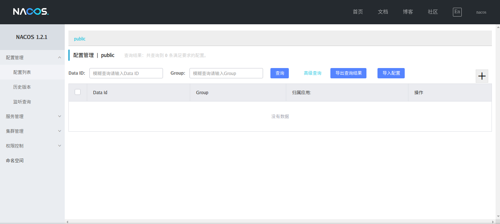

<div class = 'data-section default-folding'>
<h2 class = 'section-title'><label class = 'block-number'>1</label> 注册中心</h2>
<div class = 'folding-area'>

> 服务的注册中心有很多，如 zookeep, nacos, eureka ...

<h3 class = 'auto-sort-sub'>nacos</h3>

✿ [nacoa 官方主页](https://nacos.io/zh-cn/index.html)  
✿ [nacoa 下载 @gitee](https://gitee.com/ljq199612/nacos) 克隆自官方下载仓库，提高下载速度  

官网文档里有详细的安装使用方式，这里就不再赘述。

<h4 class = 'auto-sort-sub1'>nacos-service</h4>

启动/关闭服务
```bash
# 进入 nacos bin 目录，执行
$ > ./startup.sh -m standalone
$ > ./shutdown.sh

# 推荐在 .bashrc 文件中配置别名
alias  nacos-service.start='cd /home/xxx/nacos/ && sh ./bin/startup.sh  -m standalone && cd'
alias  nacos-service.stop='sh /home/xxx/nacos/bin/shutdown.sh'
```

<div class="myWarning">

**问: 创建服务启动的别名不是有更简单的方式吗，为什么要向上面那样折腾？**  
**答：**系统会生成 derby.log 文件和 logs/ work/ 目录，上面这样折腾，这几个文件会在 nacos 目录下创建
</div>

浏览器输入： `http://localhost:8848/nacos/`  
默认用户名:`nacos`  密码：`nacos`

<div class="myImage">


<label class="imageTitle"></label>
</div>


<h3 class = 'auto-sort-sub'>nacos-client</h3>

✿ nacos-client 基于 springclound 的配置可以参考 [官方文档](https://nacos.io/zh-cn/docs/quick-start-spring-cloud.html)  

`nacos`是按照 SpringCloud 规范开发的，eureka 也是按照标准开发，它们都会使用到一个非常核心的接口  `DiscoveryClient`， nacos 对它进行了实现，主要作用是去`nacos-server`端拉取服务。其实就是一个 socket


<div class="myTip">

这里，我以 用户服务(UserService) 和 订单服务(OrderService) 为例进行搭建，其中 用户服务是服务的提供者，订单服务是服务的消费者，`源码`请参考附录
</div>

**快速演示**  

```xml

```


</div>
</div>
