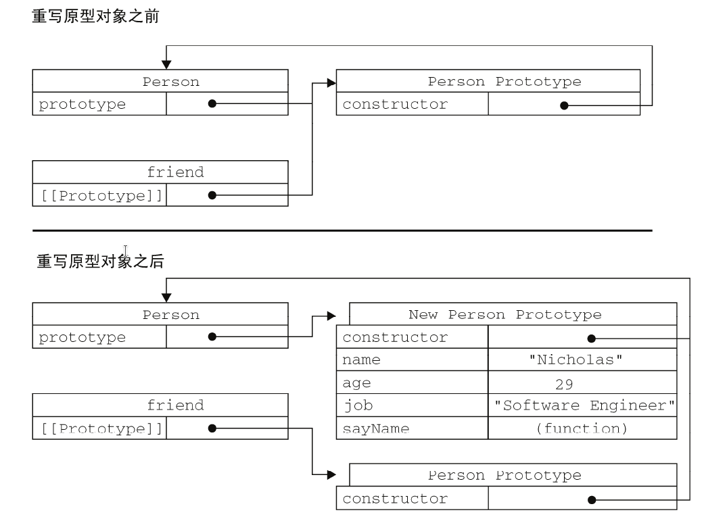
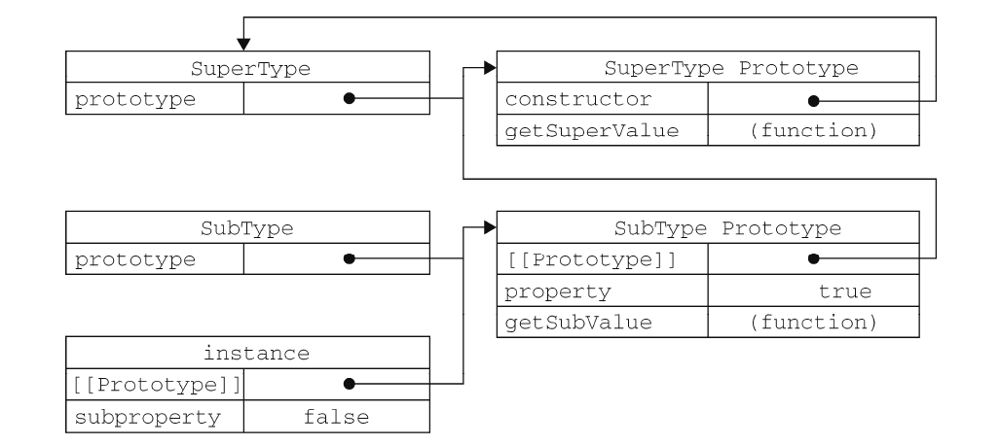
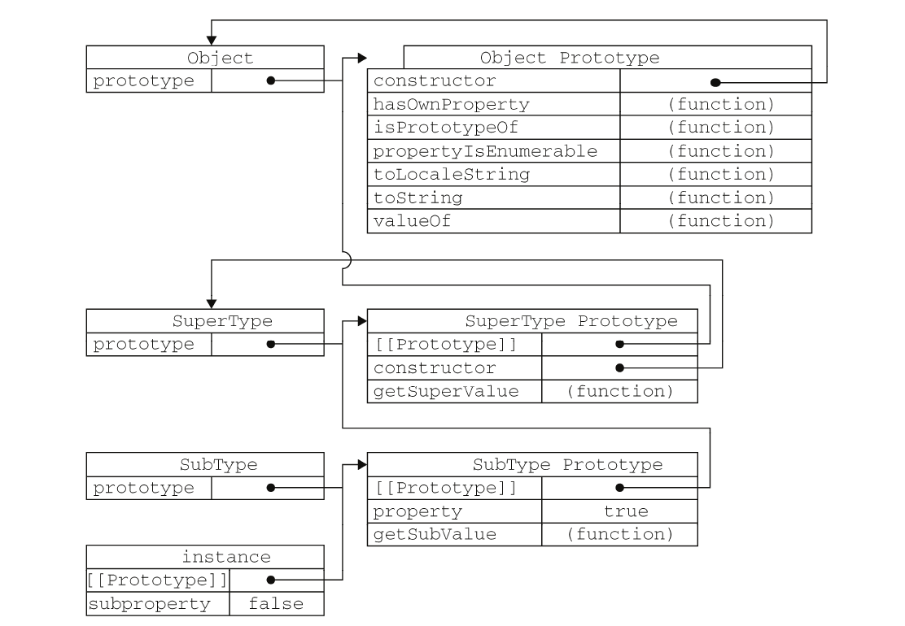

# JavaScript 高级程序设计

<div class = 'data-section default-folding'>
<h2 class = 'section-title'><label class = 'block-number'>1</label>什么是 JavaScript</h2>
<div class = 'folding-area'>

> JavaScript = ECMAScript + DOM + BOM  (核心 + 文档对象模型 + 浏览器对象模型)

Web 浏览器只是 ECMAScript 实现的一种宿主环境(host environment)。宿主环境提供
ECMAScript 的标准实现以及一些扩展(比如 DOM)语法。其他宿主环境, 如服务器端 JavaScript 平台 Node.js 

文档对象模型(DOM,Document Object Model)是一个应用编程接口(API), DOM 可以将 HTML 页面抽象成一组分层节点.


<div class="myNote">

其他实现 DOM 标准的语言  
- 可伸缩矢量图(SVG,Scalable Vector Graphics)
- 数学标记语言(MathML,Mathematical Markup Language)
- 同步多媒体集成语言(SMIL,Synchronized Multimedia Integration Language)

</div>
 


</div>
</div>


<div class = 'data-section default-folding'>
<h2 class = 'section-title'><label class = 'block-number'>2</label>在 HTML 中使用 JavaScript </h2>
<div class = 'folding-area'>

<h3 class='auto-sort-sub'>&lt;script&gt;元素</h3>


<h4 class='auto-sort-sub1'>标签的位置</h4>	

```html
<!DOCTYPE html>
<html>
	<head>
		<title>Example HTML Page</title>
	</head>
	<body>
	
	<!-- 
		这里是页面内容 
	-->

		<script src="example1.js"></script>
		<script src="example2.js"></script>
	</body>
</html>
```
这样,在解析包含的 JavaScript 代码之前,页面的内容将完全呈现在浏览器中。而用户也会因为浏览器窗口显示空白页面的时间缩短而感到打开页面的速度加快了。


<h4 class = 'auto-sort-sub1'>延迟执行脚本</h4>

`defer` 属性会使脚本延迟到整个页面都解析完毕后再运行

```html
<!DOCTYPE html>
<html>
	<head>
		<title>Example HTML Page</title>
		<script defer src="example1.js"></script>
		<script defer src="example2.js"></script>
	</head>
	<body>
	
	<!-- 
		这里是页面内容 
	-->
	
	</body>
</html>

```

<div class="myWarning">

对于 XHTML 文档,指定 defer 属性时应该写成 defer="defer"。
</div>

<h4 class = 'auto-sort-sub1'>动态加载脚本</h4>

```javascript
let script = document.createElement('script');
script.src = 'gibberish.js';
script.async = false; // 默认为 true
document.head.appendChild(script);
```

<div class="myWarning">

这种方式不会利用到浏览器预加载器, 可能会严重影响性能。要想让预加载器知道这些动态请求文件的存在, 可以在文档头部显式声明它们:
```html
<link rel="preload" href="gibberish.js">
```
</div>

<h4 class = 'auto-sort-sub1'>html 引入 javascript</h4>

```javascript
<script type="text/javascript">
	function sayScript(){
		alert("<\/script>");  // NOTICE
	}
</script>

<script type="text/javascript" src="example.js"></script>
```

<div class="myWarning">

1. type="text/javascript" 是默认属性，可以省略
2. 如果是在`XHTML`文档中,可以这么写:
`<script  src="example.js" />`	
但是,不能在`HTML`文档使用这种语法。原因是这种语法不符合 HTML 规范,而且也得不到某些浏览器(尤其是 IE)的正确解析。

</div>


<h4 class = 'auto-sort-sub1'>xhtml 引入 javascript </h4>

```javascript
<script type="text/javascript">
//<![CDATA[
function compare(a, b) {
	if (a < b) {
		alert("A is less than B");
	} else if (a > b) {
		alert("A is greater than B");
	} else {
	alert("A is equal to B");
	}
}
//]]>
</script>
```

<div class="myNote">

1. 在 XHTML(XML)中,`<![CDATA[  ]]>` 片段是文档中的一个特殊区域,这个区域中可以包含不需要解析的任意格式的文本内容。` //<![CDATA[	  //]]>`是为了兼容不支持 XHTML 的浏览器。
</div>


<h3 class = 'auto-sort-sub'>文档模式</h4>
<h4 class = 'auto-sort-sub1'>标准模式</h4>

```html
<!-- HTML 4.01 严格型 -->
<!DOCTYPE HTML PUBLIC "-//W3C//DTD HTML 4.01//EN"
"http://www.w3.org/TR/html4/strict.dtd">

<!-- XHTML 1.0 严格型 -->
<!DOCTYPE html PUBLIC
"-//W3C//DTD XHTML 1.0 Strict//EN"
"http://www.w3.org/TR/xhtml1/DTD/xhtml1-strict.dtd">

<!-- HTML 5 -->
<!DOCTYPE html>
```


<h3 class = 'auto-sort-sub'>&lt;noscript&gt;</h3>

```html
<html>
	<head>
		<title>Example HTML Page</title>
		<script type="text/javascript" defer="defer" src="example1.js"></script>
		<script type="text/javascript" defer="defer" src="example2.js"></script>
	</head>
	<body>
		<noscript>
			<p>本页面需要浏览器支持(启用)JavaScript。
		</noscript>
	</body>
</html>
```
这个页面会在脚本无效的情况下向用户显示一条消息。而在启用了脚本的浏览器中,用户永远也不会看到它。


</div>
</div>

<div class = 'data-section default-folding'>
<h2 class = 'section-title'><label class = 'block-number'>3</label>基本概念</h2>
<div class = 'folding-area'>

<h3 class = 'auto-sort-sub'>语法</h3>
<h4 class = 'auto-sort-sub1'>严格模式</h4>

ECMAScript 5 引入了严格模式(strict mode)的概念。在严格模式下,ECMAScript 3 中的一些不确定的行为将得到处理,而且对某些不安全的操作也会抛出错误。

```javascript
// 要在整个脚本中启用严格模式,可以在顶部添加如下代码:
"use strict";

// 该函数严格模式
function doSomething(){
	"use strict";
	//函数体
}
```


```javascript
var sum = a + b		   // 即使没有分号也是有效的语句——不推荐
var diff = a - b;	   // 有效的语句——推荐

if(test)
	alert(test);	   // 有效但容易出错,不要使用

if (test){
	alert(test);	   //推荐使用
}
```

<h3 class = 'auto-sort-sub'>变量</h3>
<h4 class = 'auto-sort-sub1'>var 关键字</h4>

<span class='large bold'> var 声明提升 (合法, 不提倡) </span> <i class="my-no-should iconfont icon-bug"></i> 
```javascript
function foo() {
	console.log(age);
	var age = 26;  // 自动提升到函数首行
}
```

<h4 class = 'auto-sort-sub1'>let 声明</h4>

>  let 声明的范围是块作用域

```javascript
if (true) {
	var name = 'Matt';
}
console.log(name);	 // Matt
 
if (true) {
	let age = 26;
}
console.log(age);	// ReferenceError: age 没有定义
```

<div class="myTip">

**let 与 var 的区别?**	

1. 暂时性死区

```javascript
// name 会被提升
console.log(name); // undefined
var name = 'Matt';

// age 不会被提升
console.log(age); // ReferenceError:age 没有定义, 暂时性死区
let age = 26;
```

2. 全局声明

```javascript
var name = 'Matt';
console.log(window.name); // 'Matt'

let age = 26;
console.log(window.age);  // undefined
// 使用 let 在全局作用域中声明的变量不会成为 window 对象的属性

```
</div>

<h3 class = 'auto-sort-sub'>数据类型</h3>

ECMAScript6 中有 6 种简单数据类型(也称为基本数据类型):`Undefined`、`Null`、`Boolean`、`Number`、`String` 和 `Symbol`。还有 1 种复杂数据类型`Object` 

<h4 class = 'auto-sort-sub1'>typeof 操作符</h4>

```javascript
var message = "some string";
typeof message;  //  "string"
typeof(message); //  "string"
typeof 95;		 //  "number"
```

<div class="myNote">

数据类型的值：	
`undefined`——如果这个值未定义;  
`boolean`——如果这个值是布尔值;  
`string`——如果这个值是字符串;  
`number`——如果这个值是数值;  
`object`——如果这个值是对象或 null;  
`function`——如果这个值是函数。
</div>

<h4 class = 'auto-sort-sub1'>undifined 类型</h4>

```javascript
let message;		   // 这个变量声明之后默认取得了 undefined 值
message == undefined;  // true
age;				   //  未声明, 产生错误
typeof message;		   // "undefined"
typeof age;			   // "undefined"  // NOTICE
```


<div class="myNote">

即便未初始化的变量会自动被赋予 undefined 值, 但显式地初始化变量依然是明智的选择。如果能够做到这一点, 那么当 typeof 操作符返回 "undefined" 值时, 我们就知道被检测的变量还没有被声明, 而不是尚未初始化。
</div>


<h4 class = 'auto-sort-sub1'>null 类型</h4>

从逻辑角度来看, null 值表示一个空对象指针, 而这也正是使用 typeof 操作符检测 null 值时会返回"object"的原因。
```javascript
if (car != null){
	// 对 car 对象执行某些操作
}

// undefined 值是派生自 null 值的,因此 ECMA-262 规定对它们的相等性测试要返回 true:
null == undefined; //->  true
```

<div class="myNote">

只要变量还没有真正保存对象, 就应该明确地让该变量保存 null 值。这样做不仅可以体现 null 作为空对象指针的惯例, 而且也有助于进一步区分 null 和 undefined。
</div>


<h4 class = 'auto-sort-sub1'>Boolean 类型</h4>

```javascript
let message = "Hello world!";
let messageAsBoolean = Boolean(message);

if (message){  // 自动装换
	alert("Value is true");  
}
```

<h4 class = 'auto-sort-sub1'>number 类型</h4>

```javascript
let octalNum1 = 070;	// 八进制的 56
let octalNum2 = 079;	// 无效的八进制数值——解析为79

let hexNum1 = 0xA;		// 十六进制的 10

let floatNum2 = 0.1;
let floatNum3 = .1;		// 有效,但不推荐

let floatNum1 = 1.;		// 自动将浮点数转化为整数，解析为 1
let floatNum2 = 10.0;	// 整数, 解析为 10

// --------------------------------------------------------------

if (a + b == 0.3){	// 不要做这样的测试, 浮点数不精确!
	alert("You got 0.3.");
}

NaN == NaN;		  //  false
0/0;			  //   NAN
10/-0;			  //   -Infinity  [ NOTICE 和 java 等其他语言不同 ]

// --------------------------------------------------------------

let result = Number.MAX_VALUE + Number.MAX_VALUE;
isFinite(result);  // false

isNaN("10");	   // false
isNaN("blue");	   // true
isNaN(true);	   // false
```

<div class="myWarning">

尽管有点儿不可思议, 但 isNaN()确实也适用于对象。在基于对象调用 isNaN() 函数时, 会首先调用对象的`valueOf()`方法, 然后确定该方法返回的值是否可以转换为数值。如果不能, 则基于这个返回值再调用`toString()`方法, 再测试返回值。 而这个过程也是 ECMAScript 中内置函数和操作符的一般执行流程。
</div>

```javascript
// 数据转换

Number("Hello world!");    //  NAN
Number("");				   //  0
Number("000011");		   //  11
Number(true);			   //  1


parseInt("1234blue");	   //  1234
parseInt("");			   //  0
parseInt("0xA");		   //  10
parseInt(22.5);			   //  22

parseInt("0xAF", 16);	   //  175
parseInt("AF", 16);		   //  175
parseInt("AF");			   //  NaN
```

<div class="myTip">

不指定基数意味着让 parseInt() 决定如何解析输入的字符串, 因此为了避免错误的解析, 我们建议无论在什么情况下都明确指定基数。
</div>


<h4 class = 'auto-sort-sub1'>String 类型</h4>

```javascript
var num = 10;
num.toString();    // "10"
num.toString(2);   // "1010"
num.toString(8);   // "12"
num.toString(10);  // "10"
num.toString(16);  // "a"

var value;
String(10);		   // "10"
String(true);	   // "true"
String(null);	   // "null"
String(value));    // "undefined"
```

<div class="myNote">

在不知道要转换的值是不是 null 或 undefined 的情况下, 还可以使用转型函数`String()`, 这个函数能够将任何类型的值转换为字符串。String() 函数遵循下列转换规则:  
1. 如果值有 toString() 方法, 则调用该方法(没有参数)并返回相应的结果;
2. 如果值是 null, 则返回 "null";
3. 如果值是 undefined, 则返回 "undefined"。
</div>

<h4 class = 'auto-sort-sub1'>Symbol [TODO]</h4>
// TODO

<h4 class = 'auto-sort-sub1'>Object 类型</h4>

```javascript
let a = new Object();
let b = new Object; // 有效,但不推荐省略圆括号

```
详细请参考第 6 章


<h3 class = 'auto-sort-sub'>操作符</h3>
<h4 class = 'auto-sort-sub1'>相等操作符号</h4>

```javascript
"55" == 55;			// true, 因为转换后相等
"55" === 55;		// false, 因为不同的数据类型不相等
null == undefined;	// true
null === undefined; // false
```

<div class="myTip">

由于相等和不相等操作符存在类型转换问题, 而为了保持代码中数据类型的完整性, 推荐使用全等和不全等操作符。
</div>


<h3 class = 'auto-sort-sub'>语句</h3>
<h4 class = 'auto-sort-sub1'>label 语句</h4>

```javascript
var num = 0;
outermost:
	for (var i=0; i < 10; i++) {
		for (var j=0; j < 10; j++) {
			if (i == 5 && j == 5) {
				continue outermost;
			}
			num++;
		}
	}

alert(num); // 95
```

<div class="myTip">

虽然联用 break、continue 和 label 语句能够执行复杂的操作, 但如果使用过度, 也会给调试带来麻烦。在此, 我们建议如果使用 label 语句, 一定要使用描述性的标签, 同时不要嵌套过多的循环。
</div>


<h4 class = 'auto-sort-sub1'>swith 语句</h4>

<div class="myNote">

虽然 ECMAScript 中的 switch 语句借鉴自其他语言, 但这个语句也有自己的特色。首先, 可以在 switch 语句中使用任何数据类型(在很多其他语言中只能使用数值), 无论是字符串, 还是对象都没有问题。其次, 每个 case 的值不一定是常量, 可以是变量, 甚至是表达式。
</div>

```javascript
switch ("hello world") {
	case "hello" + " world":
		alert("Greeting was found.");
		break;
	case "goodbye":
		alert("Closing was found.");
		break;
	default:
		alert("Unexpected message was found.");
}


var num = 25;
switch (true) {
	case num < 0:
	alert("Less than 0.");
	break;
	case num >= 0 && num <= 10:
		alert("Between 0 and 10.");
		break;
	case num > 10 && num <= 20:
		alert("Between 10 and 20.");
		break;
	default:
		alert("More than 20.");
}
```

<div class="myWarning">

switch 语句在比较值时使用的是全等操作符, 因此不会发生类型转换(例如, 字符串 "10" 不等于数值 10)。
</div>


<h3 class = 'auto-sort-sub'>函数</h3>


<div class="myNote">

ECMAScript 函数的参数与大多数其他语言中函数的参数有所不同。ECMAScript 函数不介意传递进来多少个参数, 也不在乎传进来参数是什么数据类型。之所以会这样,原因是 ECMAScript 中的参数在内部是用一个叫`arguments`数组来表示的。
</div>

```javascript
function sayHi(name, message) {
	alert("Hello " + name + "," + message);
}

// 与上例子等价
function sayHi() {
	alert("Hello " + arguments[0] + "," + arguments[1]);
}

function doAdd() {
	if(arguments.length == 1) {
		alert(arguments[0] + 10);
	} else if (arguments.length == 2) {
		alert(arguments[0] + arguments[1]);
	}
}
doAdd(10);		  // 20
doAdd(30, 20);	  //50
```

<div class="myTip">

ECMAScript 中的所有参数传递的都是值, 不可能通过引用传递参数。
ECMAScript 不能重载，后定义的会覆盖前面的相同方法, 通过检查传入函数中参数的类型和数量并作出不同的反应, 可以模仿方法的重载。
</div>

</div>
</div>

<div class = 'data-section default-folding'>
<h2 class = 'section-title'><label class = 'block-number'>4</label>变量、作用域和内存问题</h2>
<div class = 'folding-area'>

<h3 class = 'auto-sort-sub'>基本类型和引用类型的值</h3>
<h4 class = 'auto-sort-sub1'>复制变量值</h4>

> ECMAScript 中的 String 不是引用类型

```javascript
// 引用类型
var obj1 = new Object();
var obj2 = obj1;
obj1.name = "Nicholas";
alert(obj2.name); //"Nicholas"
```

<h4 class = 'auto-sort-sub1'>传递参数</h4>
可以把 ECMAScript 函数的参数想象成局部变量。

```javascript
function addTen(num) {
	num += 10;
	return num;
}
var count = 20;
var result = addTen(count);
alert(count); //20,没有变化
alert(result); //30

// NOTICE 对象是按值传递的
function setName(obj) {
	obj.name = "Nicholas";
	obj = new Object();
	obj.name = "Greg";
}
var person = new Object();
setName(person);
alert(person.name); //"Nicholas"
```

<div class="myTip">

在把 person 传递给setName()后, 其 name 属性被设置为 "Nicholas"。然后, 又将一个新对象赋给变量 obj, 同时将其 name 属性设置为 "Greg"。如果 person 是按引用传递的, 那么 person 就会自动被修改为指向其 name 属性值为 "Greg" 的新对象。但是, 当接下来再访问 person.name 时,显示的值仍然是 "Nicholas"。这说明即使在函数内部修改了参数的值,但原始的引用仍然保持未变。实际上, 当在函数内部重写 obj 时, 这个变量引用的就是一个局部对象了。而这个局部对象会在函数执行完毕后立即被销毁。
</div>

<h4 class = 'auto-sort-sub1'>检测类型</h4>

要检测一个变量是不是基本数据类型用`typeof`, 但对于引用类型用处不大，为此, ECMAScript 提供了`instanceof`操作符用于引用类型。
```javascript
var s = "Nicholas";
var b = true;
var i = 22;
var u;
var n = null;
var o = new Object();
alert(typeof s);	// string
alert(typeof i);	// number
alert(typeof b);	// boolean
alert(typeof u);	// undefined
alert(typeof n);	// object
alert(typeof o);	// object

// result = variable instanceof constructor
alert(person instanceof Object);   // 变量 person 是 Object 吗?
alert(colors instanceof Array);    // 变量 colors 是 Array 吗?
alert(pattern instanceof RegExp);  // 变量 pattern 是 RegExp 吗?
```

<h3 class = 'auto-sort-sub'>执行上下文及作用域</h3>

1. 变量或函数的上下文决定了它们可以访问哪些数据,以及它们的行为。每个上下文都有一个关联的变量对象(variable object)
而这个上下文中定义的所有变量和函数都存在于这个对象上。
1. 全局上下文是最外层的上下文。根据 ECMAScript 实现的宿主环境,表示全局上下文的对象可能不一
样。在浏览器中, 全局上下文就是我们常说的 window 对象, 因此所有通过 var 定义的全局变量和函数都会成为 window 对象的属性和方法。上下文在其所有代码都执行完毕后会被销毁,包括定义在它上面的所有变量和函数(全局上下文在应用程序退出前才会被销毁, 比如关闭网页或退出浏览器)。
每个函数调用都有自己的上下文。当代码执行流进入函数时, 函数的上下文被推到一个上下文栈上。在函数执行完之后, 上下文栈会弹出该函数上下文, 将控制权返还给之前的执行上下文。ECMAScript 程序的执行流就是通过这个上下文栈进行控制的。
1. 上下文中的代码在执行的时候,会创建变量对象的一个作用域链(scope chain)。这个作用域链决定了各级上下文中的代码在访问变量和函数时的顺序。代码正在执行的上下文的变量对象始终位于作用域链的最前端。`如果上下文是函数,则其活动对象(activation object) 用作变量对象。活动对象最初只有 一个定义变量: arguments (全局上下文中没有这个变量)`
1. 代码执行时的标识符解析是通过沿作用域链逐级搜索标识符名称完成的。搜索过程始终从作用域链的最前端开始,然后逐级往后,直到找到标识符。(如果没有找到标识符,那么通常会报错)

看一看下面这个例子:
```javascript
var color = "blue";
function changeColor() {
	if (color === "blue") {
	color = "red";
	} else {
		color = "blue";
	}
}
changeColor();

/* 
 * 函数 changeColor() 的作用域中有 2 个对象, 
 * 一个是全局上下文变量 color, 一个是函数定义的变量 arguments 
 */
```

<h4 class = 'auto-sort-sub1'>作用域链增强</h4>

- 全局上下文
- 函数上下文
- eval() 调用
- try / catch 语句中的 catch 块
- with 语句

对 with 语句来说,会向作用域链前端添加指定的对象; 对 catch 语句而言, 则会创建一个新的变量对象, 这个变量对象会包含要抛出的错误对象的声明。

##### 标识符查找
```javascript

var color = "blue";
function getColor(){
	return color;
}
alert(getColor()); //"blue"

// 如果局部环境中存在着同名标识符,就不会使用位于父环境中的标识符
function getColor(){
	var color = "red";
	return color;
}
alert(getColor()); //"red"
```

<h3 class = 'auto-sort-sub'>垃圾收集</h3>

JavaScript 会自动垃圾回收
<h4 class = 'auto-sort-sub1'>管理内存</h4>

<div class="myNote">

使用具备垃圾收集机制的语言编写程序,开发人员一般不必操心内存管理的问题。但是,JavaScript 在进行内存管理及垃圾收集时面临的问题还是有点与众不同。其中最主要的一个问题,就是分配给 Web 浏览器的可用内存数量通常要比分配给桌面应用程序的少。这样做的目的主要是出于安全方面的考虑,目的是防止运行 JavaScript 的网页耗尽全部系统内存而导致系统崩溃。内存限制问题不仅会影响给变量分配内存,同时还会影响调用栈以及在一个线程中能够同时执行的语句数量。  
因此,确保占用最少的内存可以让页面获得更好的性能。而优化内存占用的最佳方式,就是为执行中的代码只保存必要的数据。一旦数据不再有用,最好通过将其值设置为 null 来释放其引用——这个做法叫做解除引用(dereferencing)。这一做法适用于大多数全局变量和全局对象的属性。局部变量会在它们离开执行环境时自动被解除引用。
</div>

```javascript
function createPerson(name){
	var localPerson = new Object();
	localPerson.name = name;
	return localPerson;
}
var globalPerson = createPerson("Nicholas");
// 手工解除 globalPerson 的引用
globalPerson = null;

```

</div>
</div>


<div class = 'data-section default-folding'>
<h2 class = 'section-title'><label class = 'block-number'>5</label>引用类型</h2>
<div class = 'folding-area'>

>  引用类型是把数据和功能组织到一起的结构, 虽然从技术上讲 JavaScript 是一门面向对象语言
> - ECMAScript 缺少传统的面向对象编程语言所具备的某些基本结构,包括类和接口。
> - 引用类型有时候也被称为对象定义, 因为它们描述了自己的对象应有的属性和方法。
> - 函数也是一种引用类型

<h3 class = 'auto-sort-sub'>Date 类型</h3>

ECMAScript 中的 Date 类型是在早期 Java 中的 java.util.Date 类基础上构建的。为此,Date
类型使用自 UTC(Coordinated Universal Time,国际协调时间)1970 年 1 月 1 日午夜(零时)开始经过
的毫秒数来保存日期。

> ECMAScript 的 Date 类型参考了 Java 早期版本中的 java.util.Date

<div><span class="header5">Date.parse 和 Date.UTC <span></div>

```javascript

let someDate = new Date(Date.parse("May 23, 2019"));
/* 等价于 */
let someDate = new Date("May 23, 2019");  // 隐式调用 Date.parse


// GMT 时间 2000 年 1 月 1 日零点
let y2k = new Date(Date.UTC(2000, 0));
// GMT 时间 2005 年 5 月 5 日下午 5 点 55 分 55 秒
let allFives = new Date(Date.UTC(2005, 4, 5, 17, 55, 55));

// 等价于
// 本地时间 2000 年 1 月 1 日零点
let y2k = new Date(2000, 0);	  // 隐式调用 Date.UTC
// 本地时间 2005 年 5 月 5 日下午 5 点 55 分 55 秒
let allFives = new Date(2005, 4, 5, 17, 55, 55);

```

<div><span class="header5">执行时间<span></div>

```javascript
// 起始时间
let start = Date.now();
// 调用函数
doSomething();
// 结束时间
let stop = Date.now(),
result = stop - start;	//毫秒
```

<h4 class = 'auto-sort-sub1'>重写的方法</h4>

- `toLocaleString()`返回与浏览器运行的本地环境一致的日期和时间。包含针对时间的 AM(上午)或 PM(下午), 但不包含时区信息(具体格式可能因浏览器而不同)

- `toString()`通常返回带时区信息的日期和时间,而时间也是以 24 小时制(0~23)表示的。

- `valueOf()` 返回的是日期的毫秒, 因此可以做 4 则运算


<div class="myTip">

不同的浏览器对 Date 类型的实现有很多问题。比如,很多浏览器会选择用当前日
期替代越界的日期,因此有些浏览器会将"January 32, 2019"解释为 "February 1,
2019"。Opera 则会插入当前月的当前日,返回"January 当前日, 2019"。就是说,如
果是在 9 月 21 日运行代码,会返回"January 21, 2019"。
</div>


<h4 class = 'auto-sort-sub1'>日期格式化方法</h4>

- toDateString() 显示日期中的周几、月、日、年(格式特定于实现)
- toTimeString() 显示日期中的时、分、秒和时区(格式特定于实现)
- toLocaleDateString() 显示日期中的周几、月、日、年(格式特定于实现和地区)
- toLocaleTimeString() 显示日期中的时、分、秒(格式特定于实现和地区)
- toUTCString() 显示完整的 UTC 日期(格式特定于实现) [新代码使用]
- toGMTString() 是 toUTCString() 兼容写法

<div class="myTip">

以上方法与 toLocaleString() toString() 一样, 会因浏览器不同而显示不同
</div>

<h3 class = 'auto-sort-sub'>RegExp 类型</h3>

<div class="myNote">

**var expression = / pattern / flags ;**  

**flags 有三个值**	
- `g` 表示全局(global)模式,即模式将被应用于所有字符串,而非在发现第一个匹配项时立即停止;  
- `i` 表示不区分大小写(case-insensitive)模式;  
- `m` 表示多行(multiline)模式,即在到达一行文本末尾时还会继续查找下一行中是否存在与模式匹配的项。
- `y` 粘附模式, 表示只查找从 lastIndex 开始及之后的字符串。
- `u` Unicode 模式, 启用 Unicode 匹配。
- `s` dotAll 模式, 表示元字符.匹配任何字符(包括\n 或\r)


</div>

<div class="myTip">

**贪婪匹配和非贪婪匹配**  

例如： {ab}{cd}{de}{ef}

{[\s\S]*} ==>  {ab}{bc}{cd}{de}  

{[\s\S]*?} ==> {ab}

</div>

<div><span class='header5'>[1] 使用字面量定义<span></div>

```javascript
// 匹配第一个" [bc]at",不区分大小写
let pattern2 = /\[bc\]at/i;

// 匹配所有以"at"结尾的 3 个字符的组合,不区分大小写
let pattern3 = /.at/gi;

// 匹配所有".at",不区分大小写
let pattern4 = /\.at/gi;
```

<div><span class='header5'>[2] 使用构造函数<span></div>

```javascript
// NOTICE 需双重转义
let pattern2 = new RegExp("\"\[bc\\]at", "i");
```

<h4 class = 'auto-sort-sub1'>RegExp 实例方法</h4>

<div><span class='header5'>exec()<span></div>

```javascript
let text = "mom and dad and baby";
let pattern = /mom( and dad( and baby)?)?/gi;
let matches = pattern.exec(text);
matches.index;	//->  0
matches.input;	//->  "mom and dad and baby"
matches[0];		//->  "mom and dad and baby"
matches[1];		//->  " and dad and baby"
matches[2];		//->  " and baby"


// [2]
// 对于 exec() 方法而言,即使在模式中设置了全局标志(g),
// 它每次也只会返回一个匹配项。在不设置全局标志的情况下,
// 在同一个字符串上多次调用 exec()将始终返回第一个匹配项的信息。

let text = "cat, bat, sat, fat";
let pattern1 = /.at/;		// [-]
let matches = pattern1.exec(text);
matches.index;		  //->	0
matches[0];			  //->	cat
pattern1.lastIndex;   //->	0
matches = pattern1.exec(text);
matches.index;		  //->	0
matches[0];			  //->	cat
pattern1.lastIndex;   //->	0

let pattern2 = /.at/g;		// [-]
let matches = pattern2.exec(text);
matches.index;		  //->	0
matches[0];			  //->	cat
pattern2.lastIndex;   //->	3
matches = pattern2.exec(text);
matches.index;		  //->	5
matches[0];			  //->	bat
pattern2.lastIndex;   //->	8
```


<div><span class='header5'>test()<span></div>

```javascript
let text = "000-00-0000";
let pattern = /\d{3}-\d{2}-\d{4}/;
pattern.test(text);		   //->  true
```


<h4 class = 'auto-sort-sub1'>RegExp 构造函数属性</h4>
<div class="myImage">


<label class="imageTitle">图示5-1: RegExp 构造函数的属性 </label>
</div>


```javascript
let text = "this has been a short summer";
let pattern = /(.)hort/g;
/*
* 注意:Opera 不支持 input、lastMatch、lastParen 和 multiline 属性
* Internet Explorer 不支持 multiline 属性
*/

// [1]
if (pattern.test(text)){
	RegExp.input;		  //->	"this hs been a short summer"
	RegExp.leftContext;   //->	"this hs been a "
	RegExp.rightContext;  //->	" summer"
	RegExp.lastMatch;	  //->	"short"
	RegExp.lastParen;	  //->	"s"
}

// [2]
if (pattern.test(text)){
	RegExp.$_;		//->  "this hs been a short summer"
	RegExp["$&"];	//->  "short"
	RegExp["$+"];	//->  "s"
}

// [3]
let text = "this has been a short summer";
let pattern = /(..)or(.)/g;
if (pattern.test(text)){
	RegExp.$1;		   //->  "sh"
	RegExp.$2;		   //->  "t"
}
```

<h3 class = 'auto-sort-sub'>基本包装类型</h3>

ECMAScript 提供了 3 个特殊的引用类型:`Boolean`、`Number`、 `String`。
```javascript
// [1]
var s1 = "some text";
var s2 = s1.substring(2); // 自动包装

// [2]
// 自动创建的基本包装类型的对象,则只存在于一行代码的执行瞬间
var s1 = "some text";
s1.color = "red";
s1.color;			//-> undefined
```


<div class="myNote">


`"hello".substring(2);` 等价于
```javascript
let s1 = new String("some text");
let s2 = s1.substring(2);
s1 = null;
```
</div>


<h4 class = 'auto-sort-sub1'>String 类型</h4>

```javascript
// indexOf
let stringValue = "hello world";
stringValue.indexOf("o");	   //->  4
stringValue.lastIndexOf("o");  //->  7
stringValue.indexOf("o", 6);   //->  7
```

<div><span class='header5'>字符<span></div>

JavaScript 字符由 16 位码元(code unit)组成。字符串的 length 属性表示字符串包含多少 16 位码元 
- 16 位只能表示 65536 个字符。为了表示更多的字符, Unicode 采用了一个策略, 即每个字符使用另外 16 位去增补。这种每个
字符使用两个 16 位码元的策略称为代理对。
- 使用 codePointAt() 代替 charCodeAt(), 这样可以解析 32 位的字符 

<div class="myWarning">

-  数组 length 属性
```javascript
// 0x1F60A === 128522
let str = "ab😊de";   
str.length;			  //->	6	//结果不符合预期
[...str].length;	  //->	5
```

- 利用 codePointAt() 代替 charCodeAt()
```javascript
"😊".charCodeAt(0);		//->  55357
"😊".charCodeAt(1);		//->  56842
"😊".codePointAt(0);	 //->  128522
"😊".codePointAt(1);	 //->  56842
```

- 利用 fromCodePoint() 代替 fromCharCode()
```javascript
String.fromCharCode(97, 98, 55357, 56842, 100, 101);  //-> "ab😊de"
String.fromCodePoint(97, 98, 128522, 100, 101);		  //-> "ab😊de"
```
</div>

<div><span class='header5'>normalize()<span></div>

同一个 Unicode 字符可以有多种编码方式, 但不同编码方式得到的字符比较却不相等, 比如 Å

```javascript
let a1 = String.fromCharCode(0x00C5);		   //->  Å
let a2 = String.fromCharCode(0x212B));		   //->  Å

a1 === a2;							//->  false
a1.normalize() === a2.normalize();	//->  true
```

<div><span class='header5'>padStart 和 padEnd()<span></div>

```javascript

"22".padStart(3, "0");		//-> "022"
"2222".padStart(3, "0");	//-> "2222"
"22".padEnd(3, "0");		//-> "220"
```

<h4 class = 'auto-sort-sub1'>Number</h4>

```javascript
let num = 10;
num.toString();    //->  "10"
num.toString(16);  //->  "a"

num.toFixed(2);    //->  "10.00"

num.toExponential(1);	//-> "1.0e+1"
// 自动调整科学计数
num.toPrecision(1);		//-> "1.0e+1"
num.toPrecision(2);		//-> "10"
```

```javascript
let value = "25";
let number = Number(value);   // 转型函数
console.log(typeof number);   //-> "number"
let obj = new Number(value);  // 构造函数
console.log(typeof obj);	  //-> "object"
```

<div class="myWarning">

- 非必要时不要显示创建包装类型, 以免引起混乱(引用类型 or 基本类型)
- 避免使用 Boolean 包装类型, 如下例
```javascript
new Boolean(false) && true;  //->  true
```
</div>

<div><span class='header5'>isInteger() 函数与安全整数<span></div>

```javascript
Number.isInteger(1.00); //-> true
Number.isInteger(1.01); //-> false

Number.isSafeInteger(2 ** 53);		 //-> false
Number.isSafeInteger((2 ** 53) - 1); //-> true
```

<h3 class = 'auto-sort-sub'>单例内置对象</h3>

<h4 class = 'auto-sort-sub1'>Global</h4>

ECMAScript 中的 Global 对象在某种意义上是作为一个终极的“兜底儿对象”
来定义的。事实上, 没有全局变量或全局函数; 所有在全局作用域中定义的属性和函数, 都是 Global 对象的属性。

<div><span class='header5'>URI 编码方法<span></div>

```javascript
// [1]
var uri = "http://www.wrox.com/illegal value.htm#start";

// [-] 只有空格被替换成 %20
encodeURI(uri);   
//->  "http://www.wrox.com/illegal%20value.htm#start"

// 所有非字母数字都替换
encodeURIComponent(uri);  
//->  "http%3A%2F%2Fwww.wrox.com%2Fillegal%20value.htm%23start"

// [2]
var uri = "http%3A%2F%2Fwww.wrox.com%2Fillegal%20value.htm%23start";
decodeURI(uri);
//->  "http%3A%2F%2Fwww.wrox.com%2Fillegal value.htm%23start"

decodeURIComponent(uri);
//->  "http://www.wrox.com/illegal value.htm#start"
```

<div class="myTip">

URI 方法`encodeURI()` `encodeURIComponent()` `decodeURI()`和`decode-URIComponent()`用于替代已经被废弃的 escape() 和 unescape()方法。URI 方法能够编码所有 Unicode 字符, 而原来的方法只能正确地编码 ASCII 字符。因此在开发实践中, 特别是在产品级的代码中, 一定要使用 URI 方法, 不要使用 escape() 和 unescape()方法。
</div>

<div><span class='header5'>eval()<span></div>

> 整个 ECMAScript 语言中最强大的一个方法  

```javascript
// [1]
eval("function sayHi() { alert('hi'); }");
sayHi();
// [2]
eval("let msg = 'hello world'; ");
alert(msg);    //->  "hello world"
```
<div class="myTip">

严格模式下,在外部访问不到 eval()中创建的任何变量或函数,因此前面两个例子都会导致错误。
</div>

<div><span class='header5'>Global 对象属性<span></div>

Global 对象有很多属性, 像 undefined、 NaN 和 Infinity 等特殊值都是 Global 对象的属性。此外, 所有原生引用类型构造函数,比如 Object 和 Function, 也都是 Global 对象的属性。


<div><span class='header5'>window 对象<span></div>

> 浏览器将 window 对象实现为 Global 对象的代理。因此,所有全局作用域中声明的变量和函数都变成了 window 的属性

```javascript
var color = "red";
function sayColor(){
	window.color;	   //->  "red"
}
window.sayColor();	   //->  "red"
```

获取 Global 对象的实现
```javascript
let global = function() {
	return this;
}();
```

<div class="myTip">

- window 对象在 JavaScript 中远不止实现的 ECMAScript 的 Global 对象
- 当一个函数在没有明确 (通过成为某个对象的方法,或者通过 call()/apply())指定 this 值的情况下执行时, this 值等于
Global 对象。

</div>


<h4 class = 'auto-sort-sub1'>Math</h4>

Math 对象上提供的计算要比直接在 JavaScript 实现的快得多,因为 Math 对象上的计算使用了 JavaScript 引擎中更高效的实现和处理器指令。但使用 Math 计算的问题是精度会因浏览器、操作系统、指令集和硬件而异。


<div class="myTip">

如果为了加密而需要生成随机数(传给生成器的输入需要较高的不确定性),那么建议使用 window.crypto.getRandomValues() 而不是 Math.random()。
</div>

<h3 class = 'auto-sort-sub'>Object 类型</h3>

<div><span class='header5'>创建 Object 对象的两种方式<span></div>

```javascript
// 使用构造函数
let person = new Object();
person.name = "Nicholas";
person.age = 29;

// 使用对象字面量表示法
// NOTICE 属性名也可以使用字符串
let person = {
	name : "Nicholas",
	age : 29
};
```

<div class="myNote">

在使用对象字面量表示法定义对象时,并不会实际调用 Object 构造函数。
</div>


```javascript
function displayInfo(args) {
	let output = "";
	if (typeof args.name == "string"){
		output += "Name: " + args.name + "\n";
	}
	if (typeof args.age == "number") {
		output += "Age: " + args.age + "\n";
	}
}
```

<div class="myTip">

**对象属性的访问方式**	
```javascript
person["name"];  //->  "Nicholas"
person.name;	 //->  "Nicholas"

// 从功能上看,这两种访问对象属性的方法没有任何区别。但方括号语法的主要优点是可以通过变量来访问属性
let propertyName = "name";
alert(person[propertyName]); //"Nicholas"
person["first name"] = "Nicholas";
```
</div>

<h3 class = 'auto-sort-sub'>Array 类型</h3>

<div class="myNote">

ECMAScript 数组的每一项可以保存任何类型的数据, 而且, ECMAScript 数组的大小是可以动态调整的, 即可以随着数据的添加自动增长以容纳新增数据。
</div>


<h4 class = 'auto-sort-sub1'>创建数组的基本方式有两种</h4>
<div><span class='header5'>使用构造函数<span></div>

```javascript
// new 关键字可以省略
let colors = new Array();
let colors = new Array(3);	 // 初始化长度为 3
let colors = new Array("red", "blue", "green");
```

<div><span class='header5'>字面量表示<span></div>

```javascript
let names = [];		 // 创建一个空数组
let colors = ["red", "blue", "green"]; // 创建一个包含 3 个字符串的数组
```
<div class="myWarning">

- 在使用数组字面量表示法创建数组不会调用 Array 构造函数。

- 不要这样创建数组	
```javascript
let values = [1,2,];   // 不要这样!这样会创建一个包含 2 或 3 项的数组
let options = [,,,,,]; // 不要这样!这样会创建一个包含 5 或 6 项的数组
```
在 IE 中, values 会成为一个包含 3 个项且每项的值分别为 1、2 和 undefined 的数组;在其他浏览器中,values 会成为一个包含 2 项且值分别为 1 和 2 的数组。原因是 IE8 及之前版本中的 ECMAScript 实现在数组字面量方面存在 bug。
</div>


<h4 class = 'auto-sort-sub1'>from() 与 to()</h4>

```javascript
let a = [1, 2, 3];
Array.from(a);			   //->  [ 1, 2, 3 ]
Array.from(a, x => x*2);   //->  [2, 4, 6]

// Array.of() 用于替代在 ES6 之前常用的 Array.prototype.slice.call(arguments)
Array.of(1, 2, 3);		   //->  [1, 2, 3]
Array.of(undefined);	   //->  [undefined]
```
<h4 class = 'auto-sort-sub1'>检测数组</h4>

```javascript
if (Array.isArray(value)){
	//对数组执行某些操
}
```

<h4 class = 'auto-sort-sub1'>迭代器方法</h4>

在 ES6 中, Array 的原型上暴露了 3 个用于检索数组内容的方法: keys() 、 values() 和 entries()。

```javascript
const a = ["foo", "bar", "baz"];

// 因为这些方法都返回迭代器,所以可以将它们的内容
// 通过 Array.from()直接转换为数组实例
const aKeys = Array.from(a.keys());		  //->	[0, 1, 2]
const aValues = Array.from(a.values());   //->	["foo", "bar", "baz"]
const aEntries = Array.from(a.entries()); //->	[[0, "foo"], [1, "bar"], [2, "baz"]]
```

<h4 class = 'auto-sort-sub1'>copyWithin() 和 fill()</h4>

```javascript
const zeroes = [0, 0, 0, 0, 0];
zeroes.fill(5);		//->  [5, 5, 5, 5, 5]
zeroes.fill(6, 3);	//->  [0, 0, 0, 6, 6]
```

```javascript
let ints,
reset = () => ints = [0, 1, 2, 3, 4, 5, 6, 7, 8, 9];
reset();
// 从 ints 中复制索引 0 开始的内容,插入到索引 5 开始的位置
// 在源索引或目标索引到达数组边界时停止
ints.copyWithin(5);		//->  [0, 1, 2, 3, 4, 0, 1, 2, 3, 4]
reset();
ints.copyWithin(0, 5);	//->  [5, 6, 7, 8, 9, 5, 6, 7, 8, 9]
```


<h4 class = 'auto-sort-sub1'>转换方法</h4>

```javascript
// [1]
var colors = ["red", "blue", "green"]; // 创建一个包含 3 个字符串的数组
colors.toString();	// red,blue,green
colors.valueOf();	// red,blue,green
colors;				// red,blue,green

// [2]
var person1 = {
	toLocaleString : function () {
		return "Nikolaos";
	},
	toString : function() {
		return "Nicholas";
	}
};

var person2 = {
	toLocaleString : function () {
		return "Grigorios";
	},
	toString : function() {
		return "Greg";
	}
};
var people = [person1, person2];
people;					  // Nicholas,Greg
people.toString();		  // Nicholas,Greg
people.toLocaleString();  // Nikolaos,Grigorios
```
数组继承的 toLocaleString() 、toString() 和 valueOf()方法,在默认情况下都会以逗号分隔的字符串的形式返回数组项。而如果使用 join() 方法,则可以使用不同的分隔符来构建这个字符串。 
```javascript
var colors = ["red", "green", "blue"];
colors.join(",");	// red,green,blue
colors.join("||");	// red||green||blue
```


<div class="myTip">

如果数组中的某一项的值是 null 或者 undefined ,那么该值在 join() 、toLocaleString()、toString()和 valueOf() 方法返回的结果中以空字符串表示。
</div>

<h4 class = 'auto-sort-sub1'>栈、队列方法</h4>

```javascript
// 栈
var colors = ["red", "blue"];
colors.push("brown");	   // 添加另一项
colors.length;			   // 3
var item = colors.pop();   // 取得最后一项
item;					   // "brown"
colors.length;			   // 2
```

```javascript
// 队列
var colors = new Array();				  // 创建一个数组
var count = colors.push("red", "green");  // 推入两项
count;									  // 2
count = colors.push("black");
count;									  // 3
var item = colors.shift();				  // 取得第一项
item;									  // "red"
```

<div class="myNote">

**队列与栈方法**  
栈： `push` `pop`  
队列：`push` `shift`  
反向队列：`unshift` `pop`  
</div>


<h4 class = 'auto-sort-sub1'>排序方法</h4>

```javascript
// [1]
var values = [1, 2, 3, 4, 5];
values.reverse();	 // 具有破坏性
values;				 //->  5,4,3,2,1

// [2]
var values = [0, 1, 5, 10, 15];
values.sort();		// 具有破坏性
values;				//->  0,1,10,15,5

// [3]
function compare(value1, value2) {
	if (value1 < value2) {
		return -1;
	} else if (value1 > value2) {
		return 1;
	} else {
		return 0;
	}
}
var values = [0, 1, 5, 10, 15];
values.sort(compare);	  // ES6 后可用 lamda 表达式代替比较函数
values;			   //->  0,1,5,10,15
```

<h4 class = 'auto-sort-sub1'>操作方法</h4>

```javascript
// [1]	concat()
var colors = ["red", "green", "blue"];
var colors2 = colors.concat("yellow", ["black", "brown"]);	 //  red,green,blue,yellow,black,brown

// [2]	slice()
var colors = ["red", "green", "blue", "yellow", "purple"];
var colors2 = colors.slice(1);		// green,blue,yellow,purple
var colors3 = colors.slice(1,4);	// green,blue,yellow
var colors4 = colors.slice(-2,-1);	// yellow,purple
```
```javascript
// splice()  // 具破坏性
// [1]
var colors = ["red", "green", "blue"];
var removed = colors.splice(0,1);  // [-] 删除第一项
colors;		// green,blue
removed;	// red,返回的数组中只包含一项
// [2]
removed = colors.splice(1, 0, "yellow", "orange"); // [-] 从位置 1 开始插入两项
colors;    // green,yellow,orange,blue
removed;   // 返回的是一个空数组
// [3]
removed = colors.splice(1, 1, "red", "purple"); // [-] 插入两项,删除一项
colors;    // green,red,purple,orange,blue
removed;   // yellow,返回的数组中只包含一项
```

<h4 class = 'auto-sort-sub1'>位置方法</h4>

`indexOf`和`lastIndexOf`方法，第二个参数表示开始索引的位置
```javascript
// 
var numbers = [1,2,3,4,5,4,3,2,1];
numbers.indexOf(4);		   // 3
numbers.lastIndexOf(4);    // 5
numbers.indexOf(4, 4);	   // 5
numbers.lastIndexOf(4, 4); // 3
```

<h4 class = 'auto-sort-sub1'>迭代方法</h4>

ECMAScript 5 为数组定义了 5 个迭代方法。每个方法都接收两个参数: 即在迭代项上运行的函数和(可选的)运行该函数的作用域对象(影响 this 的值)。  
传入这些方法中的函数会接收三个参数:`数组项的值` `该项在数组中的位置` `数组对象本身`

根据使用的方法不同, 这个函数执行后的返回值可能会影响方法的返回值。以下是这 5 个迭代方法的作用。

- `every()`对数组中的每一项运行给定函数, 如果该函数对每一项都返回 true,则返回 true。
- `filter()`对数组中的每一项运行给定函数, 返回该函数会返回 true 的项组成的数组。
- `forEach()`对数组中的每一项运行给定函数。这个方法没有返回值。
- `map()`对数组中的每一项运行给定函数, 返回每次函数调用的结果组成的数组。
- `some()`对数组中的每一项运行给定函数, 如果该函数对任一项返回 true,则返回 true。

```javascript

let numbers = [1,2,3,4,5,4,3,2,1];
// [1]
let everyResult = numbers.every(function(item, index, array){  // ES6 推荐用 lamda 表达式
	return (item > 2);
});
everyResult; // false

// [2]
let someResult = numbers.some(function(item, index, array){ 
	return (item > 2);
});
someResult; // true

// [3]
let filterResult = numbers.filter(function(item, index, array){
	return (item > 2);
});
filterResult; // [3,4,5,4,3]

// [4]
let mapResult = numbers.map(function(item, index, array){
	return item * 2;
});
mapResult;	//	[2,4,6,8,10,8,6,4,2]

// [5]
// 本质上与使用 for 循环迭代数组
numbers.forEach(function(item, index, array){
	//执行某些操作
});
```

<h4 class = 'auto-sort-sub1'>归并方法</h4>

`reduce()`和`reduceRight()`的 4 个参数:`前一个值` `当前值` `项的索引`和`数组对象`。
```javascript
var values = [1,2,3,4,5];
var sum = values.reduce(function(prev, cur, index, array){
	return prev + cur;
});
alert(sum); //15

// 第一次执行回调函数, prev 是 1, cur 是 2。
// 第二次, prev 是 3(1 加 2 的结果), cur 是 3(数组的第三项)。
```


<h3 class = 'auto-sort-sub'>Function 类型</h3>

ECMAScript 中函数实际上是对象。每个函数都是 Function 类型的实例, 而且都与其他引用类型一样具有属性和方法。由于函数是对象, 因此函数名实际上也是一个指向函数对象的指针, 不会与某个函数绑定。
```javascript
// [1]
function sum (num1, num2) {
	return num1 + num2;
}

// 也可以这样定义
var sum = function(num1, num2){
	return num1 + num2;
};

var sum = new Function("num1", "num2", "return num1 + num2"); // 不推荐

// [2]
function sum(num1, num2){
	return num1 + num2;
}
sum(10,10);			// 20
var anotherSum = sum;
anotherSum(10,10);	// 20
sum = null;
anotherSum(10,10);	// 20
```
<h4 class = 'auto-sort-sub1'>作为值的函数</h4>

```javascript
// [1]
function callSomeFunction(someFunction, someArgument){
	return someFunction(someArgument);
}
function add10(num){
	return num + 10;
}
var result1 = callSomeFunction(add10, 10);	// 20

// [2]
function createComparisonFunction(propertyName) {
	return function(object1, object2){
		var value1 = object1[propertyName];
		var value2 = object2[propertyName];
		if (value1 < value2){
			return -1;
		} else if (value1 > value2){
			return 1;
		} else {
			return 0;
		}
	};
}
```
<h4 class = 'auto-sort-sub1'>函数内部属性</h4>

函数内部的特殊对象：`arguments` `this` `callee`
```javascript

// [1]
function factorial(num){
	if (num <= 1) {
		return 1;
	} else {
		return num * factorial(num-1)
	}
}

// [2]
function factorial(num){
	if (num <= 1) {
		return 1;
	} else {
		return num * arguments.callee(num-1)  // [-]
	}
}

var trueFactorial = factorial;
factorial = function(){
	return 0;
};

trueFactorial(5);	// 120
factorial(5);		 // 0
```
this 引用的是函数据以执行的环境对象, 或者也可以说是 this 值(`当在网页的全局作用域中调用函数时, this 对象引用的就是 window`)
```javascript
window.color = "red";
var o = { color: "blue" };

function sayColor(){
	return this.color;
}
sayColor();				// "red"
o.sayColor = sayColor;
o.sayColor();			// "blue"

// 注意: 
// 这里不能这么定义 let sayColor = () => this.color; 
// 否则, o.sayColor -> "blue"
```
ECMAScript 5 也规范化了另一个函数对象的属性:`caller`
```javascript
function outer(){
	inner();
}
function inner(){
	return inner.caller;			 // 返回 outer() 函数的源代码
 // return arguments.callee.caller;  // 等价上一行，更高好的解耦
}
outer();
```

<div class="myTip">

当函数在严格模式下运行时, 访问 arguments.callee 会导致错误。ECMAScript 5 还定义了 arguments.caller 属性, 但在严格模式下访问它也会导致错误, 而在非严格模式下这个属性始终是 undefined。定义这个属性是为了分清 arguments.caller 和函数的 caller 属性。以上变化都是为了加强这门语言的安全性, 这样第三方代码就不能在相同的环境里窥视其他代码了。严格模式还有一个限制: 不能为函数的 caller 属性赋值,否则会导致错误。
</div>

<h4 class = 'auto-sort-sub1'>函数属性和方法</h4>

ECMAScript 中的函数是对象, 因此函数也有属性和方法。每个函数都包含两个属性: `length`和`prototype`。
```javascript
function sum(num1, num2){
	return num1 + num2;
}
function sayHi(){
	alert("hi");
}
sum.length;		// 2
sayHi.length;	// 0
```

<div><span class='header5'>apply() <span></div>

apply()方法接收两个参数:一个是在其中运行函数的作用域,另一个是参数数组。

```javascript
function sum(num1, num2){
	return num1 + num2;
}
function callSum1(num1, num2){
	return sum.apply(this, arguments);	 // [-]
}
function callSum2(num1, num2){
	return sum.apply(this, [num1, num2]);  // [-]
}
callSum1(10,10);	// 20
callSum2(10,10);	// 20
```

<div><span class='header5'>call() <span></div>

call() 方法与 apply() 方法的作用相同, 它们的区别仅在于接收参数的方式不同。

```javascript
function sum(num1, num2){
	return num1 + num2;
}
function callSum(num1, num2){
	return sum.call(this, num1, num2);
}
callSum(10,10);   // 20
```

<div class="myTip">

在严格模式下, 未指定环境对象而调用函数, 则 this 值不会转型为 window。除非明确把函数添加到某个对象或者调用 apply() 或 call(), 否则 this 值将是 undefined。
</div>

`apply()` `call()`真正强大的地方是能够扩充函数赖以运行的作用域。
```javascript
window.color = "red";
var o = { color: "blue" };
function sayColor(){
	return this.color;
}
sayColor();				 // red
sayColor.call(this);	 // red
sayColor.call(window);	 // red
sayColor.call(o);		 // blue
```

<div><span class='header5'>bind() <span></div>

ECMAScript 5 还定义了一个方法: `bind()`
```javascript
window.color = "red";
var o = { color: "blue" };
function sayColor(){
	return this.color;
}
var objectSayColor = sayColor.bind(o);	// [-]
objectSayColor();		  // blue
```

</div>
</div>


<div class = 'data-section default-folding'>
<h2 class = 'section-title'><label class = 'block-number'>6</label>面向对象的程序设计</h2>
<div class = 'folding-area'>

<h3 class = 'auto-sort-sub'>理解对象</h3>

`ECMAScript 6之前中没有类的概念`, 因此它的对象也与基于类的语言中的对象有所不同。

```javascript
var person = {
	name: "Nicholas",
	age: 29,
	job: "Software Engineer",
	sayName: function(){
		return this.name;
	}
};
```

<h4 class = 'auto-sort-sub1'>属性性质</h4>

**数据属性**
- `Configurable`: 表示能否通过 delete 删除属性从而重新定义属性, 能否修改属性的特性, 或者能否把属性修改为访问器属性。默认为 true  
- `Enumerable`: 表示能否通过 for-in 循环返回属性。默认为 true  
- `Writable`: 表示能否修改属性的值, 默认为 true  
- `Value`: 包含这个属性的数据值。读取属性值的时候, 从这个位置读; 写入属性值的时候, 把新值保存在这个位置。默认值为 undefined。


```javascript
var person = {};
Object.defineProperty(person, "name", {
	configurable: false,
	value: "Nicholas"
});
// 在非严格模式下什么也不会发生,而在严格模式下会导致错误。
delete person.name;    //  无法删除
person.name;		   // "Nicholas"
```

<h4 class = 'auto-sort-sub1'>定义多个属性</h4>

```javascript
var book = {};
Object.defineProperties(book,{
	_year: {
		value: 2004
	},
	edition: {
		value: 1
	},
	year: {
		get:function(){
			return this._year;
		},
		set: function(newValue){
			if (newValue > 2004) {
				this._year = newValue;
				this.edition += newValue - 2004;
			}
		}
	}
});
```

<h3 class = 'auto-sort-sub'>创建对象</h3>

ES5 没有正式支持面向对象的结构, 比如类和继承。但可以利用`原型式继承`来模拟。ES6 开始支持类和继承, 但仅仅只是 ES5.1 构造函数添加原型继承的语法糖而已。本节使用 ES5 语法实现类行为的模拟, 如果只想用 ES6 的语法, 请看下一节**类**
<h4 class = 'auto-sort-sub1'>工厂模式(不提倡)</h4>

```javascript
function createPerson(name, age, job){
	var o = new Object();
	o.name = name;
	o.age = age;
	o.job = job;
	o.sayName = function(){
	alert(this.name);
	};
	return o;
}
var person1 = createPerson("Nicholas", 29, "Software Engineer");
var person2 = createPerson("Greg", 27, "Doctor");
```
<div class="myTip">

工厂模式虽然解决了创建多个相似对象的问题, 但却没有解决对象识别的问题(即怎样知道一个对象的类型)。
</div>
<h4 class = 'auto-sort-sub1'>构造函数模式(不提倡)</h4>

```javascript
// [1]
// 构造函数首字母大写
function Person(name, age, job){ 
	this.name = name;
	this.age = age;
	this.job = job;
	this.sayName = function(){
		console.log(this.name);
	};
}
let person1 = new Person("Nicholas", 29, "Software Engineer");
let person2 = new Person("Greg", 27, "Doctor");

person1.constructor == Person;	// true
person1.instanceof == Person;	// true
person1.instanceof == Object;	// true

// --------------------------------------------------------
// [2]
// 也可以这样定义构造函数
let Person = function(name, age, job){ 
	this.name = name;
	this.age = age;
	this.job = job;
	this.sayName = function(){
		console.log(this.name);
	};
}
let person1 = new Person("Nicholas", 29, "Software Engineer");
let person2 = new Person("Greg", 27, "Doctor");

// --------------------------------------------------------
// [3]
// 当作构造函数使用
let person = new Person("Nicholas", 29, "Software Engineer");
person.sayName(); //"Nicholas"

// 作为普通函数调用
Person("Greg", 27, "Doctor"); // 添加到 window
window.sayName(); //"Greg"

// 在另一个对象的作用域中调用
let o = new Object();
Person.call(o, "Kristen", 25, "Nurse");
o.sayName(); //"Kristen"
```

<div class="myNote">

1. 按照惯例, 构造函数名称的首字母都是要大写的。这样有助于在 ECMAScript 中区分构造函数和普通函数。毕竟 ECMAScript 的构造函数就是能创建对象的函数。
1. 通过构造函数可以确保对象被标记为特定类型, 相比于工厂模式, 这是一个很大的好处。
1. constructor 本来是用于标识对象类型的。不过, 一般认为 instanceof 操作符是确定对象类型更可靠的方式。
1. 构造函数也是函数, 不使用 new 操作符调用的函数就是普通函数
</div>
<div class="myTip">

使用构造函数的主要问题就是每个函数都要在每个实例上重新创建一遍。以这种方式创建的函数会带来不同的作用域链和标识符解析。

在前面的例子中, person1 和 person2 都有一个名为 sayName()的方法, 但那两个方法不是同一个 Function 的实例。ECMAScript 中的函数是对象,因此每次定义函数时,都会初始化一个对象。 其实逻辑上讲, 构造函数长成这样
```javascript
function Person(name, age, job){
	this.name = name;
	this.age = age;
	this.job = job;
	this.sayName = new Function("console.log(this.name)"); // 逻辑等价
}

person1.sayName == person2.sayName;  // false
```


为解决这个问题, 可以把函数定义到构造函数外部
```javascript

function Person(name, age, job){
	this.name = name;
	this.age = age;
	this.job = job;
	this.sayName = sayName;
}

function sayName() {
	console.log(this.name);
}

person1.sayName == person2.sayName;  // true
```
这样虽然解决了相同逻辑的函数重复定义的问题,但全局作用域也因此被搞乱了, 代码不能很好的聚集在一起, 并且那个函数实际上只能在一个对象上调用。

</div>

<h4 class = 'auto-sort-sub1'>原型模式</h4>

每个函数都会创建一个`prototype`属性, 这个属性是一个`对象`, 使用原型对象的好处是可以让所有对象实例共享它所包含的属性和方法。换句话说,不必在构造函数中定义对象实例的信息, 而是可以将这些信息直接添加到原型对象中。

<span class='header5'>理解原型<span>

- 只要创建一个函数,就会按照特定的规则为这个函数创建一个 prototype 属性(指向原型对象)。
- 在自定义构造函数时, 原型对象默认只会获得 constructor 属性,其他的所有方法都继承自 Object。
- 每次调用构造函数创建一个新实例, 这个实例的内部 [[Prototype]] 指针就会被赋值为构造函数的原型对象。
- 脚本中没有访问 [[Prototype]] 特性的标准方式, 但 Firefox、 Safari 和 Chrome 可以通过对象上暴露的`__proto__`属性, 访问对象的原型。
- 实例与构造函数原型之间有直接的联系,但实例与构造函数之间没有。

```javascript
/**
* 构造函数可以是函数表达式
* 也可以是函数声明,因此以下两种形式都可以:
* function Person() {}
* let Person = function() {}
*/
function Person() {}
/**
* 声明之后,构造函数就有了一个与之关联的原型对象:
*/
console.log(typeof Person.prototype);
console.log(Person.prototype);
// {
// constructor: f Person(),
// __proto__: Object
// }

/**
* 如前所述,构造函数有一个 prototype 属性
* 引用其原型对象, 而这个原型对象也有一个
* constructor 属性,引用这个构造函数
* 换句话说,两者循环引用:
*/
console.log(Person.prototype.constructor === Person); // true
/**
* 正常的原型链都会终止于 Object 的原型对象
* Object 原型的原型是 null
*/
console.log(Person.prototype.__proto__ === Object.prototype);	// true
console.log(Person.prototype.__proto__.constructor === Object); // true
console.log(Person.prototype.__proto__.__proto__ === null);		// true
console.log(Person.prototype.__proto__);
// {
// constructor: f Object(),
// toString: ...
// hasOwnProperty: ...
// isPrototypeOf: ...
// ...
// }
let person1 = new Person(),
person2 = new Person();
/**
* 构造函数、原型对象和实例
* 是 3 个完全不同的对象:
*/
console.log(person1 !== Person);
 // true
console.log(person1 !== Person.prototype);	// true
console.log(Person.prototype !== Person);	// true
/**
* 实例通过__proto__链接到原型对象,
* 它实际上指向隐藏特性[[Prototype]]
* 构造函数通过 prototype 属性链接到原型对象
* 实例与构造函数没有直接联系,与原型对象有直接联系
*/
console.log(person1.__proto__ === Person.prototype);   // true
conosle.log(person1.__proto__.constructor === Person); // true
/**
* 同一个构造函数创建的两个实例
* 共享同一个原型对象:
*/
console.log(person1.__proto__ === person2.__proto__); // true
/**
* instanceof 检查实例的原型链中
* 是否包含指定构造函数的原型:
*/
console.log(person1 instanceof Person);  // true
console.log(person1 instanceof Object);  // true
console.log(Person.prototype instanceof Object); // true
```
<div class="myImage">


<label class="imageTitle">图示 6-1 </label>
</div>


<span class='header5'> 实现原型继承关系 <span>

<span class='large bold'> 方式一: Object.setPrototypeOf() </span> <i class="my-no-should iconfont icon-bug"></i> 
```javascript
let biped = {
	numLegs: 2
};
let person = {
	name: 'Matt'
};
Object.setPrototypeOf(person, biped);
person.name;	// Matt
person.numLegs; // 2
Object.getPrototypeOf(person) === biped; // true
```
<div class="myWarning">

Object.setPrototypeOf() 可能会严重影响代码性能。Mozilla 文档说得很清楚: 在所有浏览器和 JavaScript 引擎中, 修改继承关系的影响都是微妙且深远的。这种影响并不仅是执行 Object.setPrototypeOf() 语句那么简单, 而是会涉及所有访问了那些修改过 [[Prototype]] 的对象的代码。
</div>


<span class='large bold'> 方式二: Object.create() </span> <i class="my-should iconfont icon-yes"></i> 
```javascript
let biped = {
	numLegs: 2
};
let person = Object.create(biped);
person.name = 'Matt';
person.name;	  // Matt
person.numLegs;   // 2
Object.getPrototypeOf(person) === biped; // true
```

<span class='header5'> 原型层级<span>

先搜索实例对象, 如果没有再搜索原型对象。 constructor 属性只存在于原型对象,因此通过实例对象也是可以访问到的。

```javascript
// []
function Person(){}
Person.prototype.name = "Nicholas";
Person.prototype.age = 29;
Person.prototype.job = "Software Engineer";
Person.prototype.sayName = function(){
	console.log(this.name);
};


// [1]
let person1 = new Person();
let person2 = new Person();

person1.name = "Greg";
/* person1 的 name 属性遮蔽了原型对象上的同名属性。*/
console.log(person1.name);	// "Greg"
console.log(person2.name);	// "Nicholas"

/* delete 操作符可以完全删除实例上的属性*/
delete person1.name;
person1.name;				// "Nicholas"


/* hasOwnProperty()方法用于确定某个属性是在实例上还是在原型对象上 */
person1.name;					// "Nicholas"
person1.hasOwnProperty("name"); // false

person1.name = "Greg";
person1.hasOwnProperty("name");  // false


// [3]
Object.getPrototypeOf(person1) == Person.prototype; // true
Object.getPrototypeOf(person1).name;  // "Nicholas"

Person.prototype.isPrototypeOf(person1);  // true
Person.prototype.isPrototypeOf(person2);  // true

```

<div class="myImage">


<label class="imageTitle">图示 6-2</label>
</div>

<div class="myTip">

原型最初只包含 constructor 属性, 而该属性也是共享的,因此可以通过对象实例访问。	
ECMAScript 5 的 Object.getOwnPropertyDescriptor() 方法只能用于实例属性, 要取得原型属性的描述符, 必须直接在原型对象上调用 Object.getOwnPropertyDescriptor() 方法。
</div>

<span class='header5'> 运行与 in 操作符 <span>

```javascript
function Person(){
	Person.prototype.name = "Nicholas";
	Person.prototype.age = 29;
	Person.prototype.job = "Software Engineer";
	Person.prototype.sayName = function(){
		console.log(this.name);
	}
};
let person1 = new Person();
let person2 = new Person();
person1.hasOwnProperty("name"); // false
"name" in person1;				// true

person1.name = "Greg";
person1.name;					// "Greg"
person1.hasOwnProperty("name"); // true
"name" in person1;				// true

```


<div class="myNote">

**in 操作符的两种情况:**  
1. for - in
1. 单独使用, 访问对象属性, 无论该属性是在实例上还是在原型上都会返回 true

**判定属性是否在原型中定义**
```javascript
function hasPrototypeProperty(object, name){
	return !object.hasOwnProperty(name) && (name in object);
}
```
</div>


<h4 class = 'auto-sort-sub1'>其他原型语法</h4>

为了减少代码冗余,也为了从视觉上更好地封装原型功能,直接通过一个包含所有属性和方法的对象字面量来重写原型成为了一种常见的做法,如下面的例子所示:

```javascript
function Person() {}

Person.prototype = {
	name: "Nicholas",
	age: 29,
	job: "Software Engineer",
	sayName() {
		console.log(this.name);
	}
};

```

<div class="myWarning">

这样重写之后, Person.prototype 的 constructor 属性就不指向 Person 了。在创建函数时,也会创建它的 prototype 对象, 同时会自动给这个原型的 constructor 属性赋值。而上面的写法完全重写了默认的 prototype 对象, 因此其 constructor 属性也指向了完全不同 的新对象(Object 构造函数) , 不再指向原来的构造函数。

如果 constructor 的值很重要, 可以重写原型对象的值

```javascript
Person.prototype = {
	constructor: Person,
	name: "Nicholas",
	age: 29,
	job: "Software Engineer",
	sayName() {
		console.log(this.name);
	}
};

```

但要注意,以上方式恢复 constructor 属性会创建一个[[Enumerable]]为 true 的属性。而原生 constructor 属性默认是不可枚举的。因此,如果你使用的是兼容 ECMAScript 的 JavaScript 引擎, 那可能会改为使用 Object.defineProperty() 方法来定义 constructor 属性: 
```javascript
Person.prototype = {
	name: "Nicholas",
	age: 29,
	job: "Software Engineer",
	sayName() {
	console.log(this.name);
	}
};

// 恢复 constructor 属性
Object.defineProperty(Person.prototype, "constructor", {
	enumerable: false,
	value: Person
});


```

</div>

<span class='header5'>原型的动态性 </span>

<span class='large bold'> 可以修改原型对象 </span> <i class="my-should iconfont icon-yes"></i> 

原型上搜索值的过程是动态的, 所以即使实例在修改原型之前已经存在, 任何时候对原型对象所做的修改也会在实例上反映出来。
```javascript
let friend = new Person();

Person.prototype.sayHi = function() {
	console.log("hi");
};

friend.sayHi();   // "hi"

```

<span class='large bold'>不能重写原型对象</span> <i class="my-no-should iconfont icon-bug"></i> 

```javascript
function Person() {}

let friend = new Person();

Person.prototype = {
	constructor: Person,
	name: "Nicholas",
	age: 29,
	job: "Software Engineer",
	sayName() {
		console.log(this.name);
	}
};
friend.sayName();	// 错误
```


<div class="myImage">


<label class="imageTitle">图示 6-3</label>
</div>


<div class="myNote">

虽然随时能给原型添加属性和方法, 并能够立即反映在所有对象实例上, 但这跟重写整个原型是两回事。实例的[[Prototype]]指针是在调用构造函数时自动赋值的, 这个指针即使把原型修改为不同的对象也不会变。重写整个原型会切断最初原型与构造函数的联系, 但实例引用的仍然是最初的原型。记住, `实例只有指向原型的指针, 没有指向构造函数的指针`。
</div>


<span class='header5'>原生对象原型</span>

原型模式之所以重要, 不仅体现在自定义类型上, 而且还因为它也是实现所有原生引用类型的模式。所有原生引用类型的构造函数(包括 Object、 Array、 String 等)都在原型上定义了实例方法。比如, 数组实例的 sort() 方法就是 Array.prototype 上定义的。通过原生对象的原型可以取得所有默认方法的引用,也可以给原生类型的实例定义新的方法。可以像修改自定义对象原型一样修改原生对象原型, 因此随时可以添加方法。


<div class="myWarning">

尽管可以这么做, 但并不推荐在产品环境中修改原生对象原型。这样做很可能造成误会, 而且可能引发命名冲突(比如一个名称在某个浏览器实现中不存在, 在另一个实现中却存在)。另外还有可能意外重写原生的方法。推荐的做法是创建一个自定义的类, 继承原生类型。
</div>

<h4 class = 'auto-sort-sub1'>原型的问题</h4>

1. 弱化了向构造函数传递初始化参数的能力,会导致所有实例默认都取得相同的属性值。
1. 原型上的所有属性是在实例间共享的,这对函数来说比较合适。 对于包含引用值属性就有问题。

```javascript
function Person() {}

Person.prototype = {
	constructor: Person,
	name: "Nicholas",
	age: 29,
	job: "Software Engineer",
	friends: ["Shelby", "Court"],
};

let person1 = new Person();
let person2 = new Person();

person1.friends.push("Van");
person1.friends;	 // "Shelby,Court,Van"
person2.friends;	 // "Shelby,Court,Van"
person1.friends === person2.friends; // true

/*
  person1 和 person2 共享 friends 属性。但一般来说,不同的实例应该有属于自己的属性副本。
这就是实际开发中通常不单独使用原型模式的原因。
*/

```

<h3 class = 'auto-sort-sub'>继承</h3>

很多面向对象语言都支持两种继承: 接口继承和实现继承。前者只继承方法签名,后者继承实际的方法。接口继承在 ECMAScript 中是不可能的,因为函数没有签名。实现继承是 ECMAScript 唯一支持的继承方式,而这主要是通过原型链实现的。

<h4 class = 'auto-sort-sub1'>原型链</h4>

```javascript
function SuperType() { this.property = true; }

SuperType.prototype.getSuperValue = function() {
	return this.property;
};

function SubType() { this.subproperty = false; }

// 继承 SuperType
SubType.prototype = new SuperType();

SubType.prototype.getSubValue = function () { return this.subproperty; };

let instance = new SubType();

instance.getSuperValue();	// true
```

<div class="myImage">



<label class="imageTitle">图示 6-4</label>
</div>

对前面的例子而言, 调用 instance.getSuperValue() 经过了 3 步搜索: instance、 SubType.prototype 和 SuperType.prototype, 最后一步才找到这个方法。对属性和方法的搜索会一直持续到原型链的末端。


<div class="myNote">

默认情况下, 所有引用类型都继承自 Object, 这也是通过原型链实现的。任何函数的默认原型都是一个 Object 的实例, 这意味着这个实例有一个内部指针指向 Object.prototype。这也是为什么自定义类型能够继承包括 toString()、 valueOf() 在内的所有默认方法的原因。
<div class="myImage">



<label class="imageTitle">图示 6-5</label>
</div>
</div>


<span class='header5'> 如何确定原型与继承的关系?  
</span>

- **方式一: 使用 instanceof**

如果一个实例的原型链中出现过相应的构造函数, 则 instanceof 返回 true
```javascript
instance instanceof Object;		// true
instance instanceof SuperType;	// true
instance instanceof SubType;	// true
```

- **方式二: 使用 isPrototypeOf**

只要原型链中包含这个原型,这个方法就返回 true

```javascript
Object.prototype.isPrototypeOf(instance);	  // true
SuperType.prototype.isPrototypeOf(instance);  // true
SubType.prototype.isPrototypeOf(instance);	  // true
```

<span class='header5'>子类如何覆盖父类方法&增加父类方法?</span>

必须在原型赋值之后再添加到原型上
```javascript
function SuperType() { this.property = true; }

SuperType.prototype.getSuperValue = function() {
	return this.property;
};

function SubType() {
	this.subproperty = false;
}

// 继承 SuperType
SubType.prototype = new SuperType();

// 新方法
SubType.prototype.getSubValue = function () {
	return this.subproperty;
};

// 覆盖已有的方法
SubType.prototype.getSuperValue = function () {
	return false;
};

let instance = new SubType();

instance.getSuperValue();	  // false

```


<div class="myWarning">

`以对象字面量方式创建原型方法会破坏之前的原型链`, 因为这相当于重写了原型链。

```javascript
function SuperType() { this.property = true; }

SuperType.prototype.getSuperValue = function() {
	return this.property;
};

function SubType() {
	this.subproperty = false;
}

// 继承 SuperType
SubType.prototype = new SuperType();

// 通过对象字面量添加新方法,这会导致上一行无效
SubType.prototype = {
	getSubValue() {
		return this.subproperty;
	},
	someOtherMethod(){ return false; }
};

let instance = new SubType();

instance.getSuperValue(); // 报错!

```
</div>


<h4 class = 'auto-sort-sub1'>组合使用构造函数模式和原型模式</h4>

```javascript
function Person(name, age, job){
	this.name = name;
	this.age = age;
	this.job = job;
	this.friends = ["Shelby", "Court"];
}
Person.prototype = {
	constructor : Person,
	sayName : function(){
		console.log(this.name);
	}
}

let person1 = new Person("Nicholas", 29, "Software Engineer");
let person2 = new Person("Greg", 27, "Doctor");
person1.friends.push("Van");
person1.friends;		   // "Shelby,Count,Van"
person2.friends;		   // "Shelby,Count"
person1.friends === person2.friends; // false
person1.sayName === person2.sayName; // true
```

<h4 class = 'auto-sort-sub1'>动态原型模式</h4>

```javascript
function Person(name, age, job){
	//属性
	this.name = name;
	this.age = age;
	this.job = job;

	// 只在 sayName()方法不存在的情况下,才会将它添加到原型中
	if (typeof this.sayName != "function"){
		Person.prototype.sayName = function(){
			alert(this.name);
		};
	}
}
```

<h4 class = 'auto-sort-sub1'>寄生构造函数模式</h4>
<h4 class = 'auto-sort-sub1'>妥当构造函数模式</h4>
// TODO


<h3 class = 'auto-sort-sub'>类</h3>
前几节只使用 ECMAScript 5 的特性来模拟类似于类(class-like)的行为。实现继承的代码也显得非常冗长和混乱。为解决这些问题,ECMAScript 6 新引入的 class 关键字具有正式定义类的能力。虽然 ECMAScript 6 类表面上看起来可以支持正式的面向对象编程,但实际上它背后使用的仍然是原型和构造函数的概念。

<h4 class = 'auto-sort-sub1'>类定义</h4>

<span class='header5'>定义类的两种方式</span>

- **方式一:** 类声明
```javascript
class Person {}
```

- **方式二:** 类表达式
```javascript
const Animal = class {};
```


<div class="myWarning">

函数受函数作用域限制, 而类受块作用域限制
```javascript
{
	function FunctionDeclaration() {}
	class ClassDeclaration {}
}

console.log(FunctionDeclaration); // FunctionDeclaration() {}
console.log(ClassDeclaration);	  // ReferenceError: ClassDeclaration is not defined
```
</div>

<span class='header'>类的构成</span>

类可以包含构造函数方法、实例方法、获取函数、设置函数和静态类方法

```javascript
// 空类定义, 有效
class Foo {}

// 有构造函数的类, 有效
class Bar {
	constructor() {}
}

// 有获取函数的类, 有效
class Baz {
	get myBaz() {}
}
// 有静态方法的类,有效
class Qux {
	static myQux() {}
}
```

类表达式的名称是可选的。在把类表达式赋值给变量后,可以通过 name 属性取得类表达式的名称字符串。但不能在类表达式作用域外部访问这个标识符。
```javascript
let Person = class PersonName {
	identify() {
		console.log(Person.name, PersonName.name);
	}
}

let p = new Person();

p.identify();			  // PersonName PersonName

console.log(Person.name); // PersonName

console.log(PersonName);  // ReferenceError: PersonName is not defined
```

<h4 class = 'auto-sort-sub1'>类构造函数</h4>

<span class='header5'>实例化</span>
使用 new 调用类的构造函数会执行如下操作。  
(1) 在内存中创建一个新对象。  
(2) 这个新对象内部的[[Prototype]]指针被赋值为构造函数的 prototype 属性。  
(3) 构造函数内部的 this 被赋值为这个新对象(即 this 指向新对象)。  
(4) 执行构造函数内部的代码(给新对象添加属性)。	
(5) 如果构造函数返回非空对象,则返回该对象;否则,返回刚创建的新对象。  

类实例化时传入的参数会用作构造函数的参数。如果不需要参数,则类名后面的括号也是可选的:
```javascript
class Person {
	constructor(name) {
		console.log('参数个数: ' + arguments.length);
		this.name = name || null;
	}
}

let p1 = new Person;	   // 参数个数: 0
console.log(p1.name);	   // null

let console.log(p2.name);  // 参数个数: 0
 p2 = new Person();		   // null

let p3 = new Person('Jake'); // 参数个数: 1
console.log(p3.name);		 // Jake
```

<span class='header5'>类的本质</span>

ECMAScript 中类就是一种特殊函数
```javascript
class Person {}

console.log(Person);		  // class Person {}
console.log(typeof Person);   // function
```

// TODO

</div>
</div>

<div class = 'data-section default-folding'>
<h2 class = 'section-title'><label class = 'block-number'>7</label> 代理与反射</h2>
<div class = 'folding-area'>

ECMAScript 6 新增的代理和反射为开发者提供了拦截并向基本操作嵌入额外行为的能力。
<h3 class = 'auto-sort-sub'>代理基础</h3>


</div>
</div>


<div class = 'data-section default-folding'>
<h2 class = 'section-title'><label class = 'block-number'>7</label>函数表达式</h2>
<div class = 'folding-area'>

```javascript
//不要这样做!
if(condition){
	function sayHi(){
		alert("Hi!");
	}
} else {
	function sayHi(){
		alert("Yo!");
	}
}
```

<div class="myTip">

表面上看,以上代码表示在 condition 为 true 时,使用一个 sayHi()的定义;否则,就使用另一个定义。实际上,这在 ECMAScript 中属于无效语法,JavaScript 引擎会尝试修正错误,将其转换为合理的状态。但问题是浏览器尝试修正错误的做法并不一致。大多数浏览器会返回第二个声明,忽略 condition;Firefox 会在 condition 为 true 时返回第一个声明。
</div>

```javascript

//可以这样做
var sayHi;

if(condition){
	sayHi = function(){
		alert("Hi!");
	};
} else {
	sayHi = function(){
		alert("Yo!");
	};
}
```

<h3 class = 'auto-sort-sub'>递归</h3>


<div class="myNote">

通过使用 arguments.callee 代替函数名,可以确保无论怎样调用函数都不会出问题。因此,在编写递归函数时,使用 arguments.callee 总比使用函数名更保险。

但在严格模式下,不能通过脚本访问 arguments.callee,访问这个属性会导致错误。不过,可以使用命名函数表达式来达成相同的结果。
</div>

```javascript
// [1] 不推荐
function factorial(num){
	if (num <= 1){
		return 1;
	} else {
		//return num * factorial(num-1);
		return num * arguments.callee(num-1); 
	}
}

// [2]	推荐
var factorial = (function f(num){
	if (num <= 1){
		return 1;
	} else {
		return num * f(num-1);
	}
});
```

<h3 class = 'auto-sort-sub'>闭包</h3>
<div class="myNote">

闭包是指有权访问另一个函数作用域中的变量的函数。创建闭包的常见方式,就是在一个函数内部创建另一个函数,
</div>

```javascript
function createComparisonFunction(propertyName) {
	return function(object1, object2){
	// --------------------------------------
		var value1 = object1[propertyName];
		var value2 = object2[propertyName];
	// --------------------------------------
	}
	if (value1 < value2){
		return -1;
	} else if (value1 > value2){
		return 1;
	} else {
		return 0;
	}
};

```

<div class="myTip">

由于闭包会携带包含它的函数的作用域,因此会比其他函数占用更多的内存。过度使用闭包可能会导致内存占用过多,我们建议读者只在绝对必要时再考虑使用闭包。虽然像 V8 等优化后的 JavaScript 引擎会尝试回收被闭包占用的内存,但请大家还是要慎重使用闭包。
</div>


<h4 class = 'auto-sort-sub1'>关于 this 对象</h4>

<div class="myTip">

在闭包中使用 this 对象也可能会导致一些问题。在全局函数中,this 等于 window,而当函数被作为某个对象的方法调用时,this 等于那个对象。不过,匿名函数的执行环境具有全局性,因此其 this 对象通常指向 window。
</div>

```javascript
var name = "The Window";
var object = {
	name : "My Object",
	getNameFunc : function(){
		// ---------------------
		return function(){
			return this.name;
		};
		// ---------------------
	}
};
alert(object.getNameFunc()());	//"The Window"(在非严格模式下)
```

<div class="myNote">

为什么匿名函数没有取得其包含作用域(或外部作用域)的 this 对象呢?

每个函数在被调用时都会自动取得两个特殊变量: this 和 arguments。内部函数在搜索这两个变量时,只会搜索到其活动对象为止,因此永远不可能直接访问外部函数中的这两个变量。
</div>

```javascript
var name = "The Window";
var object = {
	name : "My Object",
	getNameFunc : function(){
		// ---------------------
		var that = this;
		return function(){
			return that.name;
		};
		// ---------------------
	}
};
alert(object.getNameFunc()()); //"My Object"
```
```javascript
// 特殊情况下,this 的值可能会意外地改变

var name = "The Window";

var object = {
	name : "My Object",
	getName: function(){
		return this.name;
	}
};

object.getName(); //"My Object"
(object.getName)(); //"My Object"
(object.getName = object.getName)(); //"The Window",在非严格模式下
```

<h4 class = 'auto-sort-sub1'>内存泄漏</h4>

闭包在 IE 的这些版本中会导致一些特殊的问题。具体来说,如果闭包的作用域链中保存着一个 HTML 元素,那么就意味着该元素将无法被销毁。
```javascript
// 问题
function assignHandler(){
	var element = document.getElementById("someElement");
	element.onclick = function(){
		alert(element.id);
	};
}
// 改进
function assignHandler(){
	var element = document.getElementById("someElement");
	var id = element.id;
	element.onclick = function(){
		alert(id);
	};
	element = null;
}
```

<h3 class = 'auto-sort-sub'>模拟块级作用域</h3>

```javascript
// [1] 注意括号
(function(){
	//这里是块级作用域
})();

// [2]
var someFunction = function(){
	//这里是块级作用域
};
someFunction();
```

<div class="myTip">

一般来说,我们都应该尽量少向全局作用域中添加变量和函数。在一个由很多开发人员共同参与的大型应用程序中,过多的全局变量和函数很容易导致命名冲突。而通过创建私有作用域,每个开发人员既可以使用自己的变量,又不必担心搞乱全局作用域。
</div>

</div>
</div>


<div class = 'data-section default-folding'>
<h2 class = 'section-title'><label class = 'block-number'>8</label>BOM</h2>
<div class = 'folding-area'>

<h3 class = 'auto-sort-sub'>window 对象</h3>

<div class="myNote">

BOM 的核心对象是 window,它表示浏览器的一个实例。在浏览器中,window 对象有双重角色,它既是通过 JavaScript 访问浏览器窗口的一个接口,又是 ECMAScript 规定的 Global 对象。
</div>

尝试访问未声明的变量会抛出错误,但是通过查询 window 对象,可以知道某个可能未声明的变量是否存在。
```javascript
//这里会抛出错误,因为 oldValue 未定义
var newValue = oldValue;
//newValue 的值是 undefined
var newValue = window.oldValue;
```

<h4 class = 'auto-sort-sub1'>窗口位置</h4>

```javascript
// 表示窗口相对于屏幕左边和上边的位置

var leftPos = (typeof window.screenLeft == "number") ?
				window.screenLeft : window.screenX;
var topPos = (typeof window.screenTop == "number") ?
				window.screenTop : window.screenY;

```
// TODO


<h3 class = 'auto-sort-sub'>location 对象</h3>

<div class="myTip">

location 对象是很特别的一个对象,因为它既是 window 对象的属性,也是document 对象的属性;换句话说, window.location 和 document.location 引用的是同一个对象。
</div>

<div class="myImage">


<label class="imageTitle">图示 8-1</label>
</div>

```javascript
location.assign("http://www.wrox.com");
// 等价
window.location = "http://www.wrox.com";
// 等价
location.href = "http://www.wrox.com";

//假设初始 URL 为 http://www.wrox.com/WileyCDA/
//将 URL 修改为"http://www.wrox.com/WileyCDA/#section1"
location.hash = "#section1";
//将 URL 修改为"http://www.wrox.com/WileyCDA/?q=javascript"
location.search = "?q=javascript";
//将 URL 修改为"http://www.yahoo.com/WileyCDA/"
location.hostname = "www.yahoo.com";
//将 URL 修改为"http://www.yahoo.com/mydir/"
location.pathname = "mydir";
//将 URL 修改为"http://www.yahoo.com:8080/WileyCDA/"
location.port = 8080;

//每次修改 location 的属性(hash 除外),页面都会以新 URL 重新加载。
```

<div class="myTip">

当通过上述任何一种方式修改 URL 之后,浏览器的历史记录中就会生成一条新记录,因此用户通过单击“后退”按钮都会导航到前一个页面。要禁用这种行为,可以使用 `replace()`方法。
</div>

```javascript
location.replace("http://www.wrox.com/");

location.reload(); //重新加载(有可能从缓存中加载)
location.reload(true); //重新加载(从服务器重新加载)
```
// TODO

</div>
</div>


<div class = 'data-section default-folding'>
<h2 class = 'section-title'><label class = 'block-number'>9</label>浏览器检测</h2>
<div class = 'folding-area'>

// TODO
</div>
</div>


<div class = 'data-section default-folding'>
<h2 class = 'section-title'><label class = 'block-number'>10</label>DOM</h2>
<div class = 'folding-area'>

</div>
</div>


<div class = 'data-section default-folding'>
<h2 class = 'section-title'><label class = 'block-number'>11</label>DOM 扩展</h2>
<div class = 'folding-area'>


<h3 class = 'auto-sort-sub'>选择符 API</h3>
<h4 class = 'auto-sort-sub1'>querySelector() 方法</h4>

**接收一个 CSS 选择符,返回与该模式匹配的第一个元素**
```javascript
//取得 ID 为"myDiv"的元素
var myDiv = document.querySelector("#myDiv");
//取得类为"selected"的第一个元素
var selected = document.querySelector(".selected");
//取得类为"button"的第一个图像元素
var img = document.body.querySelector("img.button");
```
<h4 class = 'auto-sort-sub1'>querySelectorAll() 方法</h4>

**返回的是所有匹配的元素,返回的是一个 NodeList 的实例**

<h4 class = 'auto-sort-sub1'>matchesSelector() 方法</h4>

<div class="myTip">

截至 2011 年年中,还没有浏览器支持 matchesSelector()方法;不过,也有一些实验性的实现。IE 9+通过 msMatchesSelector()支持该方法, Firefox 3.6+通过 mozMatchesSelector()支持该方法, Safari 5+和 Chrome 通过 webkitMatchesSelector()支持该方法。
</div>

```javascript
function matchesSelector(element, selector){
	if (element.matchesSelector){
		return element.matchesSelector(selector);
	} else if (element.msMatchesSelector){
		return element.msMatchesSelector(selector);
	} else if (element.mozMatchesSelector){
		return element.mozMatchesSelector(selector);
	} else if (element.webkitMatchesSelector){
		return element.webkitMatchesSelector(selector);
	} else {
		throw new Error("Not supported.");
	}
}

if (matchesSelector(document.querySelector('#id'), '.hello')){
	//执行操作
}
```
<h3 class = 'auto-sort-sub'>元素遍历</h3>
<div class="myWarning">

对于元素间的空格, IE9 及之前版本不会返回文本节点,而其他所有浏览器都会返回文本节点。这样,就导致了在使用 childNodes 和 firstChild 等属性时的行为不一致。

因此 Element Traversal API 为 DOM 元素添加了以下 5 个属性:`childElementCount``firstElementChild``lastElementChild``previousElementSibling``nextElementSibling`

</div>
 
```javascript
var i,
	len,
	child = element.firstElementChild;

	while(child != element.lastElementChild){
		processChild(child);
		//已知其是元素
		child = child.nextElementSibling;
	}
```

</div>
</div>
