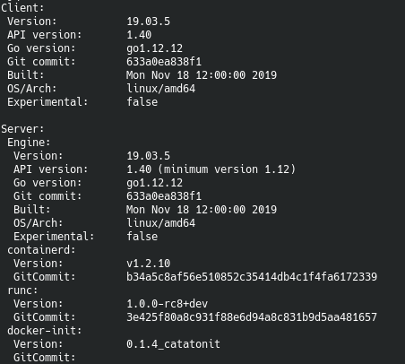

### 准备工作
```bash
# 把当前用户添加到 docker 用户组， 赋予 root 权限
sudo usermod -aG docker $UESER
```

### 启动 docker
```bash
# 重启动服务
sudo service docker restart
# 关闭服务
sudo service docker stop

```
### 确认
``` bash
docker version
```

<div class="myImage">



<label class="imageTitle"> </label>
</div>


<h3 class = 'auto-sort-block'>基本命令</h3>
<h4 class = 'auto-sort-sub'></h4>

alpine linux 


指令 | 解释 |
:-: | :-: |
docker pull redis | 从中央库拉取 redis 镜像 |
docker ps -a | 列出所有容器 |
docker rm -v $(docker ps -aq -f status=exited) | 删除所有已停止的容器 |
docker rm  $(docker ps -aq) | 删除所有已停止的容器 |
docker commit A test/B | 把容器 A 转化成 镜像 B |
-|-|
docker inspect -f {{.Mounts}} container-A | 列出数据卷在宿主机的实际位置 | 


#### 快速入门推荐阅读
- [一篇堪称Docker经典教科书的文章](http://www.360doc.com/content/19/0817/17/8859679_855510109.shtml)
- [Docker 三剑客简介](https://www.jianshu.com/p/9634c25955b6)
