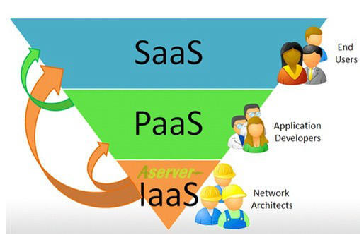
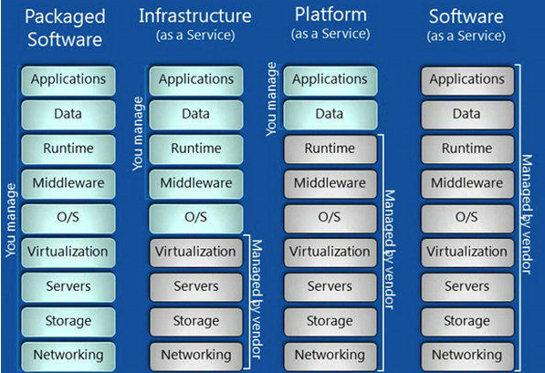
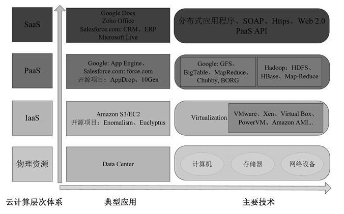

<h2 class = 'section-title'>云平台</h2>

<h3 class = 'auto-sort-block'>3 种核心的云平台</h3>

- IaaS : Infrastructure as a Service
- Paas : Platform as a Service
- Saas : Software as a Service

<label class="imageTitle"></label>

<label class="imageTitle"></label>

<label class="imageTitle"></label>

<h3 class = 'auto-sort-block'>新兴的云平台</h3>

- Fass : Function as a Service  
无服务架构：[serverless](https://serverless.com/)

- Cass : Container as a Service  
容器： docker

