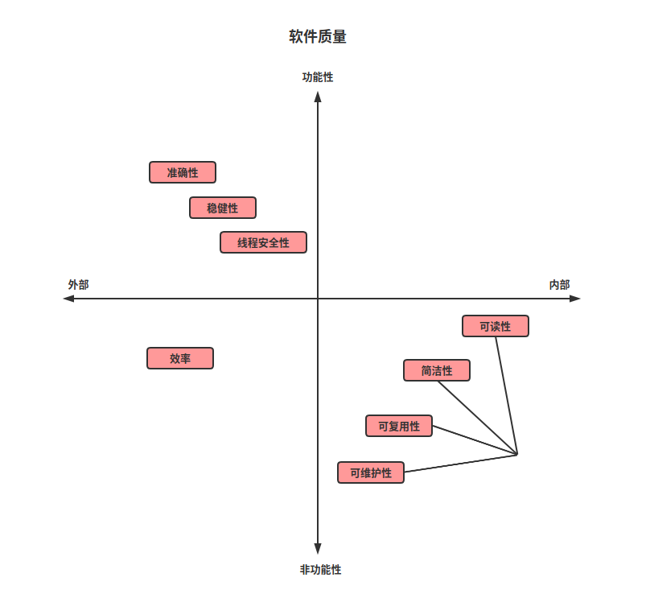

<h2 class = 'section-title'><label class = 'block-number'>1</label> 软件质量概述</h2>

**质量:** 软件按某种维度(尺度)进行评估的特征  
**外部质量:** 用户与系统交互可以感知到部分  
**内部质量:** 通过查看源码进行评估  

<label class="imageTitle"></label>

<h3 class = 'auto-sort-sub'>主要的外部软件质量</h3>

软件的外部质量属于程序的可观察特性, 因此是开发过程中核心关注点

<h4 class = 'auto-sort-sub1'>准确性</h4>

> 遵守既定的目标\规则\需求

例如, 对于烤面包机来说，准确确性意味着它必须可以烘烤切片面包，直到面包变得金黄、酥脆为止。

<h4 class = 'auto-sort-sub1'>稳健性</h4>

> 对错误的输入或无效（无法预料）的外部条件（例如某些资源的缺失）的容错能力。

稳健的烤面包机不会因为将百吉饼、叉子放进去，或什么都不放而着火。它也会具有防止过热等保护措施。

可靠性 = 正确性 + 稳健性

<h4 class = 'auto-sort-sub1'>易用性</h4>

现代的弹出式烤面包机非常易于使用，不需要用推杆将面包推入并开始烘烤，也不需要用旋钮调节烘烤量。软件的易用性和它的用户界面（UI）设计息息相关，并通过人机交互和用户体验（UX）设计等学科来解决。

<h4 class = 'auto-sort-sub1'>效率</h4>

> 适当的资源消耗

烤面包机的效率指的是它完成烤面包任务需要花费多长时间和电力。对软件而言，时间和空间（内存）是所有程序都需要消耗的两个资源。许多程序还需要网络带宽、数据库连接和众多其他资源。`不同的资源间通常需要进行权衡取舍`。功率更强的烤面包机可能更快，但需要消耗更多（峰值）电力。

尽管这里将效率列为外部质量，但本质上还是模棱两可。比如网络带宽，对用户并不可见，只能通过专用工具或分析源代码来评估。所以上图将`效率`放在靠中间位置。  

**以下两种情况下, `效率`属于功能性质量范畴:**  
1. **性能敏感的应用**  
1. **效率差到影响正常操作**  

<h3 class = 'auto-sort-sub'>主要的内部软件质量</h3>

> 查看程序的源代码比运行它能更好地评估其内部质量。

<h4 class = 'auto-sort-sub1'>可读性</h4>

> 可读性良好的程序很容易被其他程序员理解，或者其作者过了一段时间再回头看时还能理解。可读性是极其重要的，而且其价值经常被低估。

谈论烤面包机的可读性似乎有些奇怪，不过要意识到，对于所有的内部质量，我们讨论的其实都是结构和设计。`软件质量的相关国际标准将这个特征称为可分析性`。所以，可读性良好的烤面包机在被打开检查时，是很容易分析的：它有清晰的内部布局，加热原件和电子设备进行了很好的分离，电源电路和定时器很易于识别，等等。

<h4 class = 'auto-sort-sub1'>可复用性</h4>

> 复用代码来解决类似问题的难易程度，以及所需的改动量，又称为适应性。

如果制造烤面包机的公司能够将其设计和零件用于制造其他电器，那么你可以认为这款烤面包机是可复用的。例如，它的电源线很可能是标准的，因此可以和类似的小型电器兼容；也许它的定时器可以被用在微波炉中；等等。

代码复用是面向对象（object-oriented，OO）编程范式的一大亮点。经验证明，使用大量可复用的软件组件来构建复杂系统的愿景被夸大了。相反，现代编程趋势更喜欢专为可复用性而设计的库和框架。在这些库和框架之上，是一层不那么薄的、不考虑可复用性的应用相关代码。

<h4 class = 'auto-sort-sub1'>可测试性</h4>

> 为程序编写测试的能力，以及编写测试是否容易。它能够触发所有相关的程序行为，并观察其结果。

在讨论烤面包机的可测试性之前，要尝试弄清楚对烤面包机的测试大概是什么样子的。

<h4 class = 'auto-sort-sub1'>可维护性</h4>

> 易于发现和修复bug，以及改进软件。

<h3 class = 'auto-sort-sub'>软件质量各维度之间的关系</h3>

