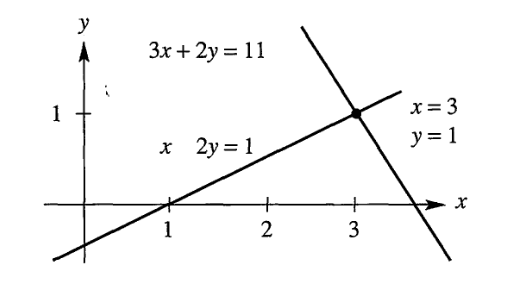
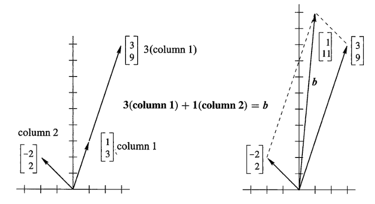
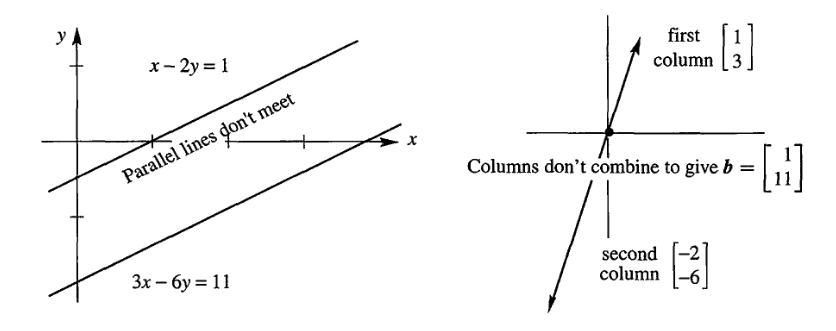
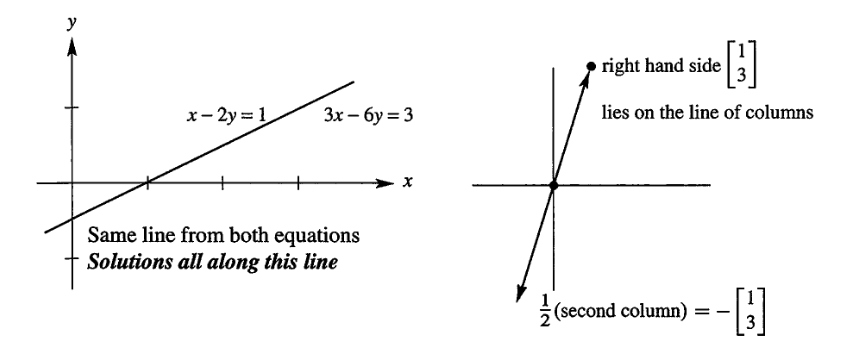
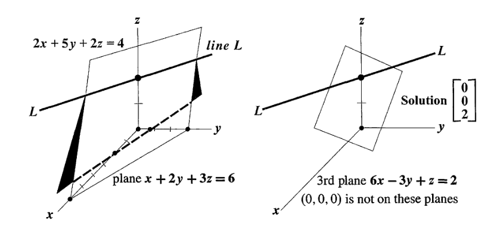
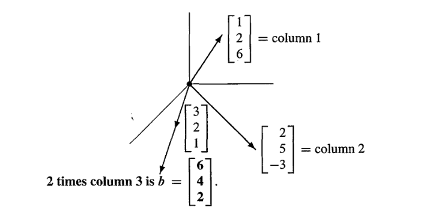
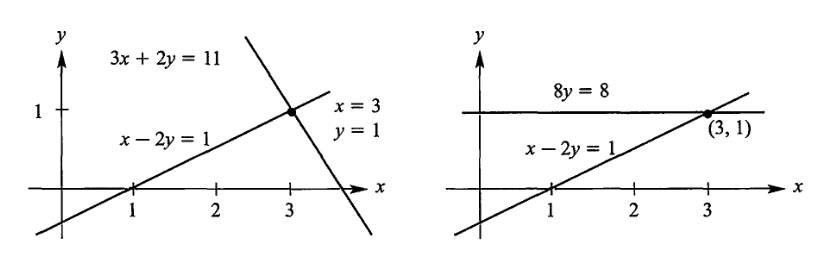

# 线性代数导论

<h2 class = 'section-title'><label class = 'block-number'>1</label> 向量引入</h2>

> 你不能把苹果和橘子相加，这就是向量产生的原因

线性代数的两个核心操作是`线性组合` `ss`, 而这两个操作的基础是`向量`

<h2 class = 'section-title'><label class = 'block-number'>2</label>方程组的解</h2>

<h3 class = 'auto-sort-sub'>向量和线性组合</h3>
<h3 class = 'auto-sort-sub'>问题引入</h3>

<h4 class = 'auto-sort-sub1'> 解下列的二元方程组 </h4>

$$
\begin{alignedat}{2}
&x \enspace -  \enspace 2&y \enspace&= \enspace 1 \\
3&x \enspace + \enspace 2&y \enspace&= \enspace 11
\end{alignedat}
$$

$\qquad \blacktriangleright \> 矩阵表示$ 
$$
{\bf{A} \atop \begin{bmatrix} 1  &-2 \\ 3  &2 \end{bmatrix}}
{\bm{x} \atop \begin{bmatrix} x \\ y \end{bmatrix}}
\quad {\bm{b} \atop \begin{bmatrix} 1 \\ 11 \end{bmatrix}}
$$

$\qquad \blacktriangleright \> 行表示$ 
$$
\begin{bmatrix}
{x \enspace -  \enspace 2y \enspace}  \\
{3x \enspace + \enspace 2y \enspace}
\end{bmatrix}
= \begin{bmatrix} 1 \\11 \end{bmatrix}
$$

<label class="imageTitle">行图像：点（3,1）为方程组的解 </label>

$\qquad \blacktriangleright \> 列表示$ 
$$
\bm{x} \begin{bmatrix} 1\\3 \end{bmatrix}
+\bm{y} \begin{bmatrix} -2\\2 \end{bmatrix}
=\begin{bmatrix} 1\\11 \end{bmatrix}
$$

<label class="imageTitle">列图像：列向量的线性组合</label>

$\qquad \blacktriangleright \>无解的情况$ 

$$
\begin{alignedat}{2}
&x \enspace -  \enspace 2&y \enspace&= \enspace 1 \\
3&x \enspace + \enspace 6&y \enspace&= \enspace 11
\end{alignedat}
$$

<label class="imageTitle">无解时的行图像和列图像 </label>

$\qquad \blacktriangleright \>无数解的情况$ 

$$
\begin{alignedat}{2}
&x \enspace -  \enspace 2&y \enspace&= \enspace 1 \\
3&x \enspace + \enspace 6&y \enspace&= \enspace 3
\end{alignedat}
$$

<label class="imageTitle">无数解时的行图像和列图像 </label>

<h4 class = 'auto-sort-sub1'> 解下列三元方程组 </h4>

$$
\begin{alignedat}{}
 &x& &+& 2&y& &+& 3&z& &=& 6 \\  
 2&x & &+& 5&y& &+& 2&z& &=& 4 \\  
 6&x& &-& 3&y& &+& &z& &=& 2  
 \end{alignedat}  
 $$

$\qquad \blacktriangleright \> 矩阵表示$ 
$$
{\bf{A} \atop \begin{bmatrix} 1&2&3 \\ 2&5&2 \\ 6&-3&1 \end{bmatrix}}
{\bm{x} \atop \begin{bmatrix} x \\ y  \\ z \end{bmatrix}}
\quad {\bm{b} \atop \begin{bmatrix} 6 \\ 4 \\ 2 \end{bmatrix}}
$$

$\qquad \blacktriangleright \> 行表示$ 
$$
\begin{bmatrix}
\begin{alignedat}{}
 &x& &+& 2&y& &+& 3&z \\  
 2&x & &+& 5&y& &+& 2&z \\  
 6&x& &-& 3&y& &+& &z  
 \end{alignedat}  
\end{bmatrix}
= \begin{bmatrix} 6 \\4 \\2 \end{bmatrix}
$$

<label class="imageTitle">行图像：点（0,0,2）为方程组的解 </label>

$\qquad \blacktriangleright \> 列表示$ 
$$
x\begin{bmatrix}1 \\ 2 \\ 6 \end{bmatrix}  
\ +\ 
y\begin{bmatrix}2 \\ 5 \\ -3 \end{bmatrix}  
\ +\ 
z\begin{bmatrix}3 \\ 2 \\ 1 \end{bmatrix}  
= \begin{bmatrix} 6 \\4 \\2 \end{bmatrix}
$$

<label class="imageTitle">列图像：列向量的线性组合 </label>

$$
\begin{alignedat}{2}
以上示例中&列表示的方式称为(列)向量的线性组合， \colorbox{#bbbbbb}{我们最好用线性组合的方式去看待矩阵与向量的乘积}
\\\\
\blacktriangleright 行向量&的线性组合 \\
&\begin{pmatrix} a_1 & a_2 & a_3\end{pmatrix}
\begin{bmatrix}
\dots line_1  \dots \\
\dots line_2  \dots \\
\dots line_3  \dots
\end{bmatrix}
= a_1 \begin{pmatrix} \dots line1  \dots \end{pmatrix}
+ a_2 \begin{pmatrix} \dots line2  \dots \end{pmatrix}
+ a_2 \begin{pmatrix} \dots line3  \dots \end{pmatrix}

\\\\
\blacktriangleright 列向量&的线性组合 \\
&\begin{bmatrix}
\begin{matrix} \vdots \\ c_1 \\ \vdots \end{matrix} &
\begin{matrix} \vdots \\ c_2 \\ \vdots \end{matrix} &
\begin{matrix} \vdots \\ c_3 \\ \vdots \end{matrix}
\end{bmatrix}
\begin{bmatrix} a_1 \\ a_2 \\ a_3\end{bmatrix}
= a_1 \begin{bmatrix} \vdots \\ c_1 \\ \vdots \end{bmatrix}
+ a_2 \begin{bmatrix} \vdots \\ c_2 \\ \vdots \end{bmatrix}
+ a_3 \begin{bmatrix} \vdots \\ c_3 \\ \vdots \end{bmatrix}

\\\\
\blacktriangleright 矩阵形&式的线性组合 \\
&\begin{bmatrix}
    a_{1} & a_{2} & a_{3} \\
    b_{1} & b_{2} & b_{3} \\
    c_{1} & c_{2} & c_{3} 
    \end{bmatrix}
    \begin{bmatrix} 
    k_{11} & k_{12} & k_{13} \\
    k_{21} & k_{22} & k_{23} \\
    k_{31} & k_{32} & k_{33}
\end{bmatrix}
\xRightarrow{行向量线性组合}
\begin{bmatrix}
      a_1 \begin{pmatrix} k_{11} & k_{12} & k_{13} \end{pmatrix}
    + a_2 \begin{pmatrix} k_{21} & k_{22} & k_{23} \end{pmatrix}
    + a_3 \begin{pmatrix} k_{31} & k_{32} & k_{33} \end{pmatrix}
    \\
      b_1 \begin{pmatrix} k_{11} & k_{12} & k_{13} \end{pmatrix}
    + b_2 \begin{pmatrix} k_{21} & k_{22} & k_{23} \end{pmatrix}
    + b_3 \begin{pmatrix} k_{31} & k_{32} & k_{33} \end{pmatrix}
    \\
      c_1 \begin{pmatrix} k_{11} & k_{12} & k_{13} \end{pmatrix}
    + c_2 \begin{pmatrix} k_{21} & k_{22} & k_{23} \end{pmatrix}
    + c_3 \begin{pmatrix} k_{31} & k_{32} & k_{33} \end{pmatrix}
\end{bmatrix}
\\\\
&\begin{bmatrix}
    a_{1} & a_{2} & a_{3} \\
    b_{1} & b_{2} & b_{3} \\
    c_{1} & c_{2} & c_{3} 
    \end{bmatrix}
    \begin{bmatrix} 
    k_{11} & k_{12} & k_{13} \\
    k_{21} & k_{22} & k_{23} \\
    k_{31} & k_{32} & k_{33}
\end{bmatrix}
\xRightarrow{列向量线性组合}
\begin{bmatrix}
    \left(\begin{array}{c} \enspace\>
          k_{11} \begin{pmatrix} a_1 \\ b_1 \\ c_1 \end{pmatrix}
        \\\\ + k_{21} \begin{pmatrix} a_2 \\ b_2 \\ c_2 \end{pmatrix}
        \\\\ + k_{31} \begin{pmatrix} a_3 \\ b_3 \\ c_3 \end{pmatrix}
     \end{array}\right)   
     &
    \left(\begin{array}{c} \enspace\>
         k_{12} \begin{pmatrix} a_1 \\ b_1 \\ c_1 \end{pmatrix}
        \\\\ + k_{22} \begin{pmatrix} a_2 \\ b_2 \\ c_2 \end{pmatrix}
        \\\\ + k_{32} \begin{pmatrix} a_3 \\ b_3 \\ c_3 \end{pmatrix}
     \end{array}\right)   
     &
    \left(\begin{array}{c} \enspace\>
          k_{13} \begin{pmatrix} a_1 \\ b_1 \\ c_1 \end{pmatrix}
        \\\\ + k_{23} \begin{pmatrix} a_2 \\ b_2 \\ c_2 \end{pmatrix}
        \\\\ + k_{33} \begin{pmatrix} a_3 \\ b_3 \\ c_3 \end{pmatrix}
     \end{array}\right)   
\end{bmatrix}

\end{alignedat}
$$

 

$ 问： 对于任意向量\ b, \> \rm{A_{3\times3} \large{\it{x}} = \it{b}} \ 是否有解?  $
$ 答： 看列的组合是否能覆盖三维空间，即\ A_{3\times3}\ 的每一列是否都有贡献，如果有一列没有贡献，三维空间就会坍塌成平面。 $

 <h4 class = 'auto-sort-sub1'>消元法</h4>

$$
\begin{alignedat}{2}
&x \enspace -  \enspace 2&y \enspace&= \enspace 1 \\
3&x \enspace + \enspace 2&y \enspace&= \enspace 11
\end{alignedat}
\quad \xRightarrow{\> 消元\> } \quad
\begin{alignedat}{2}
x \enspace -  \enspace 2&y \enspace&= \enspace 1 \\
 8&y \enspace&= \enspace 8
\end{alignedat}
$$

<label class="imageTitle">消元前后行图像对比 </label>

$\qquad \blacktriangleright \>消元矩阵$ 

$$
\begin{alignedat}{2}
&\begin{bmatrix}1 & -2 \\ 3 & 2 \end{bmatrix}
\begin{bmatrix}x  \\ y \end{bmatrix}
= \begin{bmatrix}1  \\ 11 \end{bmatrix}
\\\\
\xRightarrow{消元矩阵}
&\begin{bmatrix}1 & 0 \\ -3 & 1 \end{bmatrix}
\begin{bmatrix}1 & -2 \\ 3 & 2 \end{bmatrix}
\begin{bmatrix}x  \\ y \end{bmatrix}
=\begin{bmatrix}1 & 0 \\ -3 & 1 \end{bmatrix}
\begin{bmatrix}1  \\ 11 \end{bmatrix}
\\\\
\xRightarrow{行向量运算得}
&\begin{bmatrix}1 & -2 \\ 0 & 8 \end{bmatrix}
\begin{bmatrix}x  \\ y \end{bmatrix}
=\begin{bmatrix}1  \\ 8 \end{bmatrix}
\\\\
\xLeftrightarrow{增广矩阵形式最为简洁}
&\begin{bmatrix}1 & 0 \\ -3 & 1 \end{bmatrix}
\begin{bmatrix}1 & -2 & \color{red}{1} \\ 3 & 2  & \color{red}{11} \end{bmatrix}
\end{alignedat}
$$

<h4 class = 'auto-sort-sub1'>矩阵乘法的五种计算方式</h4>
$$
A = \begin{bmatrix}1 & 2 \\ 3 & 4 \end{bmatrix}
\quad 
B = \begin{bmatrix}10 & 20 \\ 30 & 40 \end{bmatrix}
$$

$\qquad \blacktriangleright \> 列向量法$ 
$$
第一列:\quad
10\begin{bmatrix}1 \\ 2 \end{bmatrix}   
\ +\ 
30\begin{bmatrix}2 \\ 4 \end{bmatrix}   
\ =\>
\begin{bmatrix}70 \\ 140 \end{bmatrix}   
\\
\\
第二列:\quad
20\begin{bmatrix}1 \\ 2 \end{bmatrix}   
\ +\ 
40\begin{bmatrix}2 \\ 4 \end{bmatrix}   
\ =\>
\begin{bmatrix}100 \\ 200 \end{bmatrix}   
\\
AB = \begin{bmatrix}70 & 100 \\ 140 & 200 \end{bmatrix}
 $$

