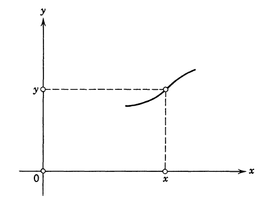
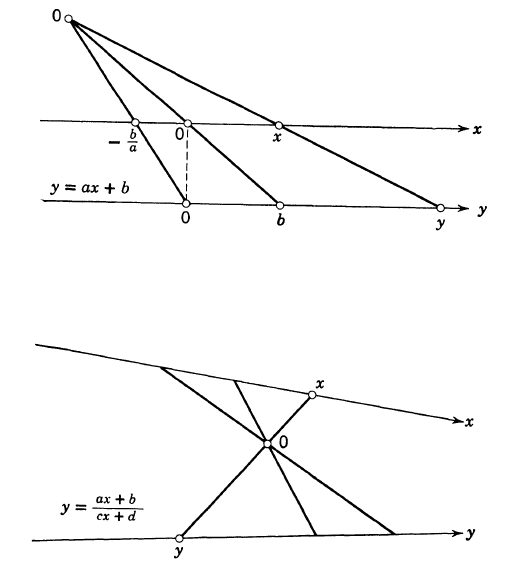
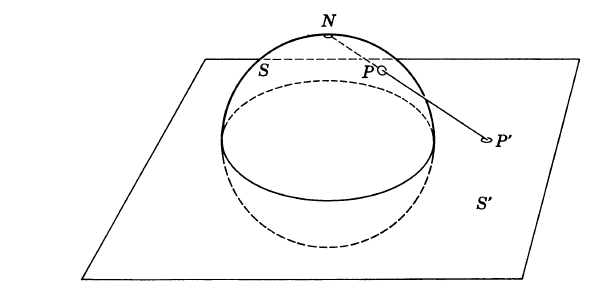
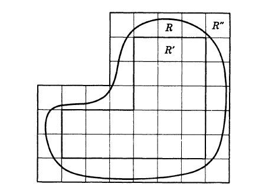
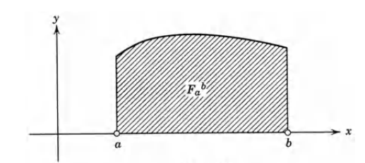
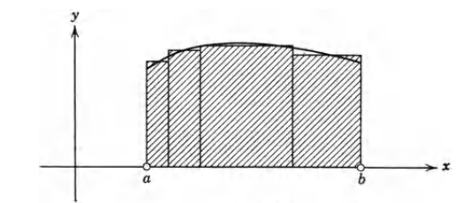
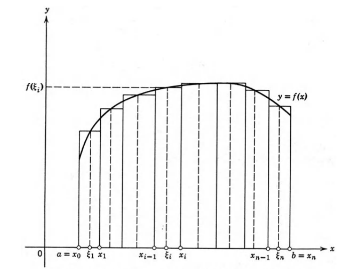
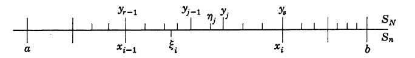
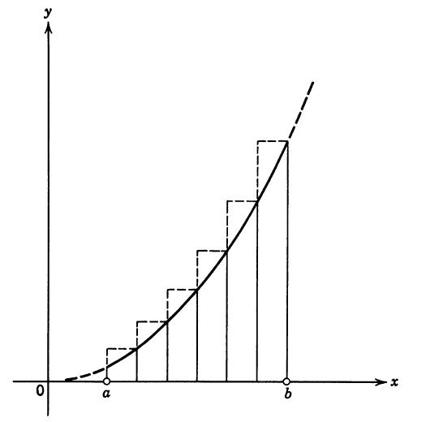

# 微积分和数学分析引论

<h2 class = 'section-title'>附录</h2>

<h3 class = 'auto-sort-sub'>常见公式</h3>

$$
\begin{aligned}

&\textbf{平方和}\\
&\qquad 
1^2+2^2+3^2+\dots + n^2=\frac{n(n+1)(2n+1)}{6}\\
\\
&\textbf{立方和}\\
&\qquad 
1^3+2^3+3^3+\dots +n^3=[\frac{n(n+1)}{2}]^2\\
\\
&\textbf{二项式定理}\\ 
&\qquad 
(a+b)^n  = \dbinom{n}{0}a^n+\dbinom{n}{1}a^{n-1}b+\dbinom{n}{2}a^{n-2}b^2+\dots+\dbinom{n}{n}b^n\\
\\
&\qquad其中，\dbinom{n}{k}=\frac{n!}{k!(n-k)!}\\
\\
&\textbf{超越数 e}\\
&\qquad
e = 1+\frac{1}{1!}+\frac{1}{2!}+\frac{1}{3!}\dots\\
&\qquad e = (1+\frac{1}{n})^n\\
\\
\end{aligned}
$$

<h4 class = 'auto-sort-sub1'>三角函数</h4>

$$
\begin{aligned}
&\textbf{}\\
&\qquad\displaystyle\lim_{x\to 0}\frac{\sin x}{x} = 1\\
\\
&\qquad\cos n\theta = \cos^n \theta - \dbinom{n}{2}\cos^{n-2}\theta\sin^2\theta + \dbinom{n}{4}\cos^{n-4}\theta\sin^4\theta \\
\\
&\qquad\sin n\theta=\dbinom{n}{1}\cos^{n-1}\theta\sin\theta-\dbinom{n}{3}\cos^{n-3}\theta\sin^3\theta\\
\\
&\textbf{德  莫阿弗尔定理}\\
&\qquad (\cos\theta+i\sin\theta)^n = \cos n\theta+i\sin n\theta\\
\\
\end{aligned}
$$

<h2 class = 'section-title'><label class = 'block-number'>1</label>引 言</h2>

自古以来，关于连续地变化、生长和运动的直观概念，一直在向科学的见解挑战。但是，直到 17 世纪，当现代科学和微积分以及数学分析迅速发展起来时，才开辟了一条理解连续变化的道路。

> 微积分的基本概念是`导数`和`积分`  
> - 导数：对于变化速率的一种度量  
> - 积分：对于`连续变化过程`总效果的度量

想要理解导数和积分需要理解`极限`和`函数`，而理解极限和函数又需要先了解`连续统`。

<h3 class = 'auto-sort-sub'>数的概念</h3>

> 自然数：1,2,3,...  
> 自然数是计算一个总体或集合中元素的一种合适工具

<h4 class = 'auto-sort-sub1'>自然数系及其扩展：计数和度量</h4>

##### 自然数和有理数
对于我们来说自然数序列 1,2,3,...是已知的，不需要从哲学的观点去讨论它属于怎样的范畴。 对于同数学打交道的人来说，重要的只是知道一些规律或定理，根据这些规则和定理将一些自然数组合成另一些自然数。

但是自然数无法度量曲线长度、物体体积或重量等。由于极其需要用称为`数`事物来表示`各种量的度量`，为此，不得不将数的概念加以扩充，以便能够描述`度量`的连续变化。这种扩充了的数系称为`数的连续统`或`实数系`。

**加法和乘法法则**  

交换率（commutative laws）：$ a + b = b+a $  

结合率（associative laws）：$ a + (b + c) = (a + b) + c $  

分配率（distributive law）：$ a(bc) = (ab)c $  

相消率（cancellation law）：如果 $a + c = b + c$，则 $a = b$

> 逆运算（除法和减法）在`自然数`集合中是不封闭的，如`1-2不属于自然数`

为了使逆运算不受限制的进行，人们不得不发明了`0`和`负整数`以及`分数`来扩充数的概念,这些数的全体被称为`有理数系`或`有理数集合`

`有理（rational）`派生自`ratio`,即关于两个量的比 

有理数域内，一切有理运算（用 0 做除数除外）得到的还是有理数。
**有理数的运算定律完全服从自然数的运算定律，因此，有理数是以完全直接的方式扩充了自然数系**

##### 稠密性
> 有理点在数轴上是稠密的  
> 在物理的现实中，各种量不能精确给出或求得，所以可以认为各种量可以用有理数来度量

##### 不可通约量
> 两个量，如果其比是有理数，则两个数为不可通约的

早在公元前五或六世纪，希腊数学家或哲学家就发现存在一些不可通约的量。

##### 无理数
因为有理数对于几何学来说是不够的，所以必须创造新的数作为不可通约量的度量，这些新的数被称为`无理数`

古希腊人不注重抽象的数的概念，而是把诸如线段这样的一些几何实体看作基本元素，他们用纯几何的方法发展出不但用来运算和处理可通约量，而且用来运算和处理不可通约量的逻辑体系。由毕达哥拉斯引入，欧多克斯推进，最后在欧几里得的《几何学源本》中详细叙述。

> 现代人在数的概念而不是几何概念的基础上，重建了数学

原则上我们只承认关于自然数的公理（包括数学归纳法原理），而有理数和实数都是在这个基础上被构造出来的。因此，关于实数的"公理", 实际上是关于自然数的一些需要证明的`定理`。

<h4 class = 'auto-sort-sub1'>实数和区间套</h4>

**区间套公理**  

如果 $I_1, I_2, I_3,\dots$ 是一个具有有理端点的

区间套序列

，则存在一个点 $x$ 包含于所有的 $I_n$ 中。

一个闭区间 $I_1, I_2,I_3,\dots$ 的集合, 其中每一个都包含着下一个并且长度趋于0

这是一个`连续性公理`，这个公理保证了实轴上没有空隙存在, 我们把这个公理作为实数连续统的特征。这个公理还有许多其他的表达方式。

<h4 class = 'auto-sort-sub1'>复数</h4>

为了使每一个代数方程都有具体的解，我们不得不引入复数，如希望方程 $x^2+1=0$ 具有根，我们不得不引入新的符号 $i$ 和 $-i$ 作为根。

<label class="imageTitle">图示: 复数 $c = x+iy$ 及其共轭复数的几何表示</label>

**极坐标表示**  
$\qquad c = r(\cos\theta+i\sin\theta)$  
$\qquad\bar{c} = r(\cos\theta-i\sin\theta)$  

<h3 class = 'auto-sort-sub'>函数的概念</h3>

> 1. 只要一些量 a,b,c,... 的值由另一些量 x,y,z,... 的值来确定，我们就说 a,b,c,...依赖于 x,y,z,..., 或者说是 x,y,z,... 的函数。  
> 1. 函数是对于自变量的给定值确定因变量的唯一值的数学规律;  
> 1. $y$ 通过函数`关系`依赖于 $x$ ，常常简单地表述为：$y$ 是 $x$ 的函数  

自 17 世纪以来，函数的概念一直是数学思想的核心。首先使用`函数(function)`一词的是莱布尼兹。
对于微积分来说，一般函数的概念不需要那么广泛，对于 x 值而确定 y 值所依据的 ”任意“对应规律，必须受到根本的限制。

<h4 class = 'auto-sort-sub1'>映射--图形</h4>

在几何上，我们常常把自变量解释为一维或多维空间中一个点的坐标。

对于定义域中的每个点 P, 函数规定了因变量的确定值点 Q (点 P 的像)，于是，我们说，`函数将点 P 映射为点 Q` ， 点 Q 构成函数的所有值域，此值域中每一个点 Q , 是函数定义域中一个或多个点的像

对于单自变量和单因变量，通常用平面图形来表示，即用（x, y）组成的曲线来表示。

<label class="imageTitle">图示1-3 : 函数的图形 </label>

如果我们不把 x 和 y 解释为 x, y 平面上同一点的坐标，而是解释为两个不同的独立的数轴上的点。于是，`函数就把 x 轴上的点 x 映射为 y 轴上的点 y`, 这种映射在几何学中常常出现，例如，把 x 轴上的点 x 投影到平行的 y 轴上的点 y (投影中心 O 在两轴所在的平面内)所产生的`仿射`映射。

<label class="imageTitle">图示1-4 : 映射 </label>

<label class="imageTitle">图示1-5 : 球极平面投影 </label>

画地图常用球极平面映射

> 由于许多这样的例子，使得我们把函数解释成`映射`

<h4 class = 'auto-sort-sub1'>函数的定义域和值域</h4>

> 定义域：对于单自变量 x 的函数，使得函数有定义的 x 值的全体

函数用 $f, F, g$ 等符号表示， 而 $x$ 与其对应的 $y$ 值之间的对应关系则写成 $y = f(x), y=F(x)$ 等形式, 有时也写成 $y=y(x)$ 的形式

对于把 $x$ 映射成 $y$ 的函数 $f$, 有时也写成： $f: x \mapsto y$

严格来说，由 $f(x)=x^2, x\in (0, 2)$, 所描绘的函数 $f$, 与 $g(x)=x^2, x\in(-2, 2)$, 所描绘的函数 $g$, 不是同样的函数。此处，我们把 $f$ 称为 $g$ 的`限定`，或称 $g$ 为 $f$ 的`拓展`

同一个函数 $f$, 能够由许多不同的函数经过限定来产生。

**多值函数**  
对于几何上可绘制的曲线，例如：$x^2+y^2=1$, 曲线的整个图形不是由一个（单值)函数给出的, 而是由两个函数 $y=\sqrt{1-x^2}$ 和 $y=-\sqrt{1-x^2}$ 来表述。这种曲线没有明确规定对应的函数， 我们有时说，这种曲线是由`多值函数`表示的，这时，表示一条曲线的各个函数，称为对应于该曲线的多值函数的单值`分枝`

为简明起见， `函数` 一词， 指的就是`单值函数`

<h4 class = 'auto-sort-sub1'>函数的连续性和间断性</h4>

**局部连续性**  

对于 $\forall \,\epsilon^+, \exist \,\delta^+$, 对定义域中满足 $|x-x_0|\lt\delta$ 的一切
 $x$ 值，有 $|f(x)-f(x_0)|\lt\epsilon$ 成立，则函数 $f(x)$ 在其定义域中的点 $x_0$ 是连续的

存在量 $\delta$ 称为`连续性的模`, 一般来说，这个 $\delta=\delta(\epsilon)$ 不仅依赖于 $\epsilon$, 而且还依赖于 $x_0$ 的值。
连续性的模表明了 $f$ 对 $x$ 的`变化的敏感度`。显然对于相同的 $x_0$ 和 $\epsilon$ 总能用任意更小的正值 $\delta'$ 来代替。
对于各种实际目的，如数值计算中，我们所关心的可能是 $\delta$ 的特定选择，如，$\delta$ 的最大值。另一方面， 如果我们仅仅想要证实 $f$ 在 $x_0$ 是连续的这一事实，那么只须找到任意一个连续模即可。

<label class="imageTitle">图示: 映射 $y=f(x)$ 在点 $x_0$ 的连续性</label>

<label class="imageTitle">图示: x-y 平面 $y=f(x)$ 在点 $x_0$ 的连续性</label>

 

**跳跃性间断性**  

当 $x$ 趋近与 $\xi$ 时，$f(\xi-\delta) \not = f(\xi+\delta)$ 或者 $f(\xi\pm\delta)\not = f(\xi)$, 其中 $\delta \to 0$

<label class="imageTitle">图示: 跳跃性间断点</label>

跳跃性间断的一个特例为`可去间断点`，这时两边趋近的极限值相等，但不等于间断点 $\xi$ 上 $f$ 的值

<label class="imageTitle">图示: $x=0$时，具有无穷间断性</label>

**一致连续性**  

如果对于 $\forall \ \epsilon^+$,  $\exist \ \delta^+$, 使得 $|f(x)-f(x_0)|\lt\delta$, 其中 $x$ 和 $x_0$ 是某个区间中满足 $|x-x_0|\lt\delta$ 的`任意两个点`，则 $f(x)$ 在此区间上是一致连续的。

例如，函数 $f(x)=5x+3$, 对于自变量的一切值来说，是一致连续的。因为 当取 $|x-x_0|\lt\frac{1}{5}\epsilon$ 时，$|f(x)-f(x_0)|=5(x-x_0)\lt\epsilon$, 于是，$\delta(\epsilon)=\frac{1}{5}\epsilon$ 表示一致连续模。

任何函数，如果在一个`有界闭区间`上是连续的，自然在此区间上是一致连续的。

**李普希兹连续性**  

对于区间 [a, b] 上的一切 $x_1, x_2$, 以及固定的值 $L$, 函数满足李普希兹条件：
$$|f(x_2)-f(x_1)|\le L|x_2-x_1|$$
即，表达式 $\delta(\epsilon)=\frac{\epsilon}{L}$ 是可能有的连续模。

李普希兹连续性对于一致连续性来说，只是充分条件，而不是必要条件。

**霍尔德尔连续性**  

对于区间 [a, b] 上的一切 $x_1, x_2$, 以及固定的值 $L$, 函数满足霍尔德尔条件：
$$|f(x_2)-f(x_1)|\le L|x_2-x_1|^\alpha$$
其中，霍尔德尔指数 $\alpha$ 的取值限于 $0\lt\alpha\le 1$., 当 $\alpha = 1$时为李普希兹连续性 

例如，函数 $f(x)=\sqrt x$ 是霍尔德尔连续的，其指数 $\alpha = \frac{1}{2}$, 但不是李普希兹连续的。

霍尔德尔连续函数，仍然没有将所有一直连续的函数包括在内。

<h4 class = 'auto-sort-sub1'>中间值定理</h4>

**中值定理**

对于某区间的每个点都连续的函数 $f(x)$, 设 $a$ 和 $b$ 是此区间的任意两个点，而 $\eta$ 是 $f(a)$ 和 $f(b)$ 之间的任意一个数，则在 $a$ 和 $b$ 之间存在数值 $\xi$, 使得 $f(\xi)=\eta$

<button class="toggleAnswer answer-button">证明:</button>

//TODO

<h3 class = 'auto-sort-sub'>初等函数</h3>

> 通过反复进行初等运算(加法和乘法)而得到的函数

<h4 class = 'auto-sort-sub1'>有理函数</h4>

**多项式函数（最基本的函数）**  
$$y=a_0+a_1x+\dots +a_nx^n\, $$
> 最简单的多项式函数，即线性函数：$y=ax+b$

一般的有理函数:

$$y=\frac{a_0+a_1x+\dots +a_nx^n}{b_0+b_1x+\dots +b_nx^n}\, $$

> $y=\frac{1}{x}$ 是除多项式函数外最简单的有理函数。

<h4 class = 'auto-sort-sub1'>代数函数</h4>

为了解决寻求有理函数的反函数问题，我们不得不超出有理函数集合的范围。
代数函数的一般形式如下，
$$y=\sqrt[n]{R(n)} \>\> ,其中 R(n) 为有理数 $$
> 常见函数: $y=x+\sqrt{x^2 + 1}$

<h4 class = 'auto-sort-sub1'>初等超越函数</h4>

有理函数和代数函数是由初等运算直接定义的，而几何学则首次产生了另一些函数，即

超越函数

, 初等超越函数有`三角函数`、`指数函数`和`对数函数`。

"超越" 仅仅指这些函数的定义超过了初等运算

##### 三角函数

<label class="imageTitle">图示: 三角函数的几何定义</label>

<label class="imageTitle"></label>

<label class="imageTitle"></label>

1. "超越" 一词并不意味着任何特殊深奥与神秘，它仅仅指出这些函数的定义超出了初等运算。  
2. 以上只是三角函数的几何定义, 以下给出三角函数的分析定义：

//TODO

##### 指数函数和对数函数

指数函数：$$y = a^x $$
及其反函数(对数函数)：
$$x = \log_a y$$

 
<b>这里给出定义指数函数的一种"初等"方法,<b>
<button class="toggleAnswer answer-button">如下</button>

$$
\begin{aligned}
&如果\ x = \frac{p}{q} \in \mathbb{Q},\ p\in\Z^+,\ q\in\Z^+, \ a \in \R,\> 则\ a^x = \sqrt[q]{{\large a}^p} = {\large a}\frac{p}{q} \\
&因为 \> 有理数\ x\ 是处处稠密的， 如果我们可以将\ y\ 的作用域扩展到无理数上（大胆假设小心证明），即\ x \in \R^+, \\
&则就定义的一个连续的函数 y=a^x(指数函数) \\
&于是， 当 y \lt 0 时， 函数 x = \log_xy 可以被定义为指数函数的反函数 \\
\end{aligned}
$$

如何定义指数函数？\\TODO

<h4 class = 'auto-sort-sub1'>复合函数和反函数</h4>

##### 复合函数
通常构成新函数的方法，不仅可以通过用有理运算来组合已知函数， 还可以通过更一般的方法，即复合函数法

<label class="imageTitle">图示: 两个映射的符号积 $g\psi = f$</label>

1. $g\psi = g(\psi)$, 不要把它同普通函数的代数积 $g(x)\psi(x)$ 混淆。
1. 一般情况下，$g(\psi)\not = \psi(g)$
1. 为了能够构成两个映射的符号积 $g\psi$, $g$ 的定义域必须包括 $\psi$ 的值域。

例如， 函数 $f(x) = \sqrt{1+\sin(x^2)}$, 可以通过依次组合 $\phi(x)=x^2, \psi(\phi)=1+\sin \phi, g(\psi)=\sqrt{\psi} = f(x)$ 而构成。 符号表示为 $f=g\psi\phi$.

##### 反函数
$g\psi x = x$ ， $g$ 称为 $\psi$ 的`逆或反函数`

##### 恒等映射
我们定义恒等映射 $I$, 即将每一个 $x$ 映射到自身的映射，如果 $g$ 是 $\psi$ 的逆，则 $g\psi =I$. 其中 $g$ 可表示为 $\psi^{-1}$

例如， $u = \sin x$ 的反函数 $x=\arcsin u$, 常常用 $x=\sin^{-1}u$ 来表示

单调连续函数是具有反函数或定义一对一映射的唯一连续函数。

如果 $g$ 和 $\psi$ 都是连续的，则 $g(\psi(x))$ （在定义处）是连续的。

通过这个一般性的定理，我们可以把复杂的函数拆分成复合函数来证明它的连续性，这比试图直接作出此函数的连续模要容易的多。

<h3 class = 'auto-sort-sub'>序列</h3>

整个数学分析归根到底所依据的基本概念，乃是无穷序列 $a_n$ 的极限概念。

<h4 class = 'auto-sort-sub1'>$a_n=\frac{1}{n}$</h4>
序列由一串矩形来描述是很方便的，如下图所示的序列 $a_n=\frac{1}{n}$ ：

<label class="imageTitle">图示: 序列 $a_n=\frac{1}{n}$ </label>

当然也可以选取四周边线 $x=n, x=n+1,y=a_n, y=0$ 的矩形来表示 $a_n$

<h4 class = 'auto-sort-sub1'>$a_n=\sqrt[n]{p}$</h4>

如果 $h\in \R^+$, $n \in \Z^+$, 则
$$(1+h)^n \ge 1 + nh $$

如果序列 $a_n = \sqrt[n]{p}$, 其中 p > 0, 则 
$$\lim_{n \to \infty}a_n = \lim_{n \to \infty}\sqrt[n]{p} = 1 $$

<button class="toggleAnswer answer-button">证明:</button>

//TODO

<h4 class = 'auto-sort-sub1'>$a_n = \alpha^n$</h4>

<h4 class = 'auto-sort-sub1'>极限</h4>

极限在数学分析中的优越性主要在于这一事实: 有些重要问题所具有的数值解，
往往不能用别的方法直接表示，但能用极限的方式来描述。这个数学分析就是由这一事实的一系列实例组成的。
例如，`把无理数表示成有理数极限`的做法，就是一个典型的例子。

**极限的定义**

假设对于给定的无穷点列 $a_1,a_2,a_3,\dots,$ , 存在一个数 $l$, 使得每个包含点 $l$ 的任意小开区间，都包含着除去最多为有限点以外的所有的点 $a_n$. 这时，数 $l$ 称为该序列的极限，或者说该序列收敛于 $l$, 记作，$\displaystyle\lim_{n\to\infty}a_n=l$ 

$\xLeftrightarrow{等价于}$

对于 $\forall\epsilon, \epsilon\to 0^+$, $\exist N=N(\epsilon), N\in\N$, 使得对于 $n\gt N(\epsilon)$, 总有 $|a_n-l|\lt\epsilon$

极限的定义与函数在某点连续的定义相似，其实函数在一点的连续性能够通过`序列极限`来表示。那里足够小的量 $\delta(\epsilon)$ 所起的作用， 就是这里足够大的数 $N(\epsilon)$ 所起的作用，

一个序列，如果即是单调的又是有界的，则是收敛序列。
$\xLeftrightarrow{等价于}$ 实数的连续性公理

<h4 class = 'auto-sort-sub1'>柯西收敛判别法</h4>

收敛的序列一定是有界的，但不一定是单调的。柯西收敛判别法适用于非单调序列收敛性的判别，最重要的是它不需要预先知道序列的极限值。

**柯西收敛判别法**  

序列 ${a_n}$ 收敛 $\xLeftrightarrow{充分必要条件}$ 对于 $\epsilon\gt 0, \exist N=N(\epsilon), N\in\N$, 使得 $n \gt N, m \gt N$ 时，有 $|a_n=a_m|\lt\epsilon$

<button class="toggleAnswer answer-button">证明:</button>

//TODO

<h3 class = 'auto-sort-sub'>级数</h3>

序列就是无穷多个数的有序排列 $a_1,a_2,\dots,$ 级数就是把序列各项按次序加起来。

级数 $s_n = a_1+a_2+\dots+a_n\,.$

对于 $a_1+a_2+\dots + a_n$, 习惯上用符号 $\displaystyle\sum_{i=1}^{n} a_i$ 表示

无穷级数 $s=\displaystyle\lim_{n\to\infty}s_n$=$\displaystyle\sum_{i=1}^{\infty}a_i$

<h3 class = 'auto-sort-sub'>连续变量的函数极限</h3>

//TODO

抽象的演绎推理只不过是数学的一个方向，而数学分析的推动力量及其广大视野来自于物理现实和直观几何。

<h2 class = 'section-title'><label class = 'block-number'>2</label>积分学和积分学的基本概念</h2>

微分和积分是微积分中两种基本的极限过程，这两种过程是`彼此互逆`地联系着的。
微积分的发展是 17 世纪由牛顿和莱布尼兹各自独立创造。虽然牛顿和莱布尼兹以及他们的直接继承者，使这种强有力的工具得到各种应用，但是谁也没有完全阐明微积分的基本概念。直到 19 世纪，在通过严格表述`极限概念`和分析了`实数的连续统`后，才阐明了微积分的基本概念。

<h3 class = 'auto-sort-sub'>积分</h3>
<h4 class = 'auto-sort-sub1'>引言</h4>

`微分`概念的产生是为了描述曲线的切线和运动质点的速度，更一般地说，`是为了描述变化率的概念`  

<label class="imageTitle">图示1-6 : 面积的近似法 </label>

曲线区域 $R$ 的面积介于区域 $R^{'}$ 和 $R^"$ 的面积

追溯到古代，以上就是在初等几何中为了描述圆的面积所使用过的穷举法,这种直观思想的精确的数学论述导致积分概念的产生

<h4 class = 'auto-sort-sub1'>作为面积的积分</h4>

##### 曲线下的面积
当我们将面积同`函数`联系起来时，便产生了积分的分析概念。
现在我们暂且从`直观`上接受以下的思想：下图所示区域的面积是一个确定的数,我们将这个数 $F_{a}^{b}$ 称为函数 $f(x)$ 在积分限 $a$ 和 $b$ 之间的积分。

<label class="imageTitle">图示1-7 </label>

我们用 $F_n$ 表示 $n$ 个小矩阵面积之和。如果将 n 无限增大，而各个块的最大长度趋于 0 , 则数值 $F_n$ 趋向于 $F_{a}^{b}$

<label class="imageTitle">图示1-8 </label>

<h4 class = 'auto-sort-sub1'>积分的分析定义</h4>

##### 积分的定义和存在
上一节，我们将曲线下的面积理解为直观上给定的量，随后又将它表示为极限值，现在我们把顺序颠倒过来，先用纯分析的方式讨论上面定义的 $F_n$ , 并且 $F_n$ 趋向于确定的极限值，然后将这个极限作为积分或面积精确的定义。

设函数 $f(x)$ 在闭区间 $a \leq x \leq b$ 上是连续的，我们用 n-1 个分点 $x_1, x_2, ..., x_{n-1}$ 将区间分成 n 个相等或不等的单元，其长度为 
$$ x_i - x_{i-1} = \Delta x_i  (i = 1, 2,..., n) $$ 
此外，令 $x_0 = a, x_n = b$ , 在每个闭区间 $[x_{i-1}, x_i]$ 或单元上，我们随意选取任意一点 $\xi_i$, 然后作和式 $$F_n = \sum_{i=1}^{n} f(\xi_i)\Delta x_i$$

<label class="imageTitle">图示1-9 </label>

当子区间的个数无限增加且最大子区间的长度趋于 0 时，和 $F_n$ 必定趋于极限 $F_{a}^{b}$ 。我们将 $F_{a}^{b}$ 称为 $f(x)$ 在积分限 a 和 b 之间的积分。  
然而，几何上的直观，无论多么令人信服，也只能作为我们分析上求极限的过程的引导。因此分析证明是必要的，而且必须证明作为上述极限的`积分的存在性`，另外，完全不必要求函数 $f$ 在积分区间上为正。

**连续函数的积分存在定理**  
只要函数 $f(x)$ 在闭区间 [a, b] 上是连续的，则 $F_n$ 在下限 $a$ 和上限 $b$ 之间的定积分存在。

<button class="toggleAnswer answer-button">证明:</button>

提示：证明方式主要是根据函数的一致连续性
 

$\forall\enspace\epsilon\to 0^+,\,\exist\enspace\delta \to 0^+ $, 使得 $| f(x) - f(x_0)| \lt \epsilon$, 其中 $x$ 和 $x_0$ 是某个区间中满足 $|x-x_0|\lt\delta$的任何两个点，则 $f(x)$ 在此区间上是一致连续的

 
用相继的点把区间 [a, b] 划分为 n 个单元，其中 $x_0 = a, x_n = b$, 并且 $x_0 \lt x_1 \lt ...x_n$。分划的粗细程度称为

跨距 (span)
，若跨距趋于0, 则近似和表示为 $F_n$。

$\Delta x_i = x_i - x_{i-1}$ 中最大者

设 $S_n$ 表示如上的一种划分。由于 $f$ 的一致连续性，只要 $S_n$ 的跨距小于 $\delta=\delta(\epsilon)$, 则同一单元中的任意两点上的 f 值之差小于 $\epsilon$. 在每一个单元 $[x_{i-1}, x_i]$ 上选取值 $\xi_i$, 这样就得到的基于分划 $S_n$ 的近似和。
$$F_n = \displaystyle\sum_{i=1}^n f(\xi)\Delta x_i \,;$$

首先证明，对于分划序列 $S_n$, 如果其跨距趋于0, 则近似和 $F_n$ 收敛于某一极限，我们用 $\int_a^b f(x)dx$ 来表示。
其次证明，$\int_a^b f(x)dx$ 与分划 $S_n$ 以及中间点 $\xi$ 的选择无关。
为了进行证明，我们首先将分别属于两个分划 $S_n$ 和 $S_N$ 的值 $F_n$ 与 $F_N$ 加以比较，其中 $S_n$ 的跨距小于 $\delta$, 而分划 $S_N$ 是分划 $S_n$ 的 "加密"。 
$$F_N = \displaystyle\sum_{j=1}^N f(\eta)\Delta y_j \,; $$

<label class="imageTitle"></label>

此时，$F$ 在单元 $[x_{i-1}, x_i]$ 的函数和 $\Delta F$ 可以表示为
$$\Delta F_i = \displaystyle\sum_{j=r}^s f(\xi_i)(y_j - y_{j-1})\,; $$
$\Delta F$的函数值和近似值的差距为
$$|f(\xi_i)(x_{i}-x_{i-1}) - \sum_{j=r}^s f(\eta)(y_j - y_{j-1})| \le \sum_{j=r}^s \epsilon (y_i - y_{j-1}) = \epsilon(x_i - x_{i-1}) \,;$$
则， 
$$|F_n - F_N| \le \sum_{i=1}^n\epsilon(x_i-x{i-1})=\epsilon(b-a)\,;$$
 现在，如果 $S_n$ 和 $S_m$ 是任意两个分划， 设 $S_n$ 和 $S_m$ 合成分划 $S_N$, 这样，$S_N$ 即是 $S_n$ 的加细又是 $S_m$ 的加细。，假设两者的跨距都小于 $\delta(\epsilon)$.
则，
$$|F_n - F_m| = |(F_n - F_N)+(F_N-F_m)|\le 2\epsilon(b-a)\,; $$
对于序列 $S_n$, 当 $ n \to \infty$ 时其跨距趋于0 。设 $F_n$ 是对应的近似和， 
则，序列 $F_n$ 满足

柯西收敛判别法

//TODO

，于是
$$\lim_{n \to \infty}F_n = F $$
证毕.

**拓展**:  
为了使和式 $F_n = \sum f_i\Delta x_i$ 收敛于积分，$f_i$ 不一定是一个函数值; 而只要对区间 $[x_{i-1}, x_i]$ 上的某个点 $\xi_i$, 有 $|f_i - f(\xi_i)| \lt \delta(\epsilon) $ 就足够了, 当 $\epsilon\to 0$ 时, $\delta(\epsilon)\to 0$ 。

为了证明这个命题，只要指出由 $\xi'_v$ 和 $\xi''_v$ 的偏差而引起的近似和的改变量 $D$, 在极限情况下趋于 0 。
 
例如，如果 $f(x) = \phi(x)\psi(x)$, 则和式表示为
$$\sum\phi(\xi'_v)\psi(\xi''_v)\Delta x_v\,; $$
其中 $\xi'_v$ 和 $\xi''_v$ 是该单元上不一定重合的两个点。当跨距趋于 0 时， 这个和式也趋向与积分，即
$$\int_a^b f(x)dx = \int_a^b\phi(x)\psi(x)dx\,,$$
$$D=\sum_{v=1}^n\phi(\xi'_v)[\psi(\xi''_v)-\psi(\xi'_v)]\Delta x_v\,.$$
因为 $\phi$ 是有界的，$\psi$ 是一致连续的，$\Delta x_v$ 充分小, 所以 $D$ 为任意小。

例如， 
$$\sum_{v=1}^n \sqrt{\phi(\xi'_v)^2 + \psi(\xi''_v )^2}\Delta x_v \,,$$
$$D=\sum_{v=1}^n (\sqrt{\phi (\xi'_v)^2 + \psi(\xi''_v)^2})- (\sqrt{\phi(\xi'_v)^2 + \psi(\xi'_v)^2})\Delta x_v \le \sum_{v=1}^n \phi([xi''_v)-\phi(\xi'_v)|\,.$$

**积分的莱布尼兹表示法**
$$\int_a^b f(x)dx \,.$$

我们不要默认十八世纪神秘主义的看法：把 $dx$ 看成无穷地小，而把积分看成是无穷多无穷小的量之和。
现代的观点来看，单独的符号 $dx$ 并没有被定义，示意性的符号组合 $\int_a^b f(x)dx$ 定义为 $\displaystyle\lim_{n\to\infty}F_n$

 

<h3 class = 'auto-sort-sub'>积分的初等实例</h3>
<h4 class = 'auto-sort-sub1'>
$x^2$ 的积分
</h4>

<label class="imageTitle">图示: 在算术等差级数的分割下抛物线下的面积 </label>

取 $\Delta x_i = h (i=1,2,3\dots n)$,  跨距 $\Delta x = h$, 当 $n \to \infty$ 时，$\Delta x \to 0$, 我们取每个单元的右断点 $x_i$ 作为中间点 $\xi_i$, 和式
$$\begin{aligned}
F_n &=(a+h)^2+(a+2h)^2h+\dots + (a+nh)^2h\\
&= na^2h+2ah^2(1+2+3+\dots +n)+h^3(1^2+2^2+3^2+\dots + n^2)\\
&= na^2h+n(n+1)ah^2+\frac{1}{6}[n(n+1)(2n+1)]h^3\\
&= a^2(b-a)+(1+\frac{1}{n})a(b-a)^2+\frac{1}{6}(1+\frac{1}{n})(2+\frac{1}{n})(b-a)^3 \,\\
\\
\displaystyle\lim_{n\to\infty} &F_n=\frac{1}{3}(b^3-a^3)
\end{aligned}$$
于是，当 $a\lt b$ 时，$$ \int_a^b x^2dx=\frac{1}{3}(b^3-a^3) \,.$$

<h4 class = 'auto-sort-sub1'>
$x^\kappa$ 在 $[a,b]$ 的积分（$\kappa \not = -1, \kappa$ 的正整数）
</h4>
 
采用几何级数的分点法：$a, aq, aq^2, aq^3,\dots aq^n=b$, 则 $q=\sqrt[n]\frac{b}{a}$, $\Delta  x_i= aq^i-aq^{i-1}$, 跨距 $\Delta x = \Delta x_n = \frac{b(q-1)}{q} $, 当 $n\to\infty$ 时，$\Delta x \to 0$. 我们仍取每个单元的右端点 $x_i$ 作为中间点 $\xi_i$, 和式
$$\begin{aligned}
F_n &=\sum_{i=1}^{n}(\xi_i)^\kappa\Delta x_i\\
&=\sum_{i=1}^{n}(aq^i)^\kappa aq^i\frac{q-1}{q}\\
&=a^{\kappa +1}\frac{q-1}{q}\sum_{i=1}^{n}(q^{1+\kappa})^i\\
&=(b^{\kappa +1}-a^{\kappa +1})q^\kappa\frac{q-1}{q^{\kappa +1}-1}\\
&=(b^{\kappa+1}-a^{\kappa+1})q^\kappa\frac{1}{q^\kappa+q^{\kappa-1}+q^{\kappa-2}+\dots +1}\,,\\
\\
\displaystyle\lim_{n\to\infty} & F_n = \frac{1}{1+\kappa}(b^{1+\kappa}-a^{1+\kappa})\,.
\end{aligned}$$

//TODO

