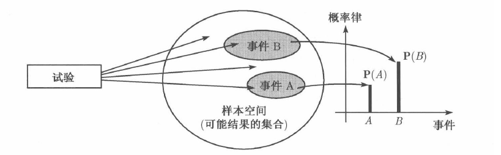

# 概率导论

<h2 class = 'section-title'>附录<label class = 'block-number'></label></h2>

<h3 class = 'auto-sort-sub'>集合</h3>

$\textbf{补集}\quad 集合\ S\ 相对于\ \Omega\ 的补集,\ \Omega^c=\empty$  

$\qquad S^c = \{x\mid x\in\Omega\ ,\ x\not\in S\}$

$\textbf{并集}$  

$\qquad S\cup T = \{x\mid x\in S\ 或\ x\in T\}$   

$\qquad \displaystyle\bigcup_{n=1}^{\infty}S_n = S_1\cup S_2 \dots = \{x\mid x\in S_n 对某个\ n\ 成立\}$

$\textbf{交集}$  

$\qquad S\cap T = \{x\mid x\in S\ 和\ x\in T\}$  

$\qquad \displaystyle\bigcap_{n=1}^{\infty}S_n = S_1\cap S_2 \dots = \{x\mid x\in S_n 对一切\ n\ 成立\}$

$\textbf{代数运算}$

$\qquad S \cup T = T \cup S$

$\qquad S \cup (T \cup U) = (S \cup T) \cup U$

$\qquad S \cap (T \cup U) = (S \cap T) \cup (S\cap U)$

$\qquad S \cup (T \cap U) = (S \cup T) \cap (S\cup U)$

$\qquad (S^c)^c = S$

$\qquad S \cap S^c = \empty$

$\qquad S \cup \Omega = \Omega$

$\qquad S \cap \Omega = S$

$\textbf{德摩根定律}$

$\qquad(\displaystyle\bigcup_n S_n)^c = \bigcap_n S_n^c$

$\qquad(\displaystyle\bigcap_n S_n)^c = \bigcup_n S_n^c$

<h3 class = 'auto-sort-sub'>概率公式</h3>

$\qquad 若 A\subset B, 则 P(A)\le P(B)$

$\qquad P(A\cup B) = P(A)+P(B)-P(A\cap B)$

$\qquad P(A\cup B) \le P(A)+P(B)$

$\qquad P(A\cup B\cup C) = P(A)+P(A^c \cup B)+P(A^c \cap B^c \cap C)$

<h2 class = 'section-title'>第 <label class = 'block-number'>1</label> 章： 样本空间与概率</h2>

<h3 class = 'auto-sort-sub'>概率模型</h3>

> 概率模型是对`不确定现象`的数学描述 
>
>概率模型的基本构成: `样本空间` `概率律`

**样本空间**： 每一个概率模型都关联着一个`实验`，这个实验将产生一个实验结果。该实验的`所有可能`结果形成样本空间。用符号 $\Omega$ 表示。

**事件**: 样本空间的子集，`某此`实验结果的集合

**概率律**: `事件`（如，事件 A）产生的概率， 用符号 $P(A)$ 表示

<label class="imageTitle">图示: 概率模型的基本构成</label>

**样本空间的选择**
1. 在确定样本空间的时候，不同实验结果必须是互斥的，这样，在实验过程中只可能产生唯一个一个结果。  
例如，当投掷骰子时，不能把 "1或3" 定义为一个实验结果
1. 确定模型时，我们不能遗漏其样本空间中的任意一个结果
1. 建立样本空间时，要避免不必要的繁琐，同时要清楚刻画我们感兴趣的事件

<h4 class = 'auto-sort-sub1'>序贯模型</h4>

许多实验本身具有序贯性，如，连续观察一只股票，观察 5 天; 一个通信设备上接收 8 位数字。 可以用有序对 $(i, j, k)$ 来表示

<h4 class = 'auto-sort-sub1'>概率律</h4>

**概率公理**

(1) **非负性** 对一切事件 A, 满足 $P(A) \ge 0$  

(2) **可加性** 对 A 和 B 为两个互不相交的集合，则它们满足
$$P(A\cup B)=P(A)+P(B)$$

(3) **归一化** 整个样本空间 $\Omega$ (称为必然事件) 的概率为 1, $P(\Omega) = 1$ 

<h4 class = 'auto-sort-sub1'>离散概率</h4>

**离散概率律**

设样本空间由有限个可能的结果组成，则事件的概率可由组成这个事件的实验结果的概率所决定。
$$P(\{s_1.s_2,s_3,\dots,s_n\})=P(s_1)+P(s_2)+P(s_3)+\dots +P(s_n)$$

我们用简单的记号 $P(s_i)$ 表示事件 $\{s_i\}$ 的概率， 而不是正式的记号 $P({s_i})$

**离散均匀概率律（古典概型)**

设样本空间由 $n$ 个等可能性的实验结果组成，因此每个实验结果组成的事件的概率是相等的，则
$$P(A) = \frac{含有事件\ A\ 的实验结果数}{n}$$

<h4 class = 'auto-sort-sub1'>模型和现实</h4>

概率理论可以用来分析现实世界的许多不确定现象。这个过程通常分成两个阶段：  

(1) 第一阶段， 在一个适当的样本空间中给出概率律，建立概率模型。在这一阶段没有关于建立模型的一般规则，只要你所建立的概率律符合概率的三条公理就行。统计学家还依赖历史数据和过去相似实验的结果，利用统计方法确定模型。

(2) 第二阶段, 在完全严格的概率模型下进行逻辑推理。

在概率论中有这样的`悖论`，对同一个问题，不同的计算方法得到不同的结论，这种模棱两可的概率律中选定模型会导致结论的不正确。

**贝特朗悖论**： 随机选择一个圆周的弦，其长度大于内接三角形的概率是多少？

<label class="imageTitle">图示：贝特朗悖论</label>

<h3 class = 'auto-sort-sub'>条件概率</h3>

条件概率是在给定`部分信息`基础上对实验结果的一种推断。例如，  
在连续两次骰子的实验中已知骰子的点数总和为 5, 第一次骰子点数为 2 的可能性多大？

**条件概率的性质**

1. 设事件 B 满足 $P(B)\gt 0$, 则给定 B 之下, 事件 A 的条件概率由下式给出
$$P(A\mid B)=\frac{P(A\cap B)}{P(B)}$$

1. 由于条件概率所关心的事件都是事件 B 的子事件, 可以把`条件概率看成 B 上的概率律`，即把事件 B 看成全空间或必然事件

1. 当实验的 $\Omega$ 为有限集,  并且所有实验结果为等可能的情况下, 条件概率律可由下式给出
$$P(A\mid B)=\frac{事件\ A\cap B\ 的实验结果数}{事件\ B\ 的实验结果数}$$

**例题：** 有两个设计团队，分别为 C, N, 要求他们在一个月内做出新的设计。从过去的经验知道：  
 （a）C 成功的概率为 2/3;  
 （b）N 成功的概率为 1/2;  
 （c）两个团队中至少有一个成功的概率为 3/4  
已知两个团队中只有一个团队完成了任务。问这个任务是 N 完成的概率是多少？

<button class="toggleAnswer answer-button">解:</button>

共有 4 种可能结果：  

$\qquad SS: 双方成功$  
$\qquad FF: 双方失败$  
$\qquad SF: C 成功, N 失败$  
$\qquad FS: C失败，N 成功$  

则，  
$$
\begin{aligned}
& P(SS)+P(SF)=\frac{2}{3}\\  
\\
& P(SS)+P(FS)=\frac{1}{2}\\
\\
& P(SS)+P(SF)+P(FS)=\frac{3}{4}\\
\\
\end{aligned}
$$
结合归一化公理  
$$P(SS)+P(SF)+P(FS)+P(FF)=1$$  

得，$$P(SS)=\frac{5}{12},\quad P(SF)=\frac{1}{4},\quad P(FS)=\frac{1}{12}, P(FF)=\frac{1}{4} $$

所以，  
$$P(FS\mid \{SF,\ FS\})=\frac{1}{4}$$

<h4 class = 'auto-sort-sub1'>利用条件概率定义概率模型</h4>

**例题：** 有一台雷达探测设备在工作，若在某区域有一架飞机，雷达以 $99%$ 的概率探测到并报警。若该地区没有飞机，雷达会以 $10%$ 的概率虚假报警。现在假定一家飞机以 $5%$ 的概率出现在该地区，问飞机没有出现在该地区而雷达虚假报警的概率有多大？ 飞机出现在该区域而雷达没有探测到的概率有多大？雷达报警的情况下，飞机出现的概率？

<button class="toggleAnswer answer-button">解:</button>

记，  
$\qquad A=\{飞机出现\}$  
$\qquad B=\{雷达报警\}$  
则，  
$\qquad A^c=\{飞机不出现\}$  
$\qquad B^c=\{雷达不报警\}$  

<label class="imageTitle">图示: 雷达探测的事件序贯树形图</label>

$$ P(A^c \cap B) = P(A^c)P(B\mid A^c)=0.095 $$
$$ P(A \cap B^c) = P(A)P(^cB\mid A)=0.0005 $$

利用贝叶斯准则，  
$$\begin{aligned}
P(飞机出现\mid 雷达报警)&=P(A\mid B)\\
&=\frac{P(A)P(B\mid A)}{P(A)P(B\mid A)+P(A^c)P(B\mid A^c)}\\
&=0.3426
\end{aligned}$$

**乘法法则**  
假设所有涉及的条件概率都是正的，则
$${P(\bigcap_{i=1}^n A_i)=P(A_1)P(A_2\mid A_1)P(A_3\mid A_1 \cap A_2)\dots P(A_n\mid\cap_{i=1}^{n-1}A_i) }$$

事件 A 发生的`充要条件`是一系列事件 $A_1,\dots ,A_n$ 全都发生，即 $A = A_1 \cap A_2\cap\dots\cap A_n$. 
$$P(\bigcap_{i=1}^n A_i) = P(A_1)\ \frac{A_2\cap A_1}{P(A_1)}\ \frac{A_2\cap A_1\cap A_3}{P(A_1\cap A_2)}\ \dots \ \frac{\cap_{i=1}^n A_i}{\cap_{i=1}^{n-1} A_i} $$

**例题：** 从 52 张扑克牌中连续抽取 3 张都不是红桃的概率。

<button class="toggleAnswer answer-button">解:</button>

<label class="imageTitle">图示: 抽取 3 张扑克牌的序贯树形表示</label>

$$A_i = \{第 i 张牌不是红桃 \},\ i=1,2,3$$
$$P(A_1\cap A_2\cap A_3) = P(A_1)P(A_2\mid A_1)P(A_3\mid A_1\cap A_2) = \frac{39}{52}\times\frac{38}{51}\times\frac{37}{50}$$

<h3 class = 'auto-sort-sub'>全概率定理和贝叶斯准则</h3>

**全概率定理**  

设 $\ A_1,A_2,\dots ,A_n$ 是一组互不相容的事件，它形成样本空间的一个分割。又假定对每个 $j,\ P(A_i)\gt 0$. 则对于任何事件 $B$, 下列公式成立
$$
\begin{aligned}
P(B)&=P(A_1\cap B)+\dots +P(A_n\cap B) \\
&= P(A_1)P(B\mid A_1)+\dots + P(A_n)P(B\mid A_n)
\end{aligned}$$

直接计算事件 B 的概率有点难度，但是若条件概率 $P(B\mid A_i)$ 是已知的或容易推导的，全概定理就成了计算 $P(B)$ 的有力工具。应用`这条定理的关键是找到合适的分割` $A_1,\dots ,A_n$, 而合适的分割又与问题的实际背景有关

**例题：**  你参加一个棋类比赛，其中 50% 是一类棋手，你赢他的概率为 0.3; 25% 是二类棋手，你赢他的概率是 0.4; 剩下的是三类棋手，你赢他的概率是 0.5. 从他们中间随机地选一位棋手与你比赛，你胜算的概率有多大？  

<button class="toggleAnswer answer-button">解:</button>

记 $A_i$ 表示与你下棋的棋手的类别  
$$P(A_1)=0.5,\qquad P(A_2)=0.25,\qquad P(A_3)=0.25$$
记 B 为你赢得比赛的事件，   
$$P(B\mid A_i)=0.3,\qquad P(B\mid A_2)=0.4,\qquad P(B\mid A_3)=0.5$$
结果，  
$$
\begin{aligned}
P(B)&=P(A_1)P(B\mid A_1)+P(A_2)P(B\mid A_2)+P(A_3)P(B\mid A_3)\\
&=0.375
\end{aligned}
$$
现在假定你已经得胜，问你的对手为一类棋手的概率 $P(A_1\mind B)$ 有多大？  
利用贝叶斯准则，得
$$\begin{aligned}
P(A_1\mid B)&=0.4
\end{aligned}$$

**贝叶斯准则**  
设 $A_1,A_2,\dots ,A_n$ 是一组互不相容的事件，它形成样本空间的一个分割。又假设对每一个 $i, P(A_i)\gt 0$, 则对于任何事件 $B$, 只要它满足 $P(B)\gt 0$, 下列公式成立
$$\begin{aligned}
P(A_i\mid B)&=\frac{P(A_i)P(B\mid A_i)}{P(B)}\\
&=\frac{P(A_i)P(B\mid A_i)}{P(A_1)P(B\mid A_1)+\dots +P(A_n)P(B\mid A_n)}

\end{aligned}$$

贝叶斯准则可以用来进行`因果推理`。设事件 $A_1,\dots A_n$  是原因，而 $B$ 代表由原因引起的结果。P(B\mid A_i）表示在因果模型中由原因 $A_i$ 造成结果 $B$ 出现的概率。当观察到结果 $B$ 的时候，我们希望反推结果 B 是由原因 $A_i$ 造成的概率 $P(A_i)\mid B$ 。$P(A_i\mid B)$ 为由于代表新近得到的信息 B 之后 $A_i$ 出现的概率，称为`后验概率`，$P(A_i)$ 称为`先验概率`

 

**假阳性之迷**  设对于某种少见的疾病的检出率为 0.95, 如果一个被检的人有某种疾病，其检查结果为阳性的概率为 0.95, 如果该人没有这种疾病，其检查结果为阴性的概率为 0.95. 现在假定某一人群中患有这种病的概率为 0.001, 并从这个总体中随机地抽取一个人进行检测， 检测结果为阳性。现在问这个人患这种病的概率有多大？

<button class="toggleAnswer answer-button">解:</button>

记 A 为这个人有这种疾病, B 为经检验这个人为阳性，利用贝叶斯准则，
$$\begin{aligned}
P(A\mid B)&=\frac{P(A)P(B\mid A)}{P(A)P(B\mid A)+P(A^c)P(B\mid A^c)}\\
\\	
&=0.0187
\end{aligned}$$

<h3 class = 'auto-sort-sub'>独立性</h3>

**独立性**  
- 两个事件 A 和 B 称为相互独立的，如果它们满足
$$P(A\cap B)=P(A)P(B)$$
若 B 还满足 $P(B)\gt 0$, 则独立性等价于
$$P(A\mid B)=P(A)$$
- 若 A 与 B 相互独立，则 A 与 $B^c$ 也相互独立
- 设事件 C 满足 $P(C)\gt 0$, 若满足 
$$P(A\cap B\mid C)=P(A\mid C)P(B\mid C)$$
则，事件 A 和 B 在给的条件 C 下条件独立，
若进一步假定 $P(B\mid C)\gt 0$, 则 A 和 B 在给定 C 的条件下的条件独立性与下面的条件等价，
$$P(A\mid B\cap C)=P(A\mid C)$$
- 独立性并不蕴涵条件独立性，反之亦然

设把一组事件任意地分成两个小组，一个小组中的任意个数的事件都相互独立，则下面的等式成立
$$\begin{aligned}
P(A_1\cup A_2\mid A_3 \cup A_4)=P(A_1\cup A_2)\\
P(A_1\cup A_2^c\mid A_3^c \cap A_4)=P(A_1\cup A_2^c)
\end{aligned}$$

<button class="toggleAnswer answer-button">证明:</button>

//TODO

<h4 class = 'auto-sort-sub1'>可靠性</h4>

**网络连接**  在计算机网络中，A 和 B 两个结点通过中间结点 C, D, E, F 相互连接。我们假定 i 和 j 之间具有给定的连接概率 $p_{ij}$. 假各点之间的连接独立于其他各点之间的连接。问 A 和 B 之间相互连接的概率有多大？

<label class="imageTitle">图示: 元件网络图</label>

<button class="toggleAnswer answer-button">解:</button>

> $P(串联系统有效)=p_1p_2\dots p_m$   
> $P(并联系统有效)=1-P(并联系统失效) = 1-(1-p_1)(1-p_2)\dots (1-p_m)$

$$\begin{aligned}
P(C\to B)&=1-(1-p_{CE}p_{EB})(1-p_{CF}p_{FB}\\
&=0.946\\
\\
P(A\to B) &= 1-(1-P(B\to C\to B))(1-P(A\to D\to B)\\
&=0.957
\end{aligned}$$

<h4 class = 'auto-sort-sub1'>独立实验和二项分布</h4>

